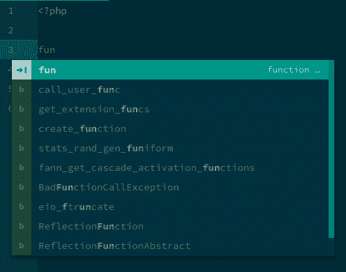
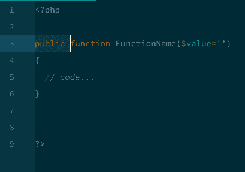
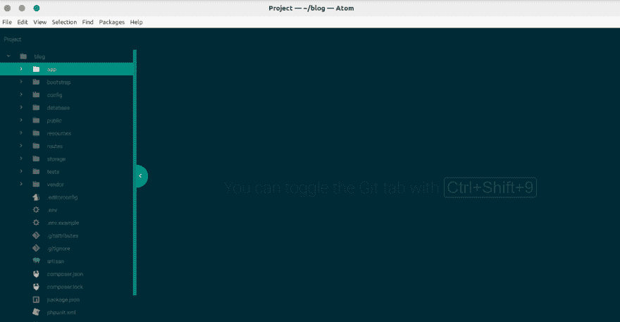
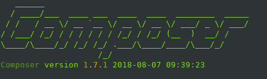

# 🔥 🔥我最喜欢的用于 PHP 开发的 Atom 编辑器包

> 原文：<https://dev.to/oyelowotobiloba/--my-favorite-packages-on-atom-editor-for-php-development-3i77>

大家好，这是我在 **dev.to** 上的第一篇帖子，今天，我将与大家分享软件包列表，如何将它们安装到您的 atom 文本编辑器上，让它有一个新的外观，让您的编码时刻更加迷人和愉快。

### 我们开始吧🔥🔥🔥

# 1。原子美化😍

猜猜它是什么同类中的一种。等等，你担心凹痕吗？😥这将节省你的时间，使你的代码更加整洁有序。

*要安装，*按 **ctrl + alt + T** 这将在 ubuntu 上打开你的终端，也可能在 Mac Os 上打开，然后键入或复制下面的命令**APM install atom-美化**到终端

# 2。剥绒机👌

这为您提供了查看代码中错误选项，而没有压力。要安装，复制或键入 **apm install linter** 。

*注意*你可能想要为不同的工作和你正在使用的语言安装特定的 linter

# 3。自动完成-路径

顾名思义，它会自动补全丢失的路径。我喜欢这个包和我的💕心，我离不开它。搞笑！😁

现在，你应该知道如何安装这个包 **apm 安装自动完成路径**这么简单吧？？😘

让我们通过输入 fun (function)来测试一下，我们看到了这个

[T2】](https://res.cloudinary.com/practicaldev/image/fetch/s--Ddt6Bryb--/c_limit%2Cf_auto%2Cfl_progressive%2Cq_auto%2Cw_880/https://thepracticaldev.s3.amazonaws.com/i/94k17rmn1nr20z2oqig8.png)

等等，现在按回车键。现在您应该看到自动完成功能开始工作了。

[T2】](https://res.cloudinary.com/practicaldev/image/fetch/s--s-RrrWBO--/c_limit%2Cf_auto%2Cfl_progressive%2Cq_auto%2Cw_880/https://thepracticaldev.s3.amazonaws.com/i/9omffxi2mwod2x1drm1v.png)

# 4。文件图标

文件图标是每个 atom 用户必须拥有的一个可爱的包(抱歉，不是必须的，而是选择)

[T2】](https://res.cloudinary.com/practicaldev/image/fetch/s--iKQvw-Sq--/c_limit%2Cf_auto%2Cfl_progressive%2Cq_auto%2Cw_880/https://thepracticaldev.s3.amazonaws.com/i/35radqirm4d8gryq1rtx.png)

# 5。php-cs 固定程序

1 号套餐。我也解释不清为什么把它保留为第*第 5*。这是 PHP 编码标准固定器。

安装与软件包的其余部分完全不同。我们需要通过使包在我们的路径上可用来满足要求。抱歉，说来话长

下面的步骤将解决它。

1.  导航到您的终端
2.  通过执行 **composer -v** 检查是否安装了 composer。这将检查 composer 的版本。不过，你可以通过这个链接安装[作曲](https://getcomposer.org/download/)

[T2】](https://res.cloudinary.com/practicaldev/image/fetch/s--CYSGzmSk--/c_limit%2Cf_auto%2Cfl_progressive%2Cq_auto%2Cw_880/https://thepracticaldev.s3.amazonaws.com/i/ippadl0jrvjxhw8qdpya.png)

如果安装了 composer，您应该会看到上面的输出

1.  接下来，复制并粘贴**$ composer global require friends of PHP/PHP-cs-fixer**到您的终端

2.  最后，复制 **$ export PATH="$PATH:$HOME/。作曲者/供应商/媒体夹"**

# 奖金:

##### 小图

使用 figlet，您可以将一个选择转换成 ascii-art，这在归档时有时很有用

##### 语言-刀锋

每个 Laravel 开发人员都必须拥有

##### 高亮-选中

剧终

丢了什么吗？留下评论，我等不及要看其他惊艳的套餐了