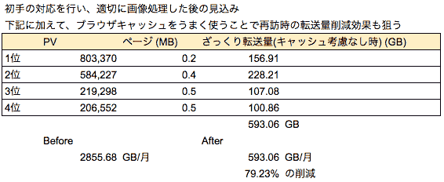
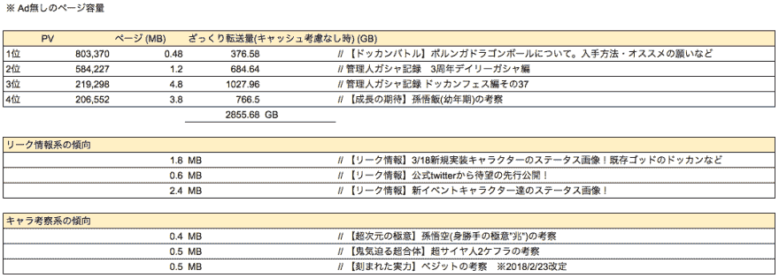
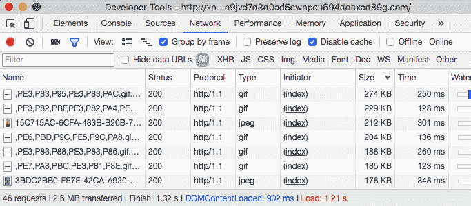
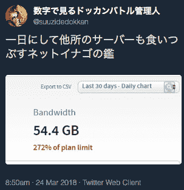
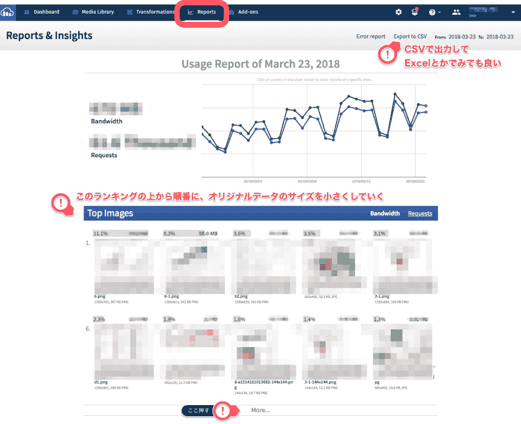
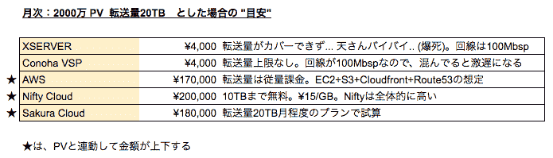

# 在兴趣游戏中受到照顾的网站，看到了被伦萨巴激怒的推文，考虑了改善方案(有 3/24 追述)

> 原文：<https://dev.to/yazashin/-10g5>

# Summary of 2018/03/24

*   就在下面
    *   关于初始图像大小调整
    *   关于以传输量为轴时的服务器费用的标准

# 前言

在趣味游戏中受到照顾的网站，打出了转发量( 20TB/month )，看到了被伦萨巴骂的推文，开始考虑改善方案

符合条件的推文是

# TL；DR；

*   cause
    *   每个文件的图像很大
    *   缓存控制不了(有很多无缓存)
    *   因为没有使用 CDN，所以负荷全部集中在 WEB 服务器上。 访问集中时掉在 500 上
*   应对的初步
    *   除了 nginx 的设定之外，图像还通过 cdn & cdn 进行图像大小的优化
*   Genben' ao
    *   方案 1 )从 XSERVER，搬到 conoha 和樱，将&wordpress (常规)变成 wordpress(kusanagi )，实现高速化
    *   方案 2 )将 WP 的报道变更为经由 S3 等作为静态内容发布的模式
        *   考虑到迁移成本和工作量，方案 2 应该更轻松吧
    *   作为 cloudfront + S3 的发送模型，同时进行 https 对应+h2 对应
        *   cdn 可以是 fastly，但需要权衡维持成本(个人使用时 fastly 较高...)
*   Weiguo
    *   只需初步应对
        *   大幅减少 XSERVER 的传输量(1/100 )。 也就是说可能可以瞄准 200GB/月)
        *   用以前的悟饭(幼年期)的图像来说，→ 3.6MB 可以相当于 36KB
        *   频繁出现的 120KB 左右的图像也可以减少到 30~40KB
*   估算(因为是到报道 TOP4 位为止的数字，所以与总量不同)

# current situation arrangement

*   PV: 2000 million PV/ month
*   传输量: 20TB/月。 也有 520GB 以上/天的分数
*   情報源:[https://twitter.com/suuzidedokkan/status/976830275484254208](https://twitter.com/suuzidedokkan/status/976830275484254208)

## 页的特征

*   因为相应地使用了角色的卡片图像，所以每页的容量容易增加
*   每一页都有评论功能，评论量也很多
*   [从 2 月的 PV 排行榜](http://xn--n9jvd7d3d0ad5cwnpcu694dohxad89g.com/archives/dr4es.html)来看
*   第三名的报道超过了 1TB 呢。 作为体验，全部图像都是徒劳的大
*   特别是第 4 名的悟饭的照片一张就有 3.6MB 的笑
*   首页状况(不含 Ad 图片)

# 对策的理念

*   尽量不增加迁移成本(无论是费用还是工作量)
*   重新审视缓存控制，利用 CDN
*   顺便也包括网站自身的高速化在内(支持 https，支持 h2 的 etc )

# 在已知的范围内调查服务器构成

*   XSERVER X20 计划
    *   [https://www.xserver.ne.jp/functions/](https://www.xserver.ne.jp/functions/)
*   是使用 wordpress 自动安装服务构建的吧。
*   nginx + wordpress (php7 + mysql 5 系)
*   基于上述调查，基本上只有传输量是瓶颈
*   但是，因为偶尔会在高负荷下出现 500 个错误，所以也需要 WP 自身的高速化
    *   大致上，APP 进入维护后，这个网站也开始出 500 元

# 具体应对措施

### 应对的第一步(因为我觉得紧急度高，所以应对速度优先)

*   除了 nginx 的设定之外，图像还通过 cdn & cdn 进行图像大小的优化
*   CDNはcloudinaryを使う
    *   可以使用 URL 参数动态地进行图像变换
    *   可以对每个设备进行最佳的发布调整( jpeg、webp 等)
    *   部署成本(工作量)少
*   无论是兔还是角，都用 cloudinary 建立账号
    *   如果你从下面的 URL 登录的话，双方都会有传输量和奖金。
    *   [https://cloud inary . com/invites/lpov 9 zyyucivxsnalc 5/phh 26 dlxmmplxsgcx 7 of](https://cloudinary.com/invites/lpov9zyyucivvxsnalc5/phh26dlxmmplxsgcx7of)
*   nginx 的设定是这样的。 suuzidedokkan 是指在 cloudinary 上获得该账户时的临时值

```
$> vim /etc/nginx/conf.d/suuzidedokkan.conf
location ~* \.(jpg|jpeg|gif|png|ico|svg)$ {
    access_log off;
    expires 10d;
    # use cdn
    rewrite ^(.*)$ https://res.cloudinary.com/suuzidedokkan/image/fetch/c_limit,f_auto,fl_progressive,q_auto/http://xn--n9jvd7d3d0ad5cwnpcu694dohxad89g.com$request_uri? last;
} 
```

*   估算(因为是到报道 TOP4 位为止的数字，所以与总量不同)

## It's not true at all.

*   方案 1 )从 XSERVER，搬到 conoha 和樱，将&wordpress (常规)变成 wordpress(kusanagi )，实现高速化
    *   包括 DB-Dump 等在内，都需要相应的工夫。
*   方案 2 )将 WP 的报道变更为经由 S3 等作为静态内容发布的模式
    *   考虑到迁移成本和工作量，方案 2 应该更轻松吧
    *   作为 cloudfront + S3 的发送模型，同时进行 https 对应+h2 对应
        *   cdn 可以是 fastly，但需要权衡维持成本(个人使用时 fastly 较高...)
*   这里的做法如果你愿意的话会更新

接下来用数字从码头管理员那里收到 DM 的话，我会个别告诉你方法。 (请到[@yazashin](https://dev.to/yazashin) )

# ★ Remember on March 24th, 2018

## 关于初始的图像尺寸变更

*   如果是上述写的设定，虽然会进行图像的自动优化，但是原本就没有输入太大的图像的纵横尺寸调整。 所以我认为不会有戏剧性的效果。
*   如果调整参数的话，虽然也可以一律缩小到横向宽度 400px 以下，但是布局会崩溃 ...
*   [文档在这里](https://cloudinary.com/documentation/image_optimization#how_to_optimize_image_sizing)

## 最新情况

*   总之，关于从下述推文向 CDN 的转发好像已经导入了。
*   **辛苦了！** 这样，以传输量为基础，图像就可以可视化了
*   目前，虽然图像多少进行了优化，但我认为传输量与 CDN 化前几乎相同
    [](https://res.cloudinary.com/practicaldev/image/fetch/s--HNlObioG--/c_limit%2Cf_auto%2Cfl_progressive%2Cq_auto%2Cw_880/https://thepracticaldev.s3.amazonaws.com/i/dq9pawua59irgudnsis1.png)

*   步骤是:[从这个报告页面](https://cloudinary.com/console/reports)开始，如下所示，从传输量大的图像开始按顺序排列对策

    *   因为是我管理的正式数据，所以模糊了重要部分
*   要么一个一个地编辑上传到 wordpress 的图像，要么把上传文件夹中的图像全部 DL，一起调整大小。 方法各不相同

## 关于以传输量为轴时的服务器费用的标准

*   XSERVERだと、下記の転送量上限がある[https://thepractical dev . S3 . Amazon AWS . com/I/asnh 590 E4 VI 3 as 1 qqd 85 . png](https://thepracticaldev.s3.amazonaws.com/i/asnh590e4vi3as1qqd85.png)
*   X20 计划为 90GB，与管理员被骂的邮件正文一致。 即使是 X30，也是杯水车薪。

[T2】](https://res.cloudinary.com/practicaldev/image/fetch/s--FQZmTfbN--/c_limit%2Cf_auto%2Cfl_progressive%2Cq_auto%2Cw_880/https://thepracticaldev.s3.amazonaws.com/i/fmjy5b0yfdjjwgy0zkgg.png)

*   这次的情况是，机器规格(运行 Wordpress 的服务器)只要 4core/内存 8GB/Disk 100GB (这个不知道用了多少，所以合适)左右就可以了吧
*   总之瓶颈是**传输量**。
*   踏实地减少图像尺寸&使用几个 cdn，在免费的范围内切换(虽然是手动的)，在金额上可能也不错。

### 追述总结

*   每月可以花 20 万左右的服务器费哦！ 那样的话，我个人推荐 AWS 化。 (必要时我会帮你的)
*   如果从 XSERVER 搬到 Conoha VPS 的话，无论是金额还是传输量都会变得幸福
*   Conoha 推荐。 我也是做生意用的。
    *   [关于传输量](https://www.conoha.jp/function/traffic/)
    *   [通过朋友介绍我也能变得幸福](https://www.conoha.jp/referral/?token=gNnQVOe1hzSCk9gEL3B3ejnXyZQ5Cs9W4278D7APipepBbsdk3o-60G)
*   如果搬家的话，Wordpress 必须进行 kusanagi 化
    *   [官方网站](https://kusanagi.tokyo/about/)
    *   [在 conoha 中的使用方法](https://kusanagi.tokyo/cloud/kusanagi-for-conoha/)

# Feeling

*   通过这次的事情，我自己学到的是，云服务以按次计费为主轴，理所当然地使用了它，但是如果不熟悉它的人进入按次计费的世界，就有容易破产的风险。
*   因为大多数服务都可以根据使用费用设定上限( AWS 之类的)，所以做那个是桅杆。
*   伦萨巴在“传输量”的轴上相当宽松。 但是线路细( 100Mbps )
    *   如果控制在 100GB/天( 3TB/月)的范围内，
        *   XSERVER X30 方案 4，000 日元左右※但是由于 NW 线路为 100Mbps，所以会相当堵塞(慢)
        *   光是 AWS 传输量就有 50，000 日元左右※爆速。 再高的负荷也不会掉下来