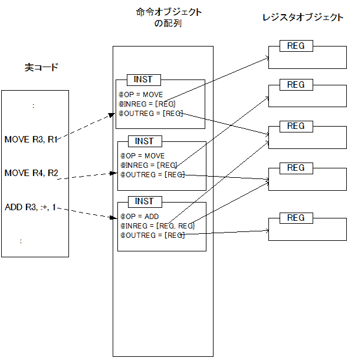

# 我写的不是类型推理器而是什么

> 原文：<https://dev.to/miura1729/-2376>

# 前言

现在，打算写 mruby 用的编译器，作为其中的一环，制作了[这样的东西](https://github.com/miura1729/mruby-meta-circular)。 我一直以为是型推理器，但我知道怎么也打不中型推理器。 所以这里就现在正在编写的程序进行说明。
基本上做的事情是扫描整个程序，收集类型信息并显示(或者用它编译)。 一言以蔽之，很简单，但实际上想要实现的话，就很困难了。

虽说要先收集型号信息，但从哪里收集型号信息呢？ 虽然很容易得到指令列，但作为其操作数的寄存器中包含的内容却是不言自明的。 需要以明确知道寄存器内容的常数的寄存器为基础，寄存器的参照关系整理得容易处理。 此外，在 mruby 的虚拟机中，数据不仅仅存在于寄存器中。 还有实例变量、全局变量、常数等。 如果不收集这些东西的型号，就得不到整体的型号信息。 因此，用于收集类型信息的中间代码的设计变得非常重要。 这方面的故事在中间代码一章中说明。

将收集的类型放入什么样的结构也不言自明。 例如，如果是 Ruby 的混沌型系统，在某个时刻，String 认为是 Fixnum 的东西是别的地方，也就不足为奇了。 需要准备即使出现各种奇怪的情况也没关系的结构。
另外，在 Ruby 中，与其说关于方法的自变量允许过载，不如说连过载这个词都是毫无意义的~~嘎巴嘎巴~~因为是自由度很高的语言，所以有必要在那方面做点什么。 这个程序使用 tup (来自 tu pple )这个概念来实现这一点。 这也是重要的概念吧。

至此说明就形成了框架，这里的每个命令都要说明规则。 根据命令的不同，有很多启发式的事情，所以有必要说明一下吧。

并不能解释虚拟机命令的规则。 mruby 有用 c (应该已经死了)写的方法，必须为每个方法指定类型规则。 很多都是显而易见的，但其中也有复杂的规则。

其次是条件分支的处理。 一般来说，只要能追溯到条件分支就可以了，例如

```
 if !block.nil? then
     block.call(n)
  end 
```

Enter fullscreen mode Exit fullscreen mode

谁都不想收到这样的错误: block 用 nil 不能叫 call。 因此，在某种程度上看了条件分支的条件，进行了适当的控制。 那个说明也要设章进行。

总之应该能做出这样的文章。

# 中间代码

在该程序中，mruby 的每个字节码指令的主要动作是将类型从输入传播到输出。 此时，输入和输出是不言自明的。 这么说来，寄存器是有编号的，简单吗？ 可能会认为，即使是同一个寄存器的号码，如果被改写了的话，也必须作为其他的寄存器来处理。
[根据以前制作的编译器的经验](https://github.com/miura1729/ytljit/)，条件分支的处理变得特别麻烦，所以感觉有必要完全分成基本块进行管理。
另外，根据[mruby 的 JIT](https://github.com/miura1729/mruby) 的经验，得出了在进行寄存器分配时，需要简单地知道寄存器的生存期。

根据以上内容，得出了中间代码最适合[SSA](https://ja.wikipedia.org/wiki/%E9%9D%99%E7%9A%84%E5%8D%98%E4%B8%80%E4%BB%A3%E5%85%A5) 的结论。 但是，将 mruby 的虚拟机的字节码转换为 SSA 非常麻烦。 经过思考，我想到了一种可以得到与 SSA 同等代码的方法，所以我安装了它。 这种方法的缺点是代码会变成图表，因此编码成文本会很麻烦。

将 mruby 的字节码转换为 SSA 按照如下步骤进行:
*将字节码分成不包含分支的基本块
*即使是相同名称的寄存器，也可以在每次代入时赋予不同的名称进行区别(单一代入化)【

## 分为基本块

为了用不包含分支的基本块来划分字节码，可以事先在指令序列( irep-> iseq )中记录分界线的位置，然后在该分界线的位置进行划分。 裂缝的位置如下。
* jmp/jmpif/jmp not/RETURN/rescue 等 pc 不是单纯增量的指令
*上述指令的跳转目的地
*指令序列的结束(最后一定会以 return 结束，所以实质上没有必要

划分命令列后，根据命令的执行关系，在每个基本块上粘贴链接。 RETURN/JMP 等有一条，而 JMPIF/JMPNOT 有两条(条件是真伪各自的飞行目的地)。

## The first generation of integration

恐怕是最麻烦的话。 说的是即使是同名的寄存器，中途代入的话也必须作为其他名字的寄存器来处理。 我觉得除了了解 SSA 的人以外，意思都不清楚，所以请看 SSA 的其他资料。 虽然从学术上来说有很多寄存器的重命名之类的方法，但是这里使用的是简单而土里土气的方法。

其方法是将寄存器作为对象准备实体，在每次代入寄存器时分配新的寄存器。 也就是说，在 SSA 中很麻烦的寄存器的命名可以根据对象的地址随意进行。 而且，类型推理需要在寄存器中添加各种附加信息(例如类型)，所以将寄存器作为对象是非常方便的事情。

中间代码如图所示是这样的。
[](https://res.cloudinary.com/practicaldev/image/fetch/s--oI0nB0vR--/c_limit%2Cf_auto%2Cfl_progressive%2Cq_auto%2Cw_880/https://raw.githubusercontent.com/miura1729/regexpllvm/master/insimage.png)

指令对象在@OP 中以符号输入指令的操作码，@inreg 为输入寄存器的数组，@outreg 为输出寄存器的数组。 add R2，1，: +这样的指令中，R2 为输入寄存器，当然是输出寄存器，但会作为其他寄存器处理。 输出寄存器必须是当场分配的(或者像实例变量一样存储在其他地方)寄存器。 输入寄存器和输出寄存器必须分离是很重要的。 有一种见解，就是在上次的 ytljit 中没有区分输入寄存器和输出寄存器，所以做得不好。

# type performance

追溯上一章中说明的中间代码来决定寄存器对象的类型。 寄存器在两个级别上具有类型信息。 分别保持在名为@same，@type 的实例变量中。
@same 表示与自己(寄存器)具有相同类型的寄存器的集合。 @type 实际上保留了自己的类型。

为什么需要@same 呢？ 确实，正如后面要说明的那样，是以将寄存器具有的类型信息扩散到其他寄存器的形式进行类型推测的，但也许大家会认为不使用@same 而直接放入@type 也可以。 但是，那样的话有时行不通。 因为原来的寄存器其实也有不确定类型，之后再确定的情况。 在这种情况下，只记住@same 是相同类型的寄存器的信息，然后更新@type。

另外，@same 可以放入多个寄存器，所以不一定与@same 中放入的寄存器为同一类型。 例如，如果在 if 语句中 then 和 else 子句返回不同的类型，则 if 的类型将是与 then 和 else 子句不同的它们的组合。

## 型客体

类型本身准备了表示类型对象这一类型的对象。 类型对象必须满足的条件是可以区分相同类型但不同类型。 看起来很简单，但非常困难，恐怕细致的条件调整会持续到最后。 类型对象是类型的表示，但可以进一步分类，分别是子类。

### 基本类型

### 基元类型

### LiteralType

### 集装箱类型

### ProcType

## tup

由于 Ruby 没有对参数进行类型约束的想法，所以方法的参数一定具有多相性。 即使是同一方法，如果用参数传递其他类型的对象，也可能会有完全不同的行为。 也就是说，在用不同的参数类型调用时，即使是同一方法也应该作为不同的方法来处理。 但是，需要一种区分方法是相同还是不同的方法。 作为单纯的方法，可以考虑将寄存器的类型信息作为自变量的类型组和类型表。 这是在 ytljit 中使用的，但是效率非常低。 因此，我们采用了给参数类型组分配唯一的整数并将其作为键的方法。 这个整数在这个程序中称为 tup (来自 tuple )。

## 阵列

## Proc

Proc 是方法或块的对象。 正在 wrap irep 和环境( mruby 的 Env 对象)。 Proc 对象中困难的是存在两个 Proc 对象时的同一性。 乍一看，好像只看 irep 就可以了，但那样的话有时会做不好。
例如，

```
 def foo(&block)
    self.collect {|x| block.call(x)}
  end 
```

Enter fullscreen mode Exit fullscreen mode

这样的程序在{|x| block.call(x ) }部分的 Proc 对象只有 irep (程序代码)时总是相同的。 这里，如果将例如返回 Fixnum 的 Proc 对象和返回 Float 的 Proc 对象传递给 block，它们也会变成相同的类型，因此例如会变成 Fixnum|Float 的类型。

因此，Proc 对象将使用封闭在环境中的变量类型来判定同一性。 这样，block 就是封闭在{|x| block.call(x ) }环境中的变量，因此可以根据 block 的类型将其作为单独的 Proc 对象进行处理。

# 指令的规则例子

## LOADNIL

## 移动

## 发送

# 嵌入式方法的规则示例

## 数组#[]

# 条件分支的处理