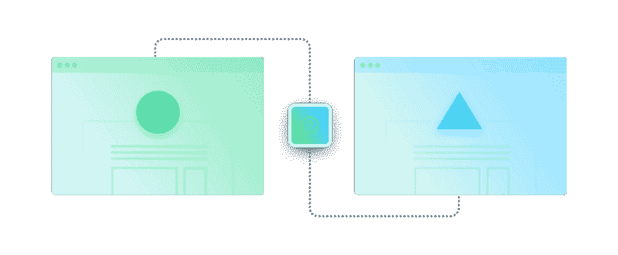

# 📈启动时使用有限数据进行 A/B 测试

> 原文：<https://dev.to/manifold/-ab-testing-with-limited-data-at-astartup-1i7b>

[T2】](https://res.cloudinary.com/practicaldev/image/fetch/s--qKPl8MaE--/c_limit%2Cf_auto%2Cfl_progressive%2Cq_auto%2Cw_880/https://thepracticaldev.s3.amazonaws.com/i/zx4fhemr7t189ekkx70m.png)

最初发布在[歧管](https://blog.manifold.co/a-b-testing-with-limited-data-at-a-startup-6fe1cf46f63d)

# 📈启动时使用有限数据进行 A/B 测试

几乎你读过的每一篇关于创业营销的文章都强调了 A/B 测试的重要性。从你登陆页面的标题到你注册按钮的颜色，即使是最微小的事情也应该被测试。但是，你正在阅读的几乎所有这些文章都假定了一件事。你正处于成长阶段。

但这是许多公司面临的问题。

没有实现增长的初创公司只是没有足够的数据来进行大规模的 A/B 测试。这意味着在较低的数量下进行测试与在进行扩展时是完全不同的。我不是说不可能，但是我会分解一些在用少量数据测试时容易犯的常见误区和错误。

## 让我们快速定义一下 A/B 测试

> 一项营销实验，让登陆页面、广告、电子邮件或其他在线内容的两种变体相互竞争，以确定哪一种能产生最高的转化率。
> [https://unbounce . com/conversion-glossary/definition/a b-testing/](https://unbounce.com/conversion-glossary/definition/ab-testing/)

这是从营销人员的角度来定义的。将两份营销材料进行对比，看看哪一份更容易转化。这个定义没有公平对待 A/B 测试背后的统计方法。

当您运行 A/B 测试时，您最有可能使用某种类型的统计测试来比较两个二项分布(有几种可能性)。

点击率或转换率都是二项式分布。

如果你使用像 Optimizely 这样的 A/B 测试软件，这些统计数据对你来说是隐藏的，这有时会对你不利。

## A/B 测试陷阱

测试软件使得所有类型的人都可以进行实验。在 Google Optimize 或 Optimizely 中完成 A/B 测试，你真的不需要了解太多统计数据。但是没有太多的统计知识会让你犯一些容易避免的错误。

我们来看几个。

### 过早结束测试

如果你和我一样，当你在做实验(或者广告，或者任何事情)的时候，你喜欢看着数字上升。最好看的数字之一是大多数 A/B 测试软件现在拥有的。“击败的机会”指标。这是软件使用大量可用变量动态计算的一个数字。

这个数字可能会产生误导。如果你的“获胜几率”是 100%，你可能会想，“好吧，让我们结束这个，开始下一个测试”，但这可能会给你带来大麻烦。这叫偷看。偷看是指你在收集到足够大的样本量之前查看数据，这意味着你没有达到统计显著性。遵循尽早结束测试的过程可能会导致假阳性，从长远来看这是不正确的。

运行 A/B 测试需要很大的流量，尤其是当你进一步进入漏斗时。用户越来越少，越来越少的人看到你的测试。

让我们看一个例子。假设你有一个 5%的登录页面转化率，你想把它提高到 5.5%。增长了 10%。去那里似乎很合理。但是为了对登录页面的变化有信心，您需要每个变化来获得大约 30000 个访问者的样本量。

我不知道你是怎么想的，但是当你处于初创公司生命周期的早期，让 6 万左右的访问者访问一个登陆页面是相当困难的。

看看埃文·米勒令人敬畏的样本量计算器，更好地了解你需要的观众数量:[https://www.evanmiller.org/ab-testing/sample-size.html](https://www.evanmiller.org/ab-testing/sample-size.html)

### 不了解你的听众

不是所有的访问者都是一样的。作为营销人员和创始人，我们知道动机和意图是熟练营销的关键。

A/B 测试是一样的。如果你正在运行一个测试，每个变体需要 10000 个会话，突然你的登陆页面得到 20000 次点击，因为一个博客帖子爆炸了。这真的能很好地预测你的转换率吗？大概不会。在打电话之前，你需要确定你知道谁在访问你的网站。

有时，如果您不确定您的样本是否具有良好的多样性，那么运行一个更高显著性的测试是值得的。

### 测试所有的小事

希望你现在脑子里没有闪现 182。

我已经谈了很多进行测试所需的样本量。在某些情况下，它是巨大的。你需要的样本量的最大贡献者之一是你想要看到的提升百分比。

让我们回到上面我们 5% -> 5.5%转化率的例子。对这个例子的重要性进行测试，我们需要每个变体有大约 30k 的访问者。但是，假设我们希望通过更改整个登录页面，而不仅仅是 CTA 副本，将转换率提高到 6%。这使得每次变化所需的访问者数量下降到 12k 左右。这是访客的一半，也是一个更容易实现的数字。

当您只能收集一个小的样本集时，对您正在测试的任何东西进行大的修改是很重要的。如果你正在改变一些小的东西，你不会在你的测试变量中假设一个大的提升。但是，如果你对你的内容做了很大的改变，并且在测试变量上做了更大的改变，你需要的样本量将会显著减少。

不要只是去把你的目标提升到一个疯狂的程度。您仍然需要考虑以科学的方式进行测试，并基于良好的假设选择所有这些指标。否则你永远不会有所收获，也永远学不到任何东西。

## 测试很难

在初创公司，这就更难了。像 Optimizely 和 Google Optimize 这样的工具正在使运行实验变得越来越容易，但它们并没有给你所有需要做的背景数学。不知道那些在后台运行的统计方法会导致误报。

确保你在测试前设定了样本量并坚持下去。不要因为测试看起来会赢就认为它已经完成了。记住，如果你有数据，数据胜过直觉。注意一个点的流量峰值，它会使你的观众变得不那么多样化，并最大程度地扭曲你的结果。最后，当您的吞吐量较低时，不要测试小东西。如果你希望在低样本量的情况下看到显著的结果，那就做出大的改变。换一个完全不同的登陆页面，或者完全改变你正在运行的广告，而不仅仅是几个词。

如果你有任何问题，请随时打电话到[colin@manifold.co](mailto:colin@manifold.co)找我，我喜欢谈论这些事情。