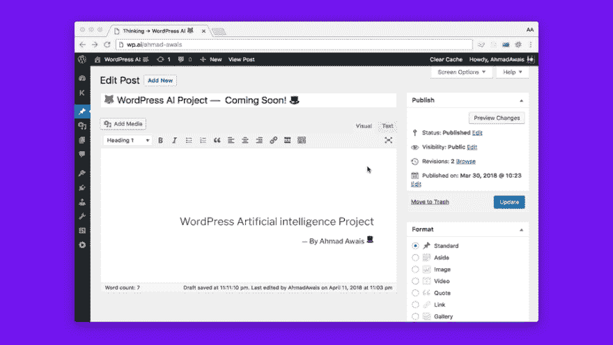

# 🦊构建一个 WordPress 人工智能插件

> 原文：<https://dev.to/ahmadawais/-building-a-wordpress-artificial-intelligence-plugin-2kih>

我在做这个很酷的项目的时候，通宵达旦，兴奋不已，在这个项目中，我构建了一个 WordPress 人工智能插件。

[T2】](https://res.cloudinary.com/practicaldev/image/fetch/s--xT6zq-qN--/c_limit%2Cf_auto%2Cfl_progressive%2Cq_auto%2Cw_880/http://on.ahmda.ws/qqwI/c)

听起来很老套，但在我继续向你解释之前，我宁愿你看这个我在早上 5 点试图演示我所做的快速愚蠢的视频。开始吧。👇

[https://www.youtube.com/embed/Dv_qJhn8KM4](https://www.youtube.com/embed/Dv_qJhn8KM4)

那么，你有什么想法？令人震惊吧。

*   👌认知服务 API
*   🎩微软@Azure
*   ☘ @MongoDB 图集
*   🚀自动化 FTW

如果运气好的话，我会尽最大努力以 FOSS(自由和开源软件)的形式发布这个作品，以及我在 GitHub 发布的数百个其他开源项目。因为，为什么不。另外，这是 GitHub 的 10 周年纪念日💥

### 现在怎么办？

嗯，上 Twitter，告诉我你对这个项目的感觉。或者只是说👋或许还会转发这条。会有很大的不同。

液体错误:内部

和平！✌