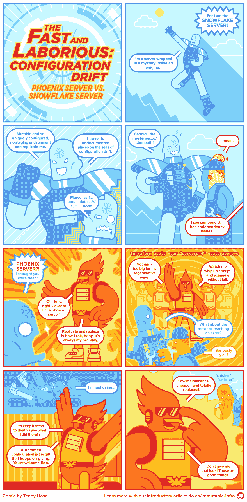

# 配置漂移:凤凰服务器 vs 雪花服务器漫画

> 原文：<https://dev.to/digitalocean/-configuration-drift-phoenix-server-vs-snowflake-server-comic-2pbn>

作者:泰迪·霍泽、久保正美、[黑兹尔·维尔多](https://dev.to/hazelnut)

**注意:**这个漫画改编的内容涵盖了一篇关于不可变基础设施的文章的一部分。如果你想了解更多，我们建议看一看原文:[什么是不可变的基础设施？](https://dev.to/digitalocean/what-is-immutable-infrastructure-2h1o)

[T2】](https://res.cloudinary.com/practicaldev/image/fetch/s--F7XNEoeg--/c_limit%2Cf_auto%2Cfl_progressive%2Cq_auto%2Cw_880/http://assets.digitalocean.com/articles/configuration_drift_comic/phoenix-snowflake_comic_r2_1490x3020.png)

在 DigitalOcean 上构建、测试和部署一些新的东西——一体化云平台开发人员及其团队的最爱。为新用户提供 100 美元的免费帐户信用:[do.co/devto](http://do.co/devto)T3】

 
本作品受[知识共享署名-非商业性使用-类似共享 4.0 国际许可](http://creativecommons.org/licenses/by-nc-sa/4.0/)的许可。