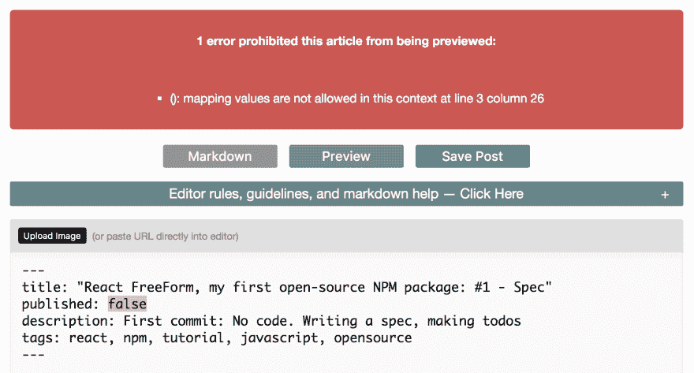
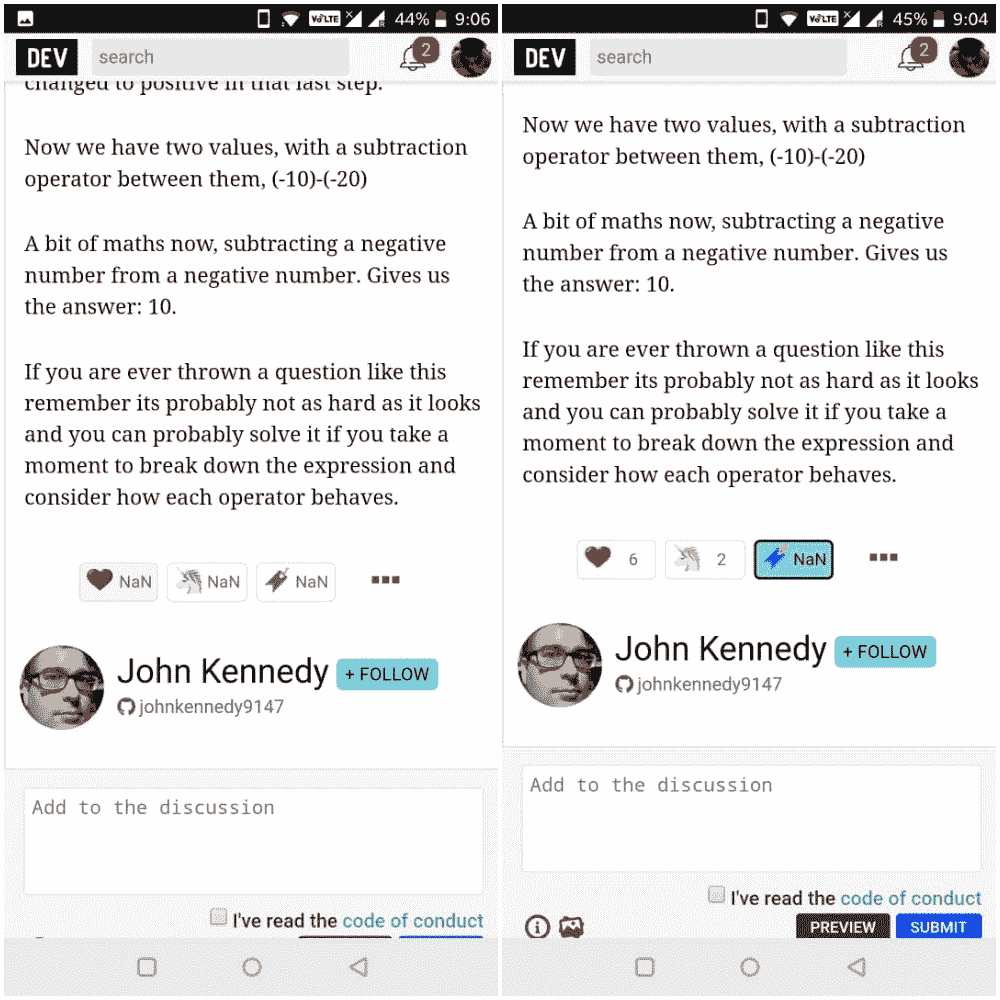
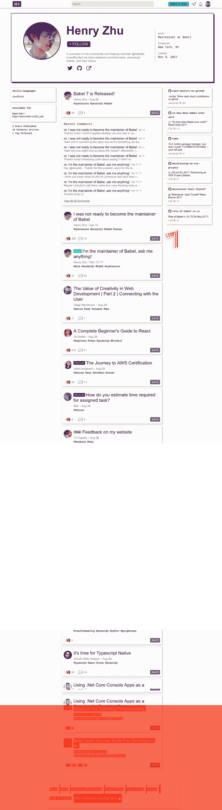
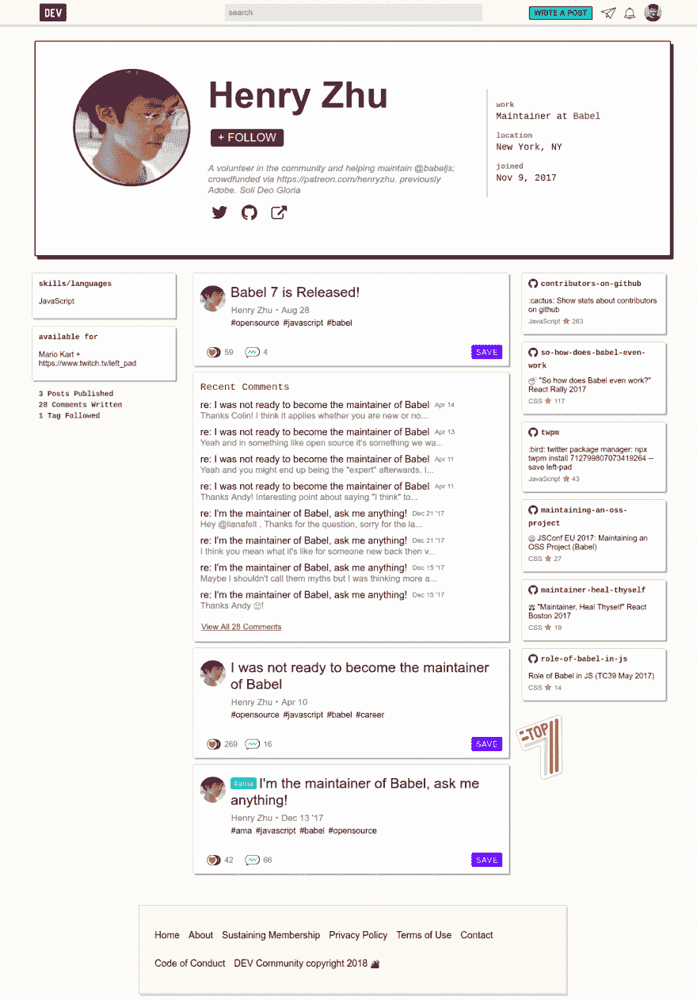
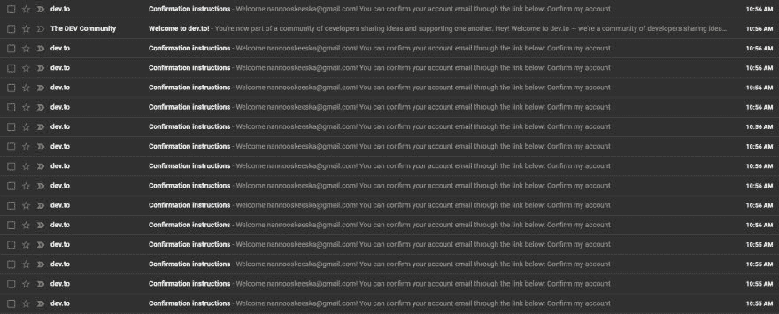
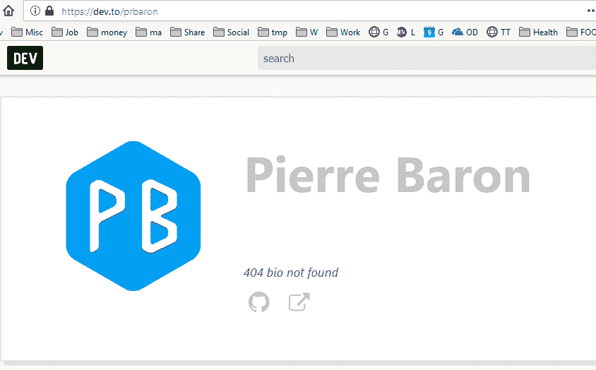
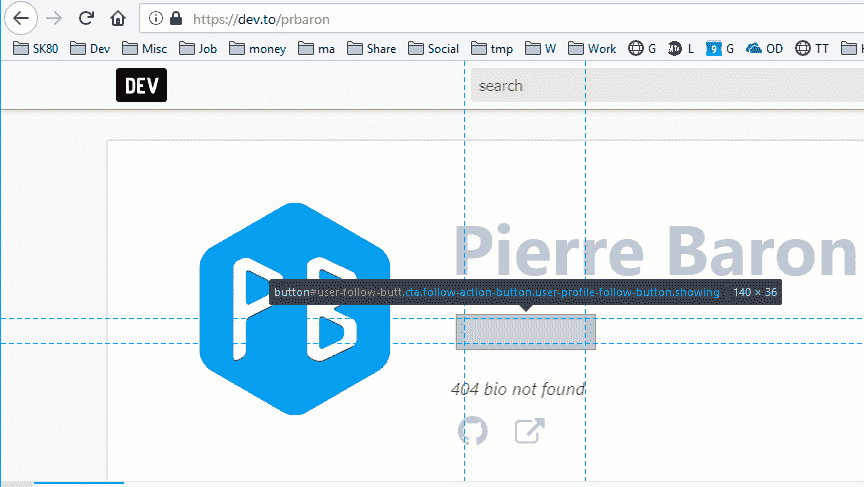

# 🐛开发 bug 待价而沽🐛

> 原文：<https://dev.to/devteam/-dev-bugs-up-for-grabs--24bj>

对于任何对开发社区代码库感兴趣的人来说，这里有几个可能需要一些爱的 bug。一期早在#96！(我们现在已经 800 岁了😱)

如果有任何不清楚的地方，或者您需要反馈/帮助，请不要犹豫提及[核心团队](https://github.com/thepracticaldev/dev.to#core-team)中的任何人。

# [【YAML】错误为元数据不清楚 #96](https://github.com/thepracticaldev/dev.to/issues/96) 

[](https://github.com/good-idea) **[good-idea](https://github.com/good-idea)** posted on [<time datetime="2017-10-03T21:07:03Z">Oct 03, 2017</time>](https://github.com/thepracticaldev/dev.to/issues/96)

# *臭虫*

### 当前行为

当一篇新帖的元数据出现解析错误时，返回的错误不会提供任何细节或指导。

### 预期的行为

一个更有用的错误消息:“带有特殊字符的标题和描述字符串应该用引号括起来”

### 附加信息(复制步骤、设备/浏览器、有用链接)

添加使用冒号`:`且未用引号括起来的标题或描述。

### 截图

[T2】](https://user-images.githubusercontent.com/11514928/31149219-090abb56-a844-11e7-96a8-d553187b39b8.png)

[View on GitHub](https://github.com/thepracticaldev/dev.to/issues/96)

# [ 楠心中/独角兽/书签一帖 #208](https://github.com/thepracticaldev/dev.to/issues/208) 

[](https://github.com/flexdinesh) **[flexdinesh](https://github.com/flexdinesh)** posted on [<time datetime="2018-04-30T08:08:22Z">Apr 30, 2018</time>](https://github.com/thepracticaldev/dev.to/issues/208)

# *臭虫*

### 当前行为

当我反复点击心形/独角兽/书签(网络连接不畅)时，我得到 NaN 的计数。

### 预期的行为

当我反复点击心形/独角兽/书签时，数字应该交替增减 1。

### 附加信息(复制步骤、设备/浏览器、有用链接)

当用户在每次点击异步请求返回之前再次点击图标时，可能会发生这种情况(慢速互联网可能会发生这种情况)。

### 截图

[T2】](https://camo.githubusercontent.com/3909607506937790404ddccd9981e0ff79db1d2f/68747470733a2f2f696d6167652e6962622e636f2f684e715150482f646576746f5f4e615f4e2e6a7067)

[View on GitHub](https://github.com/thepracticaldev/dev.to/issues/208)

# [ 小故障嵌入:全屏按钮不工作 #253](https://github.com/thepracticaldev/dev.to/issues/253) 

[](https://github.com/genemars) **[genemars](https://github.com/genemars)** posted on [<time datetime="2018-07-26T22:30:19Z">Jul 26, 2018</time>](https://github.com/thepracticaldev/dev.to/issues/253)

# *BUG* (未成年)

### 当前行为

单击或点击故障嵌入全屏按钮不起作用。

### 预期的行为

打开全屏毛刺。

[View on GitHub](https://github.com/thepracticaldev/dev.to/issues/253)

# [ 混合了个人资料页面上无关的帖子。 #525](https://github.com/thepracticaldev/dev.to/issues/525) 

[](https://github.com/joshi-chinmay) **[joshi-chinmay](https://github.com/joshi-chinmay)** posted on [<time datetime="2018-08-29T03:06:51Z">Aug 29, 2018</time>](https://github.com/thepracticaldev/dev.to/issues/525)

## Bug 报告

我在浏览提要，进入了个人资料的页面，看到了奇怪的帖子列表。这种行为发生在几个月前。我试着繁殖，但是没有再发生。

### 当前行为

我点击了用户的个人资料，并滚动浏览了他/她的个人资料。一旦你重新加载页面，所有与他/她的个人资料无关的帖子都会消失。这种行为很难复制。

### 步骤重现——

1.  打开开发到
2.  页面打开后，单击个人资料图标。[T2】](https://user-images.githubusercontent.com/16207311/44763130-5a0e9680-ab7c-11e8-9cc1-80036cebf203.png)
3.  滚动个人资料页面。你最有可能重现这种行为。

### 预期的行为

用户的个人资料应包含他/她的职位。

### 手机&桌面截图/录音

当我点击个人资料时，我看到了这个- [](https://user-images.githubusercontent.com/16207311/44762811-eddf6300-ab7a-11e8-84b7-f2d3f8e7c917.png)

一次重装后，它被自动修复- [](https://user-images.githubusercontent.com/16207311/44762821-f6379e00-ab7a-11e8-9619-63b12bede465.png)

(PS。很抱歉第一张截图质量不好。)

[View on GitHub](https://github.com/thepracticaldev/dev.to/issues/525)

# [ 我在注册  #424](https://github.com/thepracticaldev/dev.to/issues/424) 时收到了多封“确认邮箱地址”的邮件

[](https://github.com/AndrewPetz) **[AndrewPetz](https://github.com/AndrewPetz)** posted on [<time datetime="2018-08-21T18:04:37Z">Aug 21, 2018</time>](https://github.com/thepracticaldev/dev.to/issues/424)

## Bug 报告

### 当前行为

注册后，我收到了 15 封“确认电子邮件地址”的邮件。

### 预期的行为

我应该只收到一封邮件。

### 手机&桌面截图/录音

[T2】](https://user-images.githubusercontent.com/7032619/44420095-a46f9200-a542-11e8-83d5-f2557d61e820.png)

### 附加信息(设备/浏览器，有用链接)

只有最后发送的电子邮件(截图中最上面的那封)有正确的链接。所有其他人都将我引向一个带有以下错误消息的页面:

[T2】](https://user-images.githubusercontent.com/7032619/44420252-11832780-a543-11e8-9f3f-896da89a6af4.png)

[View on GitHub](https://github.com/thepracticaldev/dev.to/issues/424)

# [ 如果有 Giphy 嵌入  #640](https://github.com/thepracticaldev/dev.to/issues/640) 的中等 RSS 源文章不会被拉入

[](https://github.com/Zhao-Andy) **[Zhao-Andy](https://github.com/Zhao-Andy)** posted on [<time datetime="2018-09-12T16:56:22Z">Sep 12, 2018</time>](https://github.com/thepracticaldev/dev.to/issues/640)

## Bug 报告

### 当前行为

当通过 RSS feed 从媒体中提取文章时，不会创建带有 Giphy 嵌入的帖子，因为它们在此处遇到错误:[https://github . com/thepracticaldev/dev . to/blob/9 e 35 b 25 AC 1471 fad 4497d 3c 25 c 974 ACF 590 de 256/app/labor/RSS _ reader . Rb # L126-L143](https://github.com/thepracticaldev/dev.to/blob/9e35b25ac1471fad4497d3c25c974acf590de256/app/labor/rss_reader.rb#L126-L143)

在第 133 行，`open`失败:

```
# possible_link is https://medium.com/some-long-link-that-redirects-to-the-proper-place/href
open(possible_link)
#=> RunTimeError: redirection forbidden:
#=> "gph.is/short-code-url" -> "http://giphy.com/gif-link"
```

Enter fullscreen mode Exit fullscreen mode

基本上，短链接重定向到常规 HTTP，而这是`open`所不允许的。

### 提出解决方案

从最容易到最难，我们可以:

1.  有更好的链接检查，
2.  也许可以试试别的东西，
3.  支持 Giphy 嵌入。

### 补充说明

这并不是一个影响很多人的关键问题，因为我不认为 Giphy 嵌入程序被用得那么多。此外，只有嵌入了 Giphy 的文章才会受到影响；RssReader 仍然会尝试获取其余的文章。

[View on GitHub](https://github.com/thepracticaldev/dev.to/issues/640)

# [ 描述文本中的冒号没有正确的错误处理 #625](https://github.com/thepracticaldev/dev.to/issues/625) 

[](https://github.com/Zhao-Andy) **[Zhao-Andy](https://github.com/Zhao-Andy)** posted on [<time datetime="2018-09-10T19:40:29Z">Sep 10, 2018</time>](https://github.com/thepracticaldev/dev.to/issues/625)

## Bug 报告

在前面的描述文本中留下一个冒号没有适当的错误处理。

### 当前行为

在本例中:

```
---
title: Minimal bug example 
published: false
description: this is: okay
tags: 
--- 
```

点击“预览”或“保存”将导致页面显示为 500，而不是有一个正确的错误消息。

### 预期的行为

我们给出一个适当的错误信息，而不会让页面出现 500 错误。

### 相关文件

参见`markdown_parser.rb`。

感谢 [@nestedsoftware](https://dev.to/nestedsoftware) 举报此事！

[View on GitHub](https://github.com/thepracticaldev/dev.to/issues/625)

# [ 不允许按钮与背景颜色相同 #735](https://github.com/thepracticaldev/dev.to/issues/735) 

[](https://github.com/dance2die) **[dance2die](https://github.com/dance2die)** posted on [<time datetime="2018-09-25T13:17:34Z">Sep 25, 2018</time>](https://github.com/thepracticaldev/dev.to/issues/735)

## 功能请求或任务

你能检查一下`follow`按钮什么时候和背景颜色一样从而隐藏按钮吗？

例如，Pierre Baron 在[https://dev.to/prbaron](https://dev.to/prbaron)有以下个人资料页面，很难关注。

[T2】](https://user-images.githubusercontent.com/8465237/46016787-b8f3fc80-c0a3-11e8-9801-0807588ffb69.png)

* * *

按钮就在那里。[T2】](https://user-images.githubusercontent.com/8465237/46016751-96fa7a00-c0a3-11e8-9a7e-72bebdfcd492.png)

[View on GitHub](https://github.com/thepracticaldev/dev.to/issues/735)

编码快乐！