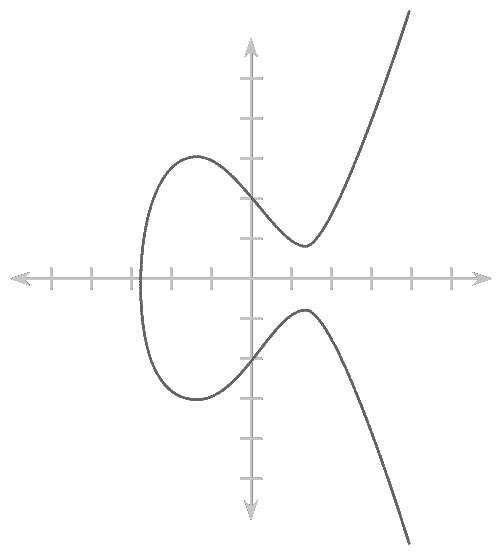
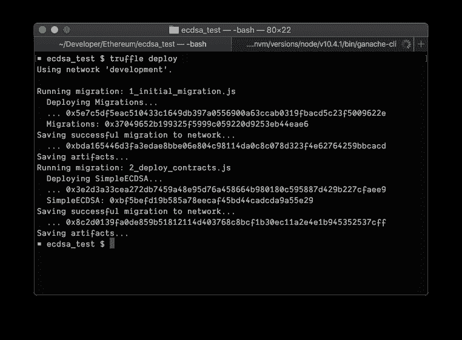
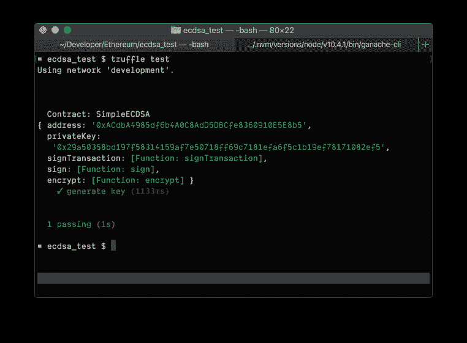
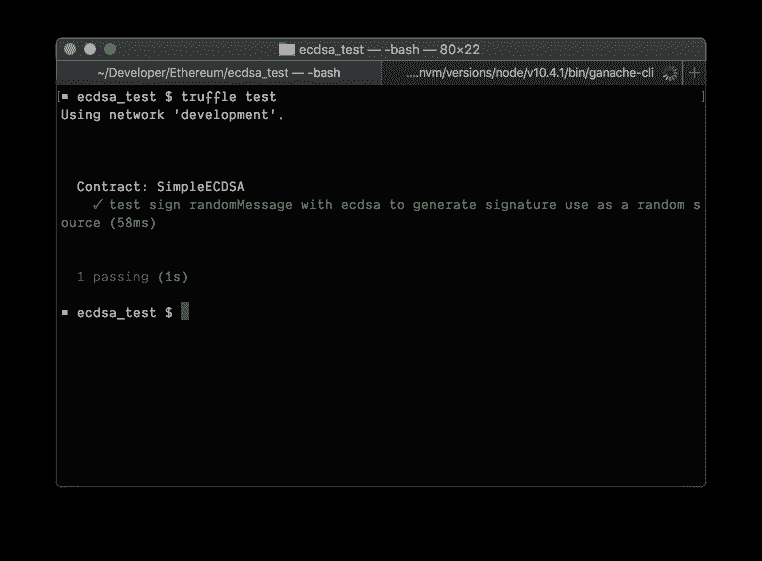

# 如何使用 ECDSA 在智能控制以太网上进行加密和解密，以此作为 Random 的源。

> 原文：<https://dev.to/armariya/-ecdsa--ethereum-smart-contract--source--random-25mp>

你好，今天回来一个关于以太网的系列。我今天要讲的是我刚刚从工作中学到的。那是 a。

#### ECDSA 是什么？

让我们先从这里开始。555 如果我们还不知道如何使用它，首先，我们要学习。为什么？为什么？:)对于 ECDSA，它是 elliptic 的缩写。

<figure>[](https://res.cloudinary.com/practicaldev/image/fetch/s--r4tM1gsg--/c_limit%2Cf_auto%2Cfl_progressive%2Cq_auto%2Cw_880/https://cdn-images-1.medium.com/max/500/1%2AY89MBlUMqXQ1JwFkPNpPFQ.png) 

<figcaption>【示例格式】用于椭圆曲线计算</figcaption>

。</figure>

其中 ECDSA 本身是一种生成私有密钥和公共密钥的算法，通过粗略的运算，我们可以用公共密钥或私有密钥 b 进行加密。

#### 进入故事！我的天啊！

对于本文要使用的内容，如下所示:

#### 要求

*   加纳切-cli
*   [块菌框架](http://truffleframework.com)
*   [Node.js / npm](https://nodejs.org/en/)
*   [对乙烯利和固体的初步认识](https://cryptozombies.io)。
*   基本的 javascript 语言知识

如果有人有这三样东西，那就让我们来玩吧。如果没有，先读一遍，然后再来。如果有人还没倒下，就跟着来了。(完)(完)(完)(完)(完)(完)(完)(完)(完)(完)(完)(完)(完)(完)(完)(完)(完)(完)(完)(完)(完。

让我们先来做一个 Truffle 项目，Truffle 是一个以太网项目。

```
truffle init 
```

Enter fullscreen mode Exit fullscreen mode

就能得到这样的结果。
t0㎡。

```
■ ecdsa_test $ truffle init
Downloading…
Unpacking…
Setting up…
Unbox successful. Sweet!

Commands:
Compile: truffle compile
Migrate: truffle migrate
Test contracts: truffle test 
```

Enter fullscreen mode Exit fullscreen mode

可以看到有三个我们可以使用的命令:

*   **是用于编译控制的，为部署做好准备。**
***   **【流量/流量分配】t1⾹用于以太网上的部署，本文所用的是向上部署。***   **t1**测试将在测试文件夹中运行所有测试，可以用 javascript 或 solidity 语言编写。**

 **我们先从对比端开始，在一个名为“对比”的文件夹中创建一个名为“ **SimpleECDSA”的文件。索尔**有个代码

```
pragma solidity 0.4.24;

contract SimpleECDSA {
  address private publicKey = 0x831412;

  modifier mustSignWithECDSA(bytes32 hash, uint8 v, bytes32 r, bytes32 s) {
    require(ecrecover(hash, v, r, s) == publicKey);
    _;
  }

  function callWithECDSA(bytes32 hash, uint8 v, bytes32 r, bytes32 s) 
    public 
    view 
    mustSignWithECDSA(hash, v, r, s) 
    returns (uint8) 
  {
    return 1;
  }
} 
```

Enter fullscreen mode Exit fullscreen mode

好的，我们一行一行看看每一个都做了什么

```
pragma solidity 0.4.24 
```

Enter fullscreen mode Exit fullscreen mode

就是说这个文件将使用什么版本的 solidity，这里使用的是 0。4.24，先生，
。

```
contract SimpleECDSA {
  address publicKey = 0x831412; 
```

Enter fullscreen mode Exit fullscreen mode

它声明了什么是连接名称，并声明了作为地址类型的 publicKey 变量，其值为 0x 83142Ӂt0⾹。

```
modifier mustSignWithECDSA(
  bytes32 hash, 
  uint8 v, 
  bytes32 r, 
  bytes32 s) 
{
  require(ecrecover(hash, v, r, s) == publicKey);
  _;
} 
```

Enter fullscreen mode Exit fullscreen mode

它声明了一个名为 mustSignWithECDSA 的 modifier，并使用 ecrecover 函数来解码所发送的 signature 是否可以与 public 匹配。

```
function callWithECDSA(bytes32 hash, uint8 v, bytes32 r, bytes32 s)
  public
  view
  mustSignWithECDSA(hash, v, r, s)
  returns (uint8)
{
  return 1;
} 
```

Enter fullscreen mode Exit fullscreen mode

这是我们刚刚创建的 test modifier 函数。如果我们通过了 verify，它将返回 1。

太好了，我们已经准备好了连接端了，我们去写测试文件

但首先，我们要为部署创建一个文件，在一个名为**t0 _ deploy _ contracts】的迁移文件夹中创建一个文件。js〔t1〕T2㎡**

```
// 2_deploy_contracts.js
const SimpleECDSA = artifacts.require('./SimpleECDSA.sol');

module.exports = function(deployer) {
  deployer.deploy(SimpleECDSA);
} 
```

Enter fullscreen mode Exit fullscreen mode

对于这个档案，让我解释一下，作为 truffle 框架的 deploy 部分，我想跳过它，因为它已经开始长了 555。

接下来，我们要先做一个增量数据包，以便在“测试”文件中使用通用密钥。使用
命令。

```
nom init -y
npm install --save secp256k1
npm install --save web3 
```

Enter fullscreen mode Exit fullscreen mode

好的，如果你完成了，让我们开始编写一个名为**simpleecdsa 的文件。js**，然后根据这个编写代码，先生，
。

```
// simpleecdsa.js
const SimpleECDSA = artifacts.require('./SimpleECDSA.sol');
const { randomBytes } = require('crypto');
const secp256k1 = require('secp256k1');

contract('SimpleECDSA', async (accounts) => {
  let simpleECDSAInstance;

  before('setup contract instance', async () => {
    simpleECDSAInstance = await SimpleECDSA.new();
  });

  it('generate key', async () => {
    const Web3 = require('web3');
    const web3 = new Web3();
    const messageBuffer = new randomBytes(32);
    const messageHex = messageBuffer.toString('hex');
    let privateKey;
    do {
      privateKey = randomBytes(32);
    } while (!secp256k1.privateKeyVerify(privateKey));

    const privateKeyHex = `0x${privateKey.toString('hex')}`;
    const generatedAccount = web3.eth.accounts.privateKeyToAccount(privateKeyHex);
    console.log(generatedAccount);
  });
}); 
```

Enter fullscreen mode Exit fullscreen mode

这个测试，我们先把它放在通用的钥匙上，然后再写一个真正的测试文件，555。

我们该走了，先生，现在我们要打开自己的私人 testnet，如果谁还没下 ganache-ce

```
npm install -g ganache-cli 
```

Enter fullscreen mode Exit fullscreen mode

完成后，在终端上打开一个新的 tab，执行 ganache-CLI
命令。

```
ganache-cli 
```

Enter fullscreen mode Exit fullscreen mode

好了，现在我们要在电脑上做私人测试了，在 t0¨http://localhost:8545㎡t1js 中的一个项目，在此基础上输入，T4㎡。

```
// truffle.js
module.exports = {
  networks: {
    development: {
      host: "127.0.0.1",
      port: 8545,
      network_id: "*"
    }
  }
}; 
```

Enter fullscreen mode Exit fullscreen mode

然后进行编译，然后部署到我们的私人测试台上，先生。
t0㎡。

```
truffle compile
truffle migrate 
```

Enter fullscreen mode Exit fullscreen mode

truffle 内置的编译会创建一个名为 builds 的文件夹，里面有一个编译完成的文件，然后执行 migrate testnen。

<figure>[](https://res.cloudinary.com/practicaldev/image/fetch/s--9nJibfgM--/c_limit%2Cf_auto%2Cfl_progressive%2Cq_auto%2Cw_880/https://cdn-images-1.medium.com/max/762/1%2A38XbuQ-M7roNJyrdLd3THw.png) 

<figcaption>【图】当部署成功时</figcaption>

</figure>

。

如果让我们回到 ganache-cli 的 tab 上，可以看到调用中有一个转接器，并且 deploy contract 上了，先生，如果没有 error，它就成功地实现了 deploy houre。

```
truffle test 
```

Enter fullscreen mode Exit fullscreen mode

<figure>[](https://res.cloudinary.com/practicaldev/image/fetch/s---jdxO_Xh--/c_limit%2Cf_auto%2Cfl_progressive%2Cq_auto%2Cw_880/https://cdn-images-1.medium.com/max/762/1%2AURUDZrgwkdkmAXSWaDoKiw.png) 

<figcaption>【通用计数器图像】成功完成</figcaption>

。</figure>

如果我们成功运行测试，我们可以看到上面的图片。我们已经有了 address，privateKey。现在，我们将把这两个放在一起。

首先，我们把它放在对比中，把这个叫做 publicKey 的变量替换成这个。
230。

```
address private publicKey = 0xACdbA4985df6b4A0C8AdD5DBCfe8360910E5E8b5; 
```

Enter fullscreen mode Exit fullscreen mode

文件中的部分，simpleecdsa。js 将通过删除通用功能将 privateKey 变量添加到一个实际的测试文件中，并将其转换为签名消息。

```
// simpleecdsa.js
const SimpleECDSA = artifacts.require('./SimpleECDSA.sol');
const { randomBytes } = require('crypto');

contract('SimpleECDSA', async (accounts) => {
  let simpleECDSAInstance;
  let privateKey = '0x29a50358bd197f58314159af7e50718ff69c7181efa6f5c1b19ef78171082ef5';
  let web3;
  let generatedAccount;

  before('setup contract instance', async () => {
    simpleECDSAInstance = await SimpleECDSA.new();
    const Web3 = require('web3');
    web3 = new Web3(Web3.givenProvider || 'http://localhost:8545');
    generatedAccount = web3.eth.accounts.privateKeyToAccount(privateKey);  
});

  it('test sign randomMessage with ecdsa to generate signature use as a random source', async () => {
    const messageBuffer = randomBytes(32);
    const messageHex = messageBuffer.toString('hex');
    const signatureObject = generatedAccount.sign(messageHex);

    const result = await simpleECDSAInstance.callWithECDSA(
      signatureObject.messageHash,
      signatureObject.v,
      signatureObject.r,
      signatureObject.s
    );

    assert.equal(result, 1);
  });
}); 
```

Enter fullscreen mode Exit fullscreen mode

然后做一个编译，deploy，test 完全一样，先生，唯一需要改变的是
230。

```
truffle deploy --reset 
```

Enter fullscreen mode Exit fullscreen mode

这需要重新设置，因为不然，truffle 会记住 SimpleECDSA 已经部署完毕。truffle 会弹出一个新的连接。足够了。

<figure>[](https://res.cloudinary.com/practicaldev/image/fetch/s--usTN2UUv--/c_limit%2Cf_auto%2Cfl_progressive%2Cq_auto%2Cw_880/https://cdn-images-1.medium.com/max/762/1%2A9QrZwZwOLtxZ7sPBjT2-jw.png) 

<figcaption>【完成测试时的图像】</figcaption>

</figure>

。

实际情况是，在 contract 中，我先把 address 放在 file test 中做为 verify parter，我把 private key 放在归档中供使用。sign(privatekey)boop 将成为一个签名对象，然后执行发送，这将看到 ECDSA 中包含 messageHash、v、r、s。这是 ecdsa 中的一个(r，s)。

```
ecrecover(hash, v, r, s) 
```

Enter fullscreen mode Exit fullscreen mode

我们可以把 r、s 和 random 源代码放在一起

```
uint256 randomNumber = uint256(s) % 10000; 
```

Enter fullscreen mode Exit fullscreen mode

像这样，耶，结束了！

嗯，忘了告诉你，这是一个 r 和 s 的样本，先生，
【注:

```
r: 0x79650c78c66d36e4c1c7edde2c8d45e2db1f19710bbb596d3d60f043b6e87a0c
s: 0x309482307f62e1ca9cdf6017b5a911b2e99cf0443e78a286b7c81694bca0f33b 
```

Enter fullscreen mode Exit fullscreen mode

你自己写吧，我们到底从 555 条里得到了什么？

*   用 ECDSA 实现通用密钥分配方法
*   它知道了 javascript 中的签名消息，并带着智能控件进行了身份验证，它可以让第一个 Verify 成为我们的 approve 吗？
*   当然，miner 无法预知的随机来源(不确定，但我想不行，如果还有，请告诉我 55)

#### 缺点

从刚才看起来很不错，但这个方法的缺点是(他称之为 signidice，search，看起来不错)，用我们的 randomMessage，对吧？

有关已完成的代码，请参见 [https://github。com/qapquiz/ecdsa _ t1 测试[此处]](https://github.com/qapquiz/ecdsa_test)**