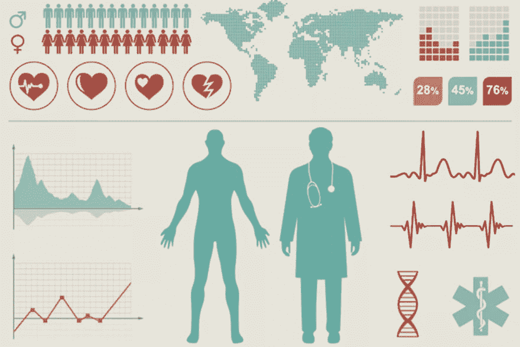

# Medical University Data: From Centralized Governance to Public Participation

> 原文：<https://dev.to/andys0975/-gop>

## In the era of centralized data governance, how much legal effect is left?

In the era of big data, do we still retain the ownership of the data generated from us? Recently, Facebook not only broke out the Cambridge Analytica scandal [T0】 [1] 【T1] , but also was reported by the new york Times [[2]](https://nyti.ms/2t5Haw1) that it shared the complete user's personal information and interpersonal status with 60 mobile device manufacturers, including Huawei, Lenovo, OPPO and other China manufacturers which are highly politically sensitive. It can be seen that the era of big data is not only a privacy issue, but the data collectors can't even effectively prevent unauthorized misappropriation, which is equivalent to the fact that the ownership has been overhead by the data collectors. Even though the European Union recently introduced the General Data Protection Regulation (GDPR) [[3]](https://www.eugdpr.org/) to require enterprises to reduce "accidental leakage", as long as the data is still in their hands, it is still difficult to prevent intentional unauthorized interest exchange, and even to avoid fines, it may be more transparent by carefully packaging under the pretext of trade secrets.

[T2】](https://res.cloudinary.com/practicaldev/image/fetch/s--Baxx23X_--/c_limit%2Cf_auto%2Cfl_progressive%2Cq_auto%2Cw_880/https://thepracticaldev.s3.amazonaws.com/i/ecvhax53wvjx9gudr8lx.png)

圖片來源：[https://tcrn.ch/2HVayuh](https://tcrn.ch/2HVayuh)

Compared with social network data such as Facebook, which may be connected to a fabricated virtual identity, health data is directly connected to the real identity, not only the hospital medical records, but also the emerging research biological database and wearable device continuous physiological monitoring in recent years, and even the information in the non-disease state is recorded in detail. The collection of these multivariate data is of great value to preventive medicine and clinical demonstration, which is an inevitable trend, but they may also become powerful tools to persecute the rights and interests of specific groups, such as bio-discriminatory personnel arrangements, medical and insurance industries. However, nowadays, as in the field of social networks, biological databases are still under the centralized governance of specific organizations. Under the trend that the data economy will be more profitable, even if the laws and regulations are stricter, it is still difficult for us to ensure that the incremental new actors will not use unidentified data to exchange interests with interested people, including the China government, like Facebook for development. An example is that even though Taiwan Province has layers of protection against trade secrets law and breach of trust, TSMC engineers are still desperate to sell secrets to China in exchange for huge profits [[4]](http://bit.ly/2yhZibO) . It is difficult for visible light to resist disproportionate inducements by tightening the law.

[T2】](https://res.cloudinary.com/practicaldev/image/fetch/s--TKYecQFJ--/c_limit%2Cf_auto%2Cfl_progressive%2Cq_auto%2Cw_880/https://thepracticaldev.s3.amazonaws.com/i/bs2szc2xelzawjg6a8vf.png)

圖片來源：[http://bit.ly/2lh89Rz](http://bit.ly/2lh89Rz)

## The issue we should really care about: people lack the awareness of data asset autonomy.

Even in the face of the abuse crisis caused by centralized data governance, Taiwan Province people have always been generally insensitive to their own asset characteristics, whether biological or non-biological, and virtually abandoned the right to speak and supervise the use of data. Take Taiwan Bio Bank [[5]](http://bit.ly/2yi81e3) hosted by Academia Sinica as an example. Since its launch in 2012, it has collected nearly 100,000 biological data, including questionnaires (family history, living habits, self-reported diseases, etc.), physiological tests (BMI, HbA1c, GOT/GPT, HDL/LDL, etc.) and blood DNA (genome typing) According to nearly 10,000 satisfaction surveys [[6]](http://bit.ly/2ynWhGO) , the primary factor of 26.59% of the participants is that they have free health check-up service. If they don't provide health check-up report, 39.33% of the participants will no longer be willing to provide data. Moreover, the primary factor of 5.75% of the participants who are not satisfied is that there are too few health check-up items. It can be seen that for some people, the valuable measurement of biological data is only in exchange for free health check-ups with rich projects, not to mention that most other participants are willing to donate biological data for free. This warns us that, despite years of appeals and doubts from ethicists and human rights groups, people's concept of data autonomy and asset awareness under medical recruitment can't be awakened. The following article quotes Professor Cai Youyue's exposition, sorts out the justifications in the process of centralized governance of Biobank, imagines community recruitment, and how to embed altruistic dedication in Taiwan Province society, thus catalyzing people's desensitization to data value, indirectly losing the significance of active supervision, and possibly falling into a passive position in the imitation of new actors.

[T2】](https://res.cloudinary.com/practicaldev/image/fetch/s--8X5UxFYL--/c_limit%2Cf_auto%2Cfl_progressive%2Cq_auto%2Cw_880/https://thepracticaldev.s3.amazonaws.com/i/28us7aawnsogad7rjyzh.png)

圖片來源：[https://www.twbiobank.org.tw/](https://www.twbiobank.org.tw/)

## Imagined gene community

Professor Cai Youyue's research [[7]](#ref7) pointed out that from the perspective of biopolitical paradigm [[8]](#ref8) , the national biodatabase is both the promoter and beneficiary of bio-nationalism. The collective identity shared by its citizens is reproduced in the form of a large number of biomarkers, such as genomes, forming an "imagined genetic community" [[9]](#ref9) , which in turn eliminates many difficult costs that may be faced. For example, Dr. Shen Zhiyang, CEO of Biobank, has publicly stated that [[10]](http://bit.ly/2JG2EdU) "this is doing meritorious deeds. Compared with traditional nationalism, bio-nationalism seems to be more capable of rallying the hearts and minds of modern countries, resulting in a stronger way to promote relevant policies. It appeals to the imagination of a common vision for the future, including the display of competitive strength, rather than the traditional mode of focusing on ideological identity such as language, history and culture. In particular, the latter has probably become a common factor of internal division and opposition in modern countries.

[T2】](https://res.cloudinary.com/practicaldev/image/fetch/s--1JVZZjH4--/c_limit%2Cf_auto%2Cfl_progressive%2Cq_auto%2Cw_880/https://thepracticaldev.s3.amazonaws.com/i/b1n0r7m3yj0suqu0d07f.png)

沈志陽執行長，圖片來源：[http://bit.ly/2ygMTEX](http://bit.ly/2ygMTEX)

Up to now, the established Biobank of various countries complement each other with their own imagination communities. For example, Iceland focuses on "racial homogeneity". When Icelandic people participate in the case, they can feel that the Viking blood flowing in their bodies is integrated with the nation through genetic technology, and the national participation rate reaches about 50%. On the contrary, Estonia has experienced the rule of neighboring countries, and its population composition is particularly heterogeneous. Biobank promoters mentioned that "Estonia is like a shortcut (to Europe), where people can come here and download their (race) genetic information" [[11]](#ref11) . This national identity as a transportation hub has also contributed to the recently launched digital citizenship of blockchain, which is not only an ambition to absorb the world. Ong et al. [[12]](#ref12) pointed out that although there were some differences in medical policies among Asian countries including Taiwan Province, they also revealed a kind of "communities of fate" governance, which was a historical thread embedded in the post-colonial era in an attempt to surpass Europe and catch up with the United States and overcome the impression of the sick man in East Asia.

[T2】](https://res.cloudinary.com/practicaldev/image/fetch/s--Ct9W_6u5--/c_limit%2Cf_auto%2Cfl_progressive%2Cq_auto%2Cw_880/https://thepracticaldev.s3.amazonaws.com/i/qoivr2y6mcul6umawwnp.png)

愛沙尼亞 e-Estonia 計劃，圖片來源：[https://e-estonia.com/](https://e-estonia.com/)

## The trend of democratization and localization has contributed to the situation.

However, the imagination of Taiwan Province's gene community is not limited to this, but also incorporates the characteristics of the initial germination of localization and democratization after the strict rule, which is reflected in two aspects: spiritual legitimacy and organizational governance model. Since the Kuomintang government came to rule in Taiwan Province, under the political propaganda of greater China nationalism and regaining the Central Plains regime, it is almost impossible for Taiwan Province to take the thinking and practice as the main body in education, culture and scholarship in postwar. After the lifting of martial law, the tide of localization and democratization finally came, and the political, literary, historical and linguistic activities that pursued Taiwan's subjectivity flourished, which also highlighted the spiritual intention of academic research in various fields. For example, Professor Cai Youyue's research [[13]](#ref13) pointed out that according to the research results obtained by Taiwan Province people's sampling, almost all medical journals before the lifting of martial law were used to represent the physical characteristics and health status of "China people". In the 1990s, with the rise of subject consciousness in Taiwan Province, the proportion of "Taiwan Province people" was obviously increased. Therefore, it is "to establish Taiwan Province's own Biobank" instead of citing the database established by China as the Taiwan Province standard. This kind of spiritual legitimacy stems from the imagination of Taiwan Province's subject under the new trend of thought. On the other hand, based on the pressure of industrial upgrading and transformation, the biotechnology industry became a field vigorously promoted by the government in the 1990s. Under the context of lifting martial law, the government extensively invited overseas biomedical and chemical scholars to return to Taiwan, and even shared the power to lead biotechnology policies with scholars. Through multiple and frequent expert committee meetings, it showed the transition and change of democratization of organizational governance.

[T2】](https://res.cloudinary.com/practicaldev/image/fetch/s--KPfnykbq--/c_limit%2Cf_auto%2Cfl_progressive%2Cq_auto%2Cw_880/https://thepracticaldev.s3.amazonaws.com/i/l2kbi283ekfyvsvyp1cw.png)

1950 年代反攻大陸漫畫，圖片來源：[http://bit.ly/2K23LnT](http://bit.ly/2K23LnT)

As we can see, the centralized data governance based on national sentiments of national Biobank virtually makes people ignore the importance of data asset autonomy, and deliver data to professional centralized organizations without active supervision and feedback. This phenomenon is actually caused by the interaction between Biobank and social context. In the post-genome era, Biobank scientists have mastered the knowledge of biomedical analysis as the basis of data centralization. On the one hand, they have promised a beautiful common vision to the people, on the other hand, they have also borne the pressure that Taiwan Province cannot lose in the industrial transformation, making the whole society an imaginary gene community. Moreover, the local consciousness is on the rise, which strengthens the public's recognition of Taiwan Province's ontology database. In addition, since the pioneering period is still in the transitional stage of democratization, most people are accustomed to obeying the authority of public departments and scientific experts for a long time, so they have no doubts about the medical experts in power, and those in power haven't cultivated the concept of open and transparent public opinion communication, which makes it difficult for research ethics, imperfect supervision mechanism and other issues to arouse widespread concern and diverse voices.

## How does data change from centralized governance model to autonomous governance?

Of course, the efforts made by the staff of Biobank for biomedical progress are quite admirable. However, in the future, apart from the gene database, all kinds of large-scale biological databases will be in full swing to accept cases. If all of them follow the traditional centralized management experience of Biobank, people will be more accustomed to giving up their awareness of asset autonomy and self-defense in data sharing again and again. At that time, I'm afraid we won't be able to deal with all kinds of data crises just by tightening the personal data protection law. How can we wake up people's awareness and motivation of autonomous management of biological data? Recently, the red blockchain, its decentralized ledger technology may be a constructive solution.

Shivom [[14]](https://shivom.io/) , founded in Munich, Germany in 2016, is to use distributed ledger technology, including Hyperledger Fabric and IOTA tangle (Internet of Things Continuation Data), to establish a safer and more efficient molecular genomics data exchange ecosystem, and to completely return the control rights of various biological data to people. Unlike many blockchain projects that are still painting big cakes, Shivom has completed the ICO [[15]](http://bit.ly/2Mwjk5y) of USD 35 million, and signed a memorandum of cooperation [[16]](http://bit.ly/2JKw5vx) with alpha Pradesh, India at the beginning of this year, which will gradually carry out the establishment of decentralized gene database of more than 60 million local people by 2025\. T4】 [16] 【T5]

[T2】](https://res.cloudinary.com/practicaldev/image/fetch/s--dAiIb45d--/c_limit%2Cf_auto%2Cfl_progressive%2Cq_auto%2Cw_880/https://thepracticaldev.s3.amazonaws.com/i/rzma9jk4gv4tz3obtveb.png)

Shivom 共同創辦人與印度孩童合影，圖片來源：[https://shivom.io/about.html](https://shivom.io/about.html)

The mechanism [[17]](#ref17) of Shivom to return the dominance of biological data to people is quite clear. Participating people can register multiple virtual identities on the platform to face a number of biotechnology service providers that cooperate with Shivom, and purchase OmiX virtual currency launched by Shivom to apply for data collection services such as gene sequencing, so that all service providers and purchasing units can't master all data of the same person. The service provider encrypts the sequencing result with the public key generated separately by the virtual identity and writes it into the database of Shivom platform for safekeeping. Only those who hold the corresponding private key can master the sequencing result, which contains annotation information. Therefore, the purchasing unit can create a smart contract on the blockchain to purchase data that meets the conditions of specific annotation and metadata with OmiX currency. People can independently decide in which units the smart contract is launched to sell the private key, or create a smart contract to automatically donate to specific disease research. Therefore, all data transactions are recorded in the decentralized ledger of blockchain, and the records in these chains are hashed with metadata such as the ID of both parties to the transaction, so only both parties to the transaction can track and verify the transaction history in the chain to avoid information leakage. Finally, Shivom will also cooperate with third-party enterprises, allowing people to use OmiX coins obtained from sales data to purchase diversified products and services such as health nutrition products, fitness equipment, regular health check-ups, etc., as incentives for OmiX coins. Once this system is mature, it is believed that Shivom will have enough right to say that scientists must note the list of quoted public keys when publishing research and when medical AI developers launch products. On the one hand, it will enable peers and quality control organizations to conduct secondary verification, on the other hand, it will also enable participants to monitor whether there may be abuse of resale.

[T2】](https://res.cloudinary.com/practicaldev/image/fetch/s--ncWdlrV3--/c_limit%2Cf_auto%2Cfl_progressive%2Cq_auto%2Cw_880/https://thepracticaldev.s3.amazonaws.com/i/3drxq6jwc8rf6bfh266w.png)

圖片來源：Shivom whitepaper

As can be seen from the foregoing, Shivom visualizes the value of biological data in people's minds through OmiX coins, and also allows people to change their passive mentality into initiative by applying for data and signing smart contracts, cultivate their knowledge of the data operation process, and learn to use the transparent records of decentralized books to actually supervise purchasers. Even because the blockchain technology used is a well-known open source project, any people with the ability to work can participate in the development contribution and assist in the notification and repair of security vulnerabilities even if they don't provide data. In this mobilization of self-governance, people's biological data can be guaranteed more completely, and it can be done by one's own efforts.

# References

7\. Cai Youyue, Li Wanru (2016) "Imagining the Future: Taiwan Province Human Biodatabase, Gene Niche and Nation Construction" Taiwan Province Sociology No.32 p109-169

8.史蒂文·爱泼斯坦(2009)“包容:医学研究中的差异政治”

9.鲍勃·辛普森(2002)“想象的基因群落:21 世纪的种族和本质主义”今日人类学第 16 卷，第 3 期，第 3-6 页

11.弗莱彻艾米。(2004 年)“基因领域:爱沙尼亚基因组计划中的科学政治和身份。”新遗传学与社会 23(3): 3-14。

12.王爱华、陈南茜编。(2010)“亚洲生物技术:伦理和命运共同体。”达勒姆和伦敦:杜克大学出版社。

13\. Cai Youyue (2014) "Genetic Science and Identity Politics: Aboriginal DNA, Taiwan Province Origin and the Rise of Biological Multiculturalism", Sociology of Taiwan Province, 28, 1-58.

17.Shivom 白皮书和执行摘要