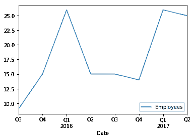

# 如何在 Python pandas 中分析时间序列数据

> 原文：<https://dev.to/harishkgarg/-how-to-analyze-time-series-data-in-python-pandas-ih9>

### 注:这篇文章最初发表于[https://bignumworks.com](https://bignumworks.com)

## 介绍

在本文中，我们将探讨如何使用 Python 的 Pandas 数据分析库来分析时间序列数据。

我们先来理解一下我们所说的时间序列数据是什么意思。简单来说，时间序列代表一段时间内的一组观察值。每当定期记录数据时，就会发生这种情况。例如...

[T2】](https://res.cloudinary.com/practicaldev/image/fetch/s--nb1rXVV1--/c_limit%2Cf_auto%2Cfl_progressive%2Cq_auto%2Cw_880/https://thepracticaldev.s3.amazonaws.com/i/xux99p7pziz598v5pwg1.png)

这里，我们记录了多个地点几个月的销售数据。

时间序列数据分析对于制定明智的商业和政策决策和计划极其重要。它被用来

*   找出过去的趋势
*   使用过去的趋势来预测当前的未来趋势。
*   找出循环变化
*   发现季节变化

例如，零售商可以发现其库存的季节性和周期性销售趋势，并据此制定计划。

### 我们的方法

*   我们将从导入必要的 python 模块开始。
*   然后我们将读入包含时间序列数据的数据集。
*   我们将转换数据，以确保它在时序数据列上是可索引的。
*   然后，我们将演示如何根据日期和时间选择和过滤数据。
*   最后，我们将时间序列数据可视化。

## 设置您的机器

对于本文中的代码演示，我们使用 Python 3.x 和 Python 模块 Pandas 和 matplotlib。我们使用 Pandas 读取数据和数据分析，使用 matplotlib 进行数据可视化。获得所有所需的最好方法是安装 Anaconda 数据科学 Python 区。

## 导入 Python 模块

我们从导入 Pandas、matplotlib 和 datetime 模块开始。我们正在为导入日期时间模块，因为我们需要使用它的一些方法。我们还设置了`matplotlib inline`来确保图表显示在 Jupyter 笔记本上

```
from datetime import datetime
import pandas as pd
%matplotlib inline
import matplotlib.pyplot as pyplot 
```

## 介绍我们的数据集

对于这个代码演示，我们将创建一个包含两列的样本雇员数据集

*   日期字段
*   员工人数

此数据是过去 8 个季度的员工季度计数。

我们用列名、键和记录作为值创建一个数据字典。然后，我们将这个`dict`对象传递给 Pandas `DataFrame`方法，并创建一个 DataFrame，其中的数据将以表格格式存储。

```
employees = {'Date': ['2015-09-30', '2015-12-31', '2016-03-31', '2016-06-30', 
                 '2016-09-30', '2016-12-31', '2017-03-31', '2017-06-30'],
        'Employees': [9, 15, 26, 15, 15, 14, 26, 25]}
df = pd.DataFrame(employees, columns = ['Date', 'Employees']) 
```

现在，我们有了熊猫数据框架中的数据，让我们把它打印出来，看看它看起来怎么样。

```
print(df) 
```

```
 Date  Employees
0  2015-09-30          9
1  2015-12-31         15
2  2016-03-31         26
3  2016-06-30         15
4  2016-09-30         15
5  2016-12-31         14
6  2017-03-31         26
7  2017-06-30         25 
```

正如我们所看到的，我们有两列数据:日期和雇员。另外，请注意，在将数据导入 DataFrame 时，会自动设置一个数字行索引。我们将不得不改变这一点。

## 熊猫时间和日期方法

让我们获得一些关于数据集的信息，比如列的数据类型

```
df.info() 
```

```
<class 'pandas.core.frame.DataFrame'>
RangeIndex: 8 entries, 0 to 7
Data columns (total 2 columns):
Date         8 non-null object
Employees    8 non-null int64
dtypes: int64(1), object(1)
memory usage: 136.0+ bytes 
```

我们看到日期列是 object，这意味着它存储为文本。文本格式的日期时间数据对于运行时间序列分析不是很有用。我们需要首先将其转换为日期时间数据类型

我们通过在日期列上调用 Pandas `to_datetime`方法来完成这种转换。我们将转换后的日期列赋回原始的 Pandas 数据帧，从而用新的 datetime 类型列替换旧的文本日期列。

```
df['Date'] = pd.to_datetime(df['Date']) 
```

我们通过在 DataFrame 上再次调用 info 方法来检查到 datetime 数据类型的转换

```
df.info() 
```

```
<class 'pandas.core.frame.DataFrame'>
RangeIndex: 8 entries, 0 to 7
Data columns (total 2 columns):
Date         8 non-null datetime64[ns]
Employees    8 non-null int64
dtypes: datetime64[ns](1), int64(1)
memory usage: 168.0 bytes 
```

我们看到日期列现在显示为日期时间数据类型。

在开始探索时间序列属性之前，我们还需要做一件事。我们需要将数据帧的索引设置为日期列。我们通过在 Pandas 数据帧上调用 index 并给它分配日期序列来实现这一点。我们还删除了日期列，因为我们不需要它与索引分开。

```
df.index = df['Date']
del df['Date'] 
```

让我们打印出数据帧，看看将索引设置为日期列后是什么样子

```
print(df) 
```

```
 Employees
Date                 
2015-09-30          9
2015-12-31         15
2016-03-31         26
2016-06-30         15
2016-09-30         15
2016-12-31         14
2017-03-31         26
2017-06-30         25 
```

## 查询时间序列数据

现在我们开始探索我们的时间序列数据。我们将从展示一些数据查询技术开始。

在这里，我们查询和过滤数据，只选择 2016 年的记录

```
df['2016'] 
```

|  | 雇员 |
| --- | --- |
| 日期 |  |
| --- | --- |
| 2016-03-31 | Twenty-six |
| 2016-06-30 | Fifteen |
| 2016-09-30 | Fifteen |
| 2016-12-31 | Fourteen |

注意，由于我们将 Date 列转换为 datetime 并将其设置为 index，所以我们可以运行各种查询。上面我们刚刚过了 2016 年，熊猫明白我们正在寻找 2016 年的记录。

接下来，我们将选择 2016 年 6 月起的所有记录。

```
df[datetime(2016, 6, 30):] 
```

|  | 雇员 |
| --- | --- |
| 日期 |  |
| --- | --- |
| 2016-06-30 | Fifteen |
| 2016-09-30 | Fifteen |
| 2016-12-31 | Fourteen |
| 2017-03-31 | Twenty-six |
| 2017-06-30 | Twenty-five |

## 时间序列数据可视化

这里，我们通过调用 DataFrame 上的 plot 方法，使用时间序列来可视化我们的数据。因为我们已经将时间序列设置为索引，所以我们必须以最简单的形式简单地调用 plot 方法来获得这个图。

```
df.plot(); 
```

[T2】](https://res.cloudinary.com/practicaldev/image/fetch/s--sr6hD9tO--/c_limit%2Cf_auto%2Cfl_progressive%2Cq_auto%2Cw_880/https://thepracticaldev.s3.amazonaws.com/i/tkohn1pstcz8s36ikky8.png)

## 结论

我们将涉及到 Pandas 的一些时间序列数据分析功能。我们转换并操作了一个包含时间序列数据的数据集。我们使用 Pandas 内置的方法将其转换为适当的时间序列格式。然后，我们学习了如何使用 Pandas 的日期时间数据方法和功能来探索和过滤数据。最后，我们看到了一种可视化时间序列数据的简单方法