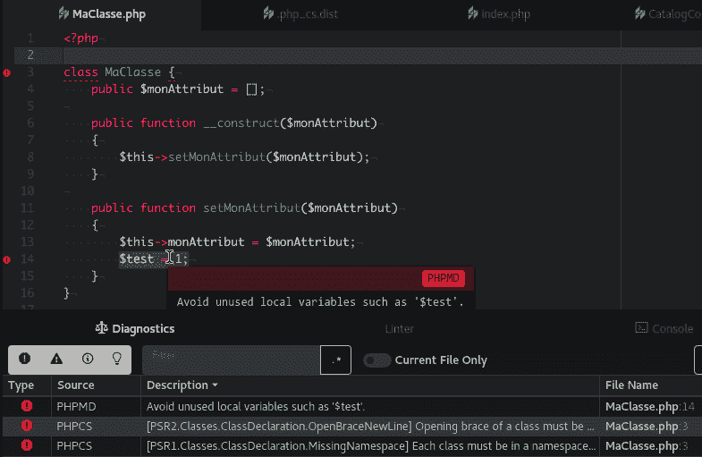
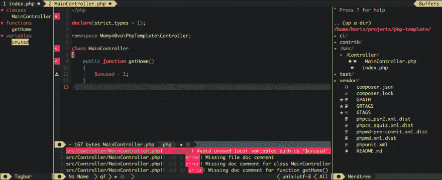
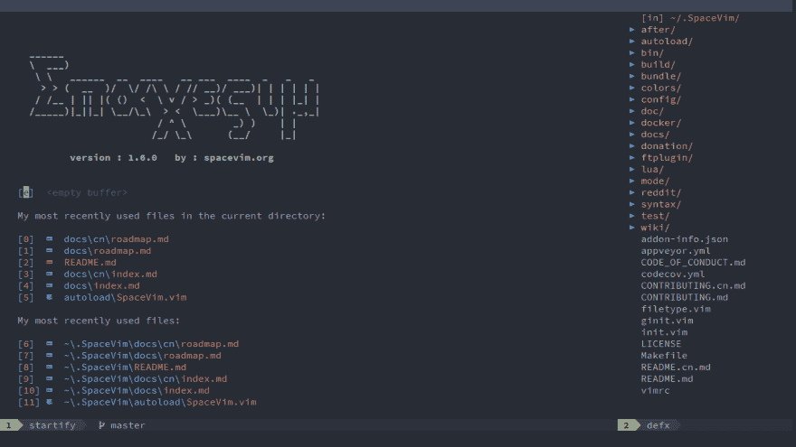
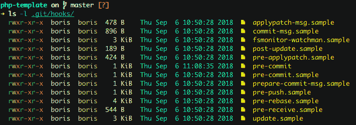

# 🚥如何在您的工作流程中自动化代码质量检查？⚙

> 原文：<https://dev.to/biros/-how-to-master-your-code-through-your-project-lifecycle-22-2pej>

## 目录

*   [如何在你的工作流程中嵌入代码分析工具](#embed) ❓
    *   📝[在您的编辑器或 IDE 中](#in-ide)
    *   🌱[与 git 挂钩](#git-hooks)
    *   ⚙ [通过作曲家实现自动化](#composer)
    *   🚉[在您的 CI/CD 渠道中](#pipeline)
*   ⏭[更进一步](#go-further)

之前，我们关注了一些广泛采用的 PHP 代码质量工具( [phpcs](https://github.com/squizlabs/PHP_CodeSniffer) 、 [phpmd](https://github.com/phpmd/phpmd) 和 [php-cs-fixer](https://github.com/FriendsOfPhp/PHP-CS-Fixer) )，我们得出的结论是，这些工具需要作为我们代码库的一部分。

> 本文并不特别关注 PHP，而是关注在工作流程的每个阶段控制代码库的质量(编辑= >版本控制= >构建)。因此，它对任何类型的项目(前端或后端，Go 或 JS，...).你只需要为你的语言找到合适的工具。
> 
> 对于你们中最没有耐心的人，我在`gitlab.com`上创建了一个[模板项目](https://gitlab.com/mamyn0va/php-template)，让你们可以用现成的质量工具快速启动一个 PHP 项目。

* * *

## 如何在你的 workflow❓中嵌入代码分析工具

使用 CLI 手动检查您的代码很酷(真的吗？🤔)，但不是很有成效。让我们把⚙自动化一点！

### 📝在你的编辑器或 IDE 中

我个人用的是 [Atom](https://atom.io/) 和 [Neovim](https://neovim.io/) 。两者都为许多高质量的工具提供插件。但是所有现有的编辑器(Emacs，SublimeText，VSCode...)和 IDE (Intellij，PhpStorm...)也有用于此目的的插件。

💡Atom 中的插件安装:

```
apm install linter-phpmd \
            linter-phpcs \
            linter-php \
            php-cs-fixer

Installing linter-phpmd to /home/boris/.atom/packages ✓
Installing linter-phpcs to /home/boris/.atom/packages ✓
Installing linter-php to /home/boris/.atom/packages ✓
Installing php-cs-fixer to /home/boris/.atom/packages ✓ 
```

Enter fullscreen mode Exit fullscreen mode

然后你必须配置这些插件，以便它们找到相关的工具(例如`linter-phpcs` ➜ `./vendor/bin/phpcs`)。

如果你用 Composer ( `composer global require xx/xx`)全局安装了它们，那么你只需要把`~/.config/composer/vendor/bin`放到你的`$PATH`中。不需要在 Atom 中配置它们。

如果您在项目的根目录下为 phpc(`phpcs.xml.dist`)、phpmd ( `phpmd.xml.dist`)和 php-cs-fixer ( `.php_cs.dist`)定义了自己的规则集，那么它们将被 Atom 的插件自动加载。

让我们看看它在 *Atom* 中的样子:

[T2】](https://res.cloudinary.com/practicaldev/image/fetch/s--2FTcBo4Q--/c_limit%2Cf_auto%2Cfl_progressive%2Cq_auto%2Cw_880/https://thepracticaldev.s3.amazonaws.com/i/vymggdh9m8h00l2gd0jt.png)

通过组合这 3 个工具(`phpcs`、`phpmd`和`php-cs-fixer`)，我们可以对当前文件进行实时诊断，内嵌突出显示检测到的违规(错误带有下划线，鼠标悬停时会出现工具提示，相关行的空白处会显示一个图标)，并且`php-cs-fixer`会在保存时自动修复错误。

同样，在 *nvim* 中，错误显示在当前文件下的专用缓冲区中，文件本身包含上下文信息:

[T2】](https://res.cloudinary.com/practicaldev/image/fetch/s--aT_Ax6So--/c_limit%2Cf_auto%2Cfl_progressive%2Cq_auto%2Cw_880/https://thepracticaldev.s3.amazonaws.com/i/pqg3uaapojymxifriyst.png)

如果您正在寻找一个开箱即用的解决方案来改善 vim/neovim 中的开发体验，请看看这个非常棒的🚀项目:

##  [太空维姆](https://github.com/SpaceVim) / [太空维姆](https://github.com/SpaceVim/SpaceVim)

### 社区驱动的模块化 vim 发行版——终极 vim 配置

<article class="markdown-body entry-content container-lg" itemprop="text">

[T2】](https://spacevim.org)

[Wiki](https://github.com/SpaceVim/SpaceVim/wiki) | [社区](https://spacevim.org/community/) | [赞助商](https://spacevim.org/sponsors/)|[Twitter](https://twitter.com/SpaceVim)|[Gitter**Chat**](https://gitter.im/SpaceVim/SpaceVim)|[中文官网](https://spacevim.org/cn/)

[](https://github.com/SpaceVim/SpaceVim/actions?query=workflow%3Abuild)[](https://codecov.io/gh/SpaceVim/SpaceVim)[](https://hub.docker.com/r/spacevim/spacevim/)[](https://camo.githubusercontent.com/70f46be7ad64f947bfea1c89cefef6d7cf5cb249bad1311cb82b26a08e47d04b/68747470733a2f2f696d672e736869656c64732e696f2f62616467652f76657273696f6e2d312e372e302d2d6465762d3837303046462e737667)[](https://raw.githubusercontent.com/SpaceVim/SpaceVim/master/LICENSE)[](https://raw.githubusercontent.com/SpaceVim/SpaceVim/master/doc/SpaceVim.txt)

[T2】](https://user-images.githubusercontent.com/13142418/103414298-5e1da980-4bb8-11eb-96bc-b2e118f672b5.png)

SpaceVim 是一个社区驱动的模块化 Vim 发行版。它在层中管理插件的集合，这有助于将相关的包收集在一起，以提供类似 ide 的特性。

最新版本是 [v1.6.0](https://spacevim.org/SpaceVim-release-v1.6.0/) ，查看[跟随者-HEAD](https://github.com/SpaceVim/SpaceVim/wiki/Following-HEAD) 页面，了解自最新版本以来发生的事情。

**更多信息见下文:**

*   [快速入门指南](https://spacevim.org/quick-start-guide/):初学者的简单指南。
*   [文档](https://spacevim.org/documentation/):关于使用 SpaceVim 的完整文档。
*   [可用层](https://spacevim.org/layers/):space vim 中包含的所有可用层的列表。

## 支持空间 Vim

这个项目的存在要感谢所有[做出贡献的人](https://raw.githubusercontent.com/SpaceVim/SpaceVim/master/CONTRIBUTING.md)我们感谢来自社区的任何贡献。

[T2】](https://github.com/SpaceVim/SpaceVim/graphs/contributors)

支持 SpaceVim 的最好方式是通过在 [Gitter Chat](https://gitter.im/SpaceVim/SpaceVim) 上报告 bug 来帮助社区，或者发送 pull 请求。

有关更多信息，请查看我们的[开发指南](https://spacevim.org/development/)。

如果你用 SpaceVim…

</article>

[View on GitHub](https://github.com/SpaceVim/SpaceVim)

### 🌱有饭桶挂钩的

*在编辑器中检查代码是好的，但是在推送到 git 之前做更好！*

Git 附带了一组钩子，您可以在工作流的许多步骤中使用它们(提交前、推送前、更新后...).git 挂钩只是一个在特定事件之前或之后执行的脚本。它可以是 shell 脚本、PHP 脚本、perl 脚本、python 脚本或任何脚本语言。甚至可以是二进制。它只需要是一个可执行文件。

以下是所有可用挂钩的列表:

[T2】](https://res.cloudinary.com/practicaldev/image/fetch/s--ErwfxAva--/c_limit%2Cf_auto%2Cfl_progressive%2Cq_auto%2Cw_880/https://thepracticaldev.s3.amazonaws.com/i/ntkaeymeyrkusy4m6rto.png)

我们将重点关注`pre-commit`挂钩。

这个想法是运行`pre-commit`钩子中的质量工具来检查你的修改是否符合你为你的项目定义的标准。因此，您要确保不会提交错误的代码。

⚠️在编辑`pre-commit`脚本之前，重要的是要知道如果一些工具返回一个错误代码(不是 0)，那么它将停止提交过程。这正是我们想要的。

📜以下是我个人使用的两条规则:

*   `pre-commit`钩子**应该**只检查(并修复)用户提交的文件。如果您需要检查/修复整个代码库，那么手动完成并通知您的团队，以避免合并地狱。
*   任何被钩子**修改的文件**都不会被自动重新添加到 git 索引中。这个**应该**由用户来完成，让他控制什么是真正提交的。

首先，必须在`.git/hooks/pre-commit`中重命名文件`.git/hooks/pre-commit.sample`。

然后，您需要检索添加到 git 索引中的文件列表，并过滤您需要的文件扩展名(。php，。去吧。巴拉圭...):

```
#!/bin/bash

STAGED_FILES_CMD=`git diff --cached --name-only --diff-filter=ACMR HEAD | grep \\\\.php` 
```

Enter fullscreen mode Exit fullscreen mode

这里我使用`bash`是为了拥有一个可以在(几乎)任何计算机上运行的可移植脚本。但是任何脚本语言都是可以接受的。

现在，在下面添加对每个质量工具的调用，为它们提供暂存文件的列表，并在出错时用 1 退出以中断提交:

```
#!/bin/bash

echo "Running pre-commit hook"

PROJECT=`php -r "echo dirname(dirname(dirname(realpath('$0'))));"`
STAGED_FILES_CMD=`git diff --cached --name-only --diff-filter=ACMR HEAD | grep \\\\.php`

echo "Checking PHP Lint..."
for FILE in $STAGED_FILES_CMD
do php -l -d display_errors=0 $PROJECT/$FILE
    if [ $? != 0 ]
    then echo "Fix the error before(s) commit."
        exit 1
    fi FILES="$FILES  $PROJECT/$FILE"
done echo "Running PHP Code Beautifier and Fixer (phpcbf)..."
phpcbf --standard=phpcs.xml.dist $STAGED_FILES_CMD --colors --report=summary
if [ $? != 0 ]
then echo "Fix the error before(s) commit."
    exit 1
fi echo "Running PHP-CS-FIXER..."

PHP_CS_STATUS=0

for FILE in $STAGED_FILES_CMD
do php-cs-fixer fix $FILE
    PHP_CS_STATUS=$(( $PHP_CS_STATUS + $? ))
done

if [ $PHP_CS_STATUS != 0 ]
then echo "Fix the error(s) before commit."
fi echo "End of pre-commit hook"

exit $PHP_CS_STATUS 
```

Enter fullscreen mode Exit fullscreen mode

这里我不运行`phpcs`和`phpmd`，因为它们需要高度定制才能在 git 挂钩中使用。否则，将引发大量错误/警告，并阻止提交。只有当你和你的同事都准备好了，再去做。如果你做得太早，可能会让你和你的团队泄气。

如果你觉得已经准备好了，这个 [phpmd 文件](https://gitlab.com/mamyn0va/php-template/blob/master/phpmd-pre-commit.xml.dist)将是一个好的开始。

我还使用 PHP linter ( `php -l`)来确保我所有的 PHP 文件都是语法正确的。

我们也可以添加一个对`phpunit`的调用，但是要注意它不能持续超过几秒钟，因为提交必须很快。

git 钩子的极限只是你的想象。我用它来 lint 我项目的许多文件:JSON、XML、swagger spec、markdown、shell 脚本...

*   [swagger-cli](https://github.com/BigstickCarpet/swagger-cli) : lint 你的 swagger 文件！
*   composer validate:lint your composer . JSON！
*   dockerlint : lint 你的 Dockerfile！
*   shellcheck : lint 你的 shell 脚本！

如果你的文件没有过磅，那就写你自己的过磅！例如，我创建了一个简单的脚本来检查我的 **i18n** 资源文件在所有语言中都是同质的。

最后，您可以通过向 git 索引添加一个文件并提交来测试您的钩子。将自动触发`pre-commit`脚本。如果没有，检查它是否有执行位。否则:

```
chmod +x .git/hooks/pre-commit 
```

Enter fullscreen mode Exit fullscreen mode

### ⚙通过作曲家

在这个系列的第一部分中，我介绍了三个工具以及如何在 Composer 中自动安装它们。这样，每个开发者**只需在项目的根目录下运行`composer install`就可以**安装它们。

但是如何确保他们每个人**在每次修改单行代码时**都会使用它们呢？幸运的是，Composer 还附带了一组钩子，允许您自动完成一些任务。

因此，与其为每个开发人员手动创建一个`pre-commit`脚本，不如将脚本放在代码库中的某个地方(例如在`/contrib`中)，并在安装或更新项目时要求 Composer 自动安装它。

只需在您的`composer.json` :
中添加一个新的部分

```
{  "scripts":  {  "post-update-cmd":  [  "mv .git/hooks/pre-commit .git/hooks/pre-commit.bak",  "cp contrib/pre-commit .git/hooks/pre-commit",  "chmod a+x .git/hooks/pre-commit"  ],  "post-install-cmd":  [  "mv .git/hooks/pre-commit .git/hooks/pre-commit.bak",  "cp contrib/pre-commit .git/hooks/pre-commit",  "chmod a+x .git/hooks/pre-commit"  ]  }  } 
```

Enter fullscreen mode Exit fullscreen mode

这样，任何时候一个开发人员将运行`composer install`或`composer update`，脚本将被安装。

### 🚉在您的 CI/CD 渠道中

CI/CD 流程中质量控制的目标有两个:

*   首先对照项目的质量规则检查整个代码库，并在出现任何错误时中断构建(就像单元测试一样)
*   (可选)执行更深入的分析，并发布一份详细的构建报告，供开发人员随时查阅

当然，在管道中使用修复程序(`phpcbf`，`php-cs-fixer`)是没有意义的，因为它会在从回购中取出代码后修改代码**，我们不希望代码在没有开发人员任何控制的情况下被修改。**

⚠检查您的整个代码库将对构建时间产生重大影响。它可以从几秒钟到几分钟不等，这取决于您的代码大小。
供您参考，在一个 40 000 LoC 项目中，`phpcs`大约需要 5 秒，`phpmd`需要 40 秒，分析相对简单。

关于更深层次的分析，我们将使用`phpcs`和`phpmd`来提出错误/警告，并发布结果，或者是在 Slack 中带有通知的开发人员可读报告中(例如在静态网站上)，或者是以标准格式(`junit`、`checkstyle`等)...)集成到统计工具中，如`Sonar`或`PhpMetrics`。

下面是一个 gitlab-ci 管道的简单例子，它允许构建、测试和检查 PHP 应用程序，并将报告发布到 gitlab 页面:

```
image: composer

stages:
  - test
  - deploy

test:app:
  stage: test
  script:
    - apk add --no-cache $PHPIZE_DEPS
    - pecl install xdebug-2.6.0
    - docker-php-ext-enable xdebug
    - composer install
    - ./vendor/bin/phpunit --testsuite=unit --coverage-text --colors=never --log-junit reports/phpunit-junit.log --testdox-html reports/phpunit-report.html
    - ./vendor/bin/phpcs -sw --standard=phpcs_squiz.xml.dist src --basepath=. --report=full --report-file=reports/phpcs-report.log || echo "ok"
    - ./vendor/bin/phpmd src html phpmd.xml.dist --reportfile reports/phpmd-report.html --ignore-violations-on-exit
  artifacts:
    paths:
      - reports
    expire_in: 30m

pages:
  stage: deploy
  dependencies:
    - test:app
  script:
    - mkdir public
    - cp ci/pages/index.html public/
    - cp reports/* public/
  artifacts:
    paths:
      - public
  only:
    - master 
```

Enter fullscreen mode Exit fullscreen mode

你可以在我的[模板项目](https://gitlab.com/mamyn0va/php-template)上找到你需要的所有东西，用质量工具和 git+gitlab 集成来引导一个 PHP 项目。

供您参考，如果您想要为您的项目启用`Gitlab Pages`，您只需在您的管道中创建一个名为`pages`的作业。您放在`/public`中的所有内容都可以在您项目的静态网站上通过以下 URL 访问:`https://<group-or-username>.pages.forge.orange-labs.fr/<project-name>`。

既然我们在谈论`Gitlab Pages`，我们也可以使用它来托管 API 文档(PHPDoc、JavaDoc 或其他)、代码覆盖的测试报告以及`Swagger`文档。

### ⏭更进一步

有许多框架来管理 git 挂钩。其中一些是特定于语言的(Node.js，PHP，Go，...)，还有一些是语言不可知的。它们支持多种类型的堆栈。就挑你的吧！

如果你对这个话题感兴趣，你可以看看 Python [pre-commit](https://pre-commit.com) ,它非常强大(但是在 Windows 上有缺陷...).然而，这是值得一看的，因为通过一个简单的配置文件，您可以为预提交阶段切换一大堆钩子。你也可以通过编写自己的插件来扩展它的功能。

对于 PHP，看一下 [DigitalPulp 插件](https://github.com/digitalpulp/pre-commit-php.git)。

* * *

🌟如果你需要，我很乐意给你更多的细节，所以不要犹豫问！