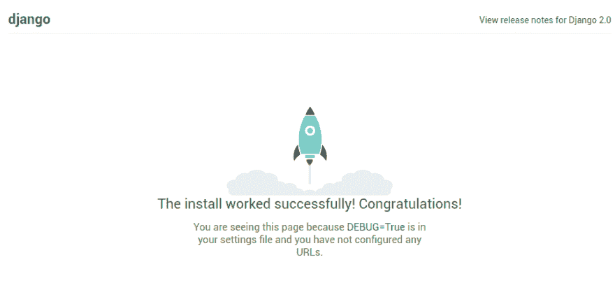

# 初学者如何在 Linux 下设置 Django 环境

> 原文：<https://dev.to/cindyachieng/-how-to-set-up-django-environment-in-linux-for-beginners-35am>

当我开始学习 Django 时，很难找到一个包含我需要的所有内容的教程，所以希望这个教程能帮助你开始！

##### 你将学到什么

*   创建虚拟人`test`
*   创建一个名为`HelloDjango`的示例项目
*   创建一个名为`accounts`的 Django 演示应用
*   Finally configure the `settings.py`

    让我们开始吧

##### 先决条件

确保您的计算机上安装了以下软件，以便进行后续操作。

*   你安装了 Linux 操作系统(ubuntu，Debian)
*   Python 3+
*   Django 2.0
*   Virtualenv(虚拟环境)

##### 姜戈简介

据 djangoProject 报道，Django 是一个 python web 框架，开发人员正在寻找一种用更少的代码更快地构建 web 应用程序的方法。本质上，django 是为有期限的完美主义者准备的

##### 为什么要考虑 Django？

请参考 [django 文档](https://www.djangoproject.com/)了解更多信息。我就说说个人的看法，为什么真的很酷。

*   内置的安全功能，如跨站点请求伪造(CSRF)保护。
*   很棒的文档。
*   更快，因为它有许多内置的功能，如管理网站，认证

##### Linux 安装

我推荐 Ubuntu 或者 Debian。对于这个特定的教程，我安装了 mint，因为它很轻，这只是个人喜好。

##### Python 安装

Django 是一个 python 框架，所以首先要确保你已经安装了 python。我的操作系统中默认安装的是 2.7。通过在 shell 中键入以下命令来检查所安装的 python 版本:

```
$ python --version
$ python -V  (Mind the capital) 
$ python2 -V 
```

Enter fullscreen mode Exit fullscreen mode

上述产出

```
 Python 2.7.12 
```

Enter fullscreen mode Exit fullscreen mode

检查 Python3 的版本

```
 $ python3 -V 
```

Enter fullscreen mode Exit fullscreen mode

上述产出

```
 Python 3.5.2 
```

Enter fullscreen mode Exit fullscreen mode

在本教程中，我们使用的是 python 3.5 和更高版本。键入以下命令，检查安装的是哪个版本 3

```
$ python3 --version 
```

Enter fullscreen mode Exit fullscreen mode

您应该会看到类似这样的内容:

```
Python 3.5.2 (default, Nov 23 2017, 16:37:01) 
[GCC 5.4.0 20160609] on linux
Type "help", "copyright", "credits" or "license" for more information.
>>> 
```

Enter fullscreen mode Exit fullscreen mode

您可以键入 CTRL+D 暂时退出交互式 shell。

##### 安装 Python

如果您没有安装 python，请使用以下命令:

```
$ sudo apt-get install python3.5 
```

Enter fullscreen mode Exit fullscreen mode

> 要安装最新版本 3.6，请查看本[教程](%20https://mintguide.org/other/794-python-3-6-install-latest-version-into-linux-mint.html)

##### 设置虚拟环境

我们可以在我们的计算机上创建一个 Django 应用程序，但是为了控制我们的应用程序特有的包，我们将使用虚拟环境。当您想要创建独立的环境，每个环境都运行自己版本的包时，虚拟环境非常有用。我们甚至可以用各种 python 版本创建虚拟环境！听起来很酷。对于本教程，我将使用 virtualenv。

##### Virtualenv

我们可以使用 python 的包管理器 pip 安装 virtualenv。

```
$ sudo pip install virtualenv 
```

Enter fullscreen mode Exit fullscreen mode

> Pip 是一个有用的 python 包工具，可以安装、更新和删除 Django 和其他 Python 应用程序使用的 Python 包/库。Pip 自带 python 2.7+从 [python 网站](https://www.python.org/)下载。你只需要使用命令升级它:
> $ pip install -U pip

如果像我这样已经安装了`virtualenv`,您应该会得到这样的结果:

```
cindy@cindy-Veriton-M290 ~/Desktop $ pip install virtualenv
Requirement already satisfied: virtualenv in /home/cindy/.local/lib/python2.7/site-packages 
```

Enter fullscreen mode Exit fullscreen mode

##### 创建并命名 virtualenv

一旦您成功安装了 virtualenv，接下来我们在 shell 中创建 virtualenv 测试。我喜欢在文档文件夹中创建我的项目。所以右键单击并选择在此打开终端选项。打开终端后，键入:

```
$  virtualenv -p python3 test 
```

Enter fullscreen mode Exit fullscreen mode

只是一个名字，你可以给它取任何名字。p 指向您想要使用的 python 版本，在上面的例子中是 python 3

##### 激活 Virtualenv

现在我们已经创建了 virtualenv 测试，我们需要用它来安装 django 和其他我们需要的包。为了使用我们的虚拟，我们必须激活它。使用以下命令将目录更改为您的虚拟环境:

```
$  cd test 
```

Enter fullscreen mode Exit fullscreen mode

进入 virtualenv 目录后，激活它，如下所示:

```
 $ source bin/activate 
```

Enter fullscreen mode Exit fullscreen mode

到目前为止，您应该可以在括号中看到您的 virtualenv

```
(test) 
```

Enter fullscreen mode Exit fullscreen mode

以下是我的控制台中的一个示例:

```
(test) cindy@cindy-Veriton-M290 ~/test $ 
```

Enter fullscreen mode Exit fullscreen mode

##### 如何检查刚创建的 virtualenv 中安装的包

运行:

```
 $  pip freeze 
```

Enter fullscreen mode Exit fullscreen mode

##### 姜戈安装

我们的`virtualenv`正在运行，让我们安装 django。撰写本文时 django 的版本是 2.0.2。

```
$ pip install django 
```

Enter fullscreen mode Exit fullscreen mode

运行:

```
 $ pip freeze 
```

Enter fullscreen mode Exit fullscreen mode

您的控制台应该列出已安装的软件包

```
(test) cindy@cindy-Veriton-M290 ~/test $ pip freeze
Django==2.0.2
pytz==2018.3 
```

Enter fullscreen mode Exit fullscreen mode

> 要指定 django 版本，请使用:
> $ pip install django==。例如要安装 django 1.11:
> $ pip 安装 django==1.11

##### 创建 Django 项目

Django 安装成功，让我们创建我们的项目结构！在您的控制台中键入以下内容:

```
django-admin startproject HelloDjango 
```

Enter fullscreen mode Exit fullscreen mode

这个命令为我们的项目创建一个模板。

```
HelloDjango/
    manage.py
    HelloDjango/
        __init__.py
        settings.py
        urls.py
        wsgi.py 
```

Enter fullscreen mode Exit fullscreen mode

外面的`HelloDjango`是容纳我们项目的容器。可以将名称改为其他名称，比如“src”。

内部的 `HelloDjango` 包含你的站点的配置。我强烈建议你保持现状，至少现在是这样。

更改到项目目录

```
 cd  HelloDjango 
```

Enter fullscreen mode Exit fullscreen mode

> 项目目录是包含 manage.py 文件的外部 HelloDjango。如果您将其名称更改为 src，则将目录更改为 src。

```
cd src 
```

Enter fullscreen mode Exit fullscreen mode

##### 进行迁移

我们需要创建一个数据库，Django 附带了 sqlite。你可以自由使用你选择的任何其他数据库。但是对于本教程，我们将使用 sqlite。通过键入以下命令，将目录更改为项目根目录并进行迁移:

```
$ python manage.py makemigrations
 $ python manage.py migrate 
```

Enter fullscreen mode Exit fullscreen mode

##### 测试开发服务器

要测试您的项目是否运行良好，请转到您的项目根目录，然后键入以下内容:$ python manage.py runserver

您应该会看到类似这样的内容:

```
Performing system checks...
System check identified no issues (0 silenced).
 February 28, 2018 - 18:58:33
 Django version 2.0.2, using settings 'achieng_website.settings'
 Starting development server at http://127.0.0.1:8000/
 Quit the server with CONTROL-C. 
```

Enter fullscreen mode Exit fullscreen mode

当您访问 http://127.0.0.1:8000/时，如果 django 安装成功，您应该会收到一条成功消息“恭喜”

[T2】](https://res.cloudinary.com/practicaldev/image/fetch/s--R2FxbfhV--/c_limit%2Cf_auto%2Cfl_progressive%2Cq_auto%2Cw_880/https://i.imgur.com/F3GEYtx.png)

##### 配置设置. py

我们将对 settings.py 做一些修改，这个文件帮助我们管理静态文件，比如 css、js 和 images。首先我们要改变`Templates DIR`

```
TEMPLATES = [
    {
        'BACKEND': 'django.template.backends.django.DjangoTemplates',
        'DIRS': [os.path.join(BASE_DIR, 'templates')],
        'APP_DIRS': True,
        'OPTIONS': {
            'context_processors': [
               ...
            ],
        },
    },
] 
```

Enter fullscreen mode Exit fullscreen mode

同样添加`staticfiles_Dirs` :

```
 STATICFILES_DIRS = (
         os.path.join(BASE_DIR, 'static'),
      ) 
```

Enter fullscreen mode Exit fullscreen mode

##### 改变时区

最后，让我们回到我们的**设置。py** 并改变我们的时区。我来自内罗毕，所以我的时区是非洲/内罗毕。查看你的:[维基百科](https://en.wikipedia.org/wiki/List_of_time_zones_by_country)

```
LANGUAGE_CODE = 'en-us'

TIME_ZONE = 'Africa/Nairobi' 
```

Enter fullscreen mode Exit fullscreen mode

##### 创建应用程序

```
 python manage.py startapp accounts 
```

Enter fullscreen mode Exit fullscreen mode

您的项目结构应该是这样的:

```
 accounts/
    __init__.py
    admin.py
    apps.py
    migrations/
        __init__.py
    models.py
    tests.py
   views.py 
```

Enter fullscreen mode Exit fullscreen mode

app 创建`models.py`、`admin.py`、`views.py`、`apps.py`等模块。Django 实现了 MVC 模式

要使用您刚刚创建的应用程序，请将其添加到`settings.py`中的`INSTALLED_APPS`。

```
INSTALLED_APPS = (
    'django.contrib.admin',
    'django.contrib.auth',
    'django.contrib.contenttypes',
    'django.contrib.sessions',
    'django.contrib.messages',
    'django.contrib.staticfiles',
    'accounts',
) 
```

Enter fullscreen mode Exit fullscreen mode

这篇文章最初发表在 [achiengBlog](https://achiengcindy.com/permalink/1/)