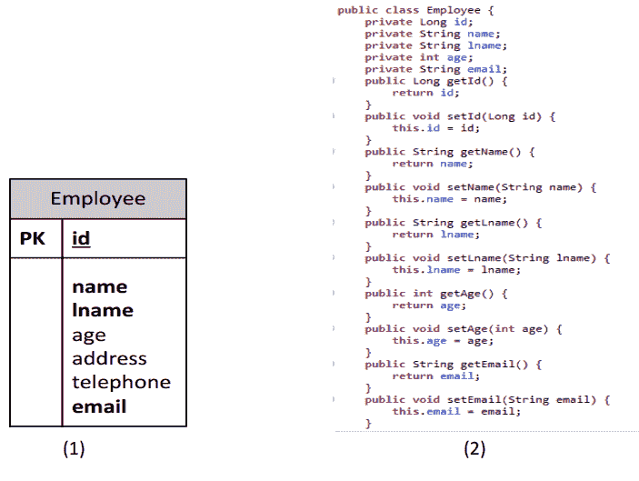
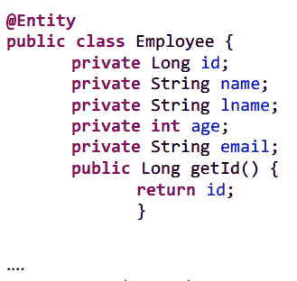
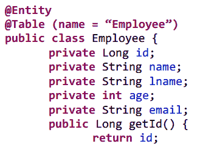
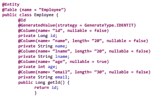

# JPA 基础[ ep2 ]

> 原文：<https://dev.to/slumboy/-jpa-ep2--1913>

#### 开始无限期

* * *

用 Java 语言编写数据库接口主要是基本的，我们将使用 JDBC 进行接口，除了 JDBC 之外，有些还可能使用 pro framework 或 API。

* * *

例如，我们有一个基于下图的客户存储数据库表(1)。如果我们将它看作对象，我们通常会编写大约这个代码(2)。

[T2】](https://res.cloudinary.com/practicaldev/image/fetch/s--DqsM_slq--/c_limit%2Cf_auto%2Cfl_progressive%2Cq_auto%2Cw_880/https://thepracticaldev.s3.amazonaws.com/i/7wkor3o2e880quo83580.png)

* * *

如果是 ORM，则我们可以使用 Employee 对象的新实例创建一个新的记录，并指示框架或 API 在不存在的情况下执行记录重建。

* * *

##### 对于今天的 T1 将要求报价、持有 JPA

JPA 是 Java Persistence API 的缩写，是属于 Java EE 技术中的一个标准 API，用于 ORM 实现，它的创建或实现方法并不繁琐。

1.  创建对象以映射数据库中的各种表或字段
2.  在 persistence 文件中为数据库连接编写文件配置。xml
3.  通过实体管理器实现对象

* * *

1.  创建对象以映射数据库中的表或字段。执行对象映射的过程是，我们将对象写入到关系中。

@Entity
用于定义要映射到数据库中表的类；
。

* * *

@ table =
用于定义一个数据库表名称，其中 Map 与我们创建的类“
 。

* * *

@id 和@GeneratedValue
用于定义主密钥字段。auto generate id 类型的案例使用@ generatedvalue〔generatedvalue〕。

* * *

@Column
用于定义数据库的列类型，如
。