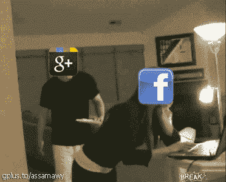
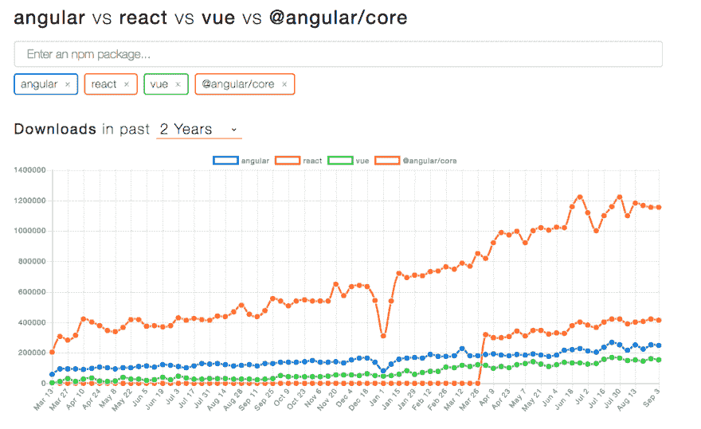

# mean vs mern

> 原文：<https://dev.to/himanshuc3/-mean-vs-mern-1816>

[T2】](https://i.giphy.com/media/10MgxoOVOuTquI/giphy.gif)

我认为图形应该反过来😜自从 facebook 想要尝试开放源码软件以来，它一直在破坏谷歌的开源社区 thrive。在 giphy 上找不到👀，乐于在评论中有建议。

* * *

# 臭名昭著的话题

[T2】](https://res.cloudinary.com/practicaldev/image/fetch/s--QJ8Oh7IQ--/c_limit%2Cf_auto%2Cfl_progressive%2Cq_auto%2Cw_880/https://thepracticaldev.s3.amazonaws.com/i/mpty0ccutkeejiord3d3.png)

这迅速升级。看我在那里做了什么。

`MERN / MEAN = R / A.`

所以，这一切都归结于使用 React/angular 或者想要学习 React/Angular 的人数。

 
*注:为了深入比较: [Angular-React faceoff](https://www.similartech.com/compare/angular-js-vs-react-js)*

* * *

# **请给一个♥️和一个🦄到[直播](https://dev.to/himanshuc3/entry-livetable-5h3o)T5】**

如果你喜欢这个帖子。希望有一天你能拥有一只独角兽(我对此表示怀疑。就像我怀疑《死侍》能拍成 x 战警电影一样。但我充满希望。你也应该如此)

* * *

# 摊牌

[T2】](https://i.giphy.com/media/3o6ZtezQpqMy5yZneE/giphy.gif)

React 正在崛起，但 angular 已经站稳脚跟，证明了自己的价值。两者都很棒，因为每个人都期待来自顶级科技行业。两者都比对方有技术优势。反应虽然有更容易的学习曲线比角。两人都在工业界工作。所以，在这篇无用的帖子的最后，我认为应该是这项技术的用户和未来的前端爱好者决定谁会更受欢迎。

你们可以**在**这个帖子**上给**投票，这个帖子的♥️会建议你们**赞成反应**和🦄建议**棱角分明才是正道**。

请在下面留下你的**评论**，为你支持的人做一些**解释**。我很想听听他们的意见，就像那些在选择中感到困惑的**人一样。**