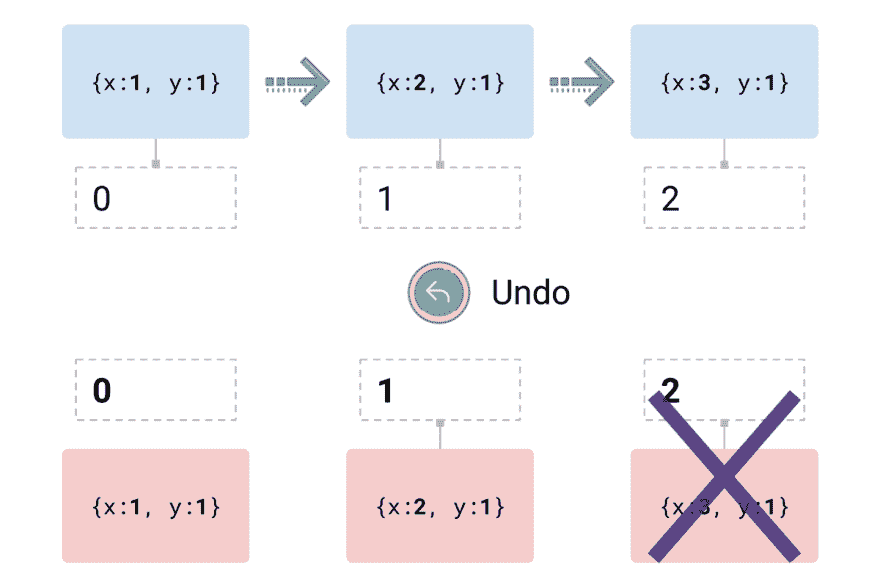
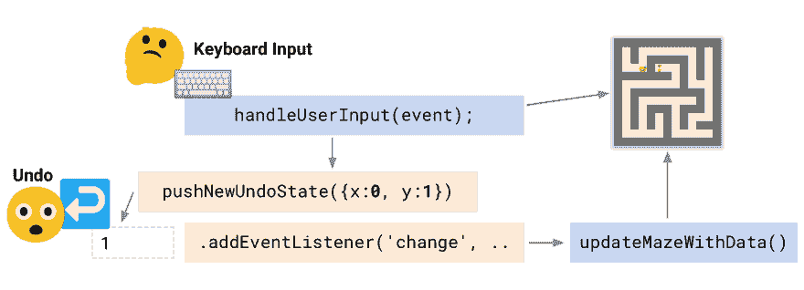

# ↩️本地 Web 撤销和重做

> 原文：<https://dev.to/chromiumdev/-native-undo--redo-for-the-web-3fl3>

对于默认情况下不支持撤销和重做的元素，如何支持撤销和重做呢？想想拖放重新排序、游戏或富文本编辑器，内置的支持不能满足这些需求。🙅✂️📄

今天，使用一点逻辑加上`execCommand`方法，这是可能的。首先，演示一下！点击/聚焦迷宫，并使用箭头键(或使用按钮)导航。最重要的是，一定要尝试撤销和重做来返回和前进。

[https://codepen.io/samthor/embed/WJvLxd?height=600&default-tab=result&embed-version=2](https://codepen.io/samthor/embed/WJvLxd?height=600&default-tab=result&embed-version=2)

有几种方法可以撤销——你可能试过`Ctrl/Cmd-Z`，但是你也可以使用浏览器的撤销菜单项或者在页面上右击。在移动 Safari 上📱🤠，摇动👋你的手机撤销↩️.
(在其他手机浏览器上不太清楚怎么撤销。)

> <small>如果你只是为了代码而不是文章，我已经创建了一个`Undoer`类，它为本地撤销/重做提供帮助。[点击这里查看⤵️💻](https://github.com/samthor/undoer)</small>

* * *

# 为什么

如果你正在为网络建立一个交互式的类似应用程序的体验，你应该致力于提供尽可能多的内置 UX 流，这样你的用户就可以更有效率。这些可能包括支持`ESC`键、浏览器的内置导航按钮、拖放，甚至是通过[网络共享 API](https://developers.google.com/web/updates/2016/09/navigator-share) 的本地共享——所有这些习惯用法，即使是不太懂技术的用户也已经习惯了。

* * *

# 如何

在引擎盖下，上面的迷宫实际上是在修改一个文本字段——就像用户会做的那样——并观察它的值是否会变回以前记录的状态。那是什么意思？

[T2】](https://res.cloudinary.com/practicaldev/image/fetch/s--Z2VNRWJQ--/c_limit%2Cf_auto%2Cfl_progressive%2Cq_auto%2Cw_880/https://thepracticaldev.s3.amazonaws.com/i/b6chmm73xqvtd5mdj8id.png)

*   当我们做出改变时(上面的蓝框)，我们秘密地用一个新的数字更新一个“隐藏的”文本字段，这是一个记录玩家位置的数组的索引。

*   当玩家执行撤销操作(红框)时，我们从堆栈中弹出最后一个事件，并以先前的状态调用迷宫。这种情况下，状态 1: `{x:2, y:1}`。

*   后面的状态会一直保留(如果用户调用 Redo ),直到用户执行另一个操作，这时我们会删除它们。

* * *

# 建造它

让我们计划一下流程。当用户使用他们的键盘时，我们处理事件——更新迷宫和推一个新的状态。当用户执行撤销或重做时，我们会检测到变化，并将迷宫恢复到我们期望的任何先前状态。

[T2】](https://res.cloudinary.com/practicaldev/image/fetch/s--OZMAiLBV--/c_limit%2Cf_auto%2Cfl_progressive%2Cq_auto%2Cw_880/https://thepracticaldev.s3.amazonaws.com/i/el9uhd5793sdibujyy4s.png)

好吧！让我们建造它。

## 1。“隐藏”文本字段

我们像往常一样创建一个文本字段，并将其附加到页面上。我们不使用`display: none`或`visibility: hidden`来隐藏字段——“正确地”隐藏元素会使它不符合浏览器正常撤销/重做堆栈的条件。所以为了让它感觉不可用，我们:

*   将它的`tabIndex`设置为-1，这将从正常的 tab 键顺序中删除它
*   添加一个`focus`处理程序，它会立即模糊元素，所以它永远不会保持焦点
*   可以设置它的`opacity` / `position`，这样元素就不会被*看到*——尽管在你测试的时候，把它放在身边会很好

下面是我们如何添加`undoer`元素:

```
const undoer = document.createElement('input');
undoer.value = '0';
undoer.tabIndex = -1;  // don't allow automatic tab
undoer.addEventListener('focus', () => {
  window.setTimeout(() => undoer.blur(), 0);  // prevent focus, delay for Safari
});

// You could hide it (but not with `display: none`—it must be on the page):
//undoer.style.opacity = 0;
//undoer.style.position = 'absolute';

document.body.appendChild(undoer); 
```

Enter fullscreen mode Exit fullscreen mode

> 问:这个输入可能会混淆可访问的用户代理。如果你有关于如何为屏幕阅读器解决这个问题的想法，请给我留言！

## 2。假装输入输入

让我们创建一个方法`pushNewUndoState`来将一个新状态推送到堆栈上，并记录这些状态。这是这篇文章的关键部分——我们使用`execCommand`来伪造用户输入。下面的代码将一个新的状态推送到堆栈上，并“键入”下一个数字:

```
let duringInput = false;
const undoStack = [{x: 1, y: 1}];  // we have to start with our initial state
function pushNewUndoState(data) {
  // remove states past now, add our new state
  const nextStateId = +undoer.value + 1;
  undoStack.splice(nextStateId, undoStack.length - nextStateId, data);

  duringInput = true;

  // focus and "type" the next number
  undoer.focus();
  document.execCommand('selectAll');
  document.execCommand('insertText', false, nextStateId);

  duringInput = false;
} 
```

Enter fullscreen mode Exit fullscreen mode

`document.execCommand`非常强大，允许我们在页面上模拟用户输入。在这种情况下，我们只想选择当前号码并键入一个新号码。浏览器足够聪明，可以将这两个独特的动作合并到撤销“可撤销”事件中。

请注意:

*   我们关注于`undoer`，但是这被我们最初设置的事件处理程序阻止了

*   如果您在应用程序中使用焦点，您可以添加代码来重新聚焦到前面的`document.activeElement`:否则焦点将会丢失

*   `.splice`方法*删除*任何超过当前状态的状态。如果用户*撤销*的事情，然后执行一个新的动作——它删除了可能的*重做*动作，就会发生这种情况。

## 3。监听输入事件

最后，让我们听听输入的变化，这样我们就可以触发回调，让迷宫知道用户想要恢复他们的位置:

```
undoer.addEventListener('input', (ev) => {
  // nb. don't use 'change', it doesn't fire in all browsers
  if (!duringInput) {
    const data = undoStack[+undoer.value];
    updateMazeWithData(data);
  }
}); 
```

Enter fullscreen mode Exit fullscreen mode

当上面的`pushNewUndoState`方法正在工作时，我们不想触发回调`duringInput`。如果用户执行撤销或重做，我们只想知道输入何时发生了变化。

## 4。Firefox 的特殊情况

Firefox 有一个[长期存在的问题](https://bugzilla.mozilla.org/show_bug.cgi?id=1220696)，这意味着`execCommand`只在`contentEditable`中受支持。支持这一点实际上相当容易——你可以把“隐藏的”`input`换成一个可编辑的`div`，并用`.textContent`代替`.value`——唷。这已经足够说明问题了，但是我在这篇文章中没有提到代码的修改。

[我在这篇博客文章中包含的代码](https://github.com/samthor/undoer)只使用了`<div contentEditable>`，但是你可以选择任何一种方法。🤔

* * *

🎉这就是全部内容，但是请继续读下去，寻找更多的想法，⬇️

# 加贺

敏锐的观察者可能会注意到，这是一个与历史 API 非常相似的模型，它使用了`history.pushState`和`window.onpopstate`。

`onpopstate`方法实际上命名得很糟糕——无论是弹出状态(后退按钮)还是按下*(前进动作)都会调用它。使用本地撤销/重做的类比是我们监听“隐藏”文本输入的`input`事件。*

 *## 截取撤消&重做文本字段

这种撤销和重做的方法可以扩展到处理文本字段或元素，它们生成自己的撤销事件。你为什么想这么做？正如我在第一段提到的，也许你正在构建一个富文本编辑器，撤销和重做并不是你想要的。

您可以通过使用`execCommand`立即撤销一个用户操作，以编程方式设置更新的值(这不会生成一个可撤销的事件)，然后通过我们的方法`pushNewUndoState`用您自己的事件替换它。

例如，我们可以搭载`input`事件:

```
theInput.addEventListener('input', (ev) => {
  const currentValue = theInput.value;
  document.execCommand('undo');   // undo this change
  theInput.value = currentValue;  // ... but immediately reset the value
  // TODO: You might want to persist the selection position.

  pushNewUndoState(currentValue);  // ... our special state to keep
}); 
```

Enter fullscreen mode Exit fullscreen mode

⚠️:这很好，但是要小心这种方法！除非您确定用户只是更改了您关心的元素，否则您可能会撤销页面上的其他用户操作。

## 撤销键盘快捷键

web 上许多定制撤销和重做的例子使用`keydown`处理程序来检测用户是否正在输入`Ctrl/Cmd-Z`，并执行一个特殊的动作。这通常是可行的，但是有两个挑战:

*   它不通过上下文菜单或浏览器的菜单栏来捕捉撤销和重做

*   它是不可访问的:如果用户将键反弹到其他地方，或者使用其他输入设备来撤销或重做

这两个原因从根本上解释了为什么让浏览器为我们工作是值得的——通过我们的“隐藏”输入。

* * *

# 感谢

感谢阅读！正如我上面提到的，我已经将这些知识转化为一个类，你可以在你自己的应用程序中使用，但是希望上面的习惯用法足够简单，可以直接应用到你自己的代码中。查看⤵️的“撤销”包💻。

在这里问我问题或者在 Twitter 上找到我。

## 致谢

*   一些来自[Icons8.com](https://icons8.com/icon/set/undo/dusk)的图标，用在 CC BY-ND 下。
*   Emoji by [Emojityper](https://emojityper.com) 。*