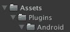

# 为 Unity 用 Kotlin 编写 Android plugin，以获得 onActivityResult 的结果，而无需主要的 override activity。

> 原文：<https://dev.to/armariya/-plugin-android--unity3d--kotlin--onactivityresult--override-activity--3l8m>

你好，今天是关于在 3d unity 上写 Plugin Android 的，他决定写这个，因为我觉得我做这个的时候很难阅读。

#### 今天的请求

*   安卓工作室
*   Unity3d 2018.2.0f2

是的，我是为一个拥有一切的人准备的，然后开始！今天我们来做一个 login line

打开 Android Studio，让我们一起工作，加载，在 Andriod 上做一个项目，然后一个新模块变成 Android 库。

<figure>[](https://res.cloudinary.com/practicaldev/image/fetch/s--jCTmH-VX--/c_limit%2Cf_auto%2Cfl_progressive%2Cq_auto%2Cw_880/https://cdn-images-1.medium.com/max/1012/1%2AsCTHodnDaMBiur2lXj1RRA.png) 

<figcaption>组成一个新的模块，作为 Android 库</figcaption>

</figure>

。

让我们开始编写 LineSDKActivity。首先，我们要去下载 linesdk bloadaar 把它拖到 lib 上了

<figure>[](https://res.cloudinary.com/practicaldev/image/fetch/s--PJteLap6--/c_limit%2Cf_auto%2Cfl_progressive%2Cq_auto%2Cw_880/https://cdn-images-1.medium.com/max/184/1%2ADcYFSbtKvMNOsnfMlBZa7Q.png) 

<figcaption>取 Android 的 SDK 线放入</figcaption>

</figure>

。

然后写了 Login 的代码。我几乎可以从 Developer Line 的网页上抄下来。
t0㎡。

```
class LineSDKActivity : AppCompatActivity() {

    companion object {
        lateinit var lineLoginCallback: LineLoginCallback

        fun startLineSDKActivity(activity: Activity, lineLoginCallback: LineLoginCallback) {
            LineSDKActivity.lineLoginCallback = lineLoginCallback;
            val intent = Intent(activity._applicationContext_, LineSDKActivity::class._java_)
            activity.startActivity(intent);
        }
    }

    data class PlayerProfile(
            val displayName: String,
            val statusMessage: String?,
            val userId: String,
            val pictureUri: Uri?
    )

    override fun onCreate(savedInstanceState: Bundle?) {
        super.onCreate(savedInstanceState)

        login()
    }

    override fun onActivityResult(requestCode: Int, resultCode: Int, data: Intent?) {
        super.onActivityResult(requestCode, resultCode, data)
        if (requestCode != Constants.REQUEST\_CODE) {
            Log.e("ERROR", "Unsupported Request");
            lineLoginCallback.onLoginFailed("Unsupported Request")
            finish()
        }

        if (data == null) {
            lineLoginCallback.onLoginFailed("Can't connect with Line")
            finish()
        }

        val result: LineLoginResult = LineLoginApi.getLoginResultFromIntent(data)

        when (result._responseCode_) {
            LineApiResponseCode.SUCCESS -> {
                lineLoginCallback.onLoginSuccess(
                        result._lineProfile_!!._displayName_  
)
            }
            else -> {
                lineLoginCallback.onLoginFailed("Login Unsuccessful")
            }
        }

        finish()

    }

    fun login() {
        startActivityForResult(getLineLoginIntent(), Constants.REQUEST\_CODE)
    }

    private fun getLineLoginIntent() : Intent {
        return LineLoginApi.getLoginIntent(this._applicationContext_, Constants.CHANNEL\_ID)
    }
} 
```

在得到这个估计后，pop 会看到我使用了 LineLoginCallback，这样我就可以把它和 Unity3d 中的 C#进行连接了。它已经创建了一个新的文件。

```
interface LineLoginCallback {
    fun onLoginSuccess(displayName: String)
    fun onLoginFailed(errorMessage: String)
} 
```

完成后，一定要把 appcompat 和 customtabs 放在构建中。这个模组的涂鸦是 t0㎡。

```
dependencies {
    implementation fileTree(dir: 'libs', include: ['\*.jar'])
    implementation 'androidx.appcompat:appcompat:1.0.0-beta01'
    implementation 'androidx.browser:browser:1.0.0-beta01'
    implementation "org.jetbrains.kotlin:kotlin-stdlib-jdk7:$kotlin\_version"
    implementation(name: 'line-sdk-4.0.8', ext: 'aar')
} 
```

然后做构建加载。如果构建成功，我们将成为一个文件。aar 在模块输出中

这一次，我们来看看我们的 Unity，这里我们需要创建一个 Plugins/Android 文件夹，先生，根据规则是我们的 Plugin 存储库。

[T2】](https://res.cloudinary.com/practicaldev/image/fetch/s--40GdITJh--/c_limit%2Cf_auto%2Cfl_progressive%2Cq_auto%2Cw_880/https://cdn-images-1.medium.com/max/115/1%2AC1D1DaKz4r8Vrtpc9aqGXw.png)

那就来吧。我们的 aar 塞进去了，包括一个 line-sdk-4 文件。0.8.aar 也是从线上载入的。我们会把 gradle 档案解压缩到专案中。请转到「构建设定 b」(build setting b)。

[T2】](https://res.cloudinary.com/practicaldev/image/fetch/s--819Jtkec--/c_limit%2Cf_auto%2Cfl_progressive%2Cq_auto%2Cw_880/https://cdn-images-1.medium.com/max/298/1%2AUT0meoBtzzCeawTlwJYT-A.png)

我们可以拿到 mainTemplate 文件.gradle 上来，做个编辑

```
implementation(name:'line-sdk-4.0.8', ext:'aar')
implementation 'org.jetbrains.kotlin:kotlin-stdlib-jdk7:1.2.51'
implementation 'androidx.appcompat:appcompat:1.0.0-alpha1'
implementation 'androidx.browser:browser:1.0.0-alpha1' 
```

把这四个添加到依赖关系中。然后我将简要地写一个应用程序部分。大概是这样的:首先，制造一个灯。cs，我是 T0 .. .

```
// LineSDK.cs

public class LineSDK {
  public class LineLoginCallback : AndroidJavaProxy {
    public LineLoginCallback : base("xxx.xx.xxx.LineSDKActivity") {}

    public void onLoginSuccess(string displayName) {
      Debug.Log("Line login success");
    }

    public void onLoginFailed(string errorMessage) {
      Debug.Log("Line login failed");
    }
  }

  ...
} 
```

这是主要的部分。注意，LineLoginCallback 是从 AndroidJavaProxy 继承的，在这个构造函数中，它是从它的类名中派生的。

而功能登录就像这样。

[T2】](https://res.cloudinary.com/practicaldev/image/fetch/s--_sD-tj5v--/c_limit%2Cf_auto%2Cfl_progressive%2Cq_auto%2Cw_880/https://cdn-images-1.medium.com/max/1009/1%2AsbZAm7W0MIkK6SXmi7_2dA.png)

最后，别忘了放 androidmanifest(androidmanifest)。在 Unity3d 中的 xml。它有一个模板，但我会把它放在一个重要的部分上。

```
...

<activity
  android:name="app.zosimos.linesdk.LineSDKActivity"
  android:theme="@style/Theme.AppCompat.NoActionBar"
/>

... 
```

这就是我们在 Java 中添加的 Activity，添加到 Unity 中。如果我们不把这个放进去，它就找不到了。

就像这样。对不起。这个部落格写得太快了。不过，不管怎样，只要有什么可以问的，或许足够指导。谢谢。

我们可以在这里讨论鱼。这页我把它打开了。555。