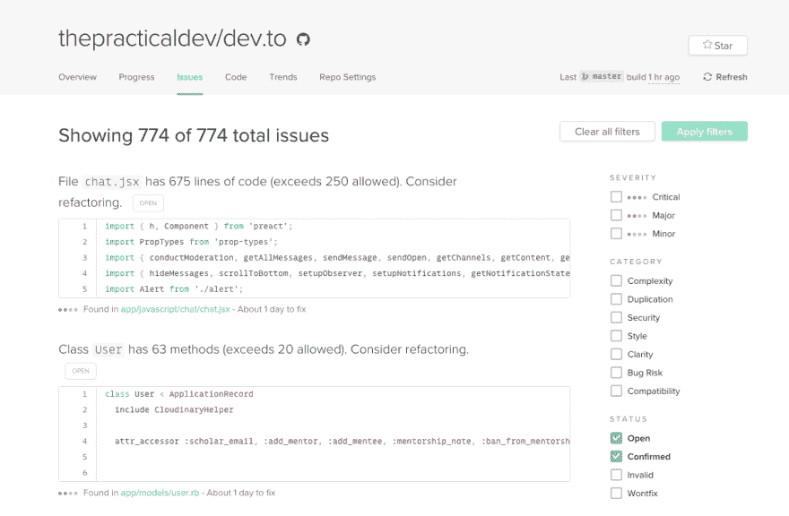

# 黑客的重构

> 原文：<https://dev.to/devteam/-refactor-for-hacktober--1n9b>

对于任何对 [DEV 社区代码库](https://github.com/thepracticaldev/dev.to)感兴趣的人，我想分享一个无止境的潜在贡献方式列表。那就是:通过重构。重构往往是一个不错的选择，直到有一天它成为一个绝对必要的障碍。

要访问我们无止境的重构列表，请查看我们的[代码气候问题](https://codeclimate.com/github/thepracticaldev/dev.to/issues)。你会看到它的一个变体:

[T2】](https://res.cloudinary.com/practicaldev/image/fetch/s--OwTUCnBg--/c_limit%2Cf_auto%2Cfl_progressive%2Cq_auto%2Cw_880/https://thepracticaldev.s3.amazonaws.com/i/mxselqz7l5bayowbsfoh.png)

有些问题比其他问题更大，但它们都值得解决。任何重构都会对项目有所帮助，并有助于代码库的健康发展。

编码快乐！