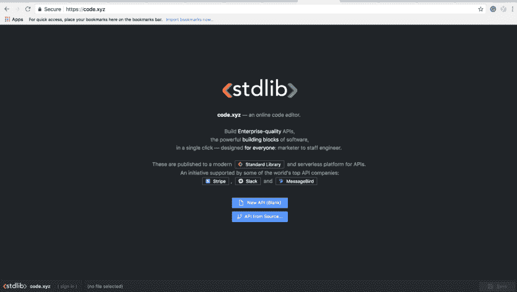
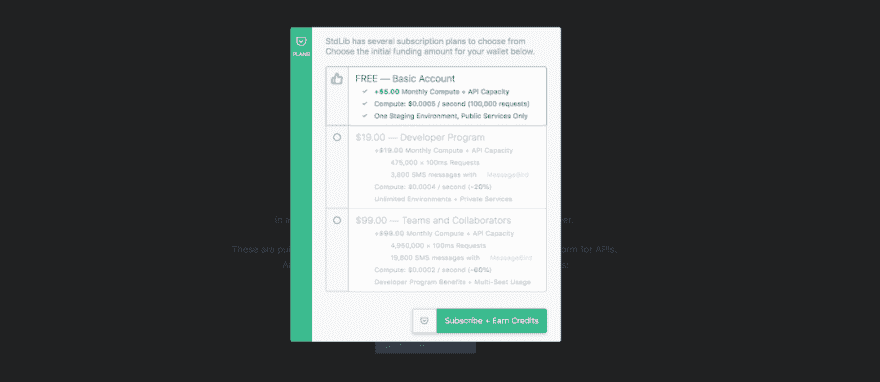
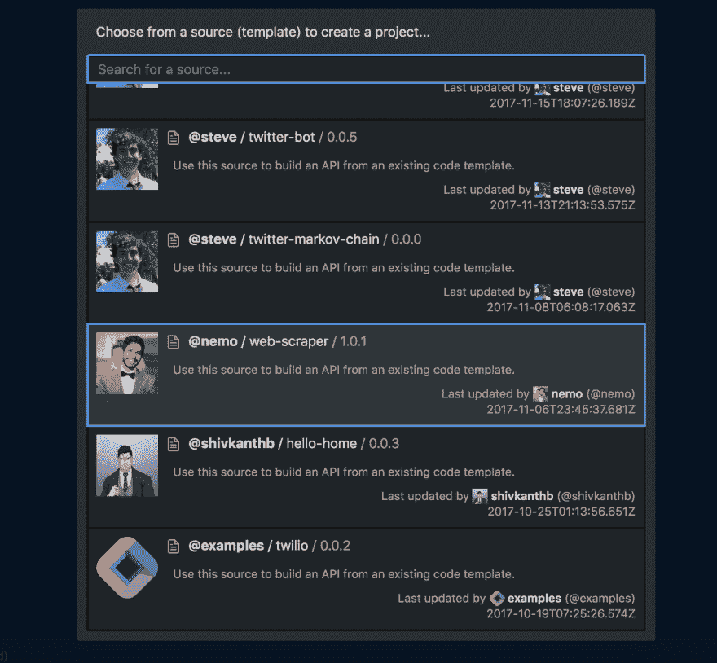
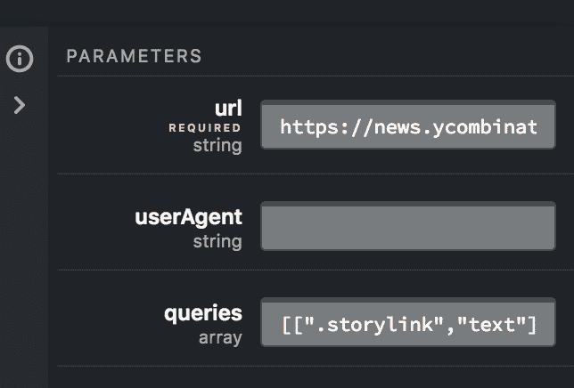
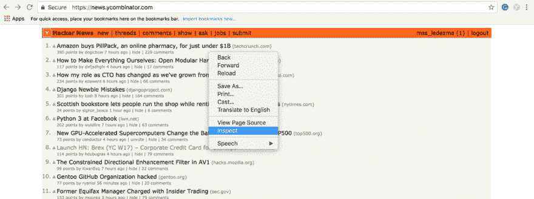
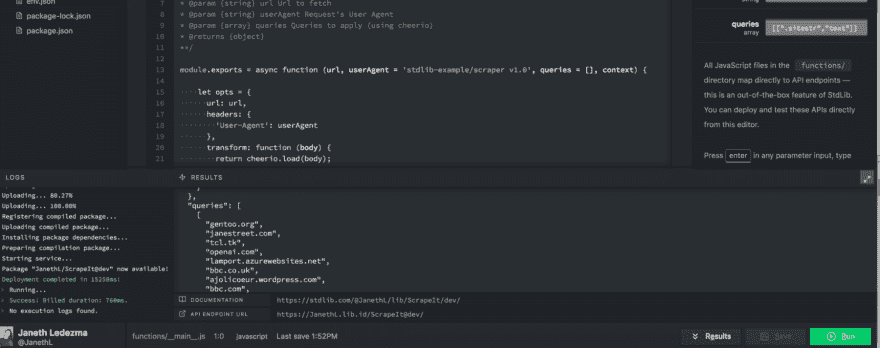

# 👨‍💻使用 Code.xyz 和 Node.js 轻松抓取网站信息🤓

> 原文：<https://dev.to/mss_ledezma/-scrape-websites-for-information-easily-using-codexyz-and-nodejs-3b3h>

* * *

[web scraper 是一种工具，它允许我们选择网站的非结构化数据并将其转换为结构化数据库。那么 web scraper 在哪里会派上用场呢？我已经列出了我最喜欢的用例，让您对推出自己的用例感到兴奋！](https://hackernoon.com/scrape-websites-for-information-easily-using-code-xyz-and-node-js-8be3e2f938ab?source=your_stories_page)

 。

Quora 上的这个问题鼓励我建立我的网络抓取器。

-抓取房地产列表-企业使用网络抓取来收集已经列出的房地产
-从零售商或制造商网站抓取产品/产品评论以显示在您的网站上，提供规格/价格比较
-抓取新闻网站以应用定制分析和管理(手动或自动)，向您的受众提供更有针对性的新闻
-收集电子邮件地址以产生潜在客户

你可以在这里阅读[的其他便利用例。](https://www.quora.com/What-are-examples-of-how-real-businesses-use-web-scraping-Are-there-any-types-of-businesses-which-use-this-more-than-others)

现在让我们开始吧！举个简单的例子——我们将抓取[黑客新闻](https://news.ycombinator.com/)的首页来获取链接的标题。

*如果你还不熟悉[标准库](https://stdlib.com/)和 [Code.xyz](https://code.xyz) ，那你就等着享受吧！标准库是一个 API 开发和发布平台，可以帮助您使用浏览器内 API 编辑器 Code.xyz 以创纪录的速度构建和发布代码。

## **第一步:使用 Code.xyz** 登录

第一步是前往[https://code.xyz/](https://code.xyz/)创建一个免费账户。Code.xyz 是由 Standard Library 的团队构建的在线 API 编辑器——一个用于快速构建 API、webhooks 和工作流自动化任务的嵌入式开发环境。

[T2】](https://res.cloudinary.com/practicaldev/image/fetch/s--LBe6whez--/c_limit%2Cf_auto%2Cfl_progressive%2Cq_auto%2Cw_880/https://cdn-images-1.medium.com/max/1440/1%2Aql_HL0-jHwQINyab-NaJVw.png)

在 Code.xyz 的左下角点击(**签到**)。如果您有 StdLib 帐户，请点击**已注册**，并使用您的 StdLib 凭证登录。

将弹出一个模式，提示您**声明一个名称空间**(这是您的用户名)。输入您的电子邮件并选择密码。

创建帐户后，将出现一个不同的模块，列出订购计划。一个**免费账户**是你开始的全部需要。

[T2】](https://res.cloudinary.com/practicaldev/image/fetch/s--uSRTUlfz--/c_limit%2Cf_auto%2Cfl_progressive%2Cq_auto%2Cw_880/https://cdn-images-1.medium.com/max/1080/1%2AextzFiXN8e0UbLsm7Y2Ppg.png)

一旦你点击**订阅+赚取积分**，你应该会看到一个确认消息弹出。

点击**继续**返回 Code.xyz 登陆页面。

## **第二步:选择网页抓取器源代码**

从源代码按钮中选择 **API。StdLib 源代码旨在简化不同类型项目的创建。源代码为样板代码和目录设置等提供了默认值，因此您可以直接开发和实现更复杂的功能。**

您应该会看到一个已发布源代码的列表。向下滚动，选择

**@nemo/web -scraper。**确保为您的 API 输入您想要的名称，并点击**确定**(或按回车键)

[T2】](https://res.cloudinary.com/practicaldev/image/fetch/s--6pDlU6Qf--/c_limit%2Cf_auto%2Cfl_progressive%2Cq_auto%2Cw_880/https://thepracticaldev.s3.amazonaws.com/i/mz6woej0j6tx8oh6qz94.png)

然后你会看到你的端点代码在:`functions/__main__.js`

下。在右边你会注意到一个参数框。

[T2】](https://res.cloudinary.com/practicaldev/image/fetch/s--RqVV35U9--/c_limit%2Cf_auto%2Cfl_progressive%2Cq_auto%2Cw_880/https://cdn-images-1.medium.com/max/1080/1%2Aowqsessjwq39-cbYI5glLw.png)

在 URL 中需要的参数类型:

`https://news.ycombinator.com/`

在查询中键入:

`[[".storylink", "text"]]`

选择绿色的**运行**按钮。

在几秒钟之内，您应该会在 Code.xyz 的**结果**部分下看到一个来自[黑客新闻](https://news.ycombinator.com/newest)首页的链接标题列表。您会注意到一个文档门户——将文档 URL 复制并粘贴到浏览器的一个新标签中，以便在 StdLib 上查看您的 API 信息。

[T2】](https://res.cloudinary.com/practicaldev/image/fetch/s--NQ1_4Kgy--/c_limit%2Cf_auto%2Cfl_progressive%2Cq_auto%2Cw_880/https://cdn-images-1.medium.com/max/1440/1%2AKJygl5ov7-iN7yjfyrr-wQ.png)

## **工作原理**🤓

web scraper 向 URL 发出一个简单的 GET 请求，并在结果页面上运行一系列查询，然后返回给您。它使用强大的 [cheerio DOM](https://github.com/cheeriojs/cheerio) (文档对象模型)处理器，使我们能够使用 [CSS 选择器](https://www.w3schools.com/cssref/css_selectors.asp)从页面中抓取数据！CSS 选择器是用来选择你想要组织的元素的模式。

## **如何使用 CSS 选择器进行查询**

网页是用 HTML 等标记语言编写的。HTML 元素是 HTML 文档或网页的一个组成部分。元素定义了信息在浏览器上向人眼显示的方式，比如图像、多媒体、文本、样式表、脚本等。

在这个例子中，我们使用了“.class "选择器(class =。storylink”)从黑客新闻首页的所有元素中获取所有超链接的标题。如果你想知道如何找到构成一个网站的元素的名字，请允许我向你展示！

打开谷歌浏览器，输入我们的[黑客新闻](https://news.ycombinator.com/)网址【https://news.ycombinator.com/。然后右击任何文章的标题，选择“**检查。**“这将在谷歌浏览器上打开网络控制台。或者可以使用命令键 **(⌘)** +选择键 **(⌥ )** + **J** 键。

[T2】](https://res.cloudinary.com/practicaldev/image/fetch/s--FxvfFjc6--/c_limit%2Cf_auto%2Cfl_progressive%2Cq_auto%2Cw_880/https://cdn-images-1.medium.com/max/1440/1%2AD-9KCvnHgZmsJrTwMfbVHg.png)

右键单击并选择检查，web 开发人员控制台将在屏幕右侧打开。请注意，当您选择链接的标题时，控制台上的一个部分也会突出显示。突出显示的元素将“类”定义为“故事链接”现在你知道如何在任何网站上找到元素的名称了！

[T2】](https://res.cloudinary.com/practicaldev/image/fetch/s--gfIc6Trc--/c_limit%2Cf_auto%2Cfl_progressive%2Cq_auto%2Cw_880/https://cdn-images-1.medium.com/max/1440/1%2A2NlgJ_bQ4GKTnWZYZWsRQA.png)

如果你想在黑客新闻上查询不同的元数据，将光标悬停在它上面。下面你可以看到我是如何找到的。class selector = "sitestr "通过将鼠标悬停在 Hacker News 上的元素上来查询链接的 URL。

[T2】](https://res.cloudinary.com/practicaldev/image/fetch/s--seOaJYHE--/c_limit%2Cf_auto%2Cfl_progressive%2Cq_auto%2Cw_880/https://cdn-images-1.medium.com/max/1800/1%2AxLTlCTcRTTmaUJkMP1mItA.png)

[T2】](https://res.cloudinary.com/practicaldev/image/fetch/s--pWEsLpVS--/c_limit%2Cf_auto%2Cfl_progressive%2Cq_auto%2Cw_880/https://cdn-images-1.medium.com/max/1800/1%2AoZHHFQ8jxuUUP4t_NzHVjw.png)

## **就这样，谢谢！**

感谢阅读！我希望您能在这里发表评论，给我发电子邮件至 Janeth [at] stdlib [dot] com，或者在 Twitter 上关注 stdlib， [@stdlibhq](https://dev.to/stdlibhq) 。如果你想让 StdLib 团队展示或分享一些令人兴奋的东西，请告诉我——我很乐意帮忙！

* * *

Janeth Ledezma 是 StdLib 的社区经理，最近刚从加州大学伯克利分校毕业。当她不学习阿拉伯语或健身时，你会发现她在骑穆尔伍德环或探索马林县。通过 Twitter @mss_ledezma 关注她的 StdLib 之旅。