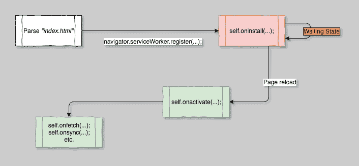

# 通往艾滋病毒/艾滋病的道路-第二部分

> 原文：<https://dev.to/s1hofmann/-the-road-to-pwa---part-2-46d9>

> 这篇文章最初发布在[我的个人博客](https://blog.simon-hofmann.org/pwa/js/2018/05/20/road-to-pwa02.html)

又来了！

欢迎回到第二部分*通往 PWA 之路*。
如果你是新来的，你可以在这里找到我的第一篇帖子[。](https://dev.to/s1hofmann/-the-road-to-pwa---part-1-21gf)

首先，我将再次总结 PWA 的主要特征:

1.  可安装:在主屏幕上使用一个网络应用程序
2.  更快的加载:由于缓存而提高了加载速度
3.  支持离线:即使没有连接，我的应用程序也能在一定程度上工作
4.  渐进性:提到的功能是可选的，该应用程序应该在不支持的浏览器中工作良好

这个列表中的所有元素都有一个共同点:它们在某种程度上依赖于[服务人员](https://developer.mozilla.org/en-US/docs/Web/API/ServiceWorker)。

所以，你可能已经猜到了，我们将会学到很多关于服务人员的知识:

*   一般来说，什么是服务人员
*   他们的能力
*   它们的生命周期
*   我们如何注册一个

我觉得这听起来挺有意思的，那我们开始吧！

# PWA 之路——探访服务人员

直入主题，服务人员是*“只是”*普通的 JavaScript。
但是与我们的 web 应用程序的其他部分不同，服务工作者在一个单独的线程中运行，这带来了一些影响:

*   服务人员**没有**的 DOM 访问权限
*   服务人员和页面之间的通信通过`postMessage()`进行
*   服务人员即使在以下情况下也能保持运行:
    *   用户已离开/关闭页面
    *   用户关闭了浏览器

在服务人员体内，我们能够倾听某些事件并做出反应。有生命周期事件，也有与我们的 web 应用程序相关的事件。我们一会儿将仔细研究这些事件。

所以，在我们要讨论的事情清单上划掉前两个元素，我喜欢把服务人员看做一个拦截者。
它是一段 JavaScript，运行在一个单独的线程中，位于我们的应用程序和*“互联网”*之间。
我们能够对服务人员的生命周期事件做出反应，这非常适合执行资产预缓存之类的事情，但也有可能通过服务人员拦截在我们的 web 应用程序中执行的任何网络请求。这允许服务工作者操纵被拦截的请求中的几乎所有内容(请求 URL、报头、有效负载、响应等)。)，但也给了它缓存动态数据的可能性。
最好的一点是，如果仔细地做，您不必对现有的应用程序进行任何更改，尽管您添加了`register()`调用来通过使用服务工作者来增强它。

# 服务工作者生命周期

现在我们知道了服务人员的能力，让我们更仔细地看看他们的生命周期。

[T2】](https://simon-hofmann.org/img/sw_lifecycle.png)

每当用户访问我们的 PWA 时，它的浏览器都会解析我们的`index.html`页面。在这个页面的某个地方，应该有一个`<script>`标签，其中包含注册服务人员的代码。

```
<script src="./src/js/registerserviceworker.js"></script> 
```

Enter fullscreen mode Exit fullscreen mode

在`registerserviceworker.js`内，服务人员通过呼叫
进行注册

```
navigator.serviceWorker
    .register($pathToServiceWorkerFile); 
```

Enter fullscreen mode Exit fullscreen mode

### 仅 HTTPS

在开发过程中，可以安装一个来自`localhost`的服务人员。每当我们准备发布我们的 PWA，我们需要一个适当的 HTTPS 设置。

如前所述，服务人员在请求操作方面非常强大。你不会想在不安全的地方安装这样的东西。

## 生命周期阶段

在调用了`register()`方法之后，服务工作者要经历以下三个阶段:

1.  安装
2.  等待
3.  使活动

让我们仔细看看其中的每一个阶段！

### 阶段 1:安装服务人员

每当我们试图注册一个新的服务工作者，或者对已经注册的服务工作者应用更改时，就会触发一个`install`事件。
该事件是我们可以附加的服务工作者生命周期事件之一，非常适合为我们的应用程序执行预缓存等操作。`event.waitUntil()`让我们可以手动延长`install`阶段，直到我们完成初始设置。

我们将在我的下一篇文章中讨论预缓存和缓存。

### 第二阶段:等待激活

立即更新服务人员可能不是一个好主意。如果我们更新了它的行为，例如返回一个与以前不同的响应，我们希望在新版本激活之前有一个“干净的切口”。

为了实现这种清晰的划分，目前由我们的服务人员控制的每个客户端都必须重新加载*。一旦完成，我们的服务人员将进入下一阶段。

*   如果我们真的想这么做，我们可以通过调用服务工作者内部的`self.skipWaiting()`来忽略这种行为，立即进入下一个阶段。

### 阶段 3:激活服务人员

一旦我们进入第三阶段，我们确信没有一个客户端是由活动的服务工作者控制的，因此激活我们的新客户端是安全的。

类似于`install`事件，我们可以通过调用`event.waitUntil()`来手动延长这个阶段。通过这样做，我们能够执行清理任务，从其他工作人员那里删除过时的数据。

在这一阶段要做的典型任务是清理最终过期的缓存。在我的下一篇文章中，我们将再次对此进行深入探讨。

# 服务人员登记

下面的代码片段显示了我的一个`registerserviceworker.js`文件的内容:

```
import {
    capabilities
} from "./capabilities";

console.log('Trying to register service worker.');
if (capabilities.sw) {
    navigator.serviceWorker
        .register('../../sw.js')
        .then(registration => {
          console.log("Registered service worker with scope: " + registration.scope);
        });
} else {
    console.log('Service workers not supported, skipping registration.');
} 
```

Enter fullscreen mode Exit fullscreen mode

这段相当短的代码实际上包含了相当多要讨论的内容。

```
navigator.serviceWorker
    .register('../../sw.js'); 
```

Enter fullscreen mode Exit fullscreen mode

这条线是实际负责登记我们的服务人员。在我的例子中，`sw.js`中的服务人员代码位于我的 web apps 根文件夹中，比注册码高两级。虽然这看起来没什么特别的，但它实际上把我们引向了一个重要的话题。

## 服务人员范围

我们在应用程序中发出的每个请求都有一个`origin`。并且服务工作者范围配置哪些原点在其控制之下。默认情况下，服务工作者的范围被设置为它的位置，所以当它位于我们的根级别时，它控制整个范围，我们能够拦截每个请求。
当设置为`./other/scope`时，我们只能拦截来自`https://toplevel.domain/other/scope`的请求。
通过向`register()`调用传递一个配置对象来配置 SW 作用域。

```
{
  scope: './other/scope'
} 
```

Enter fullscreen mode Exit fullscreen mode

一般来说，我们最多只能配置与我们的服务人员文件相同级别或更低级别的范围。因此不可能(至少在没有额外工作的情况下不可能)为位于例如`/src/js/sw.js`的服务工作者配置`/`范围。

万一我们真的想在我们的服务工作者文件之上配置一个范围，仍然有一种方法可以实现它。假设我们能够根据自己的喜好配置我们的 web 服务器，我们将不得不为我们的服务工作者资源添加一个特殊的头。
通过添加特殊的头`Service-Worker-Allowed`，我们能够为我们的服务人员的范围设置一个更高的路径。查看[服务人员规范](https://w3c.github.io/ServiceWorker/#service-worker-script-response)了解更多信息。
老实说，我只是把我的服务人员文件放在根级别，以避免额外的配置工作。

## 服务人员支持

另一个值得一提的细节是下面的导入:

```
import {
    capabilities
} from "./capabilities"; 
```

Enter fullscreen mode Exit fullscreen mode

为了方便起见，我介绍了这个模块。

```
export const capabilities = {
    sw: 'serviceWorker' in navigator,
    idb: 'indexedDB' in window,
    sync: 'serviceWorker' in navigator && 'SyncManager' in window
}; 
```

Enter fullscreen mode Exit fullscreen mode

服务人员获得了更多的浏览器支持，但大多数旧浏览器都不支持。因此，为了使用它们的功能，我们应该首先检查当前的浏览器是否支持服务人员。

我们稍后会处理更多的检查，目前我们只是检查

```
'serviceWorker' in navigator 
```

Enter fullscreen mode Exit fullscreen mode

[caniuse.com](https://caniuse.com/#feat=serviceworkers)概述了支持服务人员的浏览器版本。

# 结论

在这篇文章中，我们了解了服务人员的能力及其生命周期。一个小代码示例演示了如何注册服务人员以及如何配置可选范围。
我们讨论了如何操纵 max。范围，以及如何检查浏览器兼容性。

# 接下来是什么？

在我的下一篇文章中，我将深入研究服务工作者缓存。

*   预缓存
*   动态缓存
*   缓存动态内容
*   缓存实用程序

在我的下一篇文章结束时，我们将拥有一切可以让我们的 PWA 安装在移动设备上的东西！

下次见！

西蒙