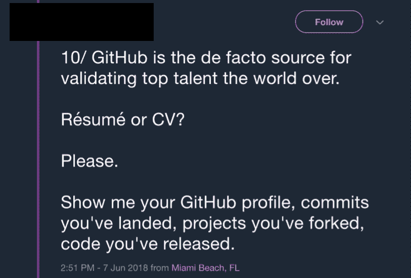

# 🤔关于 GITHUB 的思考

> 原文：<https://dev.to/amycodes/-thoughts-on-github--amy-codes-103e>

[T2】](https://youtu.be/LIRU_FiEq4Y)

再来说说微软收购 Github 的事情！
...
...
...
Lol。Jk。

不了😂。在过去的一周里，一场围绕包容性招聘实践的非常重要的对话因为这条推文而兴起:

这引起了很多人的疑问:“公司应该排除没有 github 项目的候选人吗？”

我的回答:没有

如果你对我关于这个话题的更多想法感兴趣，可以看看我的视频:
👉🏼[https://youtu.be/LIRU_FiEq4Y](https://youtu.be/LIRU_FiEq4Y)T3[T5](https://youtu.be/LIRU_FiEq4Y)

🤔你怎么想呢?

* * *

一定要在 dev.to 上关注我，获取更多精彩内容
https://dev.to/amycodes[✨](https://dev.to/amycodes)✨