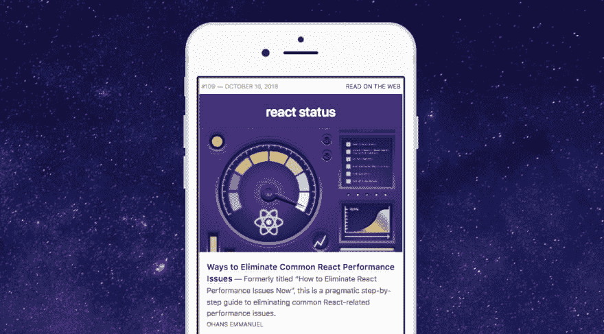

# 🔥本周最热门的链接

> 原文：<https://dev.to/chrisbrandrick/-top-react-links-of-the-week-5h36>

每周⚛️ [React Status](https://react.statuscode.com/?utm_source=devto&utm_campaign=react_roundup) 都会汇集来自 React 生态系统的最新公告、想法、建议、教程和工具。

***让我们快速看看上周哪些链接被证明是流行的:***

### [消除常见 React 性能问题的方法](https://logrocket-blog.ghost.io/death-by-a-thousand-cuts-a-checklist-for-eliminating-common-react-performance-issues/)

消除常见 React 相关性能问题的实用分步指南。

### [你好，创建 React App 2.0](https://www.telerik.com/blogs/hello-create-react-app-2)

这是对 2.0 版本中变化的实际观察，以及 create-react-app 现在比以往任何时候都更有用。

### [如何用 React 构建自定义日期选择器](https://blog.logrocket.com/react-datepicker-217b4aa840da)

很高兴 Chinda 向您展示了如何从头开始构建一个日期选择器。

### [悬疑必杀 Redux](https://medium.com/@ryanflorence/the-suspense-is-killing-redux-e888f9692430)

Ryan Florence 指出“悬念不会取代 Redux 的每一个用例”。

### [构成组件](https://developers.digital.abc.net.au/2018/09/28/composing-components/)

深入了解 ABC(澳大利亚广播公司)如何将其设计流程转变为 React 组件的创作。

* * *

[T2】](https://res.cloudinary.com/practicaldev/image/fetch/s--L55v2Mbs--/c_limit%2Cf_auto%2Cfl_progressive%2Cq_auto%2Cw_880/https://thepracticaldev.s3.amazonaws.com/i/ewep9rbanchgcv96gb4g.png)

以上**只是重点**，完整的摘要汇集了大约 15-20 个值得查看的链接。如果您最近有任何 React 教程或文章，您认为值得在未来的综述中分享，请🔗评论中的链接。

你可以[在这里](https://react.statuscode.com/issues/109?utm_source=devto&utm_campaign=react_roundup) *看到完整的摘要(如果你喜欢，也许可以注册到你的收件箱里)*。