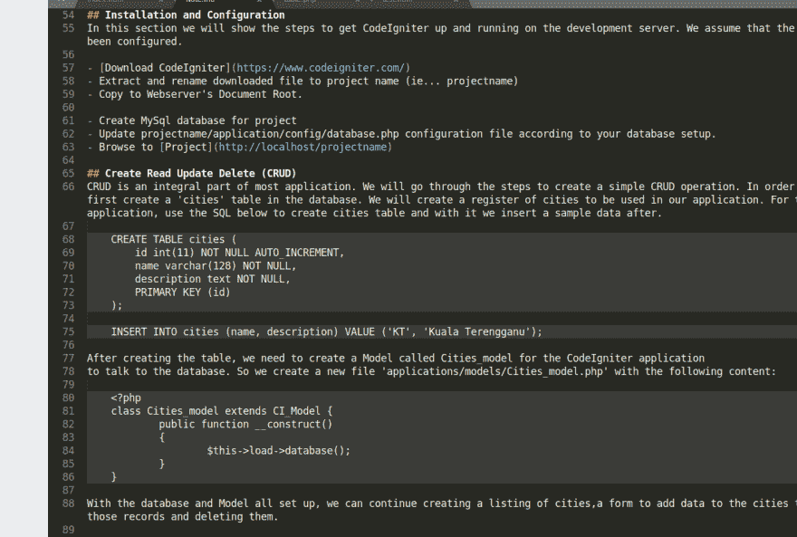
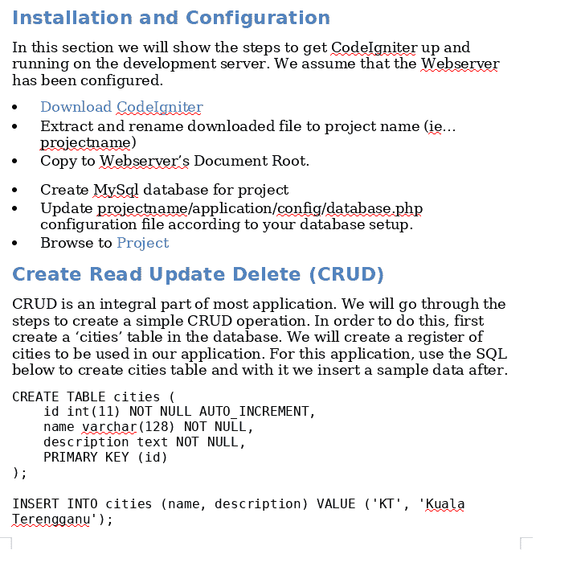

# Menjana Nota Latihan Daripada Markdown Ke Word

> 原文： [https://dev.to/zam3858/menjana-nota-latihan-daripada-markdown-ke-word-3hm3](https://dev.to/zam3858/menjana-nota-latihan-daripada-markdown-ke-word-3hm3)

Kebanyakan kerja kini lebih kepada membuat coaching (peserta bina aplikasi dengan saya menasihati apabila perlu) dan memberi latihan (saya mengajar, orang lain dengar). Adalah kebiasaan mengikut kehendak peserta untuk diberikan nota untuk dijadikan rujukan dikemudian hari.

Menyediakan nota untuk latihan kod bagi saya sangat mudah menggunakan markdown. Markdown juga adalah hasil pemikiran pengaturcara bukan? Tetapi jika mereka tidak menggunapakai sublimetext 3 ataupun apa-apa editor/site yang memberikan paparan markdown yang elok, format agak hambar.

Of course, mereka juga minta dalam bentuk ms-word document jadi...

Berbekal hasil carian google, saya diperkenalkan dengan [pandoc](https://pandoc.org) . Ianya tool mudah untuk convert satu-satu format ke format yang lain. Termasuk Markdown ke MsWord!

Hasilnya (mohon abaikan salah silap pada nota contoh dibawah. Mengantuk dan nak cepat) ...

sebelum:
[T3】](https://res.cloudinary.com/practicaldev/image/fetch/s--UteAg9tn--/c_limit%2Cf_auto%2Cfl_progressive%2Cq_auto%2Cw_880/https://thepracticaldev.s3.amazonaws.com/i/808gbqmmjgb95807lnsw.png)

Selepas:
[](https://res.cloudinary.com/practicaldev/image/fetch/s--UtdCLxFO--/c_limit%2Cf_auto%2Cfl_progressive%2Cq_auto%2Cw_880/https://thepracticaldev.s3.amazonaws.com/i/ouxxmutrkg50zpliudua.png)

Siap heading text ada kaler-kaler.

Jadi saya dapat fokus kepada ~~mengcopy-paste~~ menaip kod dan menceritakan apa ada pada kod-kod itu.

Sukar ke menggunakan pandoc? Selepas install, saya cuma run command dibawah:

```
pandoc -o codeigniterTraining.docx -f markdown -t docx Note.md 
```

Setelah lebih kurang 13 saat kemudian, nota codeigniter siap dan boleh terus dihantar ke client dengan husnuzon semua okay saja.