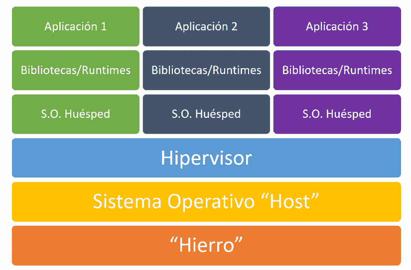
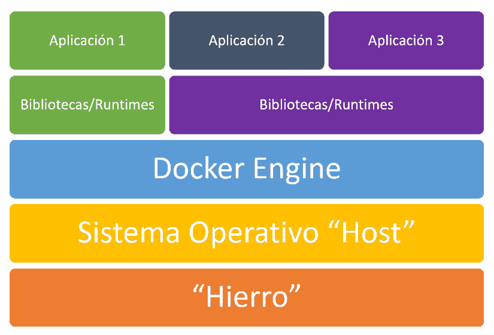

# 坞站(容器)和虚拟机(VMWare、VirtualBox)之间存在差异-我...。)？

> [https://dev . to/campus MVP/qu-difference-hay-docker-container-y-mquinas-virtual-VMware-virtualbox-4ji 3](https://dev.to/campusmvp/qu-diferencia-hay-entre-docker-contenedores-y-mquinas-virtuales-vmware-virtualbox-4ji3)

 

图片由 José Manuel Alarcón，CC-BY-NC 制作

很多人，当你听说“T0”坞站和它可以做些什么时，你首先想到的是虚拟机。毕竟，虚拟机是一种软件，它使您能够与底层操作系统隔离开来，并在多个应用程序之间共享。

但是，坞站和虚拟机等容器技术在概念和实践上都存在巨大差异。

在本文中，我们将简要回顾这两种技术，看看它们是如何工作的，并了解它们的不同之处。你不会再对此有任何疑问

## 了解虚拟机的工作方式

顾名思义，虚拟机(或从现在起的 VM)是在另一个完整操作系统上独立运行的完整操作系统。

VMs 技术允许共享硬件*，这样您就可以同时使用多个操作系统。*

 *其体系结构的简化方案如下(由下而上读取):

[T2】](https://res.cloudinary.com/practicaldev/image/fetch/s--yAKRbcpA--/c_limit%2Cf_auto%2Cfl_progressive%2Cq_auto%2Cw_880/https://www.campusmvp.es/recursos/image.axd%3Fpicture%3D/2018/2T/Docker/Arquitectura-VMs.png)

很明显，下面总要有*某种*硬件*T3】支撑着它的一切。我称之为“铁”，更商业化的说法通常称为“基础设施”。它可能是您用于开发的个人计算机，但如果我们是在讨论实际应用程序的部署，则很可能是您选择的供应商(AWS、Azure、Digital Ocean、Arsys、OVH 等)的数据中心中的服务器。我们想要的东西可能会变得复杂，但最终是“铁”:运行所有其他东西的物理机器。*

所有这些计算能力都没有多大价值，除非我们以操作系统的形式将“脑”加进去。在生产环境中使用了一些专门在服务器上运行的操作系统，即 Windows 或 Linux (macOS 在这种环境中很少使用)。到目前为止，我们还没有什么你不知道的，因为你现在用的电脑基本上是一样的工作方式(即使是手机或平板电脑)。

虚拟机需要在 s . o .:**虚拟机管理程序**之上安装另一个组件才能运行。虚拟机管理程序是一种专用软件，用于公开操作系统下的*硬件*资源，以便其他操作系统可以使用这些资源。这包括 CPU(或*颜色*，内存和存储空间，以及*硬件*的其馀部分。这样就可以创建**虚拟机**，使其暴露于底层*硬件的一部分*。这些虚拟机“欺骗”传统操作系统，使其认为自己正在物理计算机上运行。虚拟机管理程序附带 hyper-v(windows 免费提供)、VirtualBox 或 VMWare 等产品。

> **高级读者注意事项**:我意识到有第 1 类虚拟机管理程序直接安装在*硬件*上，避免了在中间安装常规操作系统的需要。事实上，这些通常用于数据中心，以进一步提高性能。不过，本文将尽可能广泛地讨论这一问题，以便知识较少的读者能够全面了解虚拟机和容器的工作情况。

这使我们能够在同一台物理计算机上并行运行不同的操作系统，每个操作系统都保留了内存和磁盘空间(“颜色”可以共享)，并且彼此完全隔离。由于近年来虚拟机管理程序的进步以及现代处理器提供的面向虚拟化的技术，性能损失降到最低，并且是共享硬件“”以充分利用其优势的一种非常高效的方式。

## 了解容器的工作原理

容器的理念与 VM 的理念完全不同。他们还试图隔离应用程序并为其运行创造一个可复制和稳定的环境，而不是托管一个完整的操作系统，但他们所做的是共享运行所在的“主机”操作系统本身的资源。

如果我们看一下与前面的集装箱方案相当的方案，我们得到的是这样的:

[T2】](https://res.cloudinary.com/practicaldev/image/fetch/s--NOKvRsEV--/c_limit%2Cf_auto%2Cfl_progressive%2Cq_auto%2Cw_880/https://www.campusmvp.es/recursos/image.axd%3Fpicture%3D/2018/2T/Docker/Arquitectura-Contenedores.png)

从表面上看，我们可能赚得不多。最后，仅来宾操作系统层消失，虚拟机管理程序被替换为我所说的“坞站引擎”。但是**差别很大**，如下所示。

> **注意**:我放入了坞站引擎，因为我集中在坞站上。还有其他容器溶液([美德](https://www.virtuozzo.com)， [LXC/LXD](https://linuxcontainers.org/) ， [OpenVZ](https://openvz.org/) ， [DC/OS](https://dcos.io) -我...。)，但 Docker 无疑是最受欢迎和使用的，所以我会遵守她。在其他解决办法中，负责"集装箱化"的组成部分的名称会有所不同，但概念是一样的。

docker engine 负责使用我们的应用程序启动和管理容器，但它不会单独暴露机器的不同硬件资源(即 1 个处理器和“x”GB ram)-我...。对于每个应用程序)，它所做的是在所有容器之间共享它们，优化它们的使用，消除了单独操作系统实现隔离的需要。

docker 由影像组成，可在多个应用程式之间重复使用(请参阅上图，其中应用程式 2 与 3 共用*执行时间*。这些图像中的每一个都可以被视为一个“层”，可以重叠在一起形成一个文件系统，这是所有图像的组合。例如，一个层可能包含我们需要使用的库或“*运行时*”；另一个层包含我们的应用程序使用的特定库(如 Node.js 或 PHP)；最后一个层包含我们的应用程序代码。生成的组合(一个新映像，对于我们的应用程序是唯一的)是我们容器的基础。

从映像中启动一个或多个容器时，就我们的应用程序而言，它就像在自己的操作系统中运行一样，与计算机上当前存在的任何其他应用程序隔离开来。但现实是他们正在共享下面的“主机”操作系统。一个容器看到它自己的文件系统，这是它以前讨论过的“重叠”层的结果，而且硬件资源是根据需要动态分配的，由 docker engine(如果使用其他类型的容器，则为其对等项)处理。即**坞站隔离应用程序，而不是整个操作系统**。

> **注意**:您也可以访问本地计算机上的文件系统，以永久保留特定于应用程序的信息，因为如果关闭容器，您对其虚拟文件系统所做的所有更改都将丢失。尽管可以选择这样做而不必这样做。但这是可以打破容器和来宾操作系统之间的隔离的最大限度。

如我们所见，追求类似目的，但方法截然不同的技术。

现在，我们已经了解了这两种技术的基本运作方式，我们将重点关注它们的差异及其实际影响，这正是我们感兴趣的。

## 坞站与。虚拟机(VM)

首先，我们必须考虑到，就容器而言，它们不需要完整的操作系统，而是重复使用底层的“”这一事实大大减少了物理机必须承受的负荷，**所使用的存储空间**对于某些 Linux 发行版而言，操作系统占用的空间几乎不到 1GB，而对于整个 Windows 系统而言，占用的空间则超过 10GB。此外，这些操作系统需要最低限度的保留 RAM 才能运行，根据我们的需求，保留 ram 的范围从 gb 到几 GB 不等。因此**集装箱比虚拟机轻得多**。

当我们定义**虚拟机时，我们必须预先指出要为其分配多少物理资源**。例如，我们可以说，我们的 VM 需要 2 个虚拟处理器、4 GB ram 和 100 GB 磁盘空间。就处理器而言，您可以在多个虚拟机之间共享处理器(但不应该占用或牺牲性能)，而且磁盘空间只能占用实际使用的空间，因此它可以按需扩展，而不一定占用我们预留的空间。但是对于内存和其他项目(访问外部驱动器或 USB 设备)，保留空间是完全的。因此，即使我们的应用程序实际上不使用 4GB 的保留 RAM，其他虚拟机或其他任何人也无法使用这些 ram。**就集装箱**而言，情况并非如此。事实上，我们并没有指明我们将需要什么资源，而是坞站引擎，根据每时每刻的需要，负责“T4”分配容器正常工作所需的资源。

这使得 docker 的运行环境要轻得多，而且可以更好地利用硬件，同时还可以在同一台物理机上装载比 VM 多得多的容器。虽然 VM 可能需要一分钟或更长时间才能启动并使我们的应用程序可用，但**坞站容器在几秒钟内就会弹出并响应**(或更短，具体取决于图片)。**由于不需要安装完整的操作系统，所以坞站占用的磁盘空间要少得多**。

另一方面，docker 不允许在“主机”操作系统中使用同一操作系统以外的容器/应用程序。也就是说，我们不能在 Windows 上运行包含 Linux 应用程序的归档文件，反之亦然。这在某些情况下可能会造成障碍。

> **注意**:dock for windows，自相矛盾的是，它在后台使用 Linux 虚拟机来运行 Linux 应用程序。Windows 容器自然在 Windows 上运行。

此外，要在容器中进行高级应用程序部署，就必须超越坞站，采用诸如“**[kublets、](https://kubernetes.io)T3]等技术，使我们能够编排和控制具有许多移动部件的部署。这些技术可能变得复杂，难以学习和掌握。**

## 总之

容器使您能够更快地部署应用程序，更快地启动和停止应用程序，并更好地利用硬件资源。虚拟机使我们能够创建完全隔离的完整系统，更好地控制环境，并将操作系统*主机*和来宾操作系统混合在一起。

每项技术都有其应用和优势，具体取决于每项发展的需要和情况。目前，容器，特别是坞站，正成为一项不可或缺的技术，而且越来越多地被用于多种用途，不仅是在生产中部署应用程序，而且还用于在所有团队成员中创建可复制的开发环境，**，以确保有人保证，**从中期来看，大部分开发者都会使用 docker 来开发和部署**应用程序。看看会发生什么，但 Docker 无疑在软件开发的各个阶段都提供了非常重要的优势。**

我给你留些链接，如果你想进一步了解这个问题:

*   [美国码头主要港口](https://dev.to/campusmvp/7-motivos-para-utilizar-docker-en-general-y-con-aspnet-core-en-particular-1279-temp-slug-2641266)
*   [如何开始使用 dock](https://www.campusmvp.es/recursos/post/como-empezar-a-desarrollar-utilizando-docker.aspx)开发
*   码头工人与流浪者:差异与相似
*   [坞站和库台:基于容器的应用程序的开发和部署](https://www.campusmvp.es/recursos/catalogo/Product-Docker-y-Kubernetes-desarrollo-y-despliegue-de-aplicaciones-basadas-en-contenedores_237.aspx)

直到结果出来！*