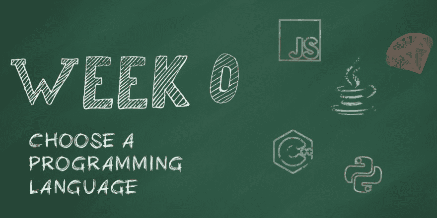
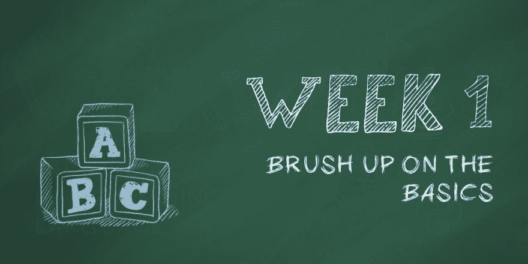
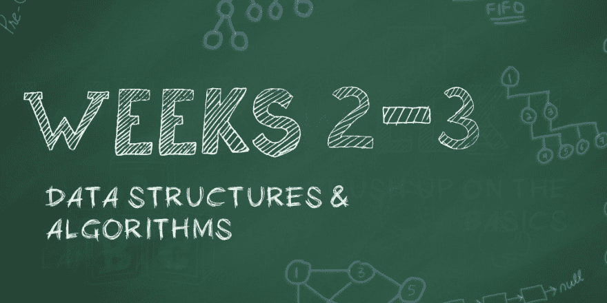
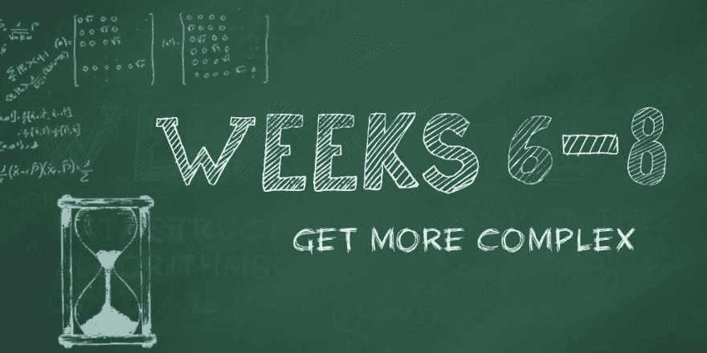
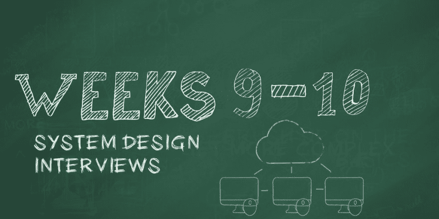
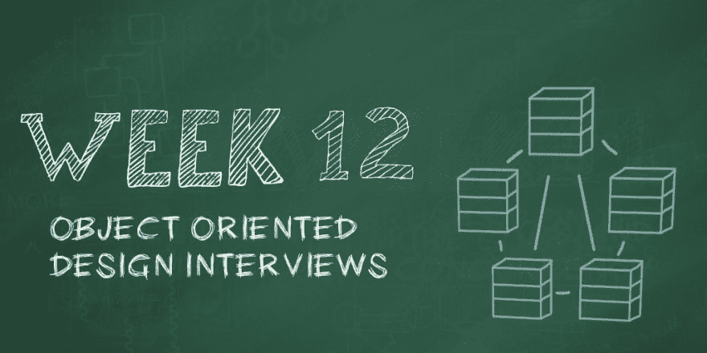

# 3 个月编码面试训练营

> 原文: [https://dev.to/fahimulhaq/3 个月-编码-面试-bootcamp-5gpl](https://dev.to/fahimulhaq/3-month-coding-interview-bootcamp-5gpl)

*原文发表[此处](https://medium.com/educative/3-month-coding-interview-bootcamp-904422926ce8)* 。

一些背景:我已经面试了数百名脸书和微软软件工程职位的候选人。当我没有准备好的时候，我自己也失败过几次编码面试。

我最初写这篇文章是为了回答 Quora 上一个关于软件工程面试路线图的问题。最终，答案变得如此之长，以至于我认为它值得自己写一篇博文。)

# 三个月——真的？

让我们把这个弄清楚。人们经常问我:如果你是从零开始，破解编码面试的合理时间框架是什么？(也就是说，你在过去几年中没有参加过面试。)

我认为三个月是一个合理的时间范围。是的，真的，三个月。除此之外，如果你有一段时间没有参加面试，至少要花 4-6 周时间。如果你在过去的 12 个月左右参加过面试，你可能会得到更少的信息。

现在吃肉。以下是软件工程在“大技术”公司面试的五个主要部分，如脸书、谷歌、微软等。将包括:

1.  编码面试(关注问题解决、数据结构和算法)。
2.  操作系统和并发概念
3.  系统设计面试。
4.  面向对象的设计面试
5.  文化契合度面试

像任何其他需要持续工作的长期目标一样(比如准备跑马拉松)，遵循某种结构是至关重要的，因为它会鼓励你在动力可能减弱的日子里坚持下去。

> 为了帮助你，我创建了一个 12 周的准备计划，你可以按照它来准备你的下一次编码面试。在这 12 周中，你将以结构化的方式涵盖上述所有主题。让我们开始吧。

# 第 0 周—应该用什么编程语言？

[T2】](https://res.cloudinary.com/practicaldev/image/fetch/s--l3ceWzaH--/c_limit%2Cf_auto%2Cfl_progressive%2Cq_auto%2Cw_880/https://thepracticaldev.s3.amazonaws.com/i/m8ln609lb93c4uu1q5er.png)

选择一种编程语言，然后坚持下去。经常有人问我:认识的不止一个怎么办？例如，Python 更好，还是 Java 更好？

答案当然是，对于你的编码面试来说，最好的编程语言是你最熟悉的语言。大多数公司/面试官都不在乎，只要你能表现出对任何一种主流编程语言的熟练程度。

在一些最糟糕的情况下，我看到人们在面试中途决定“切换”到一种不同的编程语言。这是一个很大的障碍，也是浪费时间。不要那样做。尽早选择一个，并坚持到底。

# 第一周——复习你最喜欢的编程语言的基础知识

[T2】](https://res.cloudinary.com/practicaldev/image/fetch/s--CQBldM04--/c_limit%2Cf_auto%2Cfl_progressive%2Cq_auto%2Cw_880/https://thepracticaldev.s3.amazonaws.com/i/4phu2wpkbo5ut2s1d56t.png)

温习一下你选择的编程语言。当你用你喜欢的语言为你的日常工作编写代码时，你会忘记很多事情。我见过人们努力去记住一些事情，比如:

*   如何读取/写入文件
*   如何从控制台读取输入
*   如何拆分字符串
*   字符串长度是一个函数还是一个属性(回答:这不重要，但仍然反映在你身上很差)
*   如何声明和使用 2D 数组
*   在 C/C++中，如何处理以 null 结尾的字符串

有一次，我看到一个应试者很困惑，不记得如何计算一个数字是正数还是负数。(我肯定他们知道这一点——他们只是脑子僵住了)。

> 你花在回忆你所选择的编程语言的细微差别上的时间和精力，用在实际解决问题和展示你解决问题的技巧上会更好。这才是面试官想看到的。

一些公司，如 Lyft 和 Salesforce，要求你在笔记本电脑上解决问题。你应该编写完整的程序，通过给定的测试用例。在这些情况下，您可能必须:

*   处理命令行参数
*   解析 CSV 或文本文件

当然，你可以在谷歌上搜索这些，但那会把时间花在琐碎的任务上，这些任务是必要的，但不会帮助你脱颖而出。

# 第 2 周&第 3 周—数据结构和算法

[T2】](https://res.cloudinary.com/practicaldev/image/fetch/s--0YcWo1Bm--/c_limit%2Cf_auto%2Cfl_progressive%2Cq_auto%2Cw_880/https://thepracticaldev.s3.amazonaws.com/i/qusep0ftrktrebug21fu.png)

开始修改计算机科学概念，如数据结构和算法。你知道，那些你在大学时学过的概念，从那以后就再也没有看过——它们实际上在编写面试代码时非常有用。以下是一些相关资源:

对于数据结构，请访问[编码面试的数据结构](https://www.educative.io/m/data-structures-for-coding-interviews)。

算法方面，访问[编码面试的算法](https://www.educative.io/m/algorithms-for-coding-interviews)。

记得复习以下主题:

*   复杂性分析(又名 BigO)
*   数组
*   大量
*   行列
*   链接列表
*   树
*   尝试(它们实际上是树，但是单独调用它们还是好的)。
*   图表(BFS 和 DFS)
*   散列表
*   很
*   整理
*   搜索

# 第 4 周&第 5 周—练习简单的数据结构和算法挑战

[T2】](https://res.cloudinary.com/practicaldev/image/fetch/s--P_7hEApx--/c_limit%2Cf_auto%2Cfl_progressive%2Cq_auto%2Cw_880/https://thepracticaldev.s3.amazonaws.com/i/mvrspm8evnuo8ya4lzal.png)

当您熟悉(或重新熟悉)数据结构时，开始练习与这些数据结构和算法相关的相对简单的编码问题。这些问题通常不会在大型科技公司的面试中被问到。

当这样的问题被问到时，它们通常被用作嘶嘶声类型的热身问题。这样的问题在电话采访中也很常见。然而，练习这些编码面试问题将帮助你内化数据结构，并帮助你解决更难的问题，这些问题你将在几周后练习。

通过以下问题提高您的阵列技能:

*   从数组中移除偶数整数
*   合并两个排序的数组
*   数组中第一个不重复的整数
*   查找数组中的第二个最大值

用以下问题来复习你的链表概念:

*   查找链表的长度
*   在单链表中搜索
*   反转一个链表
*   查找链表的中间值

通过以下问题提高您的堆栈/队列技能:

*   对堆栈中的值进行排序
*   创建堆栈，其中 min()返回 O(1)中的最小值
*   使用一个数组实现两个堆栈

练习树问题，如:

*   在二叉查找树找到最小值
*   找到二叉树的高度
*   在二叉查找树找到 kth 最大值

练习图形问题:

*   实现广度优先搜索
*   实现深度优先搜索
*   检测图形中的循环

练习基本的 Trie 问题:

*   Trie 中的总字数
*   查找存储在 Trie 中的所有单词

练习基本的堆问题:

*   在列表中找到 k 个最小的元素
*   找出数组中 k 个最大的元素

# 第 6、7、8 周—练习更复杂的编码面试问题

[T2】](https://res.cloudinary.com/practicaldev/image/fetch/s--clcYiaXn--/c_limit%2Cf_auto%2Cfl_progressive%2Cq_auto%2Cw_880/https://thepracticaldev.s3.amazonaws.com/i/urbw3dv962pnwo4y1e02.png)

既然你已经练习了几个星期更简单的问题，是时候面对现实了，开始练习更难的问题，这些问题更有可能在编码面试中被问到。

关于实践和自动化挑战以及交互式解决方案，请看[探索编码面试:编码问题的模式](https://www.educative.io/courses/grokking-the-coding-interview)。

在解决这些问题时，请记住以下一些指导原则:

1.  现在是时候开始为自己计时了。理想情况下，你不应该花超过 20-30 分钟来解决任何给定的问题。(这可能不会马上适用于所有问题。)
2.  如果你不能在规定的时间内解决问题，不要气馁。即使花了你几个小时，也要解决它，不要看解决方案。这将帮助你建立信心，你可以解决它，然后你可以专注于更快地解决它们。
3.  开始考虑每个解决方案的运行时和内存复杂性。你必须在实际的面试中清楚地阐述复杂的问题，所以最好现在就开始。

以下是一些需要考虑的示例问题:

*   实施二分搜索法
*   找到两个链表的交点
*   颠倒句子中的单词
*   检查两个二叉树是否相同
*   克隆(深度复制)一个有向图
*   找到一个拼字游戏的解决方案
*   判断数组中是否有三个整数的和等于给定值。

你必须在这里呆上 2-3 周。如果你经常遇到障碍和卡住，不要担心——过一段时间你会找到窍门的。相信我，在开始的几天看起来不可能的问题在你练习后会变得很容易。为了避免编码面试中的常见错误，你可以访问:[如何在你的 45 分钟编码面试中不成功](https://dev.to/fahimulhaq/how-not-to-succeed-in-your-45-minute-coding-interview)。

# 第 9 周& 10 —系统设计面试

[T2】](https://res.cloudinary.com/practicaldev/image/fetch/s--z-n2lroL--/c_limit%2Cf_auto%2Cfl_progressive%2Cq_auto%2Cw_880/https://thepracticaldev.s3.amazonaws.com/i/a0mr1uxiuu3znabrfvm6.png)

系统设计面试现在是软件工程面试过程中不可或缺的一部分——尤其是当你申请一个高级职位的时候。这些面试对你的“招聘水平”有重大影响

学习分布式系统概念，如 Cap 定理、一致性、分区、负载平衡等。

查看课程[系统设计面试](https://www.educative.io/courses/grokking-the-system-design-interview)了解更多设计面试实践。

作为系统设计面试的一部分，你被要求设计一个“网络规模”的服务。面试官感兴趣的是评估您描述可扩展服务不同部分的能力，例如:

*   web 服务器的负载是如何平衡的？
*   数据库是如何共享的？
*   大型文件是如何存储的？
*   如何设置网络以实现冗余和最大吞吐量？

你需要练习这样的问题:

*   设计 Instagram
*   设计脸书新闻源
*   设计优步

以下是一些关于系统设计的有用文章:

*   [软件工程师十大系统设计面试问题](https://dev.to/fahimulhaq/top-10-system-design-interview-questions-for-software-engineers)
*   [如何在 45 分钟的系统设计面试中不设计网飞](https://dev.to/fahimulhaq/how-not-to-design-netflix-in-your-45-minute-system-design-interview)
*   [系统设计面试剖析](https://dev.to/fahimulhaq/anatomy-of-a-system-design-interview)

# 第 11 周—操作系统和并发概念:

[T2】](https://res.cloudinary.com/practicaldev/image/fetch/s--KZmCd6t4--/c_limit%2Cf_auto%2Cfl_progressive%2Cq_auto%2Cw_880/https://thepracticaldev.s3.amazonaws.com/i/ndthd7m0l01cuwivkvqu.png)

如今，即使是“经济型”笔记本电脑和手机也拥有多个内核。理解线程、锁、同步等概念。无论是构建移动应用还是网络规模的服务，都是有益的。

就像系统设计面试问题一样，多线程和并发性面试问题有助于衡量你的水平。一个初级工程师会纠结于这些问题(并期望在工作中学到更多)。相对资深的工程师应该在这类问题上做得更好，因为他们将负责编写大量利用多核/线程的代码。访问[并发编码面试](https://www.educative.io/m/concurrency-for-coding-interviews)来帮助你准备。

# 第 12 周——面向对象的设计面试:

[T2】](https://res.cloudinary.com/practicaldev/image/fetch/s--pbw0y5T---/c_limit%2Cf_auto%2Cfl_progressive%2Cq_auto%2Cw_880/https://thepracticaldev.s3.amazonaws.com/i/qe9cgs4fbu81383lyc3x.png)

一些公司会问这样的问题:

*   设计一台自动取款机
*   设计一部电梯
*   设计一个停车系统

在面向对象的设计问题中，面试官在寻找你对软件设计模式的理解，以及你将需求转化为可理解的类的能力。您将大部分时间花在解释各种组件、它们的接口以及不同组件如何使用接口相互交互上。

要了解更多关于软件设计模式的面向对象编程的最佳实践，请看[软件设计模式:软件开发者的最佳实践](https://www.educative.io/courses/software-design-patterns-best-practices)。

# 文化契合访谈

这是许多人认为不重要的一次，尽管这是有时最重要的一次面试。对此的思考非常简单:如果你有正确的态度，你可以学习新的技能，这样你的编码或系统设计面试中的小缺点就可以被忽略。然而，如果一个人看起来对产品没有感情，或者看起来不像一个团队成员，即使他们是伟大的黑客，他们也可能值得雇佣。

还有一本名为《无屁眼法则》的书。公司尽量不雇佣有毒的人——这样做的长期成本可能是巨大的。公司也不想雇佣对产品没有热情的工程师。文化契合面试就是为了淘汰这样的人。

文化契合度面试的一些基本规则是:

1.  对产品表现出兴趣，并展示对产品的理解。(曾经有一位候选人告诉我，脸书销售 AWS(存储/计算)之类的云服务。他甚至用过其中的一个。现在，脸书确实收购了 Parse.com，并让它存活了一段时间，但云基础设施从来都不是脸书的主要/核心业务)。

2.  准备好描述你与队友或经理发生冲突的场景，以及你是如何解决的。如果你已经做了几年软件工程师，请不要说你从未有过冲突。

3.  谈谈你想在公司里完成什么

4.  谈谈你作为工程师最近/最重要的成就

5.  谈谈你遇到的一些特别疯狂/困难的 bug。

# 结论

准备编码面试需要花费大量的时间和精力，但如果这能帮助你脱颖而出，证明你已经准备好接受一份复杂的工作，那就值得了。我发现始终牢记最终目标的价值很有帮助——在这种情况下，就是获得一份高价软件工作的个人满意度和经济补偿。

# 资源

作为参考，下面是我在整篇文章中提到的软件工程面试资源的综合列表:

1.  [寻找编码面试:编码问题的模式](https://www.educative.io/courses/grokking-the-coding-interview)。
2.  [编码面试的数据结构](https://www.educative.io/m/data-structures-for-coding-interviews)。
3.  [钻研系统设计面试](https://www.educative.io/courses/grokking-the-system-design-interview)。
4.  [编码面试并发](https://www.educative.io/m/concurrency-for-coding-interviews)
5.  软件设计模式:软件开发人员的最佳实践。
6.  [编码面试的算法](https://www.educative.io/m/algorithms-for-coding-interviews)

我很想知道你是否有任何反馈。如果您有任何问题或反馈，请通过 [fahim@educative.io](mailto:fahim@educative.io) 联系我。