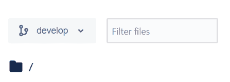

# 十月:去恐怖故事

> -= ytet-伊甸园字幕组=-翻译:粒粒粒尘紫月皮皮夏酷校对

[T2】](https://res.cloudinary.com/practicaldev/image/fetch/s--UfhJlM4s--/c_limit%2Cf_auto%2Cfl_progressive%2Cq_auto%2Cw_880/https://thepracticaldev.s3.amazonaws.com/i/lvi3t2rn6jzcpqxx2txs.png)

因为这是所有事情都令人毛骨悚然的一个月，我认为在开发过程中发布我的一个可怕的经历是一个好主意，以进入“幽灵特工”的情绪。这种可怕的经历以 git 的形式出现。故事是这样的...

我被安排在一个 Android 项目中，在那里我必须添加一个新的功能并应用特定于味道的资源。所以首先要做的是克隆项目。好吧，我以前做过，所以这不是问题。哦，我错了吗？项目源代码驻留在 BitBucket 上，我利用 Git Bash 终端来克隆和运行其他命令。我进入 BitBucket，选择 **develop** 分支(见下图)，然后点击“克隆”按钮，将链接粘贴到我的终端。
T3T5】

> BitBucket 上的开发分支。

在这一点上，一切似乎都很好。然后，我继续到 Android Studio 打开项目，以确保它能够构建。项目运行成功。我再次回到我的终端运行 *$git status* 来查看我当前所在的分支的状态。然后我注意到我在*掌握*。然后我运行*$ git check out developer*。它返回一条消息，指出该分支不存在。
*这怎么可能，因为它存在于 BitBucket 上。*

我再次重复整个过程，希望得到不同的结果。我仍然遇到同样的问题。我问一位同事，他是否有成功的克隆体。他说*不*。然后，我想知道我们是否获得了正确的 BitBucket 访问权限...
但这不是原因，因为我可以看到所有的分支。在这一点上，我太害羞了，不敢就这种愚蠢的情况去找我的经理。
下一步:在 Stackoverflow 上挖掘解决方案。

我谷歌了一下我的问题，在 Stackoverflow 上找到了一些建议的解决方案。最初的几个解决方案根本不起作用。我深入挖掘，最终找到了一个可行的解决方案。命令是 *$git clone -b* 。

我最初没有联系我的上级/团队领导的一些原因是:

1.  我想展示我试图解决问题的努力。
2.  这感觉很尴尬，因为我是一个初级开发人员。到目前为止，我已经使用 git 命令 3 年了。

要吸取的教训:

1.  在你接近队友之前，尝试解决问题。
2.  不要花太多时间试图解决一个问题。
3.  及时提醒你的团队成员这个问题。
4.  与社区分享您的解决方案。

哪些 git 命令对你有用？

有用的链接:

*   [https://www.git-tower.com/blog/git-cheat-sheet](https://www.git-tower.com/blog/git-cheat-sheet)
*   [https://www . atlassian . com/dam/JCR:8132028 b-024 f-4b6b-953 e-e 68 fcce 0 C5 fa/atlassian-git-cheat sheet . pdf](https://www.atlassian.com/dam/jcr:8132028b-024f-4b6b-953e-e68fcce0c5fa/atlassian-git-cheatsheet.pdf)

由 Ehud Neuhaus 在 Unsplash 上拍摄的封面照片