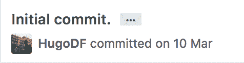
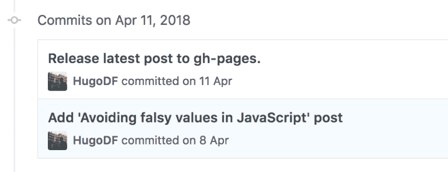
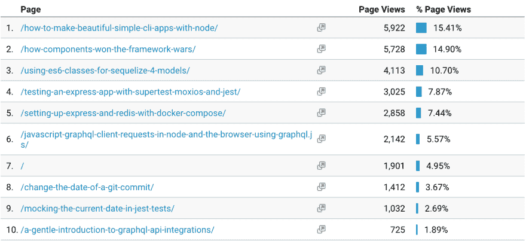
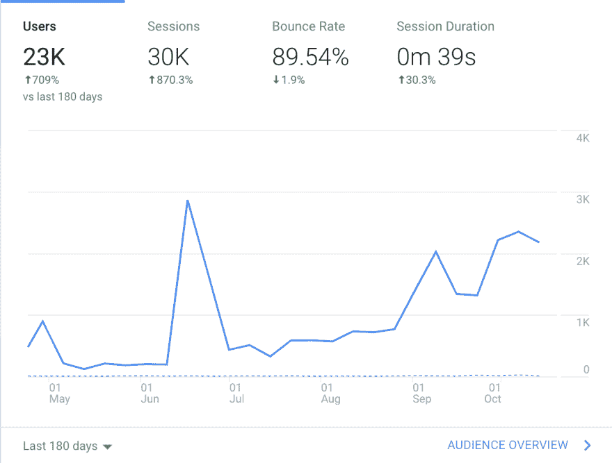
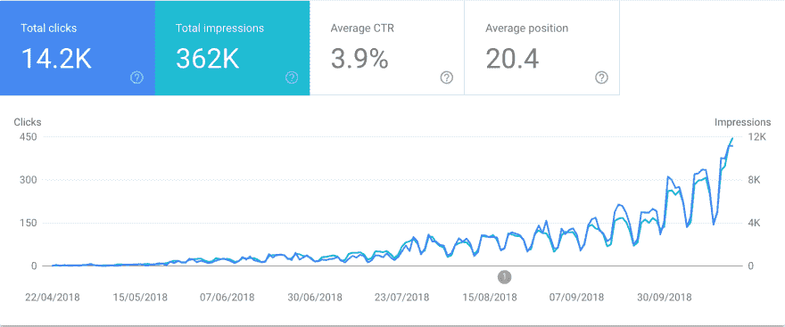

# 雨果 6 个月的代码，用数字

> 原文: [https://dev.to/hugo__df/6 个月的代码与 hugo-in-numbers-4p8](https://dev.to/hugo__df/6-months-of-code-with-hugo-in-numbers-4p8)

> 从 0 到小。一个开发者从零开始的技术博客之旅。

本帖中的统计数据截止到 10 月 21 日，[在 Twitter 上关注我](https://twitter.com/hugo__df)每月更新。

内容:

*   [时间线](#timeline)
*   [帖子数量、总字数和阅读时间](#post-count-total-word-and-read-time)
*   [热门访问](#top-visited)
*   [热门日，分析和搜索流量数据](#top-day-analytics-and-search-traffic-data)
*   [亮点](#highlights)
*   [时事通讯、开发者和推特](#newsletter-devto-and-twitter)
*   [代码和示例库](#code-and-example-repositories)
*   [收入](#revenue)

## 时间轴

**首次提交**:2018 年 3 月 10 日

[T2】](https://res.cloudinary.com/practicaldev/image/fetch/s--8VZGgGni--/c_limit%2Cf_auto%2Cfl_progressive%2Cq_auto%2Cw_880/https://d2mxuefqeaa7sj.cloudfront.net/s_12BC44EFC445B39435F24188DC09E3523F5F0BB39541BE515F4AE118481862F4_1540125428049_image.png)

**第一篇** : [避免 JavaScript 中的虚假值](https://dev.to/hugo__df/avoiding-falsy-values-in-javascript-arrays-19c7)，【2018 年 4 月 10 日发布

[T2】](https://res.cloudinary.com/practicaldev/image/fetch/s--1_Kc7HUr--/c_limit%2Cf_auto%2Cfl_progressive%2Cq_auto%2Cw_880/https://d2mxuefqeaa7sj.cloudfront.net/s_12BC44EFC445B39435F24188DC09E3523F5F0BB39541BE515F4AE118481862F4_1540125423109_image.png)

**6 月日期**:10 月 11 日

**天** : 183 天(6 个月的日期)

## 帖子计数、总字数和阅读时间

**帖子** : 35 (36 自本文发表后，在 https://beta.observablehq.com/@hugodf/code-with-hugo-posts[的实时统计](https://beta.observablehq.com/@hugodf/code-with-hugo-posts))

**总字数**:3.29 万

> Hugo 根目录下:`cat content/post/2018-{04,05,06,07,08,09,10,11,12}-* | wc -w`的输出

总阅读时间 : 110 分钟，1 小时 50 分钟

**平均读后时间** : 3.02 分钟

## 登顶拜访

1.  [如何用节点制作漂亮简单的 CLI 应用](https://dev.to/hugo__df/how-to-make-beautiful-simple-cli-apps-with-node-c1b)，【2018 年 6 月 20 日发布
2.  [组件如何赢得框架大战](https://dev.to/hugo__df/how-components-won-the-framework-wars-5fko)，【2018 年 4 月 22 日发布
3.  [为 Sequelize 4 车型使用 ES6 课程](https://dev.to/hugo__df/using-es6-classes-for-sequelize-4-models-17ga)，【2018 年 5 月 9 日发布
4.  [使用 Supertest、moxios 和 Jest 测试 Express 应用](https://dev.to/hugo__df/testing-an-express-app-with-supertest-moxios-and-jest-4f44)，【2018 年 6 月 27 日发布
5.  [用 Docker 排版设置 Express 和 Redis】，【2018 年 6 月 6 日发布](https://dev.to/hugo__df/setting-up-express-and-redis-with-docker-compose-aaa)
6.  [在节点和浏览器中使用 graphql.js 的 JavaScript GraphQL 客户端请求](https://dev.to/hugo__df/javascript-graphql-client-requests-in-node-and-the-browser-using-graphqljs-45n5)，【2018 年 9 月 5 日发布
7.  [主页，codewithhugo.com](https://codewithhugo.com)
8.  [更改 git 提交日期](https://dev.to/hugo__df/change-the-date-of-a-git-commit-261e)，【2018 年 8 月 29 日发布
9.  [在玩笑测试中嘲讽当前日期](https://dev.to/hugo__df/mocking-javascripts-current-date-in-jest-tests-412j)，【2018 年 7 月 7 日出版
10.  [graph QL API 集成简介](https://dev.to/hugo__df/a-gentle-introduction-to-graphql-api-integrations-6fk)，【2018 年 9 月 10 日发布

[T2】](https://res.cloudinary.com/practicaldev/image/fetch/s--5aERdhGF--/c_limit%2Cf_auto%2Cfl_progressive%2Cq_auto%2Cw_880/https://d2mxuefqeaa7sj.cloudfront.net/s_12BC44EFC445B39435F24188DC09E3523F5F0BB39541BE515F4AE118481862F4_1540124344695_image.png)

## 热门日，分析和搜索流量数据

第一天:4 月 23 日，2622 次页面浏览

[如何用节点制作漂亮简单的 CLI 应用](https://dev.to/hugo__df/how-to-make-beautiful-simple-cli-apps-with-node-c1b)在 [`/r/node`](http://reddit.com/r/node) 上得到了相当高的评价。

[T2】](https://res.cloudinary.com/practicaldev/image/fetch/s--6MDELWrz--/c_limit%2Cf_auto%2Cfl_progressive%2Cq_auto%2Cw_880/https://d2mxuefqeaa7sj.cloudfront.net/s_12BC44EFC445B39435F24188DC09E3523F5F0BB39541BE515F4AE118481862F4_1540124269010_image.png)

最近 6 个月的搜索流量(截至 2018 年 10 月 21 日):

[T2】](https://res.cloudinary.com/practicaldev/image/fetch/s--ym0y6inP--/c_limit%2Cf_auto%2Cfl_progressive%2Cq_auto%2Cw_880/https://d2mxuefqeaa7sj.cloudfront.net/s_12BC44EFC445B39435F24188DC09E3523F5F0BB39541BE515F4AE118481862F4_1540124214742_image.png)

## 高亮显示

*   进入[节点周刊](https://nodeweekly.com/)、 [JavaScript 周刊](https://javascriptweekly.com/)、 [Vue.js feed](https://www.google.co.uk/search?q=vuejsfeed&oq=vuejsfeed&aqs=chrome..69i57j0l3.1928j0j7&sourceid=chrome&ie=UTF-8) 、 [GraphQL 周刊](https://graphqlweekly.com/)，感谢为策划顶级内容所做的所有工作(并认为其中一些是我的)。
*   除了 HackerNoon 和 Codeburst 贡献者之外，成为 freeCodeCamp 和 Startup 的作者

## 时事通讯、开发到和 Twitter

时事通讯:

*   **订阅数** : 72
*   **退订** : 4

开发到:

*   关注者:2811 人

## 代码和示例库

**储存库计数** : 11

**按出场顺序:**

1.  [github.com/HugoDF/express 中继停靠站](https://github.com/HugoDF/express-redis-docker)
2.  [github.com/HugoDF/fix-package-lock](https://github.com/HugoDF/fix-package-lock)
3.  [github.com/HugoDF/express-supertest-moxios](https://github.com/HugoDF/express-supertest-moxios)
4.  [github.com/HugoDF/express-bull-es6](https://github.com/HugoDF/express-bull-es6)
5.  [github.com/HugoDF/snapshot-everything](https://github.com/HugoDF/snapshot-everything)
6.  [github . com/hugodf/python-graph QL 客户端示例](https://github.com/HugoDF/python-graphql-client-example)
7.  [github . com/hugodf/js-graph QL 客户端示例](https://github.com/HugoDF/js-graphql-client-example)
8.  [github.com/HugoDF/parcel-gh-pages-deploy](https://github.com/HugoDF/parcel-gh-pages-deploy)
9.  [github.com/HugoDF/vue-multiple-components-in-sfc](https://github.com/HugoDF/vue-multiple-components-in-sfc)
10.  [github.com/HugoDF/wait-for-pg](https://github.com/HugoDF/wait-for-pg)
11.  [github.com/HugoDF/micro-vs-express-example](https://github.com/HugoDF/micro-vs-express-example)

> 使用:`cat content/post/2018-{04,05,06,07,08,09,10,11,12}-* | grep "https://github.com/HugoDF/"`提取，然后手动清洗🙂

## 收入

👌，一块大肥肉`0`。

我正在写[负责任的博客](https://accountableblogging.com)和一个连续的小抄，这样[就可以订阅时事通讯](https://buttondown.email/hugo)

同样，本文中的统计数据截止到 10 月 21 日，[请在 Twitter 上关注我的每月更新](https://twitter.com/hugo__df)。

斯蒂芬·道森