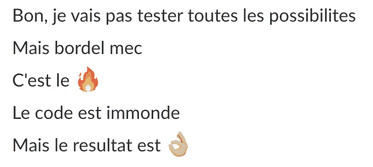
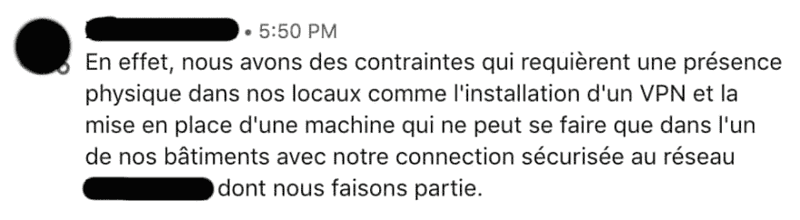
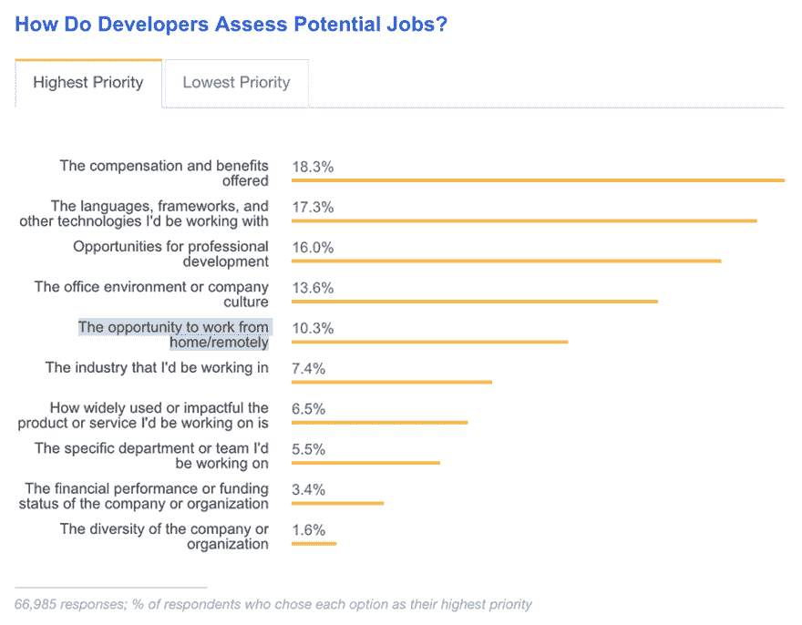
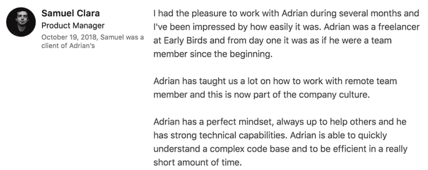

# 关于远程工作的一些神话

> 原文:# t0]https://dev . to/adrantombu/一些南南合作神话远程工作 52bd

# 关于远程工作的一些神话

> 第二个会让你大吃一惊🤓

自从我 2014 年开始自由职业生涯以来，我几乎只执行过几次远程办公任务，只有少数例外:一次是在我家坐 10 分钟车的公司，另一次是在我租用办公室的大楼。

因此，我在法国各地(甚至是美国)的公司工作了几个月，却没有与他们的领导人或员工有任何实际接触，这种情况屡见不鲜。你知道吗？**这从来没有提出过任何问题！**

全球有数以百计的公司使用分散在全球各地的远程团队“T1”，并有多个不同时区，其中包括 Amazon、Dell、Salesforce、Adobe、Xerox、SAP、Sodexo，……所有这些公司都成功地与“T2”集成不需要魔法，只要一点组织就够了！

[T2】](https://res.cloudinary.com/practicaldev/image/fetch/s--JG2J1QIP--/c_limit%2Cf_auto%2Cfl_progressive%2Cq_66%2Cw_880/https://blog.otso.img/2018-10-17-quelques-mythes-sur-le-travail-en-remote/rangement-magique.gif)

下面是一些关于远程工作的最常见的神话:

## 1。我们的生产力不如真正的办公室

我首先指出这一点，因为它是“T1”远程办公中最常见的错误观念之一。这种神话的前提是，只有在同事们的实际包围下，我们才能真正做得好，这样我们才不会被诱惑去做别人付钱做的事情。

但是，当你的同事们在开放空间聊天时，当业务开发人员的电话不停地响时，或者当开发人员在你面前像病人一样在他美丽的机械键盘上打字时，你该如何提高工作效率呢？

[T2】](https://res.cloudinary.com/practicaldev/image/fetch/s--bHW-E1yQ--/c_limit%2Cf_auto%2Cfl_progressive%2Cq_66%2Cw_880/https://blog.otso.img/2018-10-17-quelques-mythes-sur-le-travail-en-remote/taper-clavier-violent.gif)

**这些每天浪费的时间**在一直迟到(通过时)的 RER A 中，这个因旅行事故而堵塞了 20 分钟以上的破地铁，还是这些公里的堵塞终于通过了外围设备呢？这明显无助于**在安静的环境下上班**，在回家的路上又增加了一点压力。

本人从**的自由冒险一开始就站在一边，从我家租车最多 5 分钟**。我住在诺曼第的时候在一家公司的苗圃里有一个很棒的办公室。我现在在艾威龙峡谷外的一个风景秀丽的 occitanie 村的大街上有一个小办公室。这是我把个人生活和工作生活分开的一种方式，从而尽量减少分心(例如家务、编织、阅读、猫的留言……)。

其他远程办公人员将会完全满足于自己家中的专用办公空间，其中最重要的是“T0”为自己创造一个工作空间，让自己感觉良好！

## 2。我们不能合作

当我说我只在远程工作时，这是我最常听到的第二个借口。在集体想象中，一只**远程工作者是一只孤独的熊，在洞穴底部**工作，从事不需要协作的无关紧要的项目。

[T2】](https://res.cloudinary.com/practicaldev/image/fetch/s--EgjXRckD--/c_limit%2Cf_auto%2Cfl_progressive%2Cq_auto%2Cw_880/https://blog.otso.img/2018-10-17-quelques-mythes-sur-le-travail-en-remote/linkedin-pas-de-remote.png)

如今，有一种**多种工具可实现高质量的远程协作工作**:

*   支尔格或[treello](https://trello.com/)用于项目管理
*   [汇合](https://www.atlassian.com/software/confluence)用于 wiki 形式的公司文件
*   [Github](https://github.com/) 或 [Gitlab](https://about.gitlab.com/) 用于团队开发和代码审查通过拉式请求
*   [缩放](https://zoom.us/)、[【Skype】](https://www.skype.com/en/)、[呼叫](https://appear.in/)进行视频会议
*   非常有名的[【slack】](https://slack.com/intl/fr-fr/)用于同事间的讨论
*   那封令人尊敬的邮件(是的，它仍然有用！）

我当然还忘了很多(请在评论中注明！)，但这些是我最常使用的服务，而且“”涵盖了远程团队协作过程中遇到的广泛需求。

[T2】](https://res.cloudinary.com/practicaldev/image/fetch/s--yKL607yI--/c_limit%2Cf_auto%2Cfl_progressive%2Cq_auto%2Cw_880/https://blog.otso.img/2018-10-17-quelques-mythes-sur-le-travail-en-remote/conversation-slack.png)

如果你不想要远程工作人员，因为你确信它在日常生活中是不可管理的，**问你自己——而是你能否改进你的团队**的组织，使这种整合成为可能！

## 3。我们不能交换敏感信息

我有时不得不拒绝非常有趣的第一次任务，因为我被要求前往巴黎执行任务。

让我给你一个关于前往法国宇宙中心的小概念:

*   离我家最近的车站离乡间小路 20 分钟唯一路过的公共汽车是学校的交通工具。

*   车站附近没有安全的停车场让我的车在那里停留几天

*   抵达巴黎的唯一列车是往返法国中部最偏远的各个角落(gourdon、Souillac、bris-la-Gaillard，仅举几个例子)的往返列车，到达奥斯特里茨火车站需要 6 个多小时。

*   只需坐地铁/地铁/火车就能到达客户的场地。

*   然后逆来顺受地回去！

[T2】](https://www.youtube.com/watch?v=tbNlMtqrYS0)

简而言之，对于为期一天的登机服务，我将收取 2 天以上的交通费、住宿费和伙食费，这是**甚至不用开始计算在客户办公室花费的时间**。我们不会撒谎，这不一定对他很有趣我得承认，当一切都可以远程完成的时候，我也很开心！

[T2】](https://res.cloudinary.com/practicaldev/image/fetch/s--Vi_d6bxs--/c_limit%2Cf_auto%2Cfl_progressive%2Cq_auto%2Cw_880/https://blog.otso.img/2018-10-17-quelques-mythes-sur-le-travail-en-remote/linkedin-contraintes-vpn.png)

那我们怎么办？通过 Slack 或电子邮件发送清晰的密码肯定不是最高级别的安全性。这就是**【不对称密钥密码】**(我在文章[中谈到了与旅鸽一起解释的 http】](https://dev.to/adriantombu/le-https-explique-avec-des-pigeons-voyageurs-45hm-temp-slug-7796139))，以及著名的 GPG 密钥发生的地方！

我不会给你上这方面的课程，但要做到这一点，只需向您的客户提供一个公共密钥，让客户在发送敏感数据之前对其进行加密。你只需要用你的私人钥匙破解密码就行了！

请注意，同样的原则用于签署其承诺，以证明您是开发发送代码的人。

[T2】](https://res.cloudinary.com/practicaldev/image/fetch/s--XGImEpc---/c_limit%2Cf_auto%2Cfl_progressive%2Cq_auto%2Cw_880/https://blog.otso.img/2018-10-17-quelques-mythes-sur-le-travail-en-remote/github-css-commit.png)

对于技术不太熟练的客户，也有一些简单易用的解决方案，例如密码管理器(“T1 密码”或“T2 负荷工作”，仅举几个最著名的例子)，这些解决方案可以很容易地共享敏感数据，并提供足够强大的工作权限管理

## 4。我们是孤独和不幸的

从来没有想象过像**这样的远程工作者是一个社会上不适合的人**，他被关在一个黑房间里，戴着头盔躺在耳朵上，呆在泡沫中(帽衫的小额奖金)，而且只会向唯一能够带给他短暂快乐的人敞开心扉

[T2】](https://res.cloudinary.com/practicaldev/image/fetch/s--jqPUkV8i--/c_limit%2Cf_auto%2Cfl_progressive%2Cq_66%2Cw_880/https://blog.otso.img/2018-10-17-quelques-mythes-sur-le-travail-en-remote/pizza-lover.gif)

在现实生活中，**远程工作者是和大家一样的人**(如果，我向你保证！)！

在 stack overflow 2018 年对世界各地开发人员进行的调查中，远程工作的可能性甚至是最受欢迎的福利之一。，他们越来越多地寻求通过职业选择提高生活质量。远程办公使得**更容易调整自己的日子**，以应对日常生活中的细微变化(送孩子上学、在政府办公时间外出旅行、快速跑步等)。页:1。**远程工作人员，能够更轻松地处理个人需求，最终更快乐、更有生产力！**

[T2】](https://res.cloudinary.com/practicaldev/image/fetch/s--U-DehPRt--/c_limit%2Cf_auto%2Cfl_progressive%2Cq_auto%2Cw_880/https://blog.otso.img/2018-10-17-quelques-mythes-sur-le-travail-en-remote/sondage-developpeurs-stackoverflow.png)

此外，**在家工作有不同的替代方式**可以改变环境，看到新的人头！现在，每个城市都有**多个协作室**，可以在这里结识新的人，讨论中午的天气或咖啡休息时间。也有可能在图书馆或咖啡厅工作，越来越多的人使用高质量的电源插座和 wi-fi 为员工提供专用的角落。

## 5。我们光着身子在沙发上干活

为什么不呢？重要的是**要在能够产生生产力的环境中工作**！在阳台上穿着内裤或者在浴缸里光着身子也不会妨碍你正常工作。只需考虑为 visio 穿上最起码的衣服-同事会议；-什么

[T2】](https://res.cloudinary.com/practicaldev/image/fetch/s--yELIMIGR--/c_limit%2Cf_auto%2Cfl_progressive%2Cq_66%2Cw_880/https://blog.otso.img/2018-10-17-quelques-mythes-sur-le-travail-en-remote/homme-nu-lit.gif)

希望这篇文章能让你发现**远程工作的诸多优点**，如果你还不确信，我很乐意在评论中与你讨论！

## 结尾的小额奖金

即使我们是自由职业者，远程工作也是有效的。

[T2】](https://res.cloudinary.com/practicaldev/image/fetch/s--xHXT-Zi3--/c_limit%2Cf_auto%2Cfl_progressive%2Cq_auto%2Cw_880/https://blog.otso.img/2018-10-17-quelques-mythes-sur-le-travail-en-remote/linkedin-temoignage.png)