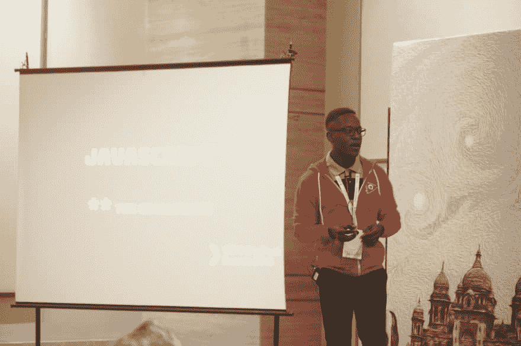

# 👋你好，戴夫·托

> 原文:# t0]https://dev . to/malgamves/hello-devto-54h 8

 
我*真的很可怕*在介绍会上如此借口过度分享！我是丹尼尔·菲里，帕鲁尔大学计算机系四年级学生，也是 GitHub 校园专家。我作为校园专家的角色包括大量参与和发布大量与社区相关的技术和非技术项目。这就是我如何帮助启动 Uniphyd 的。从技术上来说，我曾用 Python 做过数据分析，用 JavaScript 做过一些有趣的事情:p

我发这个帖子是为了与我所知道的这样一个美好的技术专业人士社区分享我希望将是一次可怕的旅程的开始，当我开始对我的目标过于放松并变得不一致时，希望他们能支持我。这基本上是让我不断学习的东西，看起来也是学习新的东西*就像我们都应该做的那样，对吗？*不做**这个**是我的一大恐惧，我希望它不会。

> 丹尼尔·马达里索·菲里[@马尔加夫斯](https://dev.to/malgamves)我最害怕的就是做太多社区工作，这让我没有时间成长为一名开发人员。
> 
> 我知道这很愚蠢🌝2018 年 9 月 14 日上午 10:14

*When will be able to edit tweets?*

* * *

 我最近刚开始在 [Hasura](https://hasura.io) 做一名开发者传道者实习生，这是一家非常棒的公司。现在，我真的对学习 Vue.js 和 GraphQL 很感兴趣，没有特别的原因，他们看起来真的很酷。我的职业目标很简单，我想从事开发者关系，因为我的社区背景使我倾向于此，也因为我对我的人民有一颗爱心(开发者❤️).也就是说，我会分享我在 Vue 和 GraphQL 项目上的进展，并承诺每周更新两次。手指交叉。

如果你看到我迷路了，请随意指引我到正确的方向。任何与我目前正在学习和/或工作的东西相关的酷资源都会很棒。我期待着网上会议，并与大家互动。