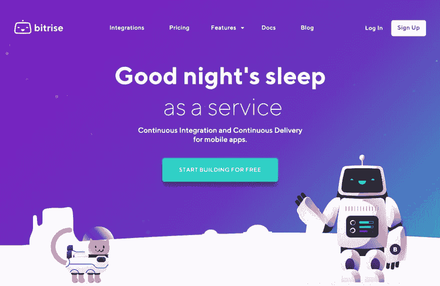
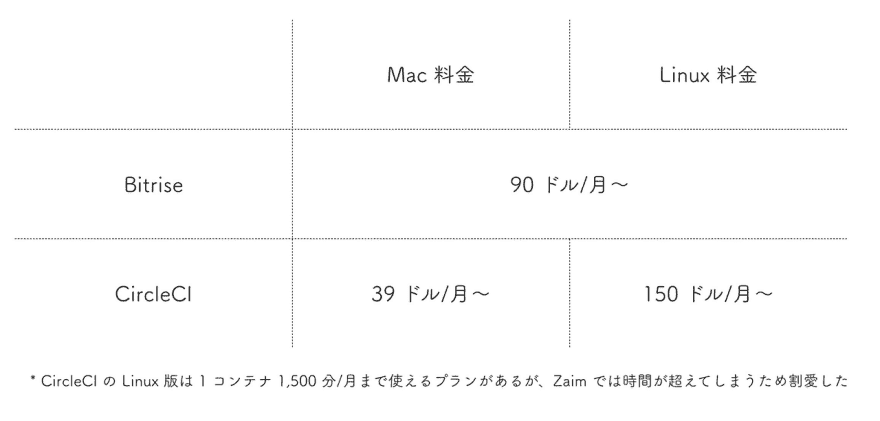
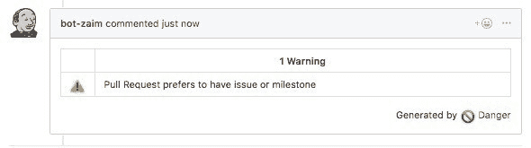
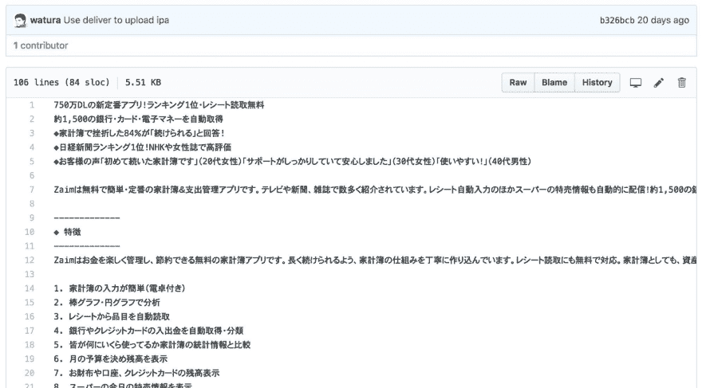

# 用 Bitrise 和 fastlane 制作的高速 CI/CD 环境#Zaim

> 原文:# t0]https://dev . to/wtr/bitrise-fastlane-cid-zaim-jp

你好吗？ 这是 Zaim 的 iOS 工程师 watura。

今天，如何在 Zaim 的 iOS 版 APP 的开发中构建和利用连续集成( ci )和连续交付( CD )系统

首先是从 CI 开始的。 目前，Zaim 的 iOS 开发以 Bitrise 和 fastlane 为中心，部分使用了 Jenkins。

 
[Bitrise -移动持续集成和交付](//www.bitrise.io)

#### 曾经的 Jenkins CI 环境中存在的三个课题

在采用 Bitrise 之前，我们只通过安装在位于局域网中的 MacBook Air 上的 Jenkins 来构建 CI 环境。 然而，这存在以下课题。

*   终端维护很麻烦
*   表演不好
*   因为无法从外部访问，所以无法通过 Github 等进行 hook

#### 采用 Bitrise 的决定性因素是多平台的费用

为了解决这些问题，我们确定需要一个可用作 SaaS 的 CI 工具，并对其进行了一些比较，最终候选对象仍是 Bitrise 和 CircleCI。

虽然功能和易用性都一样丰富，但最后的决定因素是费用体系。

Zaim 除了 iOS 版以外，还存在安卓版和网络版。 因此，作为平台，我们设想迟早会使用 Mac 以外的 CI 工具。 CircleCI 在 Mac 和 Linux 上的费用是分开的，需要单独签订合同，而 Bitrise 只需要在同一个合同内。 作为成本方面和管理方面的优点很大，选择了 Bitrise。

[T2】](https://res.cloudinary.com/practicaldev/image/fetch/s--I_A0W0YJ--/c_limit%2Cf_auto%2Cfl_progressive%2Cq_auto%2Cw_880/https://thepracticaldev.s3.amazonaws.com/i/k2n3ogp2gejlthvf11h3.jpg)

现在的话，微软采用今年春天发布的 Visual Studio App Center 也是一个办法。

#### 交给 Bitrise+fastlane(+Jenkins )的四项工作

作为 iOS 的 CI 及 CD 工作整体，使用如上所述采用的 Bitrise。

Bitrise 具有使各种动作自动化的公式步骤，几乎所有的工作都可以通过公式步骤的组合来实现。 但是，**登录 Bitrise，为了避免今后出现更好服务时无法换乘的情况，基本上这样的流程的控制使用[fastlane](//fastlane.tools) 来实现**
而且实际上，在 Jenkins 上运行的地方也只剩下一个。 我希望你早点退役，但我还在现役。

将这些工具组合起来，使以下工作自动化。

1.  运行管理员
2.  运行测试
3.  发布到深度门
4.  上传到 App Store

#### (1)执行管理员

使用 Pull Request 的简易检查工具[Danger](https://danger.systems) ，执行 Pull Request 的一次确认。

Danger 正在从旧的 CI 机器 Jenkins 启动。 Jenkins 的理由是**“Pull Request 的正文和标题有变更时，请通过在其注释栏中写入“Danger please”，让 danger 重新检查。 有**的情况，目前在 Bitrise 上做不到这一点。

例如，在 Zaim 的 iOS 版中，虽然有“一定要在 Pull Request 的标题中输入呼应的 issue 号码”的内部规则，但是这个很容易忘记。 如果任由他做的话，会被 Danger 生气如下。

[T2】](https://res.cloudinary.com/practicaldev/image/fetch/s--s8y8P5L2--/c_limit%2Cf_auto%2Cfl_progressive%2Cq_auto%2Cw_880/https://thepracticaldev.s3.amazonaws.com/i/05busej4n64zauimq378.jpg)

如果希望 Danger 可以修改标题并立即重新运行，则在尝试使用 Bitrise 时，必须推送空提交。 使用 Jenkins 的话，只需在评论栏中记述“danger please”。

[T2】](https://res.cloudinary.com/practicaldev/image/fetch/s--RZutKR-x--/c_limit%2Cf_auto%2Cfl_progressive%2Cq_auto%2Cw_880/https://thepracticaldev.s3.amazonaws.com/i/2b2flfyie1tynylcu6j0.jpg)

Danger 开始行动，变成 LGTM。 显然很方便。

[T2】](https://res.cloudinary.com/practicaldev/image/fetch/s--NFuyLbfm--/c_limit%2Cf_auto%2Cfl_progressive%2Cq_auto%2Cw_880/https://thepracticaldev.s3.amazonaws.com/i/zhqp4azginmaaeh6any8.jpg)

如果 Github 的评论有办法触发 Bitrise 的话，我也想让 Danger 成为 Bitrise。

#### (2)测试的执行

接下来是测试。 在 Bitrise 中运行单元测试和用户界面测试。 触发器是 Pull Request 和 develop 分支的更新。

我们使用 fastlane scan 来运行这些测试。 顺便说一下，即使在 Bitrise 等看不到模拟器画面的环境中，也可以运行 UI 测试。

#### (3)部署への配信

接下来是光盘的故事。 首先，我们来了解一下如何向公司内部分发生产上传前的测试用 APP。 Zaim 使用深度网关，主要发布 3 种 APP。

*   hourly :每次更新 develop 分支时分发
*   Beta:1 :每天发布一次 develop 分支
*   Inspect :分发由参数等指定的特定分支或提交

#### (4)上传到 App Store

不仅仅是公司内部测试，也想简化生产用的申请工作吧。 从最近的 2018 年 9 月开始，Zaim 才可以通过工具上传到 App Store。 整个流程变得简单了，变得非常轻松。

以前的发行工作，

1.  在 Jenkins 中为 App Store 构建
2.  下载本地构建的归档文件
3.  在 Xcode 中打开归档文件并将其上载到 App Store Connect
4.  手动写入各种元数据，如发行说明
5.  向 iTunes Connect 申请

是这样的步骤。 每个都不是很辛苦的工作。 只是，因为其间有等待的时间，所以很多时候做到一半就忘记了。

如果将其通过 Bitrise，

1.  更新存储库中的各种元数据
2.  在 Bitrise 中运行用于 App Store 的工作流
3.  向 iTunes Connect 申请

现在可以发布了。 只需要等待“在 Bitrise 上运行工作流”，之后很快就会完成。 另外，上传到 App Store 后，会收到来自 App Store Connect 的邮件，所以也不需要看 Bitrise 的画面。

作为前期准备，Github 还可以管理元数据，例如发行说明和 APP 详细信息。

[T2】](https://res.cloudinary.com/practicaldev/image/fetch/s--VkFIHiZU--/c_limit%2Cf_auto%2Cfl_progressive%2Cq_auto%2Cw_880/https://thepracticaldev.s3.amazonaws.com/i/avwvdz39hifw3pxmv41p.jpg)

话虽如此，向 DeployGate 的发布和向 App Store 的上传管理，无论是使用 CI 还是直接用 Xcode，从整体上来看都有很多麻烦的工作，权限管理也变得复杂。 例如，证书和资源调配文件是交给 Xcode，还是由开发人员和 CI 制作共同的东西，还是各自制作并管理？ 需要多少访问 Developer Portal 的权限等，有很多需要考虑的事情。

Zaim 还通过 fastlane 简化了这些部分的管理。 关于这个细节，我想在另一篇文章中进行总结。

#### 希望以进一步改善 CI/CD 环境为目标

在一系列的流程中，CI/CD 已经相当充实了，但我还想做得很好。 例如，以下情况。

*   允许从 Slack 中轻松地调用 Bitrise 的工作流
*   允许轻松部署任何分支、提交
*   允许自动更新库

通过这样的改善，我想在开发工作上腾出更多的时间，创造高效且对成员来说舒适的环境。