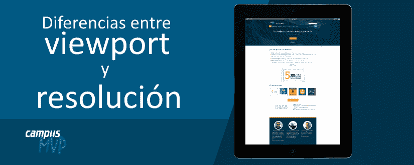
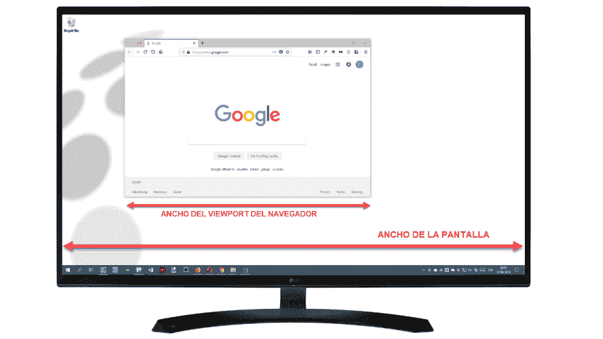
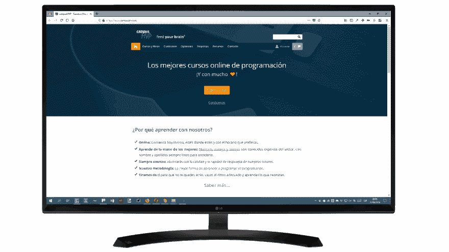
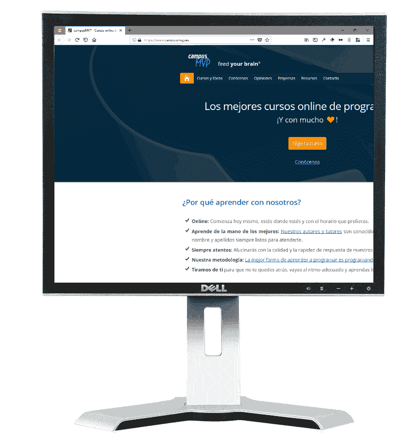
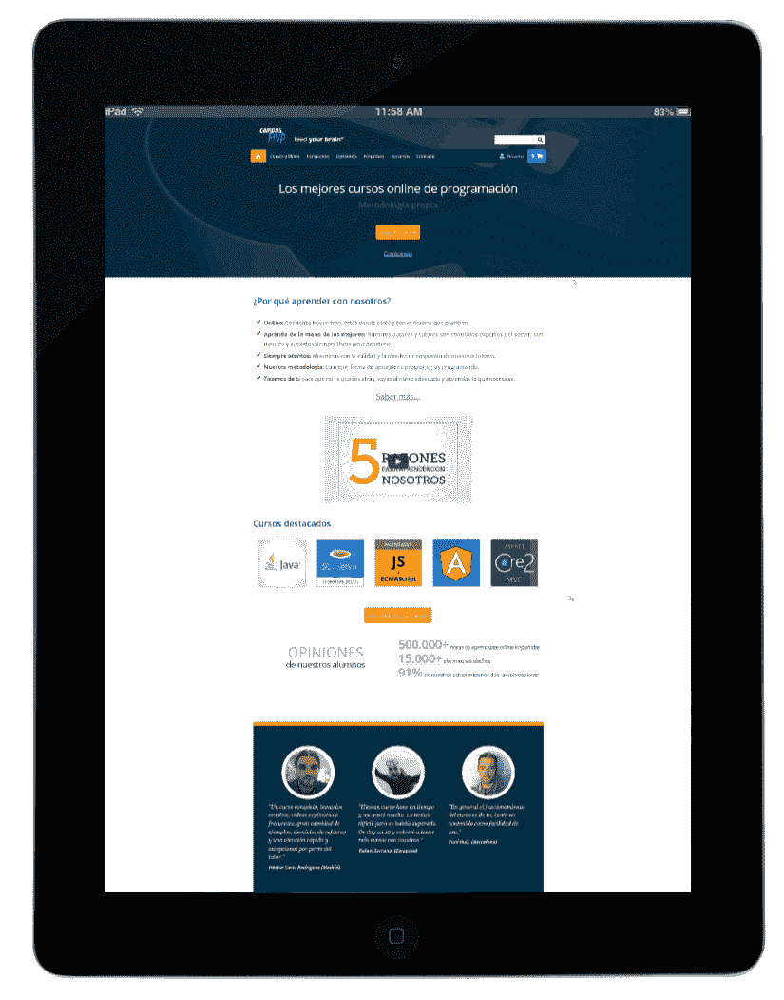
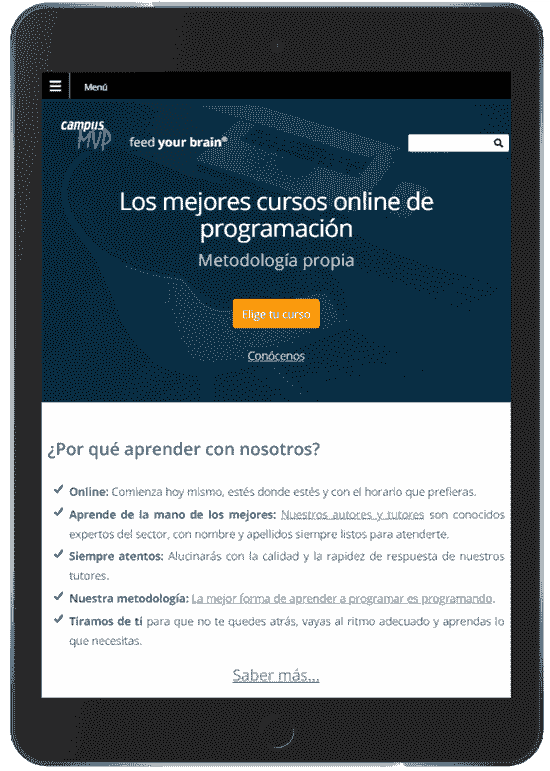

# 移动 Web 开发:设备的视口和屏幕分辨率有何区别？

> [https://dev . to/campus MVP/development-web-mvil-qu-difference-存在于-El-viewport-y-la-resolution in-screen-of-un-device-1aog](https://dev.to/campusmvp/desarrollo-web-mvil-qu-diferencia-existe-entre-el-viewport-y-la-resolucin-de-pantalla-de-un-dispositivo-1aog)之间；

**[](https://res.cloudinary.com/practicaldev/image/fetch/s--YJXksi08--/c_limit%2Cf_auto%2Cfl_progressive%2Cq_auto%2Cw_880/https://www.campusmvp.es/recursos/image.axd%3Fpicture%3D/2018/3T/Viewport-Resolucion.png)***一个设备的视口是拥有该设备屏幕的**的理论尺寸，这不一定与该设备的实际分辨率相匹配**分辨率**是指可以显示该屏幕的**像素数量**。***

 ***例如，苹果的早期 iPad 平板电脑——“t0”ipad 1 和 2，屏幕分辨率为 1024x768 像素，其‘T2’视口的默认大小完全相同(即‘T4’像素长宽比为 1x 但是，当推出已经有“视网膜”画面的‘T6’，“T8”【物理分辨率】同一时期为 2048 x 1536；***视口大小*保持不变**

> 分辨率是指该屏幕可以显示的像素数；而*视口*则是显示网页时，屏幕上的移动浏览器所模拟的像素大小。

视埠宽度通常在**CSS 像素**中称为宽度，因为它们不是实际像素，而是浏览器(及其样式表)在设计页面的*版面时实际看到的像素*

事实上，要查看浏览器的“*视口*的宽度与屏幕分辨率之间的差异，只需考虑常规的桌面环境，在这种环境中，与移动设备不同，窗口可以随意调整大小，这两个概念之间的差异非常明显:

[T2】](https://res.cloudinary.com/practicaldev/image/fetch/s--qlFOJ7_v--/c_limit%2Cf_auto%2Cfl_progressive%2Cq_auto%2Cw_880/https://www.campusmvp.es/recursos/image.axd%3Fpicture%3D/2018/3T/Viewport-Resoluci%25C3%25B3n-Escritorio.png)

事情是这样的，这对我们来说是如此自然，以至于我们甚至没有想到它。对于移动设备来说，由于它们都是全屏应用程序，**事情变得更加复杂，**因为浏览器模拟的像素宽度小于实际存在的像素宽度，并且可以显示屏幕，从而使一切看起来更好。

## 在实践中是否指这个？

这意味着，在移动设备上，屏幕确实能够显示 2048 像素宽和 1536 像素高的图像。如果你打开一张这样大小的图片，它会完美地显示出来。但是，当您在设备的移动浏览器中查看某个内容时，**可用区域“模拟”较低的屏幕分辨率**，在本例中为实际分辨率的一半，并指示页面其分辨率为 1024x768。也就是说，在这种情况下，“T2”视口小于屏幕尺寸(一半)。

## 这是干什么用的？

嗯，因为如果把全部的屏幕容量都用来显示**页面的话，会显得很小，对**也没有用。

试想一下，一个网页设计*【无响应】*的宽度为 2048px，在 FullHD+(即 2160 像素宽，稍大)分辨率的计算机显示器上看起来像寓言。就像这样：

[T2】](https://res.cloudinary.com/practicaldev/image/fetch/s--lwtkCCTY--/c_limit%2Cf_auto%2Cfl_progressive%2Cq_auto%2Cw_880/https://www.campusmvp.es/recursos/image.axd%3Fpicture%3D/2018/3T/Viewport-Resoluci%25C3%25B3n-Escritorio-2K.png)

如果您在分辨率较低的计算机(例如 1280x1024)上查看，则会出现滚动条，以便您可以移动并查看整个页面。，类似这样的事情:

[T2】](https://res.cloudinary.com/practicaldev/image/fetch/s--P94IOGwm--/c_limit%2Cf_auto%2Cfl_progressive%2Cq_auto%2Cw_880/https://www.campusmvp.es/recursos/image.axd%3Fpicture%3D/2018/3T/Viewport-Resoluci%25C3%25B3n-Escritorio-Cuadrado.png)

很不舒服，但至少你能看到那页。

现在想象一下，您在 iPad 3 屏幕上看到的是同一页，可以利用它拥有的所有分辨率，并且能够支持如此多的宽度。即**设想*视口*和 iPad 3 的分辨率具有相同的尺寸**。你会看到吗？-我...。那么**稍微小一点的东西，这样就不会让你在不做任何事情的情况下看书*【缩放】*。就像这样：**

 **[T2】](https://res.cloudinary.com/practicaldev/image/fetch/s--CiW3OeQP--/c_limit%2Cf_auto%2Cfl_progressive%2Cq_auto%2Cw_880/https://www.campusmvp.es/recursos/image.axd%3Fpicture%3D/2018/3T/Viewport-Resoluci%25C3%25B3n-iPad3.png)

以*视口*的概念来看，就像 iPad 3 屏幕，为了浏览器的目的，分辨率较低，东西会看起来更推荐、更便于管理。对于我们的假设页面，您将看到其中的一部分，您可以滚动查看其馀部分，就像在低分辨率计算机上一样，这是一件很不方便的事情，但您可以阅读。

显然，在**设计良好的网页上加上[【回应性网页设计(RWD)](https://www.campusmvp.es/recursos/catalogo/Product-Responsive-Web-Design_212.aspx)** ，将会显示得很好，因为它会检测到一定的分辨率(1024px 宽度)，从而使内容能够正确分布，并在不做任何事情的情况下以适当的大小显示每当您在平板电脑或手机上看到设计良好的移动页面时，就会发生这种情况，例如:

[T2】](https://res.cloudinary.com/practicaldev/image/fetch/s--SNY3ZxX7--/c_limit%2Cf_auto%2Cfl_progressive%2Cq_auto%2Cw_880/https://www.campusmvp.es/recursos/image.axd%3Fpicture%3D/2018/3T/Viewport-Resoluci%25C3%25B3n-iPad-Responsive.png)

其中，一切看起来都是合适的大小，而且为了更好地利用空间，还会重新分配(并隐藏)元素(虽然这与“*视口*无关，而是与 RWD 有关)。

## 在移动设备上改变*视口*的宽度

您可以使用页面标题中名为“
”的“meta”标签，为设备默认的“*”视口指定不同的宽度*

```
<meta name="viewport" content="width=device-width, initial-scale=1.0"> 
```

Enter fullscreen mode Exit fullscreen mode

在这种情况下，此标签指示浏览器要将*视口*的宽度设置为设备屏幕实际宽度的像素数。将缩放比例设定为 1.0 可避免调整内容大小以适合萤幕，这可能会导致文字太小。此外，还允许用户自由更改此比例因子。这是除特殊情况外所有网页的建议设置。

使用此标签，我们还可以设置不同于默认宽度的宽度。甚至比实际屏幕分辨率还要大。在这种情况下，*视口*将大于其大小(有点不推荐)。此外，如果存在物理分辨率低于为“*视口*申报的尺寸的设备(现在已不复存在)，效果将相同。

**总之**:重要的是要明确*视埠*和萤幕解析度的概念是独立的，一个可能大于另一个，反之亦然，它们的关系决定了网页内容在萤幕上的显示方式。*****