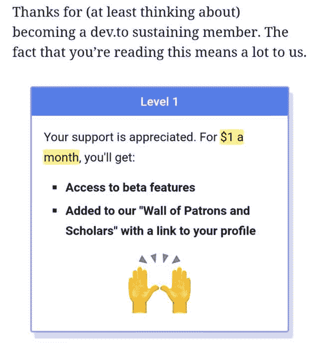

# 解锁更多开发人员功能

> 原文 https://dev.to/hugo__df/unlock-more-devto-features-245 a

你知道 dev.to 有付费会员计划吗？

我不得不挖掘 GitHub 的问题，意识到有一个问题，它解锁了 post analytics。

不是超级推广，可以在[https://dev.to/membership](https://dev.to/membership)访问。

然后只需点击以下内容:

[T2】](https://res.cloudinary.com/practicaldev/image/fetch/s--kNCgUm__--/c_limit%2Cf_auto%2Cfl_progressive%2Cq_auto%2Cw_880/https://i.imgur.com/b4k7qIy_d.jpg%3Fmaxwidth%3D640%26shape%3Dthumb%26fidelity%3Dmedium)

它解锁了一些额外的好东西(测试版功能),只需 1 美元/月，我们大多数人都负担得起。