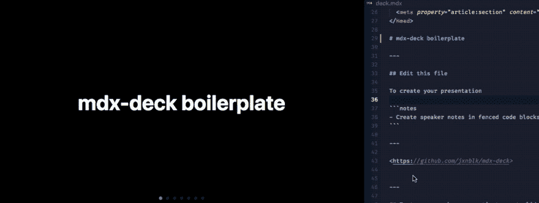

# 将 MDX-Deck 部署到网络🚀

> 原文 https://dev.to/whoisryosuke/deploy-mdx-deck-to-netlify-47hc

当我开始准备演讲和演示时，我决定升级我的幻灯片游戏，使用 React 组件📈💁‍♀️

作为一名 React 开发人员，想要在我的演示文稿中包含我工作的真实例子是很自然的事情，而 [MDX](https://github.com/mdx-js/mdx) 混合使用 Markdown 和 JSX 使这成为可能。

但我没有在 React 中构建自己的幻灯片框架，而是决定利用 mdx-deck 和 CLI 来创建 mdx 驱动的幻灯片。它使创建幻灯片组像编写 Markdown 一样简单，并提供了不可或缺的功能:

*   📝在 markdown 中编写演示文稿
*   ⚛️进口并使用 React 组件
*   💅可定制的主题和组件
*   0️⃣零配置 CLI
*   💁演示者模式
*   📓演讲者注释
*   [点击此处查看演示网站](https://dazzling-kepler-4cc40d.netlify.com/)

[T2】](https://res.cloudinary.com/practicaldev/image/fetch/s--DpgoksT8--/c_limit%2Cf_auto%2Cfl_progressive%2Cq_66%2Cw_880/http://whoisryosuke.com/mdx-deck%2520boilerplate%25203-9bdbc1b85f47dc9534799424244ca8df.gif)

为了让我的演示尽可能容易理解，我选择用 [**Netlify**](http://netlify.com) 来主持它。然而， [mdx 甲板出口文件](https://github.com/jxnblk/mdx-deck/blob/master/docs/exporting.md)缺少一些关键细节。要在 Netlify 上部署，您可以将它指向一个分发文件夹，所有静态资产都将编译到该文件夹中。我在文档中找不到导出文件夹，不得不在 CLI 的默认 Webpack 配置中找到它。

经过一番研究，我提出用 4 个步骤部署 mdx-deck(或者更少！):

## 📄设置您的项目

我只是使用了 mdx-deck repo 中提供的示例 MDX deck。我把它复制到一个新的文件夹，创建了一个新的 git repo，推送到 Github。

你可以克隆我的项目来开始。

1.  克隆项目并添加到 Github 中
2.  将回购添加到 Netlify

或者

1.  [点击此处部署以联网](https://app.netlify.com/start/deploy?repository=https://github.com/whoisryosuke/mdx-deck-netlify)

## ⚙️ Netlify settings

为了确保我们的 deck 使用持续集成正确部署，我们必须配置 Netlify 来构建和显示我们的应用程序。

转到您的部署设置(在您的 Netlify 项目/repo 中的“部署”选项卡下)并添加以下设置:

1.  将构建脚本设置为`npm run build`
2.  将部署文件夹设置为`dist`

我们给 Netlify 一个构建脚本，在每次提交回购时运行。而 deploy 文件夹是 mdx-deck 导出静态 HTML/JS 版本的地方，通过将 Netlify 指向那里，它会在构建后显示我们的 deck。

## 为什么是 Netlify？🤨

我发现自己处于一种不能立即访问开发环境(特别是节点/NPM)的情况。我想过使用类似于 [CodeSandbox](http://codesandbox.io) 的东西，但是由于我运行的是构建脚本而不仅仅是导入模块，所以它不适合 mdx-deck 这样的项目。

在 Netlify 上托管允许我利用 [Github](http://github.com) 作为代码编辑器/IDE，对我的 deck 的 repo 进行更改，并立即将这些部署到 Netlify。它给了我云中开发环境 *(on a delay)* 的力量。

这样，如果我需要对我的演讲进行快速修改，我可以通过 web 界面轻松地部署它们👏👌

[看这里的演示站点](https://dazzling-kepler-4cc40d.netlify.com/) | [源代码](https://github.com/whoisryosuke/mdx-deck-netlify)

希望有所帮助！
良

* * *

**参考文献**:

*   [mdx 甲板](https://github.com/jxnblk/mdx-deck)
*   [mdx-deck CLI(在这里可以找到默认的导出文件夹)](https://github.com/jxnblk/mdx-deck/blob/master/cli.js)