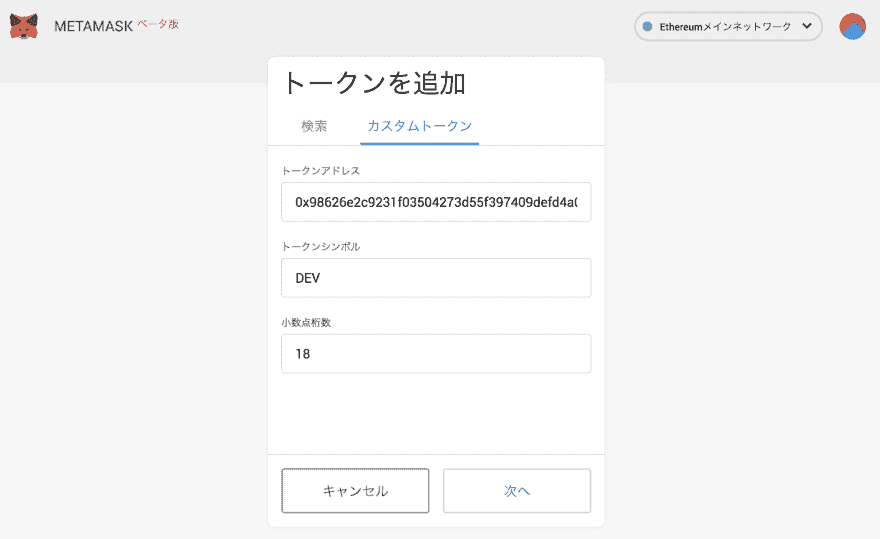
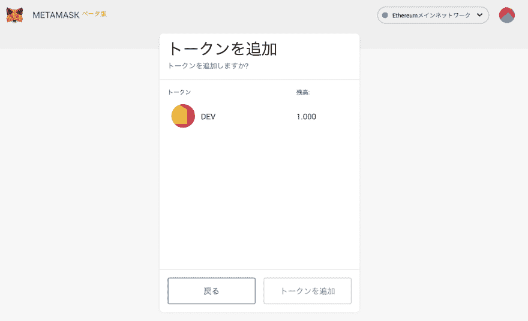

# 用 Metamask 确认 Dev 令牌的余额

> [https://dev . to/jgs/元掩码-dev-g00】的缩写形式](https://dev.to/jgs/metamask--dev--g00)

[T2】](https://res.cloudinary.com/practicaldev/image/fetch/s--0WlfakUr--/c_limit%2Cf_auto%2Cfl_progressive%2Cq_auto%2Cw_880/https://i.gyazo.com/0663e25d96c0ffd26d31415cfc778949.png)

虽然收到了 Ethrscan 的 URL，但是不太清楚如何在 Metamask 上确认 Dev 令牌的余额。

写有 Etherscan 的`ERC20(DEV)`的地方成为可以看到 Dev 令牌信息的 URL 的链接。

[https://ethers can . io/token/0x 98626 e2c 9231 f 03504273d 55f 397409 defd 4a 093](https://etherscan.io/token/0x98626e2c9231f03504273d55f397409defd4a093)

这里叫 Contract 的地方像令牌地址。

[T2】](https://res.cloudinary.com/practicaldev/image/fetch/s--6jBRgOX_--/c_limit%2Cf_auto%2Cfl_progressive%2Cq_auto%2Cw_880/https://i.gyazo.com/eedead944b380515ad9bbdcbfdc7ffce.png)

将其复制到 Metamask 的`トークンを追加`- >-`カスタムトークン`的`トークンアドレス`处

[T2】](https://res.cloudinary.com/practicaldev/image/fetch/s--sMSq0jmp--/c_limit%2Cf_auto%2Cfl_progressive%2Cq_auto%2Cw_880/https://i.gyazo.com/f2e95a660b3001937567cc3ebd73d9f2.png)

于是，令牌码元和小数点位数被补充，所以按`次へ`

[T2】](https://res.cloudinary.com/practicaldev/image/fetch/s--LNIE6kmK--/c_limit%2Cf_auto%2Cfl_progressive%2Cq_auto%2Cw_880/https://i.gyazo.com/1c175be859fc8c90162404d860e7a950.png)

也可以确认余额。 在此按`トークンを追加`时，在 Metamask 中与 Eth 一起添加名为 Dev 的项目。

[T2】](https://res.cloudinary.com/practicaldev/image/fetch/s--8nn7JsRs--/c_limit%2Cf_auto%2Cfl_progressive%2Cq_auto%2Cw_880/https://i.gyazo.com/e28ffabe3dcde9c3e92e245d38a34c99.png)

外形