# ricing 简介

> [https://dev . to/guiteixeira/introduction Cao-ao-ricing-bk 0](https://dev.to/guiteixeira/introducao-ao-ricing-bk0)

本文不是关于水稻种植中使用的新技术。相反，我将尽量简短地介绍这个问题的一些方面，并向那些已经对这个问题感兴趣但还不知道从哪里开始的人提供信息。

<figure>[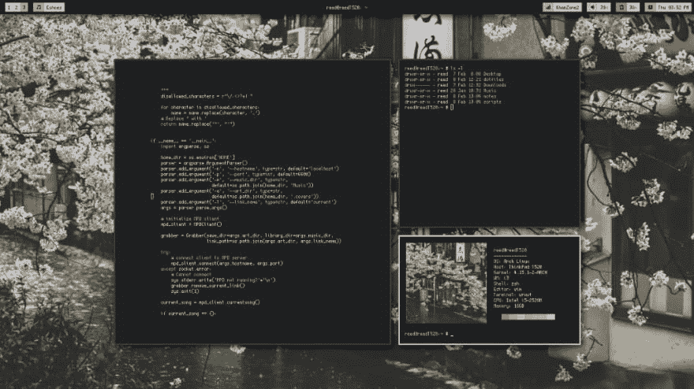](https://res.cloudinary.com/practicaldev/image/fetch/s--Qamr2faQ--/c_limit%2Cf_auto%2Cfl_progressive%2Cq_auto%2Cw_880/https://cdn-images-1.medium.com/max/1024/0%2AXraxGKyxk3ck1h0o.png) 

<figcaption>丰泰:[https://www . Reddit . com/r/UNIX born/comments/7 wyzl 1/i3 _ something _ different/](https://www.reddit.com/r/unixporn/comments/7wyzl1/i3_something_different/)</figcaption>

</figure>

#### 什么是 ricing？

ricing 一词用来描述改变某事物的行为和设计以使其更具生产力和视觉愉悦的行为。[在其原来的构想](https://www.reddit.com/r/unixporn/wiki/themeing/dictionary#wiki_rice)中，是指为了使进口的亚洲汽车看起来比实际速度更快而关爱进口汽车的行为。

> “Rice”是一个常用于指在桌面上进行视觉改进和定制的词。它继承了定制廉价亚洲进口汽车的做法，使它们看起来比实际速度更快，这也被称为“ricing”。— [/r/UnixPorn](https://www.reddit.com/r/unixporn/wiki/themeing/dictionary#wiki_rice)

当计算机开始使用该术语来表示用户对其操作系统(尤其是“[UNIX-like](http://tldp.org/FAQ/Linux-FAQ/general.html#is-linux-unix)”系统)所做的改进时，该术语已被占用。

[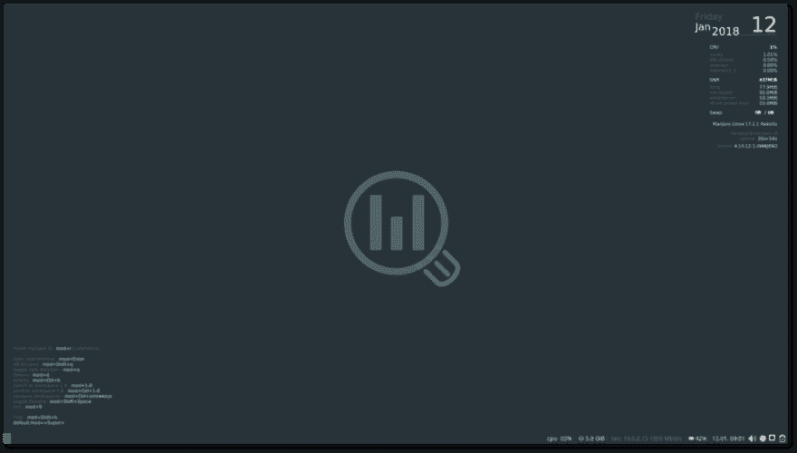T2】](https://res.cloudinary.com/practicaldev/image/fetch/s--oa2KWc0F--/c_limit%2Cf_auto%2Cfl_progressive%2Cq_auto%2Cw_880/https://cdn-images-1.medium.com/max/1024/0%2AUvzVrKrZroiJKQsP.png)

<figure>[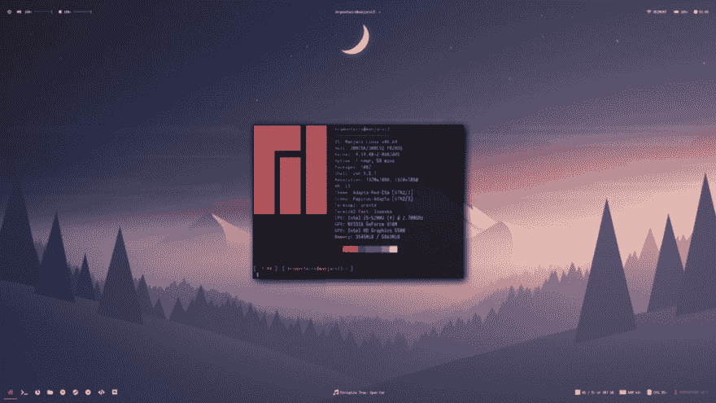](https://res.cloudinary.com/practicaldev/image/fetch/s--MRUtf6rD--/c_limit%2Cf_auto%2Cfl_progressive%2Cq_auto%2Cw_880/https://cdn-images-1.medium.com/max/1024/1%2AaRF_LXl8HzecNTRKZ2dD-A.png)

<figcaption>【manjaro i3 WM，不作任何修改】*与* Manjaro i3wm 修改(资料来源:[https://forum . manjaro . org/t/manjaro-i3-17-17)](https://forum.manjaro.org/t/manjaro-i3-17-1-1/38176)</figcaption>

</figure>

#### **Breve histórico:微软视窗**

许多人甚至在 Windows 中发现了他们对定制的偏爱。使用 Microsoft Windows 98 的用户一定记得系统在同一自定义菜单中更改窗口和图标主题的固有功能。下面的视频是一个发现，它准确地展示了它是如何工作的。

[https://www.youtube.com/embed/0TY_f0uhFZo](https://www.youtube.com/embed/0TY_f0uhFZo)

Microsoft 在后续版本中删除了此功能，但这并不意味着自定义主题的流行程度降低。曾经有一段时间，我不是玩反击和 MU，而是在下载金属专辑的同时，在下载手册中寻找 Windows XP 的主题包和图标。一切都是为了逃离传统的*蓝月亮*和*银月亮。*

但是，与此做法相关联的是一个问题，该问题超出了安装‘t0’恶意软件的风险:强烈建议您不要对 Windows 界面进行重大修改，如果进行了修改，则应始终使用还原点，因为某些软件可能会导致更改

<figure>[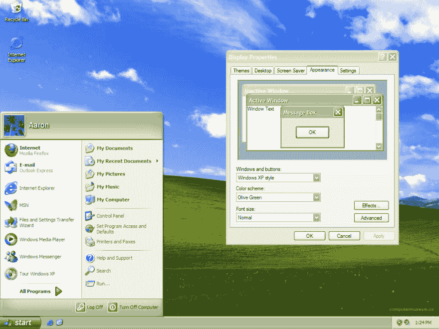](https://res.cloudinary.com/practicaldev/image/fetch/s--c8bQehO1--/c_limit%2Cf_auto%2Cfl_progressive%2Cq_auto%2Cw_880/https://cdn-images-1.medium.com/max/1024/1%2Ao-7qoKmSV8J_QdKeDpRp6Q.png) 

<figcaption>桌面 Windows XP com o tema Verde Oliva(https://warosu.org/g/thread/57392645:)。</figcaption>

T9】</figure>

我记得，在这种过渡时期，我相当执着于码头，如 nexus dock 和 [Rainmeter](https://www.rainmeter.net/) 。后一种技术使您能够在运行 Windows 的计算机上创建非常棒的台式机—而且现在仍然可以做到这一点。[超前](https://www.deviantart.com/rainmeter/gallery/12506905/Random-from-Featured)和 [Reddit](https://www.reddit.com/r/Rainmeter/) 的专用画廊到处都是不可思议的台式机。如果你从来没有听说过雨量计，很值得去了解。

#### Breve histórico: sistemas 类 Unix

<figure>[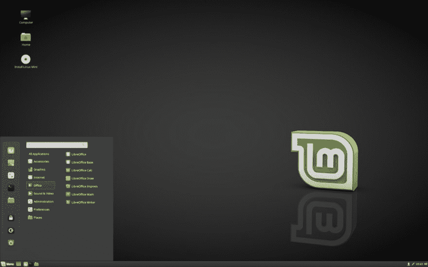](https://res.cloudinary.com/practicaldev/image/fetch/s--n94G9IyV--/c_limit%2Cf_auto%2Cfl_progressive%2Cq_auto%2Cw_880/https://cdn-images-1.medium.com/max/1024/0%2AXn0n9R0TR4MZk8nN.png) 

<figcaption>肉桂桌面环境(丰泰:[https://Linux mint-installation-guide-pt-BR . readthedocs . io/pt _ BR/latest/choose . html](https://linuxmint-installation-guide-pt-br.readthedocs.io/pt_BR/latest/choose.html))</figcaption>

</figure>

另一方面，在宇宙中*开源*的可能性以不同的方式呈现，有趣得多。此类操作系统未在[专有许可证](https://en.wikipedia.org/wiki/Proprietary_software#Examples)下分发，这一事实开创了一个新的范例。所提供的众多优势之一是出现了各种各样的**des**(*)，其中包括 Gnome、KDE 等离子体、XFCE、Cinnamon、Unity、Mate 等等虽然某些 DEs 专门设计为集成特定的发行版，例如 Linux Mint 的 Cinnamon、Ubuntu 的 Unity 和初等 OS 的 Pantheon，但由于这些操作系统在其体系结构的较低级别[上具有兼容性，因此您可以替换它们在这方面，开源系统相对于所有者的优势对于几十个基于社区的体系结构的出现至关重要，这些体系结构的功能可以满足不同类型的用户。](https://imgur.com/gallery/smipStn)*

 *有趣的是:微软和苹果目前的操作系统 Windows 10 和 MacOS 也有专用的:o’t0’metro/fluent design 和 o’T2’aqua。

<figure>[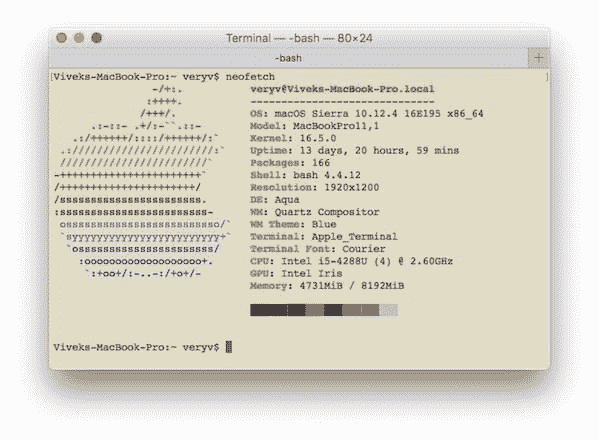](https://res.cloudinary.com/practicaldev/image/fetch/s--En6oz55E--/c_limit%2Cf_auto%2Cfl_progressive%2Cq_auto%2Cw_880/https://cdn-images-1.medium.com/max/599/1%2AQR21x6yIZSWa-ybWiJ13pw.jpeg) 

<figcaption>截屏做 MacOS Sierra。</figcaption>

</figure>

#### 桌面环境(DE) *对*窗口管理器(WM)

故事就在这里，饭也开始了。热衷于[【计算最小化】](https://wiki.archlinux.org/index.php/Arch_Linux#Simplicity)的用户选择将鼠标和图形环境的需求放在次要位置。一经应用哲学[**【kiss】**](https://pt.wikipedia.org/wiki/Keep_It_Simple)(**【k】**【eep】**【I】**【imple】**使用键盘快捷键控制应用程序可显着提高性能和工作效率。这就是为什么，如果你仔细看的话，贴在 [r/UnixPorn](https://www.reddit.com/r/unixporn/) 上的大部分桌面截图窗口并没有那么传统的最小化、最大化/还原和关闭按钮。**

 **从系统中删除时，其馀的是您的窗口管理器(英文版为“*窗口管理器”*)。**视窗管理员**(或 WMs)负责控制开启应用程式视窗的行为与格式，这一事实使其足以满足具有捷径的最小化使用者的需求。你可能已经猜到了，有不同类型的 WMs 可以满足不同的需求和兴趣。

<figure>[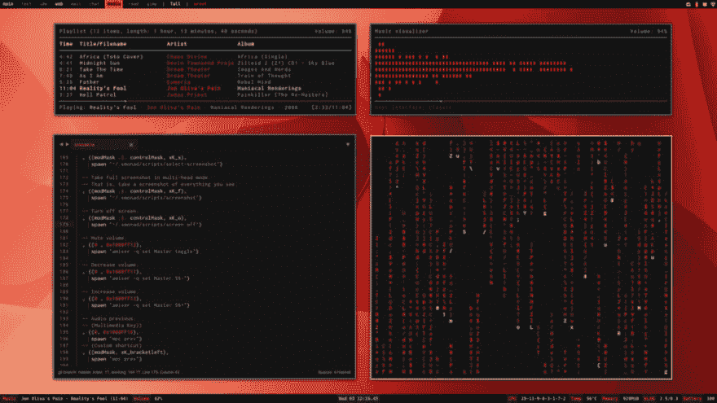](https://res.cloudinary.com/practicaldev/image/fetch/s--UplZ_wVD--/c_limit%2Cf_auto%2Cfl_progressive%2Cq_auto%2Cw_880/https://cdn-images-1.medium.com/max/1024/0%2AL91UrlLp9wKf8cP_) 

<figcaption>无装饰窗户。(资料来源:[【https://www . Reddit . com/r/unixporn/comments/6 xfsi 4/xmonad _ old _ desktop/](https://www.reddit.com/r/unixporn/comments/6xfsi4/xmonad_old_desktop/))</figcaption>

</figure>

#### **窗口管理器**

有三种类型的窗口管理器:堆栈(或 floating)、tile 和 dynamic。让我们简单谈谈他们。

**堆叠**(或**浮动**是最传统的，如 Windows、MacOS 和大多数 unix 操作系统中的传统。窗口的行为是浮动的，并且它们的默认行为可以在屏幕上的所有可用工作空间中自由地相互复盖。这种行为的最好例子是 Windows 中的 modo 和 lado a。在 ricing 的爱好者中，目前这种类型的世界杯最受欢迎的是。

<figure>[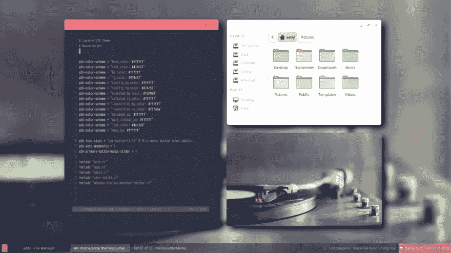](https://res.cloudinary.com/practicaldev/image/fetch/s--dbHPPxKQ--/c_limit%2Cf_auto%2Cfl_progressive%2Cq_auto%2Cw_880/https://cdn-images-1.medium.com/max/1024/0%2AeBbQKqQGB0mcmGQ4.jpg) 

<figcaption>Openbox，um 浮动 WM。https://github.com/addy-dclxvi/almighty-dotfiles#openbox:[丰泰——黑胶](https://github.com/addy-dclxvi/almighty-dotfiles#openbox--vinyl)</figcaption>

</figure>

**的工作方式与堆叠的主要行为相反。在这些窗口中，窗口将始终打开，而不是浮动，并占用所有可用的屏幕空间。如果打开另一个窗口，则两个窗口将在垂直轴和水平轴上争夺空间，而不会相互重叠。这种特性取代了通过工作空间导航在窗口之间切换焦点的做法，而自定义的键盘快捷键总是以提醒的方式简化了这种做法。Alt+Tab(和)将被缩进。**

 **<figure>[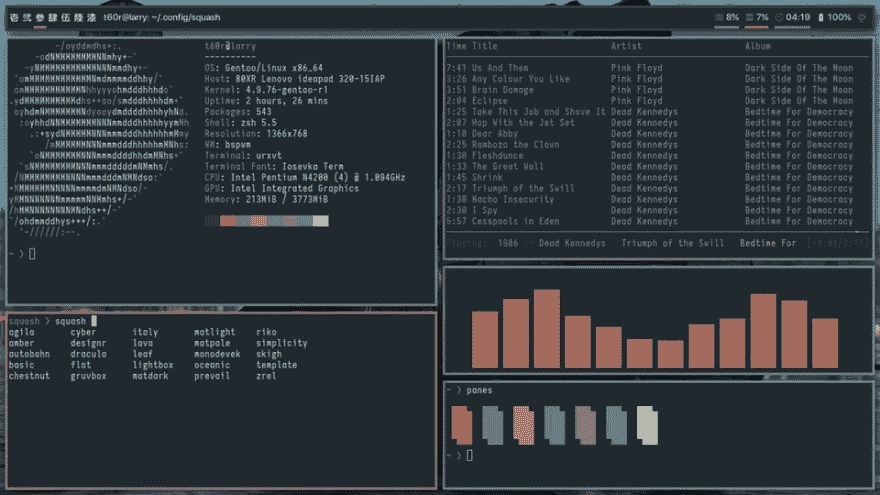](https://res.cloudinary.com/practicaldev/image/fetch/s--V2EoBkIU--/c_limit%2Cf_auto%2Cfl_progressive%2Cq_auto%2Cw_880/https://cdn-images-1.medium.com/max/960/0%2AtA_Ys-2t12zeuNyp) 

<figcaption>bspwm，um 平铺 wm。丰泰:[https://www . Reddit . com/r/UNIX born/comments/8nh 112/bs PWM _ emerged _ my _ rice _ this _ time/](https://www.reddit.com/r/unixporn/comments/8nh112/bspwm_emerged_my_rice_this_time/)</figcaption>

</figure>

早就把上述两种模式结合起来了**动力**正是为了那些不想放弃这两种模式的人。它们可以在固有模式之间切换，这与 tile 不同，后者将浮动窗口视为例外。

<figure>[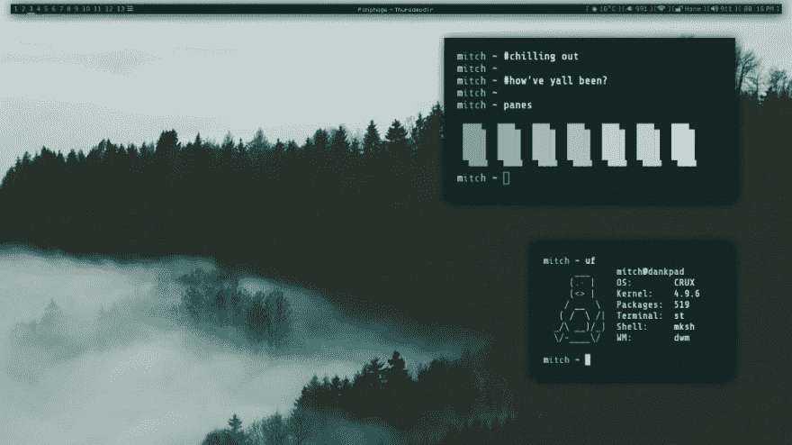](https://res.cloudinary.com/practicaldev/image/fetch/s--ZvxDCrPw--/c_limit%2Cf_auto%2Cfl_progressive%2Cq_auto%2Cw_880/https://cdn-images-1.medium.com/max/1024/0%2AfqcRK0ao-DZMH51B) 

<figcaption>dwm，一个动态世界杯。资料来源:[【https://www . Reddit . com/r/unixporn/comments/8 qlabw/dwm _ chiled _ out _ greens/](https://www.reddit.com/r/unixporn/comments/8qlabw/dwm_chilled_out_greens/)</figcaption>

</figure>

#### 巴罗斯

ricing 做法的另一个常见特征是自定义条形。因为它不可能不同，所以每个自定义桌面都有一个具有独特视觉外观的栏。[在这里](https://github.com/ricebr/Not-A-Bloat/blob/master/ricing/awesome-ricing.md#barspanels)你会找到一份最常用的清单。在我目前使用的位置，[poly；](https://github.com/jaagr/polybar)您可以将模组指派给位置，】，并手动设定所有显示内容的每一个细节。以良好的文档为基础，您可以(甚至建议)从零开始配置条形。这种做法使您可以充分自由地探索每条条形提供的所有可能性，从而使您能够按照自己喜欢的方式构建操作系统接口的这一关键元素。

#### 最后考虑事项

无论您选择哪种设置，用户查看计算机的方式都有显着的变化，但由于可用的图形界面急剧减少，所有重要设置都是通过文本文件中的代码行完成的。

例如，我的设置由【T3 WM】和 [Polybar](https://github.com/jaagr/polybar) 组成，在 [Manjaro Linux 社区版](https://manjaro.org/)中运行。几个人提到他们的表现以及使用整个工作区而不是浮动窗口的优点后，我决定尝试一下。我可以肯定地说，在您体验过 Gnome 2、Unity、kill、Pantheon、Cinnamon、Gnome 3、DDE 和 KDE 之后，i3 是迄今为止最适合我的窗口管理器。它使用 Vim 导航键，只需使用键盘即可轻松地在窗口之间导航和操作。i3wm 自身、Vim 和其他项目的这种行为最终建立了一个连贯、快速、实用、高效和愉悦的生态系统。

在每天刊登在 [/r/Unixporn](https://www.reddit.com/r/unixporn/) 上的*打印屏幕*中，提到了其他各种窗口管理器和桌面环境，这对那些对尝试制作米饭感兴趣的人和已经适合的人都有启发作用。看到那里张贴了这么多漂亮的台式机，我享受了寒假的空闲时间，开始学习了。反复认定□是不能再错了。

<figure>[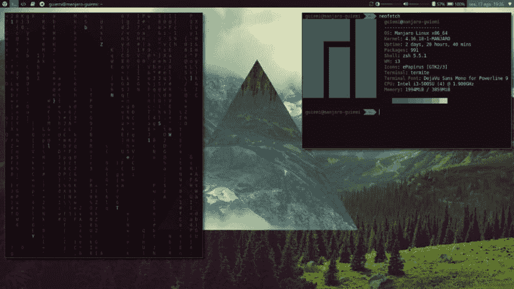](https://res.cloudinary.com/practicaldev/image/fetch/s--amRMpELS--/c_limit%2Cf_auto%2Cfl_progressive%2Cq_auto%2Cw_880/https://cdn-images-1.medium.com/max/1024/1%2AaD7NWE1RkiNHnDVrClwSJQ.png) 

<figcaption>Meu 桌面 atual。</figcaption>

</figure>

这篇课文非但没有成为某种教程的目的，反而旨在向好奇的人介绍这一主题。比文本本身更重要的是下面的链接参考，尤其是第一个:Rice BR 的 GitHub。在那里，我们收集了大量的信息来源，以指导我们如何重新创建、最小化计算和信息安全。

**如果你喜欢这篇课文，别忘了给 50 鞭。这是一个小小的姿态，帮助这个博客接触更多的人！:)**

#### 参考资料:

https://github.com/ricebr 的阿桂·德·赖斯

Ricing Linux 的基础:[http://sherylman.com/blog/basics-of-ricing](http://sherylman.com/blog/basics-of-ricing)

窗口管理器(archwiki):[https://wiki . archlinux . org/index . PHP/window _ manager _ % 28 葡萄牙语% C3 % AAS % 29 # window _ manager _ list](https://wiki.archlinux.org/index.php/Window_manager_%28Portugu%C3%AAs%29#Lista_de_gerenciadores_de_janela)

大米的定义(英文):[https://www . Reddit . com/r/unixporn/wiki/themen/dictionary # wiki _ rice](https://www.reddit.com/r/unixporn/wiki/themeing/dictionary#wiki_rice)

什么是 unix-like 系统(英文):[http://tldp . org/FAQ/Linux-FAQ/general . html # is-Linux-UNIX](http://tldp.org/FAQ/Linux-FAQ/general.html#is-linux-unix)

官方气象站:[https://www.rainmeter.net/](https://www.rainmeter.net/)

/r/雨量计:[https://www.reddit.com/r/Rainmeter/](https://www.reddit.com/r/Rainmeter/)

雨量计(DeviantArt):[https://www . DeviantArt . com/rainmeter/gallery/12506905/Random-from-Featured](https://www.deviantart.com/rainmeter/gallery/12506905/Random-from-Featured)

winstep Nexus Dock:[https://www.winstep.net/nexus.asp](https://www.winstep.net/nexus.asp)

软件所有者:[https://en.wikipedia.org/wiki/Proprietary_software#Examples](https://en.wikipedia.org/wiki/Proprietary_software#Examples)

抽象(编程语言):[https://img ur . com/gallery/smipstn](https://imgur.com/gallery/smipStn)

Aqua(桌面环境):[https://en . Wikipedia . org/wiki/Aqua _(用户界面)](https://en.wikipedia.org/wiki/Aqua_(user_interface))

流畅的设计(桌面环境):[https://www.microsoft.com/design/fluent/](https://www.microsoft.com/design/fluent/)

菲洛西菲亚之吻(简单点，笨蛋):[https://pt.wikipedia.org/wiki/Keep_It_Simple](https://pt.wikipedia.org/wiki/Keep_It_Simple)

简单原则(Arch Wiki):[https://wiki.archlinux.org/index.php/Arch_Linux#Simplicity](https://wiki.archlinux.org/index.php/Arch_Linux#Simplicity)

barras(rice br):[https://github . com/rice br/Not-A-float/blob/master/ricing/awesome-ricing . MD # barspanels](https://github.com/ricebr/Not-A-Bloat/blob/master/ricing/awesome-ricing.md#barspanels)

i3wm:[https://i3wm.org/](https://i3wm.org/)

波利巴:[https://github.com/jaagr/polybar](https://github.com/jaagr/polybar)

* * ******