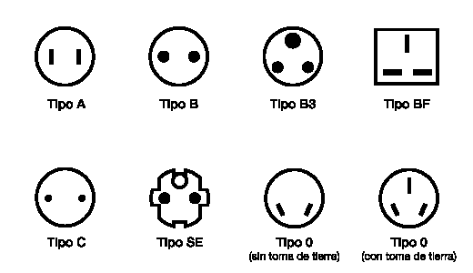
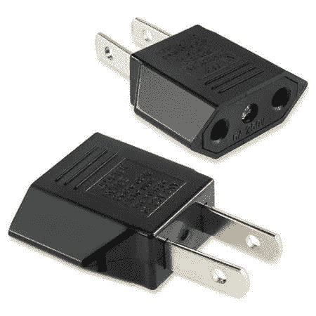

# 一个控制全部的界面:适配器模式

> [https://dev . to/missing SNC/una-interface-to-control them-a-all-patron adapter-46 o 1](https://dev.to/mangelsnc/una-interfaz-para-controlarlos-a-todos-patron-adapter-46o1)控制它们

 

<figcaption>这种虫子已经实行了数百万年的模式</figcaption>

按照[系列设计模式](https://dev.to/mangelsnc/patrones-de-diseno-de-software-1lk5-temp-slug-6227082)今天我们将看到结构模式**模式适配器。**

### 导言

作为良好的结构图案，适配器图案的作用与对象之间的交互方式有关。

为了稍微解释一下你的工作，最好考虑一下日常用品，例如插头适配器。我们都知道欧洲插头和美国插头的插头是不同的，不仅如此，还有很多其他类型的插头:

 

<figcaption>不同类型的锁骨</figcaption>

当我们到美国旅行时，手机上的电池没电了，我们决定充电时，如果我们没有事先警告，并且带了欧美适配器，我们可能会大吃一惊:

 

<figcaption>欧美适配器</figcaption>

有了这个小仙人掌，我们就可以把手机充电了。这个小装置完美地展现了图案:

1.  介面卡平面针脚代表已知介面。
2.  黑色部分表示将使不匹配项(充电器插头)按预期方式工作的适配器类。

当然，这一切都是可能的，因为两个插头(美国和欧洲)都有相同或相似的功能，即传导电流。

### 实施实例

这种模式的实施相当简单，只需遵循几个简单的步骤:

1.  **识别演员:**这将是确定谁是顾客和谁是甲方
2.  **设计一个通用界面，**一个面向客户的界面，所有未来适应的都可以实现。
3.  **创建实现此接口的适配器。**这将对每一方进行调整。每个适配器都将包含一个定制类的实例，并使用它来适应新接口。
4.  **我们把顾客从具体的班级里解出来。**从现在开始，您将收到实现新接口的任何对象，而不是接收特定类。

下面我们来看一个示例，说明在一个或多或少现实的情况下如何实现此模式。

假设在我们的项目中，我们需要不断实现我们所做的一切，这不仅适用于一种类型的记录器，而且适用于多种记录器，具体包括三种类型:

*   **文件记录器:**将日志写入本地文件。用于记录日志的方法是 addLine，它将字符串作为参数。
*   **数据库记录器:**将日志作为表中的记录写入数据库。用于记录日志的方法是 insertRecord，它将字符串作为参数。
*   **网络记录器:**将日志发送给第三方服务机构，该服务机构随后向我们展示带有非常粗糙的仪表板和图表的报告。用于记录日志的方法是 sendLog，它将 LogLine 类型的对象作为参数接收。

另一方面，我们有一项服务使用下列其中一项记录服务: