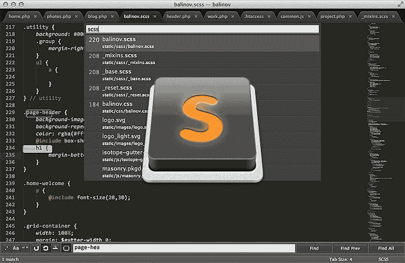
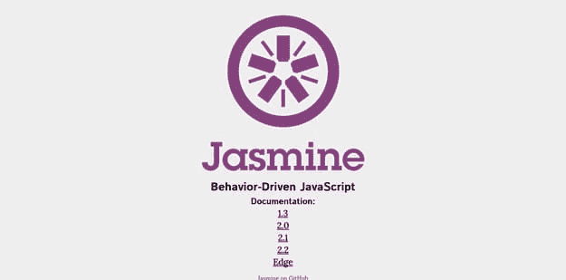
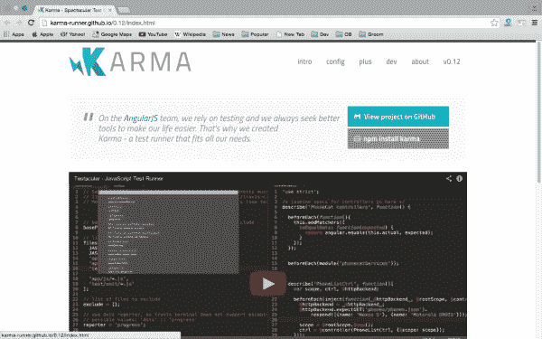
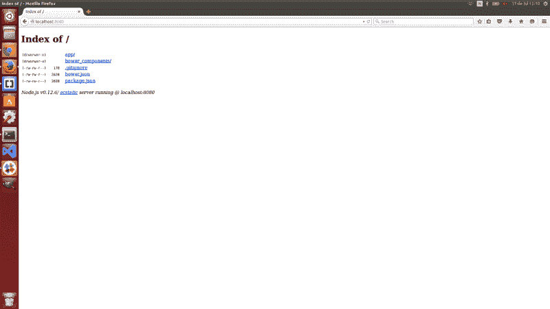

# 阿桂绝对完整

> [https://dev . to/fellipecouto/how-working-com-angular jso-guide-absolute-complete-ko](https://dev.to/fellipecouto/como-trabalhar-com-angularjso-guia-absolutamente-completo-ko)

阅读时间: <small>9 分钟</small>

[T2】](//app.vulpi.com.br/dev?utm_source=blog&utm_medium=eu_sou_dev)

动机

目前有各种 JavaScript 的 *框架* 。那你为什么要和 angularjs 而不是其他人合作？

## 调制

模块化简化了应用程序的开发、配置，最重要的是，简化了应用程序测试。angularjs 附带了一种“t1”*依赖注入机制，例如，它将把把它的应用分成小模块的任务转变成一些琐碎的事情。*

 *## **双向数据绑定**

安圭拉人最具争议的特征之一是 [*【双向数据绑定】*](https://docs.angularjs.org/guide/databinding) 。虽然它很有用，也是“T6”框架初期成功的主要因素之一，但如果使用不当，可能会出现完美无缺的问题。

## 可扩展性

使用[指令](https://docs.angularjs.org/guide/directive)延伸 HTML，是*功能*最不可思议的*框架*。指令是修改和操作 [DOM](https://developer.mozilla.org/en-US/docs/Web/API/Document_Object_Model) 的强大工具，并且在整个应用中具有重用性。

工具

#### 崇高的文本

#### 

#### 使用 angularjs 开发应用程序最常用的编辑器仍然是*【高端文字】* 。除了重量轻、使用方便之外，它还有一个专用于[的](//www.eusoudev.com.br/dot-net-core/) [*【插件】*](http://weblogs.asp.net/dwahlin/using-the-angularjs-package-for-sublime-text) 套装。

#### 茉莉

#### 

#### *【茉莉】* 设计用于[【BDD】](http://blog.concretesolutions.com.br/tag/bdd/)(*【行为驱动型开发】*)，但通常用于 angularjs 的单元测试和[【TDD】()](//www.eusoudev.com.br/tdd/)

#### 因果报应

#### 

#### [*业力*](http://karma-runner.github.io/0.12/index.html) 是一种*【test runner】*为 angularjs 制作的(尽管目前可以与其他*框架* [JavaScript](//www.eusoudev.com.br/javascript/) 。*业力*的主要目的是通过简单的命令，在各种*浏览器*中实现测试自动化。优点之一是它支持各种类型的测试，例如:统一性、集成性和 *E2E* 。

#### 凉亭

#### 

#### 作为“T6”Twitter 的开源项目*创建的*bower*T3】旨在方便在 *web 项目中使用图书馆和软件包甚至可以，[开发自己的包，并轻松地将其分发到不同的项目](http://briantford.com/blog/angular-bower)。**

#### 咕哝

#### 

#### 在许多情况下，我们开发人员面临着可以轻松实现自动化的重复性任务。这时 o**就进来了。它用于:、[*【lining】*【JavaScript】](http://www.jslint.com/)**的生成。****

 ***应用实例**

设置

为了开始我们的设置，我们需要安装 *Bower* 。假设您已经安装 NPM，我们只需要:

```
$ npm install -g bower
```

现在，创建一个名为“**app-示例”(**)的文件夹，进入该文件夹并创建一个配置文件“*bower”*:

```
$ mkdir app-exemplo
$ cd app-exemplo
$ bower init
```

接受所有的默认值，而您的 *bower.json* 应接近:

```
/// bower.json
```

```
{
  "name": "app-exemplo",
  "version": "0.0.0",
  "authors": [
    "Matheus Lima <matheusml90@gmail.com>"
  ],
  "license": "MIT",
  "ignore": [
    "**/.*",
    "node_modules",
    "bower_components",
    "test",
    "tests"
  ]
}
```

现在，为了安装*，我们必须加上*【bower】*的依存关系。要执行此操作，只需键入:*

```
$ bower install --save angular
```

请注意，已创建名为“*bower _ components*”的文件夹。在此文件夹中，您将看到“*bower”*的所有依存对象。
此外，*bower . JSON*文件自动修改。就像这样:

```
/// bower.json
```

```
{
  "name": "app-exemplo",
  "version": "0.0.0",
  "authors": [
    "Matheus Lima <matheusml90@gmail.com>"
  ],
  "license": "MIT",
  "ignore": [
    "**/.*",
    "node_modules",
    "bower_components",
    "test",
    "tests"
  ],
  "dependencies": {
    "angular": "~1.4.3"
  }
}
```

强烈建议将文件夹“*”bower _ components“*”添加到“*”中。gitignore“*”。要执行此操作，只需首先创建文件:

```
$ touch .gitignore
```

在中。 *gitignore* ，我们需要这样离开他:

```
/// .gitignore
```

```
bower_components
```

现在，我们需要从我们的应用程序中创建‘t0’index . html’:

```
$ mkdir app
$ cd app
$ touch index.html
```

并从中导入来自 *Bower* 的*angolajs*的挖掘文件，使该应用程序能够运行。

```
/// index.html
```

```
<html>
  <head>
    AngularJS
  </head>
  <body>
    <h1>AngularJS</h1>
    <script type="application/javascript" src="../bower_components/angular/angular.min.js"></script>
  </body>
</html>
```

我们还需要一台服务器来运行我们的应用程序，看看我们的‘t0’index . html 是否工作正常。我们将使用 NPM 可以下载的“T2”http 服务器:

```
$ npm install -g http-server
$ cd ..
$ http-server
```

现在，只要进入[【http://localhost:8080/](http://localhost:8080/)，我们就应该看到类似的东西:

[T2】](https://res.cloudinary.com/practicaldev/image/fetch/s--l5CnHgOy--/c_limit%2Cf_auto%2Cfl_progressive%2Cq_auto%2Cw_880/https://cdn-images-1.medium.com/max/800/1%2AfCElMHnOrSrReN2J9j6ozg.png)

为了规范和方便 *start* 和应用测试，我们需要设置*package . JSON*(NPM 使用):

```
$ npm init
```

接受所有预设值，且应如下所示:

```
///package.json
```

```
{
  “name”: “app-exemplo”,
  “version”: “1.0.0”,
  “description”: “”,
  “main”: “index.js”,
  “scripts”: {
      “test”: “echo \”Error: no test specified\” && exit 1"
   },
  “author”: “”,
  “license”: “ISC”
}
```

为了使我们能够使用一个命令启动应用程序，我们将通过仅添加一行来编辑文件:

```
///package.json
```

```
{
  “name”: “app-exemplo”,
  “version”: “1.0.0”,
  “description”: “”,
  “main”: “index.js”,
  “scripts”: {
      "start": "http-server ./app -a localhost -p 8080",
      “test”: “echo \”Error: no test specified\” && exit 1"
   },
  “author”: “”,
  “license”: “ISC”
}
```

通过此修改，我们可以按如下方式旋转应用程序:

```
$ npm start
```

并访问 [http://localhost:8080/](http://localhost:8080/) 你应该看到这个:

```

                                   index.html
```

## 建筑

现在我们已经做了基本的‘t0’设置’t1，我们可以从这里在混凝土解决方案中使用的 angularjs 应用体系结构模型开始。

1.  结构我们所有的*控制器*、*服务*、*工厂*和指令遵循相同的结构:

```
(function() {
    'use strict';
```

```
 angular
        .module('app')
        .controller('AuthController', AuthController);

    function AuthController() {
        /* código */
    }
```

```
})();
```

如果您不理解第一行和最后一行，则在 JavaScript 项目中这种非常常见的模式称为“**iife**”。我推荐[这个职位](http://blog.concretesolutions.com.br/2014/12/funcoes-imediatas-javascript-iife/)让你了解他的全部细节。
我们使用的另一个很常见的标准是**，它总结为[改进代码](https://msdn.microsoft.com/library/br230269%28v=vs.94%29.aspx)中的错误检查过程。
最后，值得注意的是，我们采用了*自上而下*的方法，其中声明位于文件的顶部，实施则位于文件的底部。**

 **2.相依性注入
我们采用**注射方式做 [DI](https://msdn.microsoft.com/en-us/library/ff921152.aspx) :**

```
(function() {
    'use strict';
```

```
 angular
        .module('app')
        .controller('AuthController', AuthController);
```

```
 AuthController.$inject = ['$location', 'AuthService'];

    function AuthController($location, AuthService) { /* código */ }
```

```
})();
```

最大的优点是便于文件挖掘(因为依赖项被视为“*string”*字符串)。

3.控制器

```
function AuthController($location, AuthService) {
    var vm = this;
```

```
 vm.login = login;
```

```
 function login(email, password) {
        AuthService.login(email, password).then(function() {
            $location.path('/');
        });
    }
}
```

我们试着尽可能保持*控制器*或更多*精益*的状态，逻辑很差，并遵循[单一责任原则](https://www.youtube.com/watch?v=Gt0M_OHKhQE)。这使它们更易于维护、阅读和测试。
我们也使用**控制器**的标准，搭配 **vm** 、[变数，由约翰爸爸](http://www.johnpapa.net/angularjss-controller-as-and-the-vm-variable/)提出。优点之一是无须将 **$scope** 输入*控制器*。

4.与后端通信
我们更喜欢封装呼叫**$ http***服务*:

```
function AuthService($http) {
    this.login = function(email, password) {
        var request = {
            username: email,
            password: password
        };
        return $http.post(url, request);
    };
}
```

这种办法的重点之一是[【关切的分离】](https://en.wikipedia.org/wiki/Separation_of_concerns)。也就是说，*控制器*没有责任处理与*后端*通信的逻辑，而是只负责处理的服务*。*

5.Factory
在 angularjs 的应用程序中共享数据的方法之一是使用*工厂*。因为它们是[单曲](http://www.oodesign.com/singleton-pattern.html)，所以数据不会随着上下文的变化而丢失。一个很好的使用案例是创建了一个*:*

```
function Session($cookieStore) {
    return {
        create: create,
        destroy: destroy,
        isAuthenticated: isAuthenticated
    };

    function create(id) {
        $cookieStore.put('session', id);
    }
```

```
 function destroy() {
        $cookieStore.remove('session');
    }
```

```
 function isAuthenticated() {
        !!$cookieStore.get('session');
    }
}
```

在此示例中，我们可以从任何*控制器*访问用户会话，并验证它是否经过验证。
一个反复出现的问题是*工厂*和*服务*之间的区别，我之前在本[邮件中对此作了解释](http://blog.concretesolutions.com.br/2015/03/angularjs-quando-usar-service-e-factory/)。

6.准则
如同*控制器*一样，准则应本着[单一责任原则](https://www.youtube.com/watch?v=Gt0M_OHKhQE)制定。如果一个策略同时解决多个问题，它几乎不会被重用，并且会失去存在的意义(这正是重用)。
下面的例子显示了一个侧重于*输入*的指令:

```
function NgFocus($timeout) {
    return {
        restrict: 'A',
        link: function(scope, element, attrs) {
            $timeout(function() {
                element[0].focus();
            }, 0);
        }
    };
}
```

应当指出，该指令只有一个目的。如果她除了把焦点放在输入上外，还要在*背景*同样的地方加上绿色，在大多数情况下肯定会错过集会。
关于指令的好帖子是托德格言中的。

**连续交货**

我们通常在项目开始时投资一些*【sprint】*，以构建支持开发人员从第一行代码到最后一行代码的基础设施。这意味着装配和构造 a [【持续集成】，](http://blog.concretesolutions.com.br/2014/02/integracao-e-deployment-continuos-como-motor-de-metodos-ageis/) [【持续部署】](http://blog.concretesolutions.com.br/2014/02/integracao-e-deployment-continuos-como-motor-de-metodos-ageis/) ，并使开发和支持过程自动化。*的主要优点是:*

 **   提高透明度
*   增加〔t0〕反馈〔t1〕
*   经常发布
*   少校信任你
*   开发者可以更多关注代码质量，较少关注构建和*部署*。

为了自动化我们的过程，我们选择[*【Jenkins】*](http://jenkins-ci.org/)作为工具。首先必须决定 *Jenkins* 在*部署*的过程中应做些什么，可归纳为 6 个指令 *:*

```
$ npm install grunt -g
$ npm install bower -g
$ npm install
$ bower install
$ npm test
$ grunt dev
```

1.  Instalar o *咕噜声*
2.  凉亭的安装
3.  安装 NPM 的所有*套装*
4.  安装所有的*bower*do 套装
5.  使用*因果报应*运行测试
6.  使用 *Grunt* 生成构造

完成此过程后， *Jenkins* 生成测试复盖报告(可由*karma*T4【如此】配置):

```

                     Cobertura de testes gerado pelo Jenkins
```

该报告对于*技术领导*在整个项目过程中验证代码质量非常有用。

结论

对于那些对如何与 angolajs 合作还有更多疑问的人，一个好的提示是我在 YouTube 上的 angolajs 系列，从最初的步骤到高级指令的构建:T1】

邮报[如何与 angularjs 合作——绝对完整的指南](////eusoudev.com.br/trabalhar-com-angularjs/)首先出现在[上【我是 dev】](////eusoudev.com.br)。*********