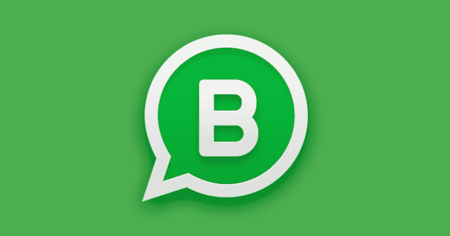

# WhatsApp:在同一台设备上使用 2 个帐号

> [https://dev . to/preras/whatsapp-使用-2-帐户-同一设备-3cc0](https://dev.to/prelias/whatsapp-usando-2-contas-no-mesmo-aparelho-3cc0)

[T2】](https://res.cloudinary.com/practicaldev/image/fetch/s--DA_jtiSP--/c_limit%2Cf_auto%2Cfl_progressive%2Cq_auto%2Cw_880/http://blog.dentalgutierre.com.br/wp-content/uploads/2018/02/whatsapp-business-dental-gutierre.png)

每个拥有双晶片的人，如果其中一个是专业人士的话，都曾遇到过这个问题。如何在两者中使用 WhatsApp 应用程序？

年初，该公司发布了面向企业使用的应用程序的∞版本。它还包含一些特定功能，如用户可以用来标记组和消息的标记(例如:∞等)，从而使可用性更易于用作需求控制。

但是，此次发布还提供了另一个非常有趣的用途:我们终于可以在同一台设备上正式访问两个不同的帐户(每个芯片一个帐户)。

使用第三方应用程序、Android 用户引擎(并非所有制造商都实施，更重要的是，不允许同时登录两个用户)等，实现这一点的方法已经比较模糊。

但没有一种方法比这更实用没有正式方法提供的安全性。虽然我还想进一步调查一下，因为该公司验证账目的方式有点模糊(收到确认代码和短信的电话)，但迄今为止，我没有遇到任何问题，即使有一定程度的担心账户会被冻结，我也一直在成功和高兴地使用第二台设备退役。

腹肌。