# 开发者资源 2018 年 7 月

> [https://dev . to/ismaeldevloop/resources-to-developer-July-2018--或 1g](https://dev.to/ismaeldevloop/recursos-para-desarrolladores-julio-2018--o1g)

在这一系列每月通讯中，我将分享我认为有趣的资源，这些资源以前我作为一个开发者每天都在项目中使用，或者只是休闲活动，所以不要再说了，我们开始吧。

[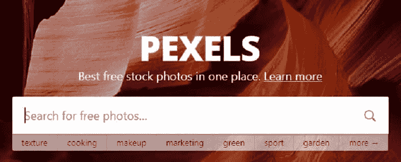T2】](https://res.cloudinary.com/practicaldev/image/fetch/s--wM3hcZ_5--/c_limit%2Cf_auto%2Cfl_progressive%2Cq_auto%2Cw_880/https://thepracticaldev.s3.amazonaws.com/i/ku3o63p640eoa7h15loa.JPG)

## [t1](#pexels)[轴](https://www.pexels.com)

它是一个网页，我们可以在其中免费提供大量图像供我们的项目使用，使我们能够根据需要为作者提供帮助，并允许下载不同大小的图像或选择所需的度量标准。此外，下载是直接的(没有验证码和这些母亲)。

[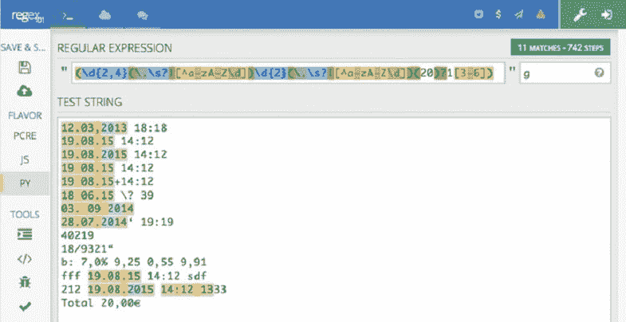T2】](https://res.cloudinary.com/practicaldev/image/fetch/s--HiOGmHsJ--/c_limit%2Cf_auto%2Cfl_progressive%2Cq_auto%2Cw_880/https://thepracticaldev.s3.amazonaws.com/i/e4i52wz7t9fv3ep9aj6w.jpg)

## [Regex101](https://regex101.com)

Regex 是一种在线工具，用于验证正则表达式，是一种非常简化的工具，它用颜色标记我们在传递给它的字符串中找到的匹配项。我想，如果我们要在代码中找出一个模式，并通过测试，我们会做一个很棒的 web scrapping，但不要太注意我，这个工具只是测试正则表达式，如果您还没有在您的项目中使用它们，请不要等待。

[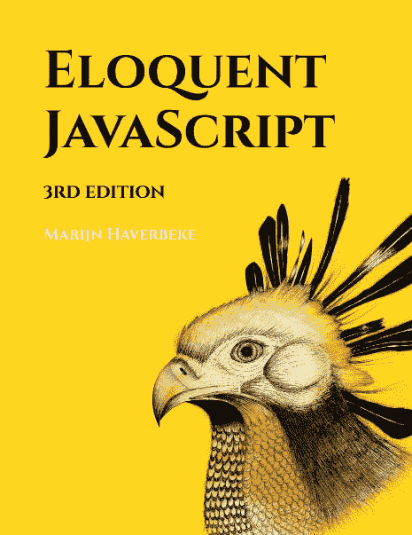T2】](https://res.cloudinary.com/practicaldev/image/fetch/s--uw_dildf--/c_limit%2Cf_auto%2Cfl_progressive%2Cq_auto%2Cw_880/https://thepracticaldev.s3.amazonaws.com/i/ovka50bxtqh4jqzqsidt.jpg)

## [雄辩 JavaScript 第三版](https://eloquentjavascript.net)

雄辩是以数字形式提供给我们的著名 JavaScript 编程书。你可以在网上阅读或者复印第二版。由于印刷版将于 10 月推出，当然如果你是在 2018 年看这篇帖子，但现在已经推出了。但是如果你既想用这种语言初学者又有高级水平的话，这是一本值得阅读的书。

[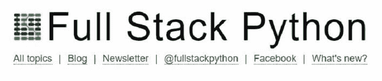T2】](https://res.cloudinary.com/practicaldev/image/fetch/s--fjVqwopH--/c_limit%2Cf_auto%2Cfl_progressive%2Cq_auto%2Cw_880/https://thepracticaldev.s3.amazonaws.com/i/hfnhkrv2dcdnbyfhp7fv.JPG)

## [全栈 Python](https://www.fullstackpython.com)

这个网站给我们带来了一份从 0 开始学习 Python 的资源清单，如果我们想深入研究某个特定主题的话，按主题排序，因为我们可以直接深入研究，我确信我们学到了一些新的东西。我会说这是一个自学 Python 的在线指南。

[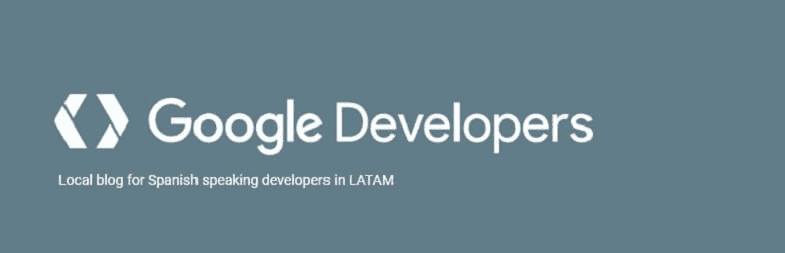T2】](https://res.cloudinary.com/practicaldev/image/fetch/s--MvF_va_E--/c_limit%2Cf_auto%2Cfl_progressive%2Cq_auto%2Cw_880/https://thepracticaldev.s3.amazonaws.com/i/ytm0ivwyvz8e0txinn55.JPG)

## [开发者 latam google 博客](https://developers-latam.googleblog.com)

如果您不太喜欢阅读英文文档，并且想了解 Google 为开发者发布的最新消息，您可以在 latam 的官方博客上阅读这些消息，我必须说，Google I/O 2018 的所有最新消息都在您的最新出版物中做了很好的总结，因为您在这里有更多的资源，这样您就不会再有任何错误信息了。

[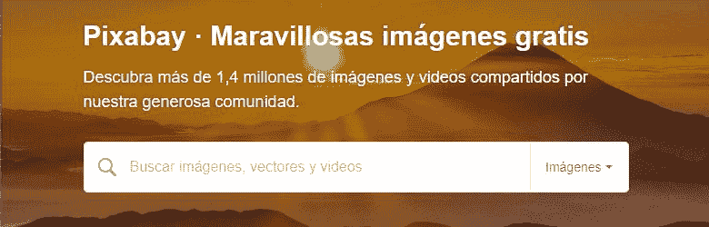T2】](https://res.cloudinary.com/practicaldev/image/fetch/s--0y5E4xKe--/c_limit%2Cf_auto%2Cfl_progressive%2Cq_auto%2Cw_880/https://thepracticaldev.s3.amazonaws.com/i/87ccwxmelabwr3q0ls50.JPG)

## [Pixabay](https://pixabay.com)

我们继续使用另一个提供精彩图像的网页，但您也可以在 pixabay 的广大社区中获得共享视频。从我的观点来看，它真的很像像素，但这并不重要，如果你已经有了哪里可以获得高质量的资源。

[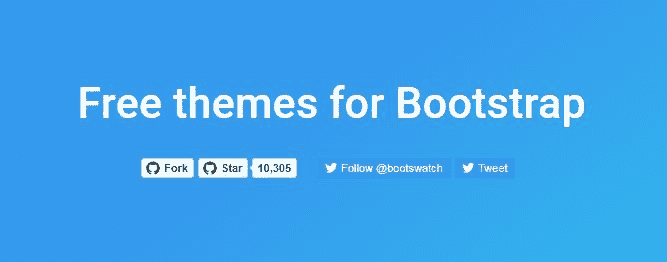T2】](https://res.cloudinary.com/practicaldev/image/fetch/s---IrgsOLm--/c_limit%2Cf_auto%2Cfl_progressive%2Cq_auto%2Cw_880/https://thepracticaldev.s3.amazonaws.com/i/s3bj9w84ymt78xjvm844.JPG)

## [Bootswatch](https://bootswatch.com/)

我们已经到达了我最喜欢的资源之一，bootswatch 为我们提供了著名的 Bootstrap 框架主题，sen 主题看起来很不错。我们还可以访问存储库并为其开发做出贡献，另一个值得注意的是，它使用了最新的稳定版本的 bootstrap，所以您不必使用它。

[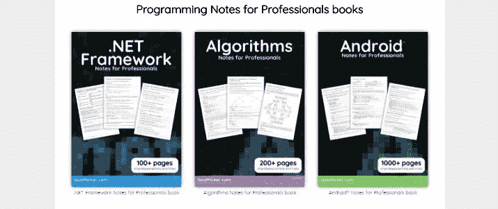T2】](https://res.cloudinary.com/practicaldev/image/fetch/s--V3ZIOJhe--/c_limit%2Cf_auto%2Cfl_progressive%2Cq_auto%2Cw_880/https://thepracticaldev.s3.amazonaws.com/i/f99avnf4kur41a1t8hv0.JPG)

## [专业人士编程笔记书籍](https://goalkicker.com)

如其名称所说，如果它是一个提供我们许多开发者创造的数字书籍的地方，真的值得我们研究，因为它们根本不是来自最新的，而且你找不到像这样完整的书籍。这是一个朋友推荐给我的，现在是你的了，所以请鼓掌欢迎艾比玲同志。

[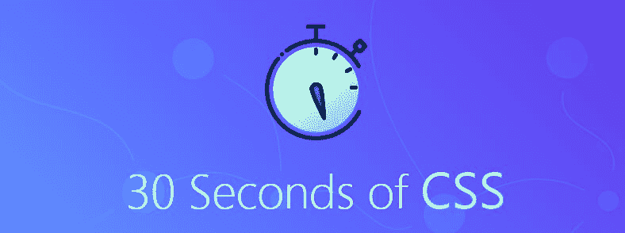T2】](https://res.cloudinary.com/practicaldev/image/fetch/s--UfzqCsoM--/c_limit%2Cf_auto%2Cfl_progressive%2Cq_auto%2Cw_880/https://thepracticaldev.s3.amazonaws.com/i/cjmmk8l0zmt142yw1fjx.JPG)

## [三十秒的**CSS**T5】](https://atomiks.github.io/30-seconds-of-css)

在此网站上，您可以找到一些理论实践练习，以一种温和有趣的方式娱乐和学习 CSS 样式语言，100%推荐。

[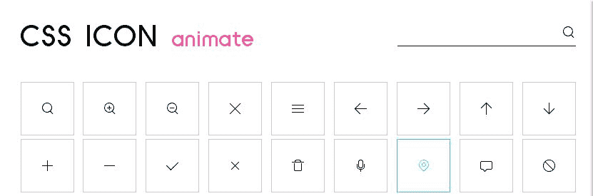T2】](https://res.cloudinary.com/practicaldev/image/fetch/s--ZTpsfVZp--/c_limit%2Cf_auto%2Cfl_progressive%2Cq_auto%2Cw_880/https://thepracticaldev.s3.amazonaws.com/i/f5vzlqa1gsfc78ushwgv.JPG)

## [CSS 图标](http://cssicon.space)

css Icon 提供了使用 CSS 创建的各种图标，这些图标有助于提高 web 项目的性能，因为您不必使用 SVG 仍然是实现这一目的的理想图像，但请注意，为了和平目的，我们会继续学习更多有关 CSS 的信息，并且我们还可以在代码代码中测试这些信息，以确保您不会怀疑。

[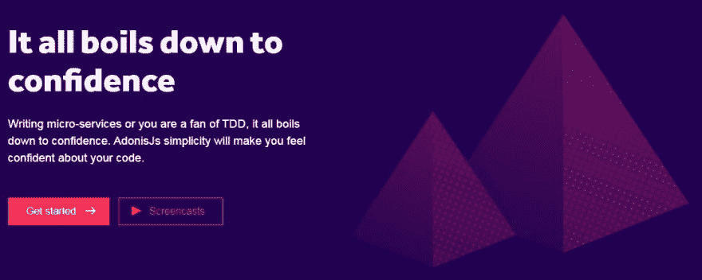T2】](https://res.cloudinary.com/practicaldev/image/fetch/s--GaURjkzm--/c_limit%2Cf_auto%2Cfl_progressive%2Cq_auto%2Cw_880/https://thepracticaldev.s3.amazonaws.com/i/upadlubsgugdus0ri9os.JPG)

## [AdonisJs - Node.js web 框架](https://www.adonisjs.com)

Adonisjs 是 Node.js 的框架，具有开发人员所喜欢的优雅语法，并且非常稳定，如果您来自 Laravel，并且希望测试服务器端的 Node 功能，您不会花费太多的精力，因为它在创建控制器、模型和 Laravel 拥有的所有其他方面都有许多相似之处。我真的很喜欢这个框架，你们一定会看到下一段 Adonisjs 的视频。