# 我的 VSCode 世界

> [https://dev . to/pamefish/my-vscode-world-1g 63](https://dev.to/pamepeixinho/my-vscode-world-1g63)

大家好，

我要说的是我在工作或活动中经常被问到的一件事:

> “您的 VSCode 看起来不一样，这是什么扩展？你能把这些分机递给我吗？”

我仍然是一个初学者，但是我真的喜欢定制和改进我的代码环境。所以，我决定写这篇文章来解释我使用的所有扩展、技巧、设置和助手，而不是一篇“10 大扩展”的文章。

[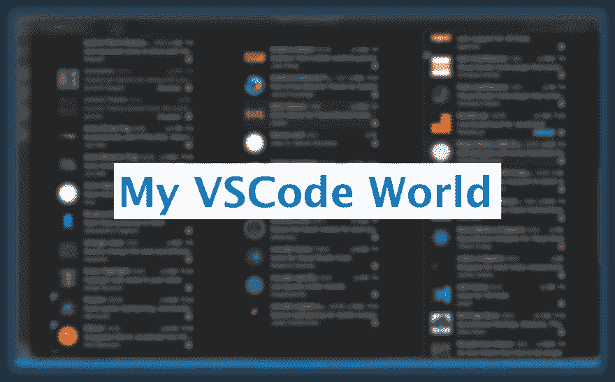T2】](https://res.cloudinary.com/practicaldev/image/fetch/s--dmHSZRU1--/c_limit%2Cf_auto%2Cfl_progressive%2Cq_auto%2Cw_880/https://cdn-images-1.medium.com/max/1024/1%2AehYGNxDnE21_kUpEITZsVQ.png)

首先，为什么是 VSCode？？

VSCode 是微软的一个 IDE。是**免费的**、**开源的**和用 JS +电子打造的**。它对所有语言都有好处，但主要是针对 *Javascript* 。**

定制 VSCode 中的一切就像自动完成和调试一样简单容易。

另外:IMO，VSCode 对两者都有好处，“*前端*”和“*后端*”！！

#### 目录

1.  [有趣的设置](https://medium.com/p/2c7b7506e32c#ec19) 1.1 [字体](https://medium.com/p/2c7b7506e32c#5bf8)
2.  [对所有人都有用(后端和前端)](https://medium.com/@pamepeixinho/my-vscode-world-2c7b7506e32c#1f57) 2.1 [IDE 设置和扩展](https://medium.com/@pamepeixinho/my-vscode-world-2c7b7506e32c#9b4a) 2.2 [版本控制](https://medium.com/@pamepeixinho/my-vscode-world-2c7b7506e32c#f488) 2.3 [节点/NPM](https://medium.com/@pamepeixinho/my-vscode-world-2c7b7506e32c#ad4d) 2.4 [Lint](https://medium.com/@pamepeixinho/my-vscode-world-2c7b7506e32c#648f) 2.5 [测试](https://medium.com/@pamepeixinho/my-vscode-world-2c7b7506e32c#d0f5) 2.6 [Markdown](https://medium.com/@pamepeixinho/my-vscode-world-2c7b7506e32c#e3c7)
3.  [对前端有用](https://medium.com/@pamepeixinho/my-vscode-world-2c7b7506e32c#cdbf)
4.  [其他酷炫扩展](https://medium.com/@pamepeixinho/my-vscode-world-2c7b7506e32c#ee6f)

### 有趣的设置

#### 字体

我使用的主要字体是 [Fira Code](https://github.com/tonsky/FiraCode) ( *等宽字体，带编程连字*)。您需要在您的字体系统中安装此字体，并通过添加到您的设置中来启用它:

```
// Set the font family
“editor.fontFamily”: “‘Fira Code’, Menlo, Monaco, ‘Courier New’, monospace”,

// Enable the font ligature
“editor.fontLigatures”: true, 
```

然后，你有一个这样的字体:

[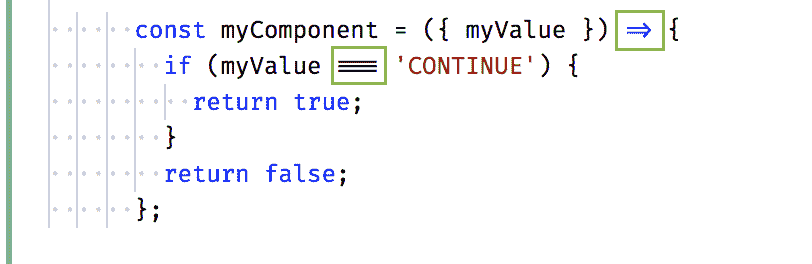T2】](https://res.cloudinary.com/practicaldev/image/fetch/s--CB389SCt--/c_limit%2Cf_auto%2Cfl_progressive%2Cq_auto%2Cw_880/https://cdn-images-1.medium.com/max/812/1%2AQ1y6nDxs3U_P3GhusQwLpg.png)

### 对每个人都有用(*后端和前端*

以下是我的 VSCode 世界的扩展列表:

#### **IDE 设置和扩展**

[**设置同步**](https://marketplace.visualstudio.com/items?itemName=Shan.code-settings-sync)

在多台计算机上同步所有 VSCode 设置。我总是有这个问题，因为我有工作和个人笔记本。

> 使用 GitHub Gist 在多台机器上同步设置、片段、主题、文件图标、启动、按键绑定、工作区和扩展

[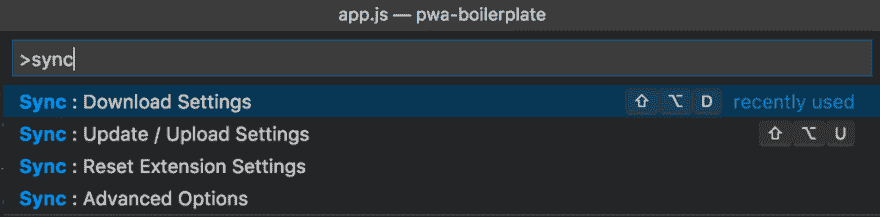T2】](https://res.cloudinary.com/practicaldev/image/fetch/s--Os81ZO92--/c_limit%2Cf_auto%2Cfl_progressive%2Cq_auto%2Cw_880/https://cdn-images-1.medium.com/max/1024/1%2Anl3OlJfHCdwP-QobiXyaTw.png)

[设置同步- Visual Studio 市场](https://marketplace.visualstudio.com/items?itemName=Shan.code-settings-sync)

[**状态栏上的活动文件**](https://marketplace.visualstudio.com/items?itemName=RoscoP.ActiveFileInStatusBar)

它在状态栏中显示当前活动文件的完整路径

[T2】](https://res.cloudinary.com/practicaldev/image/fetch/s--8_bCihHR--/c_limit%2Cf_auto%2Cfl_progressive%2Cq_auto%2Cw_880/https://cdn-images-1.medium.com/max/734/1%2AxxtyK7R9wbRZHa3I7xcF2A.png)

[状态栏中的活动文件- Visual Studio Marketplace](https://marketplace.visualstudio.com/items?itemName=RoscoP.ActiveFileInStatusBar)

[**Intellij 按键**](https://marketplace.visualstudio.com/items?itemName=k--kato.intellij-idea-keybindings)

对于对 JetBrains 产品上瘾的人来说:

> IntelliJ IDEA 键绑定端口

[IntelliJ IDEA 按键绑定- Visual Studio Marketplace](https://marketplace.visualstudio.com/items?itemName=k--kato.intellij-idea-keybindings)

[**待办事宜高亮**](https://marketplace.visualstudio.com/items?itemName=wayou.vscode-todo-highlight)

“就是高光，为什么喜欢？”。*回答*:用这个高光很容易找到你的待办事项。

[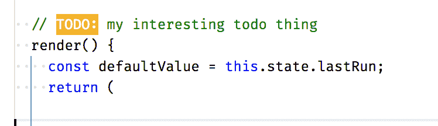T2】](https://res.cloudinary.com/practicaldev/image/fetch/s--H_M8MGHS--/c_limit%2Cf_auto%2Cfl_progressive%2Cq_auto%2Cw_880/https://cdn-images-1.medium.com/max/748/1%2A-mTbiwgjrCpEiqoA-yZWig.png)

[TODO 突出显示- Visual Studio 市场](https://marketplace.visualstudio.com/items?itemName=wayou.vscode-todo-highlight)

[**Spotify**T3】](https://marketplace.visualstudio.com/items?itemName=shyykoserhiy.vscode-spotify)

[vs code-Spotify-Visual Studio market place](https://marketplace.visualstudio.com/items?itemName=shyykoserhiy.vscode-spotify)

[**SVG 查看器**](https://marketplace.visualstudio.com/items?itemName=cssho.vscode-svgviewer)

```
“svgviewer.enableautopreview”: true, 
```

[SVG 查看器- Visual Studio Marketplace](https://marketplace.visualstudio.com/items?itemName=cssho.vscode-svgviewer)

[**变化情况**](https://marketplace.visualstudio.com/items?itemName=wmaurer.change-case)

[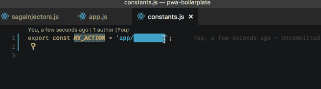T2】](https://res.cloudinary.com/practicaldev/image/fetch/s--ri_sMf26--/c_limit%2Cf_auto%2Cfl_progressive%2Cq_66%2Cw_880/https://cdn-images-1.medium.com/max/656/1%2A6-t5Jm7sLT5WVtKl94GwEw.gif)

[变化-案例- Visual Studio 市场](https://marketplace.visualstudio.com/items?itemName=wmaurer.change-case)

[**导入成本**](https://marketplace.visualstudio.com/items?itemName=wix.vscode-import-cost)

[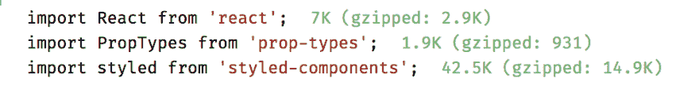T2】](https://res.cloudinary.com/practicaldev/image/fetch/s--xeSTqbbK--/c_limit%2Cf_auto%2Cfl_progressive%2Cq_auto%2Cw_880/https://cdn-images-1.medium.com/max/1000/1%2AQ8Gxqo7Ybt3WpQt6hhK6nA.png)

[导入成本- Visual Studio Marketplace](https://marketplace.visualstudio.com/items?itemName=wix.vscode-import-cost)

#### 版本控制

[**Gitlens**](https://marketplace.visualstudio.com/items?itemName=eamodio.gitlens)

顾名思义:它是 git 的一个类似“lens”的扩展。

> **增强内置于 Visual Studio 代码中的 Git 功能** —通过 Git 责备注释和代码透镜使代码作者一目了然...

有许多设置可以根据您的喜好改进 git 镜头，例如:

[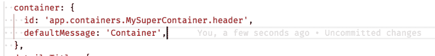T2】](https://res.cloudinary.com/practicaldev/image/fetch/s--zygkNSPQ--/c_limit%2Cf_auto%2Cfl_progressive%2Cq_auto%2Cw_880/https://cdn-images-1.medium.com/max/1024/1%2Aytg19RTSlnHQf9wxvkPkoA.png)

[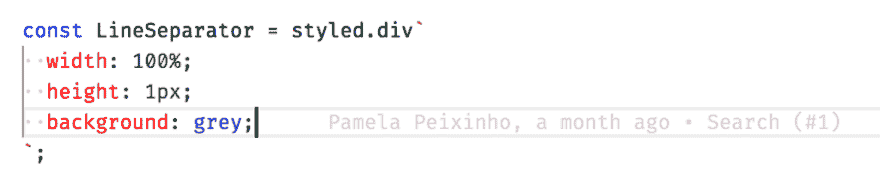T2】](https://res.cloudinary.com/practicaldev/image/fetch/s--d2BJ37BN--/c_limit%2Cf_auto%2Cfl_progressive%2Cq_auto%2Cw_880/https://cdn-images-1.medium.com/max/1024/1%2Ay-c7jiNkjqGr-xDm5Ttmjw.png)

[GitLens - Git 增压版- Visual Studio Marketplace](https://marketplace.visualstudio.com/items?itemName=eamodio.gitlens)

#### 节点/NPM

[**NPM 智能感知**](https://marketplace.visualstudio.com/items?itemName=christian-kohler.npm-intellisense)

自动完成导入语句中的 NPM 模块

[npm 智能感知- Visual Studio 市场](https://marketplace.visualstudio.com/items?itemName=christian-kohler.npm-intellisense)

[**版本镜头**](https://marketplace.visualstudio.com/items?itemName=pflannery.vscode-versionlens)

它显示 NPM 的软件包版本信息。很高兴看到可用的版本和包的状态。

[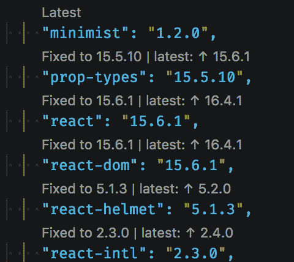T2】](https://res.cloudinary.com/practicaldev/image/fetch/s--ycJMt4kz--/c_limit%2Cf_auto%2Cfl_progressive%2Cq_auto%2Cw_880/https://cdn-images-1.medium.com/max/480/1%2ATR9CWrd833Hl2upOknT2Gg.png)

[版本镜头- Visual Studio Marketplace](https://marketplace.visualstudio.com/items?itemName=pflannery.vscode-versionlens)

#### [功能区](#lint)

[**ESLint**](https://marketplace.visualstudio.com/items?itemName=dbaeumer.vscode-eslint)

将 ESLint 集成到 VS 代码中。这对于使用 eslint 的项目来说是非常必要的(如果你想要一个干净的代码，应该是 all😆).当您启用了这个扩展并违反了一些 eslint 时，您的 IDE 看起来像:

[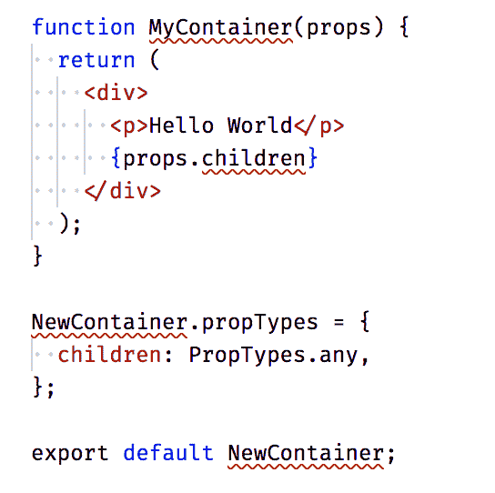T2】](https://res.cloudinary.com/practicaldev/image/fetch/s--Z0UOkDct--/c_limit%2Cf_auto%2Cfl_progressive%2Cq_auto%2Cw_880/https://cdn-images-1.medium.com/max/544/1%2Al0OX1iZ0AEc4bzs8mQWOVA.png)

突出显示的每一行都显示错误。

**Plus:** 使用“修复所有可自动修复的问题”或在设置中保存时启用自动修复很容易修复

[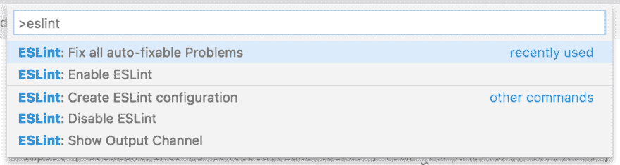T2】](https://res.cloudinary.com/practicaldev/image/fetch/s--mlNAQ7GT--/c_limit%2Cf_auto%2Cfl_progressive%2Cq_auto%2Cw_880/https://cdn-images-1.medium.com/max/1024/1%2A1Q8SWN914R1wPs9Yqpgdhg.png)

```
“eslint.autoFixOnSave”: true, 
```

[ESLint-Visual Studio market place](https://marketplace.visualstudio.com/items?itemName=dbaeumer.vscode-eslint)

#### 测试

[t1 是片段 T3](https://marketplace.visualstudio.com/items?itemName=andys8.jest-snippets)

如果你使用 Jest 作为测试框架，你应该有这个神奇的插件来帮助更快地编写测试。

我使用的主要片段是:

*   **desc+【tab】**:*形容(()= > {}*
*   **it+【tab】**:*it('，()=>{ })；*

[笑话片段- Visual Studio Marketplace](https://marketplace.visualstudio.com/items?itemName=andys8.jest-snippets)

[t1 是 T3](https://marketplace.visualstudio.com/items?itemName=Orta.vscode-jest)

对于 jest 用户来说，这是一个很好的插件，它在每个**开始时显示它**是否通过。但是，我在这里提出警告，这个插件*会让你的 IDE* 变慢。

[Jest-Visual Studio market place](https://marketplace.visualstudio.com/items?itemName=Orta.vscode-jest)

#### 降价销售

对于所有喜欢降价的人来说，像我这样的人:


 **这个扩展突出显示了改进你的 markdown 文件以遵循良好的实践。

[markdownlint-Visual Studio market place](https://marketplace.visualstudio.com/items?itemName=DavidAnson.vscode-markdownlint)

[**自动打开降价预览**](https://marketplace.visualstudio.com/items?itemName=hnw.vscode-auto-open-markdown-preview)

[自动打开降价预览- Visual Studio Marketplace](https://marketplace.visualstudio.com/items?itemName=hnw.vscode-auto-open-markdown-preview)

[**三合一**](https://marketplace.visualstudio.com/items?itemName=yzhang.markdown-all-in-one)

 **[Markdown All in One-Visual Studio market place](https://marketplace.visualstudio.com/items?itemName=yzhang.markdown-all-in-one)

[**Markdown 表情符号**](https://marketplace.visualstudio.com/items?itemName=bierner.markdown-emoji)

[降价表情符号- Visual Studio Marketplace](https://marketplace.visualstudio.com/items?itemName=bierner.markdown-emoji)

### 对前端人员有用

#### [自动关闭标签](https://marketplace.visualstudio.com/items?itemName=formulahendry.auto-close-tag)

[自动关闭标记- Visual Studio Marketplace](https://marketplace.visualstudio.com/items?itemName=formulahendry.auto-close-tag)

#### [自动重命名标签](https://marketplace.visualstudio.com/items?itemName=formulahendry.auto-rename-tag)

[自动重命名标记- Visual Studio Marketplace](https://marketplace.visualstudio.com/items?itemName=formulahendry.auto-rename-tag)

#### [颜色高亮](https://marketplace.visualstudio.com/items?itemName=naumovs.color-highlight)

[颜色突出显示- Visual Studio 市场](https://marketplace.visualstudio.com/items?itemName=naumovs.color-highlight)

#### [样式组件](https://marketplace.visualstudio.com/items?itemName=jpoissonnier.vscode-styled-components)

[vs code-styled-components-Visual Studio market place](https://marketplace.visualstudio.com/items?itemName=jpoissonnier.vscode-styled-components)

### 其他酷炫扩展

#### [书签](https://marketplace.visualstudio.com/items?itemName=alefragnani.Bookmarks)

[书签- Visual Studio Marketplace](https://marketplace.visualstudio.com/items?itemName=alefragnani.Bookmarks)

#### [路径智能感知](https://marketplace.visualstudio.com/items?itemName=christian-kohler.path-intellisense)

[Path Intellisense-Visual Studio market place](https://marketplace.visualstudio.com/items?itemName=christian-kohler.path-intellisense)

#### [阔卡](https://marketplace.visualstudio.com/items?itemName=WallabyJs.quokka-vscode)

[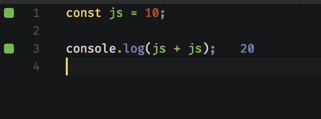T2】](https://res.cloudinary.com/practicaldev/image/fetch/s--mGBP6QTA--/c_limit%2Cf_auto%2Cfl_progressive%2Cq_auto%2Cw_880/https://cdn-images-1.medium.com/max/644/0%2AlntqtztHoSbduALQ)

[quo kka . js-Visual Studio market place](https://marketplace.visualstudio.com/items?itemName=WallabyJs.quokka-vscode)

当我发现新的很酷的扩展时，这篇文章将会更新！如果你知道一些不在这里的好的扩展或设置，请联系我😃

**LinkedIn**:【https://www.linkedin.com/in/pamepeixinho

**Twitter**:[https://twitter.com/pamepeixinho](https://twitter.com/pamepeixinho)

**Github**:[https://github.com/pamepeixinho](https://github.com/pamepeixinho)

**网站**:[https://pamepeixinho . Github . io](https://pamepeixinho.github.io)

> 我的名字叫小鱼，我有时游泳和编码。“回头见”海！😉****