# vuej-props、eventBus、Vuex-我...。皇家战斗到死亡

> 原文:# t0]https://dev . to/rdelg80/vuej-props-event bus-vuex-battle-royal-to-the-death-350 o；

[T2】](https://res.cloudinary.com/practicaldev/image/fetch/s--8MU_9HY---/c_limit%2Cf_auto%2Cfl_progressive%2Cq_66%2Cw_880/https://thumbs.gfycat.com/AthleticMindlessGourami-size_restricted.gif)

我是吉恩·奥克伦德，乡亲们，我们在加州三藩市的尤雨溪纪念竞技场为你们带来了一场盛宴。

有人说这是一场永远不会发生的战斗。这将有太多的利害关系，但我们发现自己在这里看到，事实上，谁能最好地处理数据传递。

这场比赛的规则很简单，由 Vue-Cli3 为您带来。他们是全新的女士们先生们，当然是我们的最爱之一:

[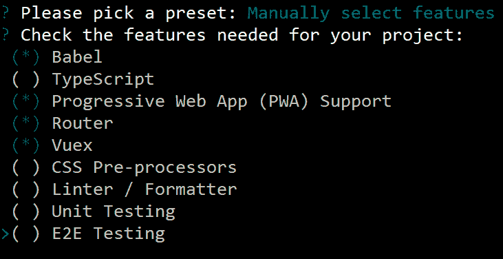T2】](https://res.cloudinary.com/practicaldev/image/fetch/s--0ddAZLs0--/c_limit%2Cf_auto%2Cfl_progressive%2Cq_auto%2Cw_880/https://thepracticaldev.s3.amazonaws.com/i/9mmp74cqikqi1ia4v2dc.png)

让我们来认识一下我们的三位战士:

**【横纲(道具)**
**兰迪‘猛男’野人(eventBus)**
**终极战士(Vuex)**

让我们来看看这枚由 VueJS 和 Bootstrap4 的优秀员工提供的精美戒指:

[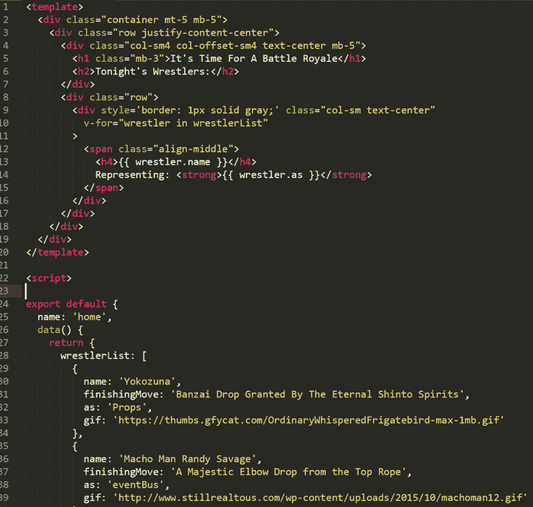](https://res.cloudinary.com/practicaldev/image/fetch/s--TXkI3mvw--/c_limit%2Cf_auto%2Cfl_progressive%2Cq_auto%2Cw_880/https://thepracticaldev.s3.amazonaws.com/i/arnqv9gf4t8vsv4lvczf.png)

*主页模板，带有用于布局目的的引导程序。数组摔跤手列表中的摔跤手信息。*

[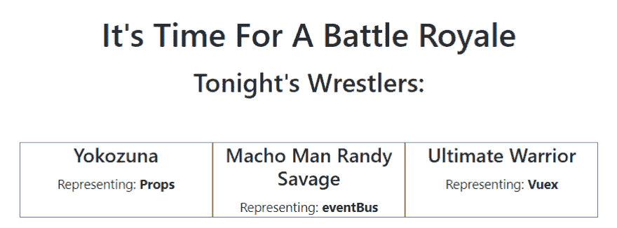T2】](https://res.cloudinary.com/practicaldev/image/fetch/s--7DTNBMuC--/c_limit%2Cf_auto%2Cfl_progressive%2Cq_auto%2Cw_880/https://thepracticaldev.s3.amazonaws.com/i/608fmhjcigen8yxvey5t.png)

首先是来自日本的庞然大物，前相扑选手成为 WWE 的杰出人物...

## 横纲(道具)

[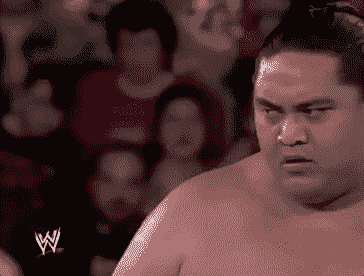T2】](https://res.cloudinary.com/practicaldev/image/fetch/s--KW5K5YKJ--/c_limit%2Cf_auto%2Cfl_progressive%2Cq_66%2Cw_880/https://media1.giphy.com/media/xULW8OJ9Fc9CKZTeCY/giphy.gif)

横纲的力量举世闻名，他的贪婪同样臭名昭著。我见过 600 磅重的人吃下几个芝士汉堡。

不幸的是，600 磅的体重不允许有那么大的机动性，横纲只能和他最接近的对手格斗。

但这并不意味着他不会很有破坏性；没有人想发现自己处于极其强大的 Bonzai 落差的底部。

洋子慢慢走向擂台:

[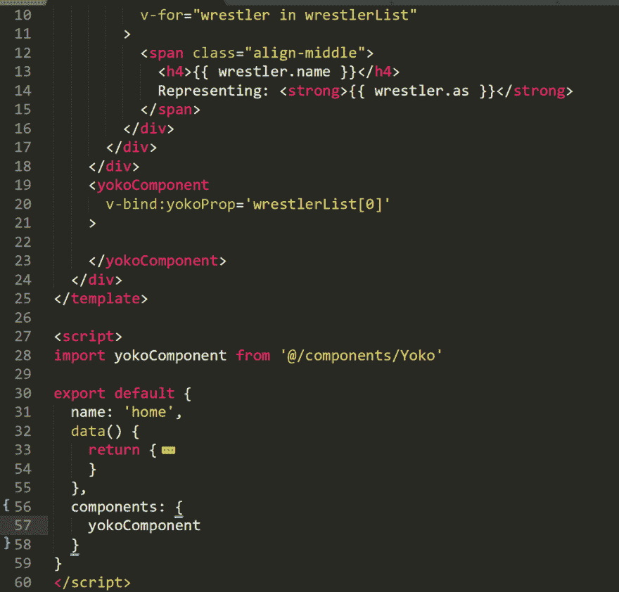](https://res.cloudinary.com/practicaldev/image/fetch/s--MnpB_ZhV--/c_limit%2Cf_auto%2Cfl_progressive%2Cq_auto%2Cw_880/https://thepracticaldev.s3.amazonaws.com/i/3ctp1vjr4fdg6cqlxq8b.png) 
*从组件文件夹导入 yokoComponent。注册组件。然后添加到模板。然后我们用 yokoProp 把道具传递给子组件。*

这里我们看到他准备进入绳索之间。不小的成就，让我告诉你。

[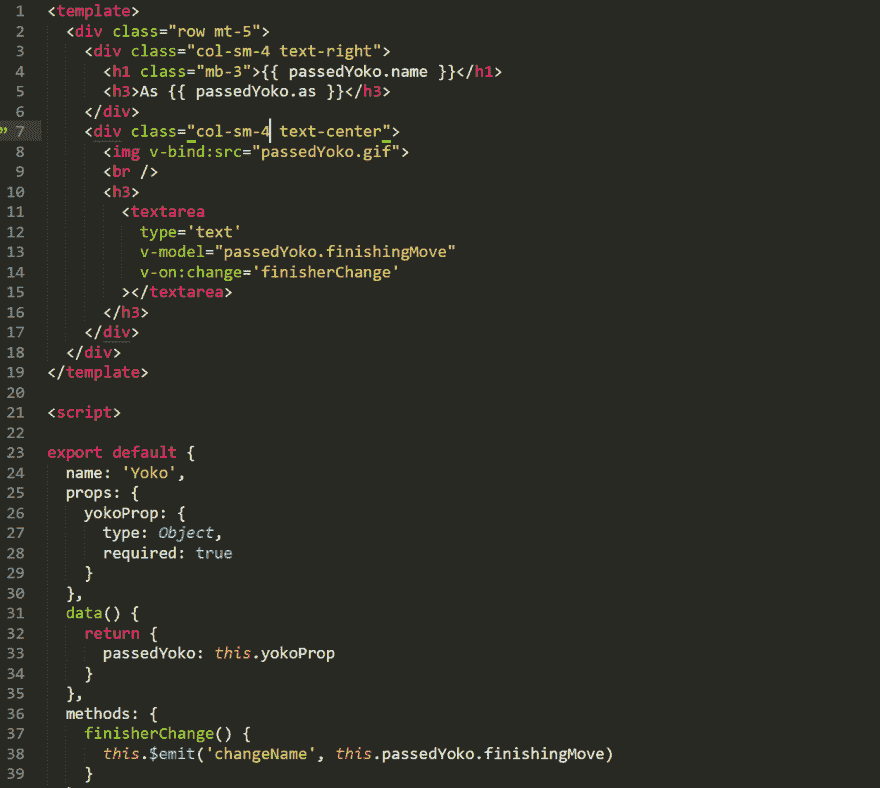](https://res.cloudinary.com/practicaldev/image/fetch/s--EiTvjgCC--/c_limit%2Cf_auto%2Cfl_progressive%2Cq_auto%2Cw_880/https://thepracticaldev.s3.amazonaws.com/i/l4alw7by8tlg28k0vgdo.png) 
*在洋子组件中，注册道具。如果需要，使用验证，如 type 或 required。[https://vue js . org/v2/guide/components-props . html # Prop-Validation](https://vuejs.org/v2/guide/components-props.html#Prop-Validation)。我们稍后将使用 textarea，但在下图中，我们只是将它显示为一个文本字段。还要注意通过 finisherChange 函数连接到 textarea 的$emit 方法，该函数在更改时被触发。*

如果你仔细观察，你会发现洋子的信息是通过 Prop move 传递的，这是 WWE 精英中严格保守的训练秘密，允许一代代摔跤手的知识从一个传给下一个。

[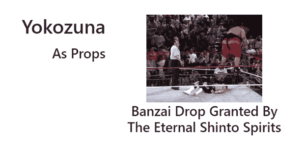T2】](https://res.cloudinary.com/practicaldev/image/fetch/s--OQK7Kujk--/c_limit%2Cf_auto%2Cfl_progressive%2Cq_66%2Cw_880/https://i.imgur.com/tw6mwVI.gif)

但令人惊讶的是，洋子也可以使用适当的动作将知识传递给他光荣的摔跤祖先。

你听到了吗，伙计们，如果你努力训练，保持专注，吃维生素，你也可以掌握这个动作:

[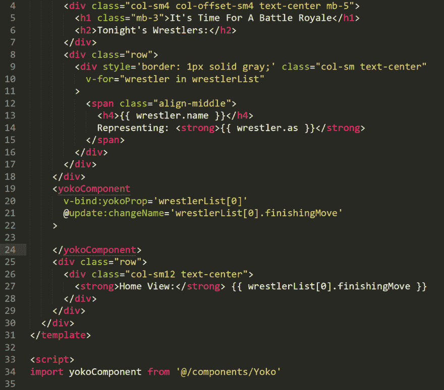](https://res.cloudinary.com/practicaldev/image/fetch/s--m50f7YCj--/c_limit%2Cf_auto%2Cfl_progressive%2Cq_auto%2Cw_880/https://thepracticaldev.s3.amazonaws.com/i/u99o41bibqi61n11qrfm.png) 
*在 Home 模板中添加@update 道具，当子 yokoComponent 中的 textfield 被更新时，该道具改变 Yoko 在摔跤手列表中的信息。*

[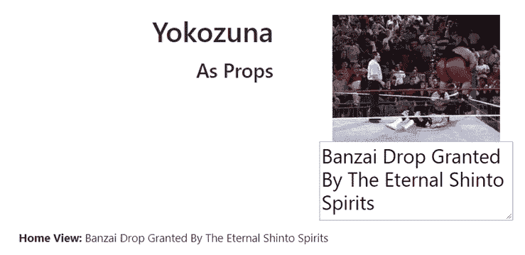T2】](https://res.cloudinary.com/practicaldev/image/fetch/s--PbZD_s_O--/c_limit%2Cf_auto%2Cfl_progressive%2Cq_66%2Cw_880/https://i.imgur.com/gCAM9qB.gif)

但那是什么？

[https://www.youtube.com/embed/Rblh_0d7Qlw](https://www.youtube.com/embed/Rblh_0d7Qlw)

这只能意味着 WWE 最被误解的摔跤手之一来到了拳击台...

## 兰迪‘猛男’野人(eventBus)

伙计们，让我从一开始就告诉你，猛男是一个粉丝最喜欢的疯狂的眼睛，和地狱般的肘部从顶绳下降。

今晚他的另一半，美丽的伊丽莎白小姐，没有陪着他，这意味着大男子主义是来处理一些事务的。

就像我说的，那个飞肘很好看，甚至可能让洋子看起来像昨天的垃圾。但是这种无视死亡的方式也有其自身的风险。

让我们来看看猛男是如何计划登上最高绳索的:

[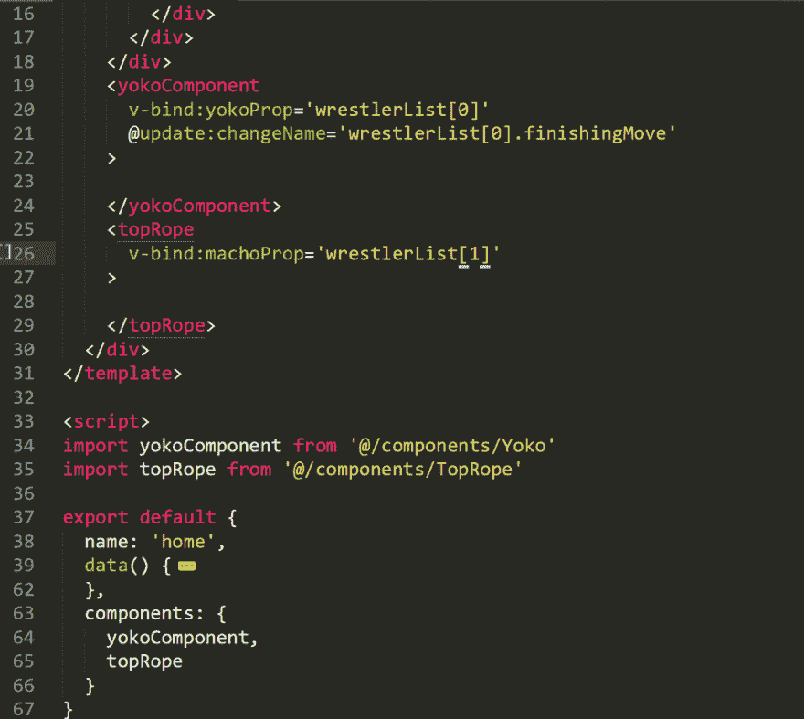](https://res.cloudinary.com/practicaldev/image/fetch/s--_hAbmV_P--/c_limit%2Cf_auto%2Cfl_progressive%2Cq_auto%2Cw_880/https://thepracticaldev.s3.amazonaws.com/i/vz1hrm9gh1vq48y3n2nu.png) 
*将 machoProp 从 Home.vue 传递到 topRope 组件。*

[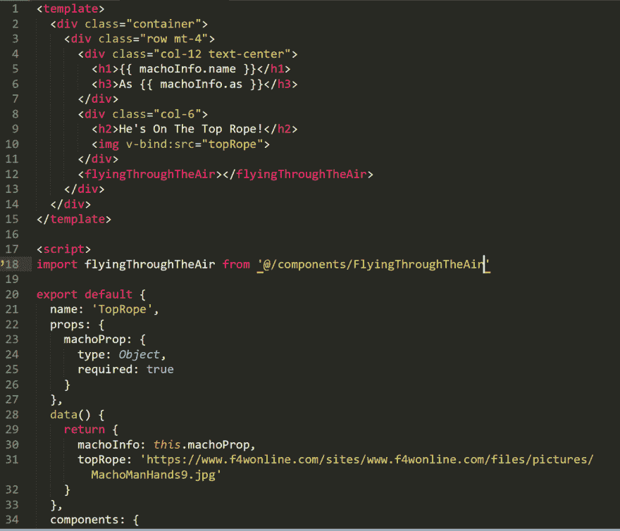](https://res.cloudinary.com/practicaldev/image/fetch/s--N3Fp8_LC--/c_limit%2Cf_auto%2Cfl_progressive%2Cq_auto%2Cw_880/https://thepracticaldev.s3.amazonaws.com/i/7t5soazjb7nfxnega5v9.png) 
*在 topRope 组件中注册 flyingThroughTheAir 组件。*

[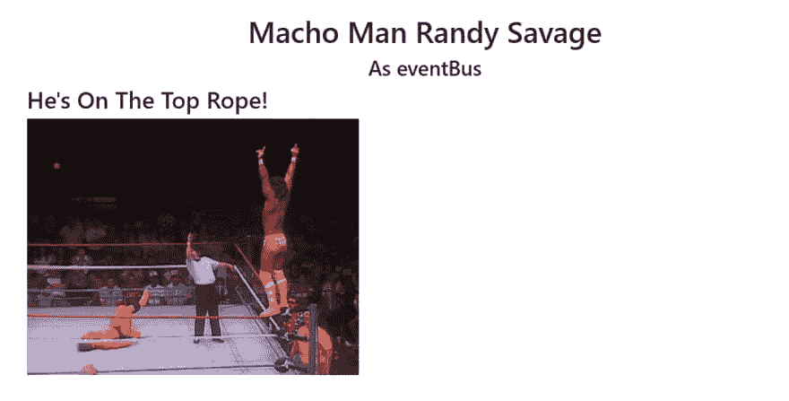T2】](https://res.cloudinary.com/practicaldev/image/fetch/s--a3mz81KE--/c_limit%2Cf_auto%2Cfl_progressive%2Cq_auto%2Cw_880/https://thepracticaldev.s3.amazonaws.com/i/nys0omrakm3a3d1o6ow6.png)

Macho 成功的秘诀在于戒指的稳定性:

[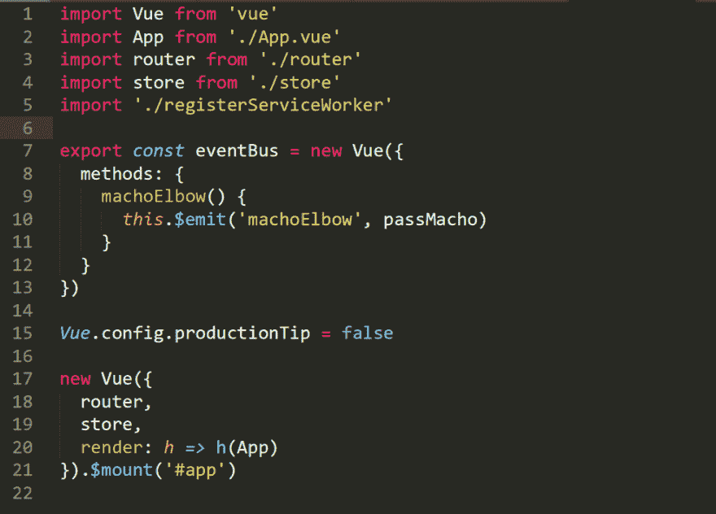](https://res.cloudinary.com/practicaldev/image/fetch/s--Gz3UfATs--/c_limit%2Cf_auto%2Cfl_progressive%2Cq_auto%2Cw_880/https://thepracticaldev.s3.amazonaws.com/i/nujkfif0h6fx78ak0lkk.png) 
*在 main.js 文件中创建 eventBus。*

正是在这里，猛男可以利用他巨大的腿部肌肉产生的力量，推动他一路穿过拳击台:

[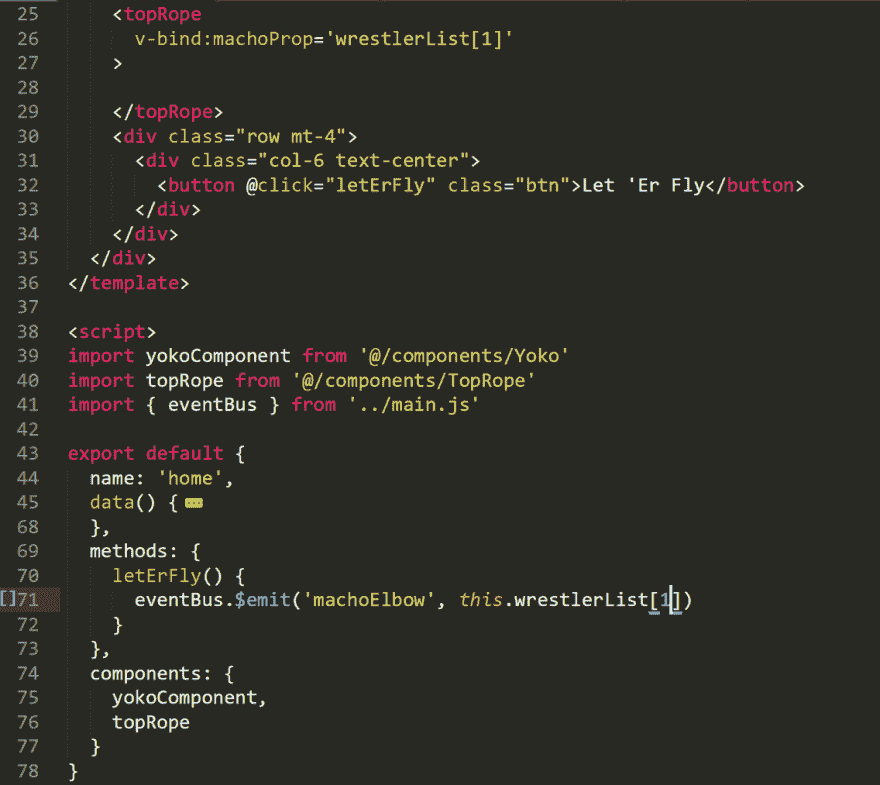](https://res.cloudinary.com/practicaldev/image/fetch/s--JUDPxkDl--/c_limit%2Cf_auto%2Cfl_progressive%2Cq_auto%2Cw_880/https://thepracticaldev.s3.amazonaws.com/i/uggcqsbeedwf0dlfst1f.png) 
*在 Home.vue 中注册 eventBus，还增加了一个触发 eventBus 发出猛男信息的按钮。*

[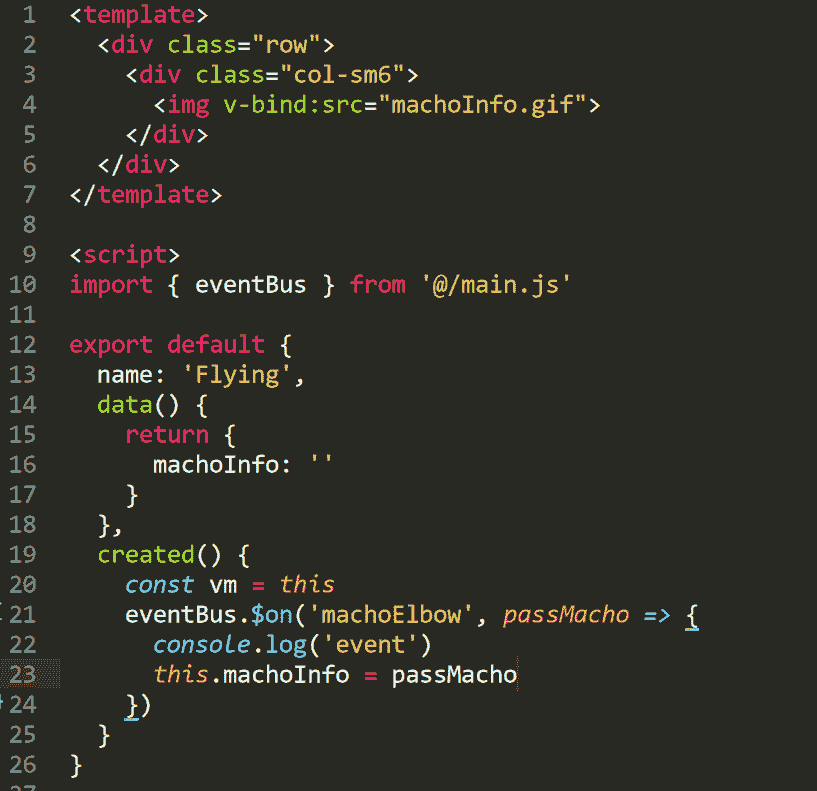](https://res.cloudinary.com/practicaldev/image/fetch/s--1bF7Bcw9--/c_limit%2Cf_auto%2Cfl_progressive%2Cq_auto%2Cw_880/https://thepracticaldev.s3.amazonaws.com/i/ps9mrhu21z85ltnlt95h.png) 
*在 flyingThroughTheAir 组件中，注册 eventBus，使用$on 事件将传递的猛男信息添加到组件中的 machoInfo 数据对象中。*

[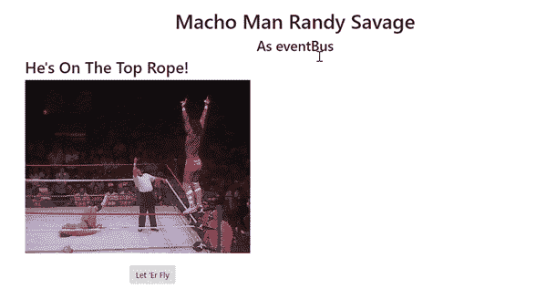T2】](https://res.cloudinary.com/practicaldev/image/fetch/s--7dziMCIL--/c_limit%2Cf_auto%2Cfl_progressive%2Cq_66%2Cw_880/https://i.imgur.com/8rAB10W.gif)

绝对毁灭性的。

但那是什么！不可能吧！不是别人，正是...

## 终极战士(Vuex)

[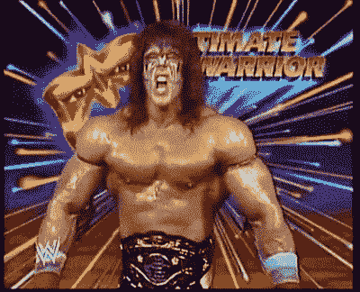T2】](https://i.giphy.com/media/Xh1yjq8vZVqik/giphy.gif)

女士们先生们，冲向拳击台，头发和流苏像蒙大拿飞机上的种马的鬃毛一样飘动，终极战士来了。

我不敢相信会发生这种事。横纲和猛男困惑地环顾四周，他们要求裁判对这种中断做点什么。

许多人说终极战士无所不能。我们见过他把树干举过头顶，然后跳过峡谷。有传言说他的二头肌可以为一座城市供电，他可能游过太平洋。

令人欣慰的是，戒指已经准备好处理终极战士的敬畏，再次感谢我们在 VueJS 的伟大赞助商，“你编码他们，我们烤他们。”

这是一份战士训练制度的分解，这是我们独家带给你的高级机密信息:

[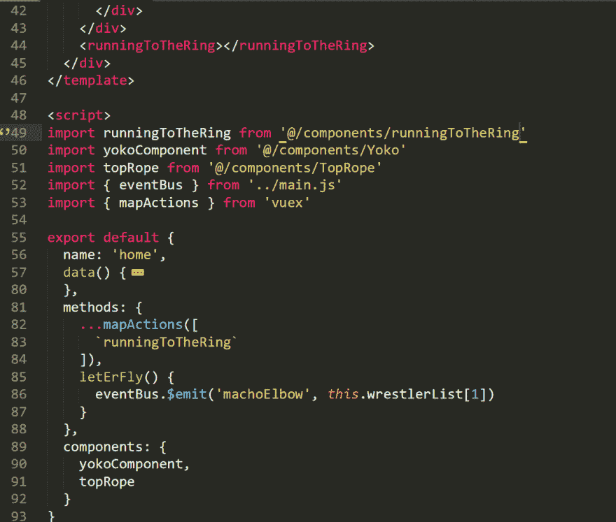](https://res.cloudinary.com/practicaldev/image/fetch/s--cEYarY_b--/c_limit%2Cf_auto%2Cfl_progressive%2Cq_auto%2Cw_880/https://thepracticaldev.s3.amazonaws.com/i/gefiinq0j2r4asvkh8du.png) 
*在 Home.vue 中注册 runningToTheRing 组件，并添加到模板中。还要注册 Vuex 的 addAction 方法，并在组件的字段中添加 mapActions 助手(mapActions 在方法中，而 mapGetters 在 Computed 中)。注意-图像在组件区域中缺少运行其他内容。*

[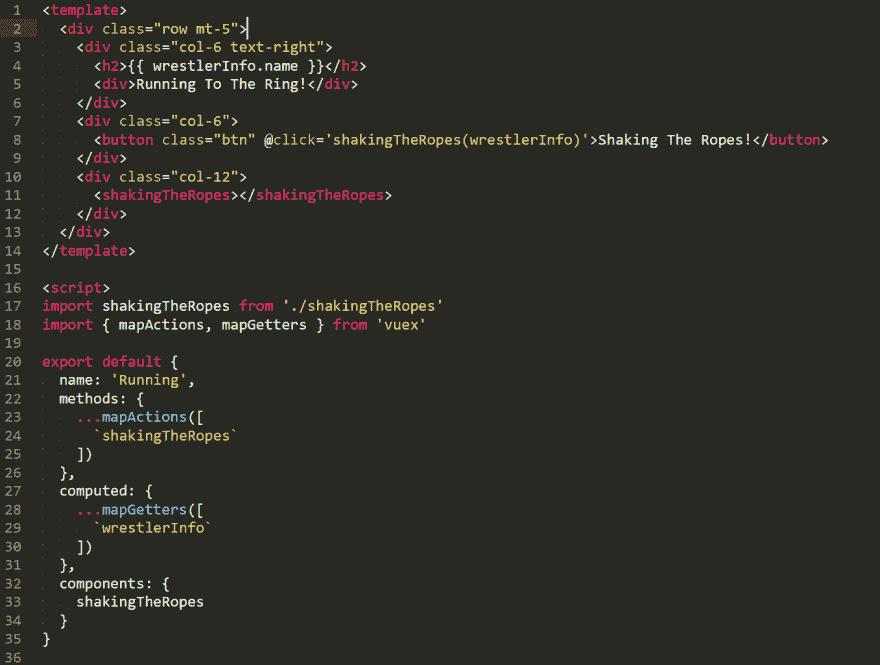](https://res.cloudinary.com/practicaldev/image/fetch/s--jJlkWNrm--/c_limit%2Cf_auto%2Cfl_progressive%2Cq_auto%2Cw_880/https://thepracticaldev.s3.amazonaws.com/i/0jqbpnv2gj9sm1pgpgaz.png) 
*在 runningToTheRing 组件中注册 shakingTheRopes 组件。还要添加 shakingTheRopes Vuex 动作和摔跤手信息获取帮助器，并从 Vuex 注册 mapAction 和 mapGetters 帮助器。*

[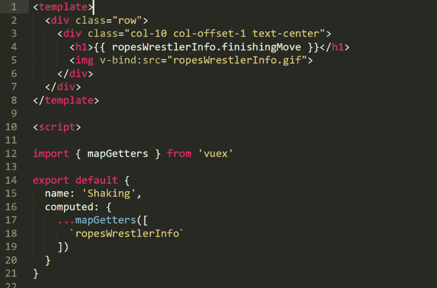](https://res.cloudinary.com/practicaldev/image/fetch/s--gQ57fHzW--/c_limit%2Cf_auto%2Cfl_progressive%2Cq_auto%2Cw_880/https://thepracticaldev.s3.amazonaws.com/i/sygza6nz4yyrrjuzk8dt.png) 
*最后在 shakingTheRopes 组件中为 ropesWrestlerInfo 添加一个 getter*

终极战士是一个复杂的摔跤手，他不只是肌肉发达。得益于他的训练和惊人的体格，他可以轻松应对任何挑战:

[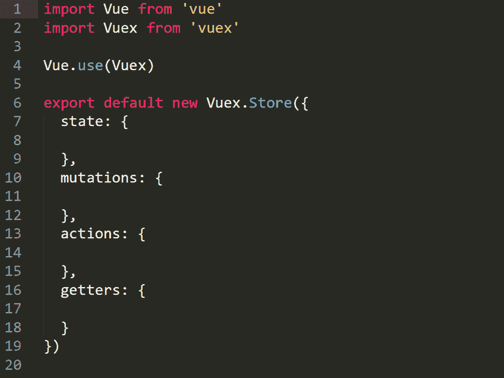](https://res.cloudinary.com/practicaldev/image/fetch/s--zj02D2ci--/c_limit%2Cf_auto%2Cfl_progressive%2Cq_auto%2Cw_880/https://thepracticaldev.s3.amazonaws.com/i/fp4eff6d43ddf23742dq.png) 
*空 Vuex 结构。我在 Vue-Cli 的初始安装中添加了 getters 部分。*

[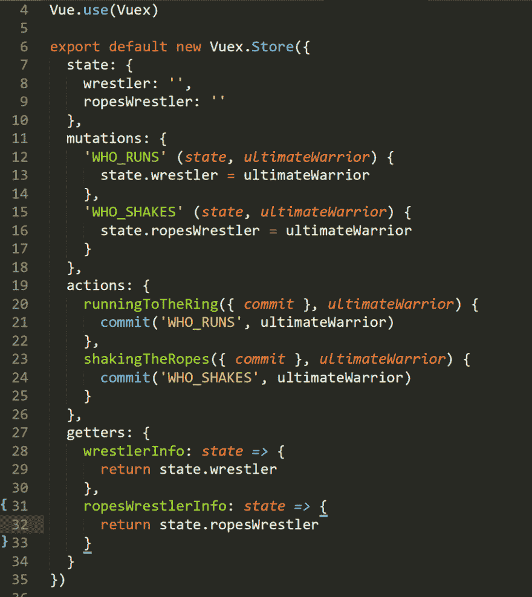](https://res.cloudinary.com/practicaldev/image/fetch/s--Wlvc6POq--/c_limit%2Cf_auto%2Cfl_progressive%2Cq_auto%2Cw_880/https://thepracticaldev.s3.amazonaws.com/i/ixgblx927aqd1nac4w7y.png) 
*Vuex 用所有动作、突变、状态、和 getters。*

我们在这里看到，终极战士可以将数据传递到他喜欢的任何地方。如果需要的话，他可以把它切成肉末，或者甚至与所有忠诚的小战士们分享。

[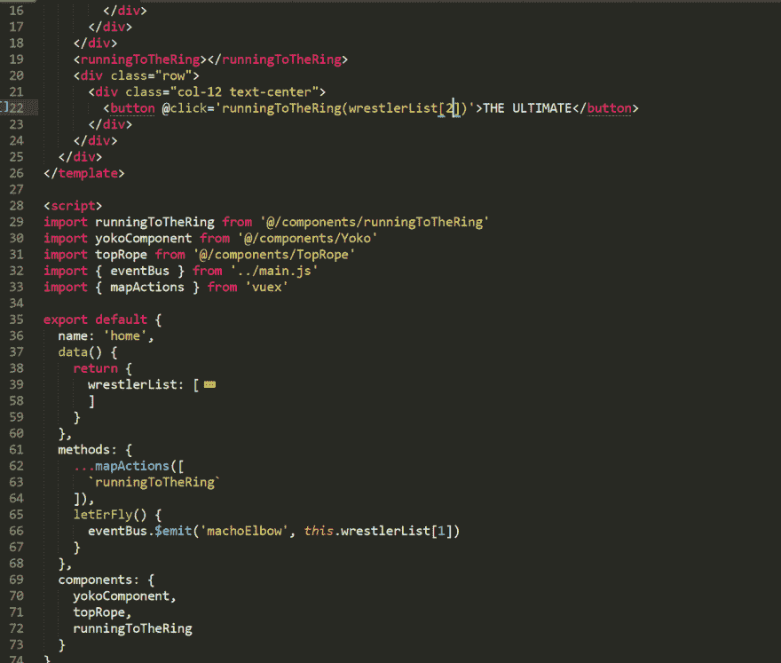](https://res.cloudinary.com/practicaldev/image/fetch/s--CwUNsqzD--/c_limit%2Cf_auto%2Cfl_progressive%2Cq_auto%2Cw_880/https://thepracticaldev.s3.amazonaws.com/i/r1rfnl82fuj17x33qjzq.png) 
*添加终极按钮，该按钮触发运行转移动作，该动作使用变异将终极战士的信息添加到状态中，并且可以作为获取器被取回。*

[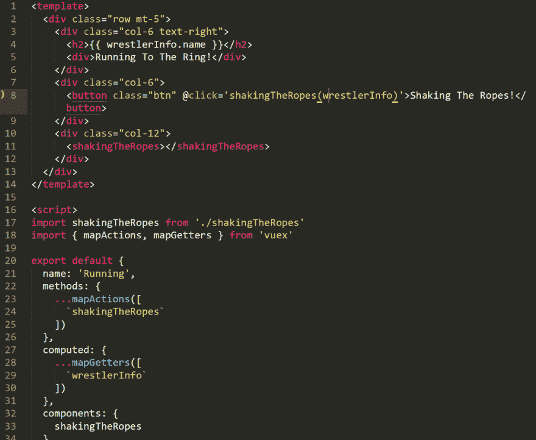](https://res.cloudinary.com/practicaldev/image/fetch/s--v_DPftiF--/c_limit%2Cf_auto%2Cfl_progressive%2Cq_auto%2Cw_880/https://thepracticaldev.s3.amazonaws.com/i/dv51hwwwhnzklezrdvk5.png)
*running othering 有类似的格式，只是它有一个动作和一个 getter。*

[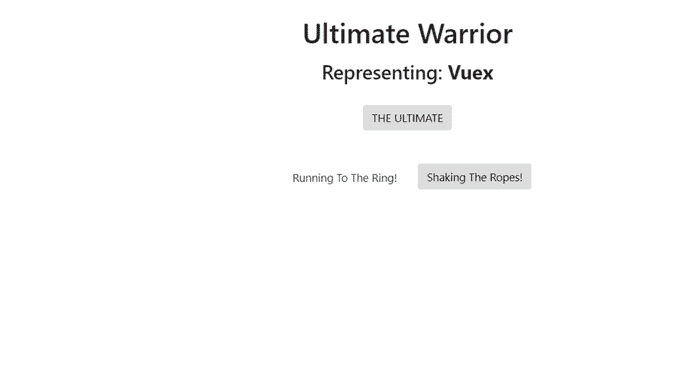T2】](https://res.cloudinary.com/practicaldev/image/fetch/s--y1UXJ9----/c_limit%2Cf_auto%2Cfl_progressive%2Cq_66%2Cw_880/https://i.imgur.com/qsTc16T.gif)

就这样了，伙计们。我想我们可以称之为平局。每个战士都展示了他们的装备。巨人之间的冲突引发了大量的故事。我相信我们很快会再次看到这场战斗。

要了解更多信息，请查看 VueJS 的优秀人员提供的精彩启发性文档:
[VueJS 文档](https://vuejs.org/v2/guide/)

直到下一次，这意味着基因结束。

[T2】](https://res.cloudinary.com/practicaldev/image/fetch/s--UFlaib3A--/c_limit%2Cf_auto%2Cfl_progressive%2Cq_66%2Cw_880/https://ringthedamnbell.files.wordpress.com/2018/01/geneo1.gif)