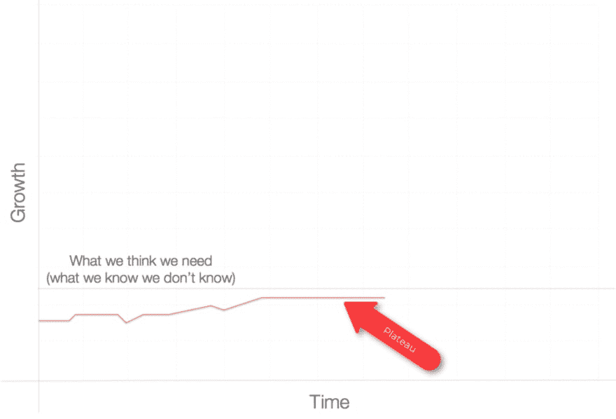
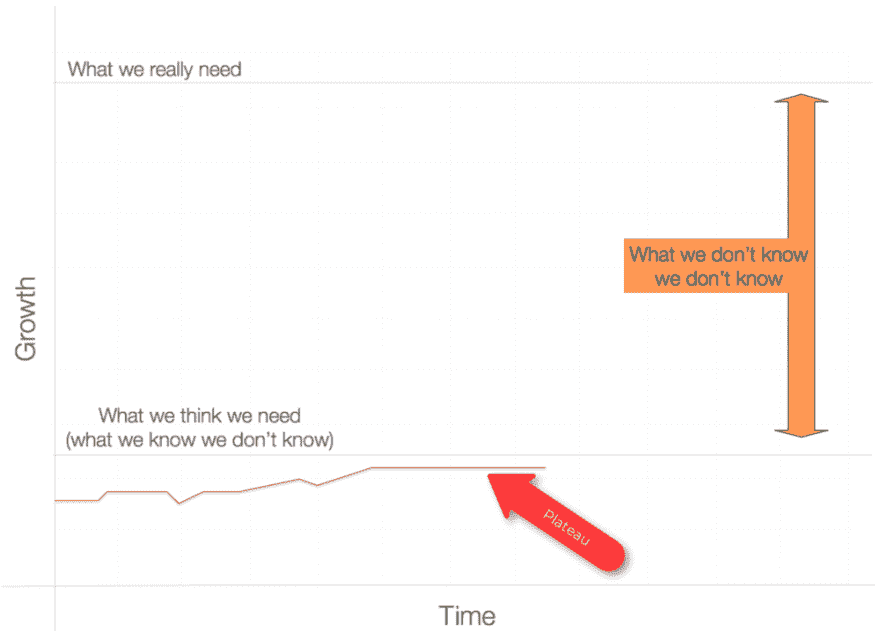
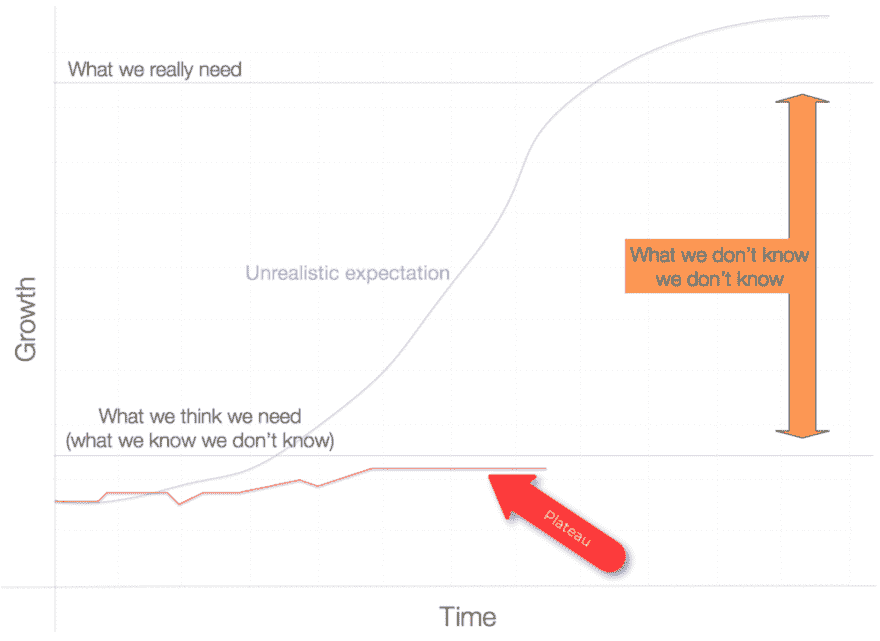
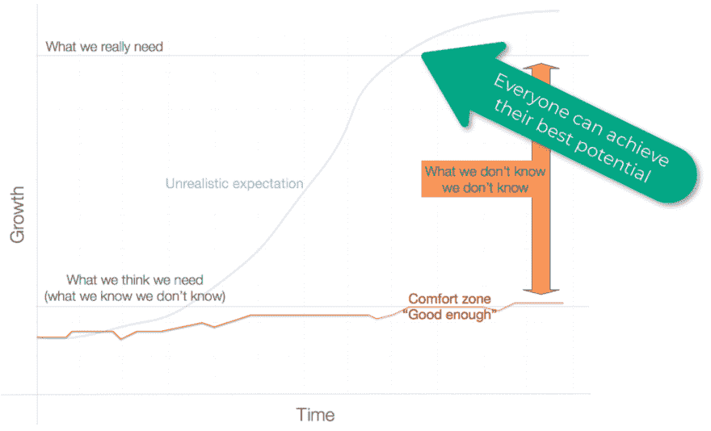
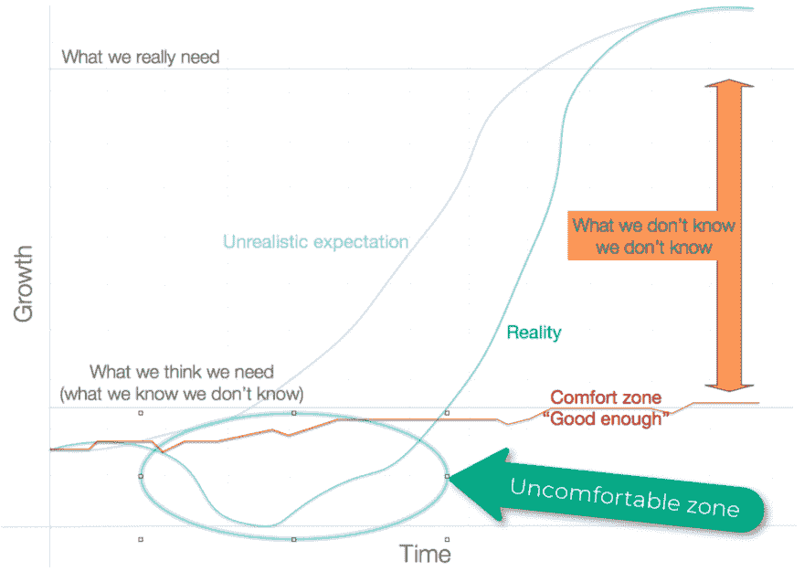

# 作为一名软件开发人员，你不进步的首要原因是什么

> 原文：<https://dev.to/essentialdeveloper/1-reason-why-you-dont-improve-as-a-software-developer-1mhk>

[https://www.youtube.com/embed/csm6kK8jUkY](https://www.youtube.com/embed/csm6kK8jUkY) [在 YouTube 上观看](https://www.youtube.com/watch?v=csm6kK8jUkY&list=PLyjgjmI1UzlT2jbk9WeqNrZhZyKpPPaWq)

在这段视频中，我们将讨论为什么我们设定了改进目标，但有时却无法实现它们的主要原因。

我们都有一个共同的趋势。这是人们面临的最古老的问题之一，作为我们进化的一部分，它深深根植于我们的大脑中。问题是:我们想要一些东西，但我们不想做需要做的事情。我们拖延并不惜一切代价避免做这项工作。换句话说，我们想避免不舒服的事情。

## 高原

我们的学习曲线通常是这样的:

[T2】](https://res.cloudinary.com/practicaldev/image/fetch/s--0YF82gR0--/c_limit%2Cf_auto%2Cfl_progressive%2Cq_auto%2Cw_880/https://static1.squarespace.com/static/5891c5b8d1758ec68ef5dbc2/t/5ba22d008a922da48d810837/1537355023367/graph-1-plateau.png%3Fformat%3D1000w)

我们想要学习新的东西，我们甚至可能认为我们知道我们需要什么(或者我们知道我们不知道什么)。我们所有人都会经历这一跌宕起伏的初始阶段，直到遇到障碍或停滞不前。感觉我们停止了前进。

当我们达到一个平台期，这并不意味着我们做错了什么，但往往是一个信号，我们需要做一些不同的事情。进步往往不是来自做同样的事情，产生同样平庸的结果。路障通常意味着我们应该回到基础，重新评估我们是否真的做对了。这是提高的最关键的一步。我们可能有一些需要调整的误解。

问题是我们可能甚至不知道我们真正需要什么。我们称这种差距为“我们不知道的我们不知道。”

[T2】](https://res.cloudinary.com/practicaldev/image/fetch/s--sgA-ltKJ--/c_limit%2Cf_auto%2Cfl_progressive%2Cq_auto%2Cw_880/https://static1.squarespace.com/static/5891c5b8d1758ec68ef5dbc2/t/5ba22d384d7a9c88ca62383d/1537355069841/%3Fformat%3D1000w)

更糟糕的是，我们通常期望持续增长。一直向上。在大多数情况下，持续增长是一种“不切实际的期望”。

[T2】](https://res.cloudinary.com/practicaldev/image/fetch/s--wJpusx-z--/c_limit%2Cf_auto%2Cfl_progressive%2Cq_auto%2Cw_880/https://static1.squarespace.com/static/5891c5b8d1758ec68ef5dbc2/t/5ba22d58aa4a99ebfd0b27c1/1537355103352/graph-3-unrealistic-expectation.png%3Fformat%3D1000w)

我们经常听到人们说:“开发人员不遵循好的实践，因为他们不知道它们或者不理解它们的价值。”我们认为这是一个谬论。

我们教的越多，遇到的越多，与开发人员合作的越多，我们就越发现许多开发人员已经知道他们应该做些什么来改进。许多开发人员知道哪些技能会让他们更上一层楼。他们不需要“收集更多的信息”——他们需要选择一条道路，行动起来，并保持纪律和专注。

## 舒适区(99%)

对稳定期的恐惧和对“调整期”的回避加上不切实际的期望造成了对进步的错误认知。这种错误的进步感也被称为“舒适区”

舒适区阻止我们实现我们真正想要的，甚至更糟的是，它可能会产生限制性的信念。我们经常听到开发者说“我真的试过 X/Y/Z，但是我就是做不到。”这是限制性的，不真实的。每个人都能做到。

[T2】](https://res.cloudinary.com/practicaldev/image/fetch/s--VisXZ94_--/c_limit%2Cf_auto%2Cfl_progressive%2Cq_auto%2Cw_880/https://static1.squarespace.com/static/5891c5b8d1758ec68ef5dbc2/t/5ba22d8b4d7a9c88ca623adf/1537355160108/graph-4-comfort-zone.png%3Fformat%3D1000w)

正如你在图表中看到的，红线显示了 99%的人选择的共同道路。舒适区。而且往往离我们真正需要的还很远。增长似乎下降的时候，可能是我们尝试新事物的时候——试图改善。当我们尝试一些事情时，表现下降是很自然的。问题是，我们大多寻求“持续增长的不切实际的期望”，并且我们回到我们所知道的(舒适的)。我们放弃得太快了。

而且平心而论，留在 99%或者舒适区也没什么不好。大多数人在这个地区都能过上体面的生活。然而，我们经常发现个人对他们的表现不满意，他们想要改进。

## 高绩效个人(占 1%)

例如，在学习骑自行车时，我们可能会比我们只是走路时走得慢。有人可能会说“走路比骑自行车更快更容易，为什么我要浪费更多的时间去平衡这种非常不舒服的交通方式呢？”当我们学习高级软件开发主题、协作技能、领导力、软件架构、自动化测试等时，也会发生同样的情况。

一个更现实的高绩效个人的方法类似于下图中的绿线。

[T2】](https://res.cloudinary.com/practicaldev/image/fetch/s--pbXnR5kS--/c_limit%2Cf_auto%2Cfl_progressive%2Cq_auto%2Cw_880/https://static1.squarespace.com/static/5891c5b8d1758ec68ef5dbc2/t/5ba22dc370a6adc92989d9b1/1537355211081/graph-5-uncomfortable-zone.png%3Fformat%3D1000w)

开始与其他人相似，但随着这些人明白要正确骑自行车，他们需要卸下支撑轮，摔倒几次，然后练习直到学会为止，增长速度会下降。起初，他们不得不慢下来，但是，随着他们学会骑自行车，他们将来会跑得更快。

> 我们的大脑主要是为了生存，而不是为了度过不舒服的阶段。

大多数时候，我们知道我们必须做些什么来改善。我们知道我们需要的技能。我们参加课程。我们读书。我们甚至练习了一段时间。但是我们没有纪律或焦点去继续做“我们知道我们应该做的事情”所以，我们知道什么并不重要。重要的是我们如何利用我们所知道的。

## 导师

开始学骑自行车时，这似乎是一项不可能完成的任务。令人难以置信的是，大多数人都学会了骑自行车。为什么？一个很大的原因是，通常有一个我们信任的人在推动和帮助我们度过恐惧(不舒服的阶段)。这就是为什么找到我们信任的导师如此重要。导师已经实现了我们想要的，并能引导我们通过艰难的阶段实现“不可能”但是，导师不能替我们做工作。我们必须这么做。

我们的大脑天生会避免不舒服的情况，这不是我们的错，但我们有责任对此做些什么。⛩

现在就订阅我们的 Youtube 频道，每周都能看到**的免费新剧集**。

* * *

最初发表于[www.essentialdeveloper.com](https://www.essentialdeveloper.com/articles/number-1-reason-why-you-dont-improve-as-a-software-developer)。

我们一直在帮助敬业的开发人员从低薪职位晋升到高层职位——有时只需几周时间！为了做到这一点，我们不断开展并分享关于如何提高你的技能的免费市场研究，同时牢记**同理心、诚信和经济学**。如果你想在事业上更上一层楼，[现在就免费获取我们的最新研究](https://www.essentialdeveloper.com/courses/career-and-market-strategy-for-professional-ios-developers)。

## 我们来连线

如果你喜欢这篇文章，请访问我们在[https://essentialdeveloper.com](https://essentialdeveloper.com)的网站，获得更多像这样的深度定制内容。

关注我们:[YouTube](https://youtube.com/essentialdeveloper)[Twitter](https://twitter.com/essentialdevcom)[脸书](https://facebook.com/essentialdeveloper)[GitHub](https://github.com/essentialdevelopercom)