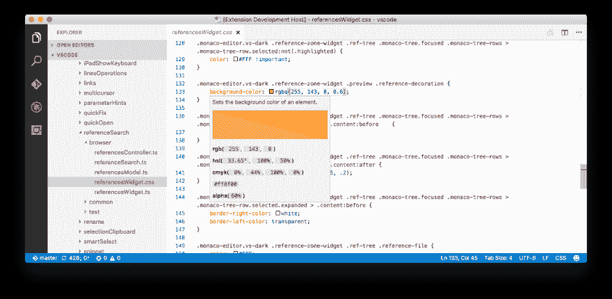
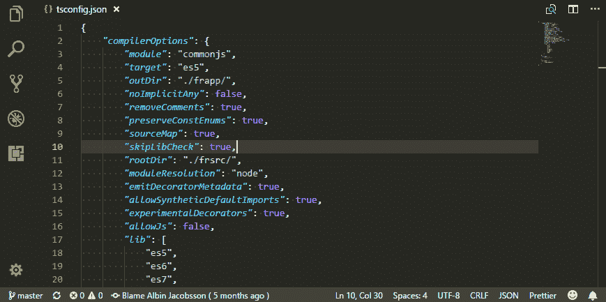
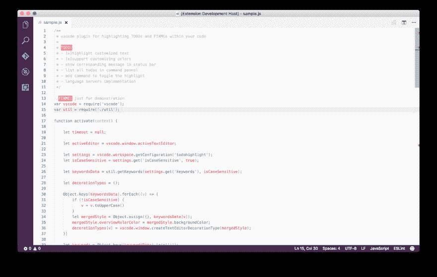
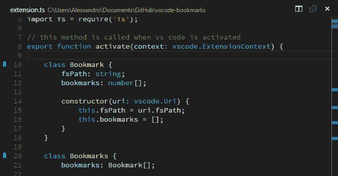
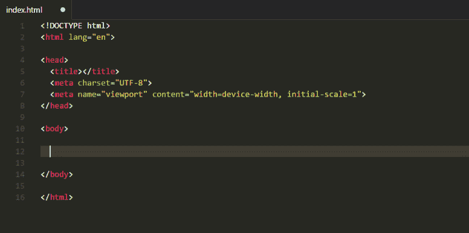

# VS 代码的 10 个基本扩展

> 原文：<https://dev.to/fbnlsr/10-essential-extensions-for-vscode-174i>

我使用 [Visual Studio 代码](https://code.visualstudio.com/)作为我的主要代码编辑器已经两年多了。我曾经使用 Sublime Text，这是一个非常棒的软件(尤其是来自 Notepad++的软件)，但是微软的家伙们一直在做着令人惊叹的工作，让他们的编辑器成为最好的，他们每月的更新显示了他们是多么专注于不断改进它。

所以这是我选择的编辑器，但是如果没有好的扩展，一个好的编辑器将一无是处。我已经列出了我最喜欢的 10 个(外加几个)扩展，没有它们我无法生活。它们让我的日常工作变得更加容易，从长远来看，也让我节省了很多时间。以下是他们(排名不分先后):

**[颜色信息](https://marketplace.visualstudio.com/items?itemName=bierner.color-info)**

VS 代码为 CSS 文件中的颜色提供了一个小小的预览框。“颜色信息”允许您更好地查看鼠标悬停时的颜色，包括 CMYK 或 alpha 值。它甚至可以充当拾色器，真的很方便。

[T2】](https://res.cloudinary.com/practicaldev/image/fetch/s--J2t5Hnox--/c_limit%2Cf_auto%2Cfl_progressive%2Cq_auto%2Cw_880/https://thepracticaldev.s3.amazonaws.com/i/hae977g3emyifm5krz67.png)

**[:emojisens:](https://marketplace.visualstudio.com/items?itemName=bierner.emojisense)**

你知道[我喜欢表情符号](https://dev.to/blog/lets-talk-about-emojis/)。此扩展允许您直接在文件中插入表情符号或键入表情符号代码。假设您希望插入一个操纵杆表情符号。例如，只要开始输入`:joy`，你就会得到一个自动完成的窗口弹出，允许直接插入🕹图标。如果你输入`::joy`，它会插入`:joystick:`以及表情符号的预览。太棒了！

**[饭桶怪](https://marketplace.visualstudio.com/items?itemName=waderyan.gitblame)**

顾名思义，这个简单的扩展在状态栏中显示当前选中行的`git blame`。

[T2】](https://res.cloudinary.com/practicaldev/image/fetch/s--qtdI9qg5--/c_limit%2Cf_auto%2Cfl_progressive%2Cq_66%2Cw_880/https://thepracticaldev.s3.amazonaws.com/i/n256ltijk2rc0459ngsg.gif)

**三合一**

我绝对喜欢减价。实际上，这个网站大量使用了 markdown，因为它是由 Hugo 创建的。这个扩展通过添加快捷方式来帮助你写 Markdown，比如用`Cmd + B`写粗体、`Cmd + I`写斜体等等。太方便了！

**[设置同步](https://marketplace.visualstudio.com/items?itemName=Shan.code-settings-sync)**

如果你像我一样在多个(有时是虚拟的)机器上工作，这个扩展太棒了！由于 Github Gist 可以下载/上传，它允许你同步你的设置和扩展。

**[待办事宜高亮](https://marketplace.visualstudio.com/items?itemName=wayou.vscode-todo-highlight)**

顾名思义，它突出显示了 TODOs、FIXMEs 和您指定的任何关键字。只要在某个地方写下`TODO:`，它不仅会高亮显示，还会列出你已经在项目中任何地方写过的所有内容。

[T2】](https://res.cloudinary.com/practicaldev/image/fetch/s--I3UVHrdq--/c_limit%2Cf_auto%2Cfl_progressive%2Cq_auto%2Cw_880/https://thepracticaldev.s3.amazonaws.com/i/d06i7koqopg63eq4u41q.png)

**[Vetur](https://marketplace.visualstudio.com/items?itemName=octref.vetur)T3】**

这个分机是 Vue 的瑞士刀。从自动完成到代码片段，它是任何前端开发人员的必备工具。

**[拼写正确](https://marketplace.visualstudio.com/items?itemName=ban.spellright)**

一个多语言，离线和“轻量级”拼写检查器。Spell Right 使用您的内置字典来检查错误，并且可以在项目中的任何地方以任何(甚至多种)语言检查错误。不过要小心大文件，因为它有时需要一些时间来操作。我通常默认关闭它。只需点击状态栏中的眼睛图标，就可以很容易地要求它进行拼写检查。

**[编辑配置为 VS 代码](https://marketplace.visualstudio.com/items?itemName=EditorConfig.EditorConfig)**

奇怪的是，VS 代码默认不支持 [EditorConfig](http://editorconfig.org/) 。只要安装这个扩展，它就会立即开始监听它遇到的任何`.editorconfig`文件。

**[书签](https://marketplace.visualstudio.com/items?itemName=alefragnani.Bookmarks)**

现在这个我经常用！书签是一个扩展，可以把蓝色的小书签放到你的文件槽里。当您需要在文件中的位置之间切换时，或者当您需要在项目中的任何位置进行快速提醒时，这非常方便。我用`shift + cmd + =`(切换书签)和`shift + cmd + -`(下一个书签)设置了我的书签，多亏了这个，我不用离开键盘就可以在文件间跳跃。该扩展还在文件浏览器的正下方添加了一个小面板，列出了当前项目中所有活动的书签。必备。

[T2】](https://res.cloudinary.com/practicaldev/image/fetch/s--fxW8Lqki--/c_limit%2Cf_auto%2Cfl_progressive%2Cq_auto%2Cw_880/https://thepracticaldev.s3.amazonaws.com/i/uxorg08yz8gywxej0jfa.png)

## 优秀奖

**自动档名**

这个扩展非常简单。只需键入文件/目录的开头，它会自动为您补全其名称。当你需要指向`node_modules`中的一个文件时非常方便。

**[cdnjs](https://marketplace.visualstudio.com/items?itemName=JakeWilson.vscode-cdnjs)**

多亏了 Webpack，大多数时候我都在 Javascript 文件中注入依赖项。但是每当我需要快速模拟一些东西时，这个扩展都会支持我。使用命令面板，您将能够插入所有库 cdnjs 句柄的 URL 或脚本/样式标签。相当方便。

[T2】](https://res.cloudinary.com/practicaldev/image/fetch/s--pyml9XiH--/c_limit%2Cf_auto%2Cfl_progressive%2Cq_66%2Cw_880/https://thepracticaldev.s3.amazonaws.com/i/k3pxsij2se6quz9c2ppm.gif)

有一个要分享吗？

下面是我每天使用的几个扩展。如果你有我应该看看的，点击评论区或[给我发推文](https://twitter.com/fbnlsr)！