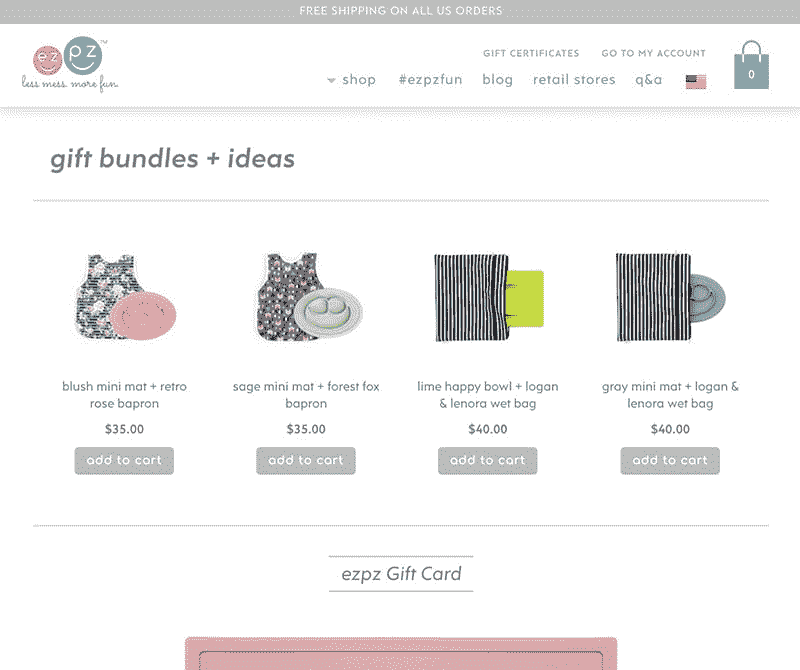
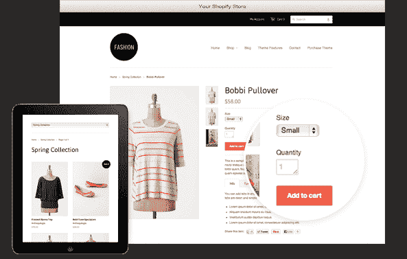

# 10 大妙招提升你的假期销售

> 原文：<https://dev.to/alexxpaull/10-great-hacks-to-boost-your-sales-this-holiday-season-418c>

[T2】](https://res.cloudinary.com/practicaldev/image/fetch/s--idmhg-VB--/c_limit%2Cf_auto%2Cfl_progressive%2Cq_auto%2Cw_880/https://thepracticaldev.s3.amazonaws.com/i/rbwztj8hyyzcs9bqfsbw.png)

如果你想销售你的产品并建立长期客户，那么你必须给他们提供一些优势，让他们购买你的产品。作为一个 WooCommerce 所有者，你应该忽略所有的营销方面，包括你的利基，你的目标受众，当然还有你的产品，这是你的资产，在专注于所有这些事情之后，你将开始为假期建设你的商店。众所周知，开一家网上商店并进行管理并不是一件容易的事情。大多数情况下，店主在网上开店时会忽略一些小事，而这些小事会对收入以及节日期间商店的业绩产生重大影响。

大多数顾客对网上商店有一定的期望。如果这些期望没有得到满足，那么你的客户将永远不会回来，并可能分享一个关于你的产品和服务的差评。

为了帮助你，这里有 10 个简单的窍门，让你为假日季的网上 WooCommerce 商店做好准备。

**1。选择您的平台**

市场上有很多选择，但我建议你在 WooCommerce 上开一个网上商店。WooCommerce 周围的社区非常棒，而且你会发现一些扩展可以帮助你使你的 WooCommerce 商店表现良好。

**2。选择托管的 WooCommerce 主机**

 
管理你的网上商店是一项长期的工作，在这个阶段，你将面临许多管理你的商店的挑战。大多数店主没有管理服务器和安全相关问题的经验。这就是专家推荐 [***托管 WooCommerce 托管***](https://www.cloudways.com/en/hosting-woocommerce.php) 开网店的原因。所有的问题，无论是与服务器，主机等将由主机提供商管理。他们还保证你的定期备份。

**3。速度快可以促进销售**

 
你在网上开网店的速度是直接影响你收入的重要因素之一。页面加载时间长、速度慢的在线商店会破坏用户体验，甚至一秒钟的延迟都会导致你的转化率下降，所以优化你的在线商店是必要的，以避免糟糕的用户体验。

**4。响应式设计**

 
大部分销售来自假日季节的智能手机。这就是为什么你的商店必须有一个响应式的设计，以确保你的 WooCommerce 商店易于浏览。

**5。吸引人的设计和布局**

 
大部分顾客只是因为店面凌乱而反弹。顾客想要一个有吸引力并且容易找到他们想要的东西的商店。为一个设计良好的商店投入时间和金钱，通过高转化率来回报他们。

推荐的 2018 年热门主题

[***雅特主题***](https://www.cloudways.com/en/astra-theme-partnership.php)
[***ocean WP 主题***](https://www.cloudways.com/en/oceanwp-theme-partnership.php)

**6。创建一个包含礼物创意的页面**

 
创建一个礼品页面是促进销售的最佳方式之一，因为访问者总是在为他们所爱的人寻找一些好的节日礼物。此外，你可以提供一些交易，在这个假期提供折扣，以吸引顾客到你的商店来促进你的销售。

**7。提供免费送货服务**

 
大多数购物者不愿意支付他们所购物品的运费。如果可能的话，在假日季节给他们免费送货，或者对特定数量的购买提供任何折扣。

**8。使用安全支付网关**

 
如今的顾客更关心他们的支付和信用卡的安全。他们在寻找安全的支付网关，以确保他们的信用卡得到保护。在 WooCommerce store 上，您可以通过 Stripe Payment Gateway 或任何其他可用的扩展工具轻松设置安全支付选项。

**9。让您的客户参与进来**

 
利用社交媒体为这个假期推出一个小活动来提高你的销售额。客户使用社交媒体作为购买产品的替代资源。这是在促销过程中吸引顾客的最佳方式。

10。简化购买流程

 这个假期，计划用一个简单的单页结账程序来取代你的结账程序。