# 新加坡 10 家最受欢迎的应用开发公司

> 原文：<https://dev.to/neerajs29318246/10-most-trending-app-development-companies-in-singapore--5ak7>

雇佣合适的应用开发团队是应用成功背后最关键的因素之一。

无论你的 app 创意多么强大，如果执行不当，都无法赢得用户的心。

如果你想让你的应用脱颖而出，那就去找一个重视你的时间和投资，理解你的想法并把它当成自己的想法，并且不遗余力地把想法变成现实的人。

总之，**选择合适的 app 开发团队**。

虽然，关注的是！

找到重视你的时间和资源的应用程序开发团队容易吗？

不是的！

数以百万计的应用程序开发公司在新加坡提供服务。每个人都声称自己比别人更好。在这一切之中，你如何决定哪一个才是适合你的呢？

这里有一个新加坡最受欢迎的应用程序开发公司的列表，你可以信任这些公司来外包你的项目。

**1。Vinova**
[Vinova](https://vinova.sg/) 自 2010 年以来，凭借新一代移动应用、网络应用和移动游戏，革新了新加坡的应用开发市场。

凭借多年的行业经验，受欢迎的企业作为客户，以及其投资组合中无数的创新应用，该公司理所当然地在榜单上排名第一。

**预算:**$ 25-$ 49/小时
**团队规模:** 10-49 人

**服务重点**
[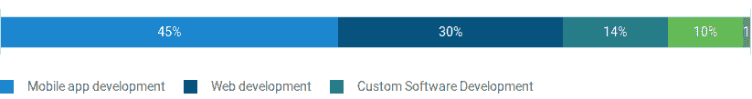](https://res.cloudinary.com/practicaldev/image/fetch/s--Muww8mcu--/c_limit%2Cf_auto%2Cfl_progressive%2Cq_auto%2Cw_880/https://thepracticaldev.s3.amazonaws.com/i/ims7geihyns06oae1m3v.png)

**客户端焦点**
[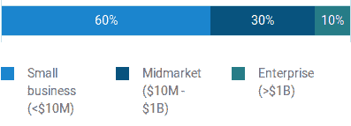](https://res.cloudinary.com/practicaldev/image/fetch/s--q52d67FN--/c_limit%2Cf_auto%2Cfl_progressive%2Cq_auto%2Cw_880/https://thepracticaldev.s3.amazonaws.com/i/zx1yps4onm0eb7bf0993.png)

**行业焦点**
[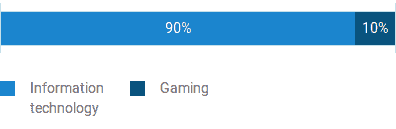](https://res.cloudinary.com/practicaldev/image/fetch/s--mn7yLNiG--/c_limit%2Cf_auto%2Cfl_progressive%2Cq_auto%2Cw_880/https://thepracticaldev.s3.amazonaws.com/i/bhkmju6pe4rceoc97nf4.png)

**2。Rainmaker Labs**
[Rainmaker Labs](http://rainmaker-labs.com/)在为初创公司和企业创建令人惊叹的移动应用程序方面拥有五年的经验，其中许多应用程序多次获得用户赞赏。

该公司脱颖而出的另一个原因是，他们使用移动营销自动化云等最先进的技术，来提供最佳的用户体验，并最大限度地提高用户参与度。

**项目预算:**最小值。1000 美元
T3 团队规模:50–249 人

**服务重点**

**客户端焦点**
[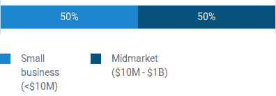](https://res.cloudinary.com/practicaldev/image/fetch/s--abGdtk6d--/c_limit%2Cf_auto%2Cfl_progressive%2Cq_auto%2Cw_880/https://thepracticaldev.s3.amazonaws.com/i/m2m87kpauqz43a17dnq4.png)

**3。Applify**
不仅是他们对完美和创新的热情，还有他们提供定制解决方案的能力，帮助 [Applify](https://www.applify.co/) 成为全球领先的移动解决方案提供商，包括新加坡应用开发市场。

这是一个全球性的存在，他们的客户包括 NLGIC、PETA 和 SThree Group 等受欢迎的企业，以及无数获奖的应用程序，这很好地解释了 Applify 为什么如此受欢迎，并在榜单上排名第三。

他们还提供可穿戴应用开发和聊天机器人开发服务。

**项目预算:**$ 10000+
**小时费率:**$ 25-$ 49/小时
**团队规模:** 10-49

**服务重点**
[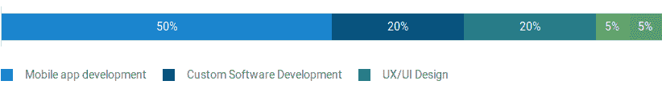](https://res.cloudinary.com/practicaldev/image/fetch/s--2GDeESRX--/c_limit%2Cf_auto%2Cfl_progressive%2Cq_auto%2Cw_880/https://thepracticaldev.s3.amazonaws.com/i/r1qft6jzpc43gyq3qnb8.png)

**客户端焦点**
[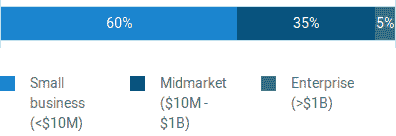](https://res.cloudinary.com/practicaldev/image/fetch/s--YAE-dbkq--/c_limit%2Cf_auto%2Cfl_progressive%2Cq_auto%2Cw_880/https://thepracticaldev.s3.amazonaws.com/i/sgcuze1jixlekk7ahcb7.png)

**行业焦点**
[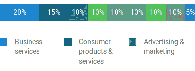](https://res.cloudinary.com/practicaldev/image/fetch/s--LWvQ94FN--/c_limit%2Cf_auto%2Cfl_progressive%2Cq_auto%2Cw_880/https://thepracticaldev.s3.amazonaws.com/i/kyhiq6q9uqh6yoyltws0.png)

**4。让我们培育**
[让我们培育](https://www.letsnurture.com/)于 2008 年成立，当时是一家小型网络和移动应用开发公司。今天，它已经出现在应用程序开发的每个领域，无论是游戏开发，可穿戴应用程序开发，还是聊天机器人开发。

凭借 10 多年的经验、1000 多个成功的应用程序和一些广受好评的企业客户，他们成为了新加坡领先的应用程序开发公司之一。

**项目预算:**最小值。5000 美元
**时薪:**【25-49 美元/小时
**员工:** 50-249

**服务重点**
[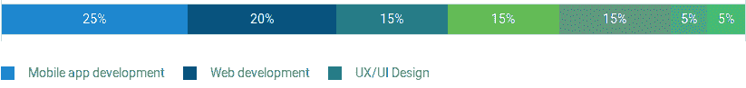](https://res.cloudinary.com/practicaldev/image/fetch/s--nsXoILjG--/c_limit%2Cf_auto%2Cfl_progressive%2Cq_auto%2Cw_880/https://thepracticaldev.s3.amazonaws.com/i/bs9t54nhsqc4ao0tsrm6.png)

**客户端焦点**
[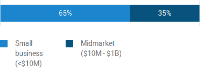](https://res.cloudinary.com/practicaldev/image/fetch/s--lJpeuID5--/c_limit%2Cf_auto%2Cfl_progressive%2Cq_auto%2Cw_880/https://thepracticaldev.s3.amazonaws.com/i/ktstqe3xgnozb108mq9y.png)

**行业聚焦**T2[T4](https://res.cloudinary.com/practicaldev/image/fetch/s--_wZgs7v6--/c_limit%2Cf_auto%2Cfl_progressive%2Cq_auto%2Cw_880/https://thepracticaldev.s3.amazonaws.com/i/1buj4p5plxqnvp96x387.png)

**5。乐百氏科技公司**
[乐百氏科技公司](https://robusttechhouse.com/)专门为电子商务、移动商务和金融技术开发尖端的移动应用和网站。
他们的团队由技术、保险和金融专家提供建议，其中一些专家是 CFA、CAIA 和新加坡意外保险精算学会等机构的成员。

**团队规模:** 11-50 人

**服务重点**
移动应用开发、网页开发、电子商务、移动商务、金融科技、金融科技

**行业聚焦**
电子商务、金融

**6。Monster Labs**
在移动应用程序开发方面拥有十多年的经验，数百名满意的客户，以及数千个成功的项目， [Monster labs](http://www.mymonsterlabs.com/) 是新加坡最值得信赖的应用程序开发公司之一。

**项目预算:**75，000 美元以上

**每小时费用:** $50-$99

团队规模: 250-999 人

**服务重点**
[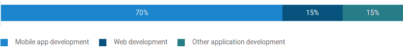](https://res.cloudinary.com/practicaldev/image/fetch/s--e_ZTx-FQ--/c_limit%2Cf_auto%2Cfl_progressive%2Cq_auto%2Cw_880/https://thepracticaldev.s3.amazonaws.com/i/zutw0yhmv5sfl4jvki35.png)

**客户端焦点**
[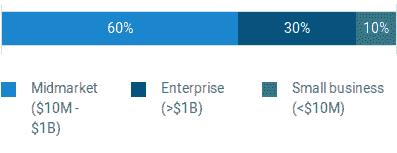](https://res.cloudinary.com/practicaldev/image/fetch/s--rAakDRjq--/c_limit%2Cf_auto%2Cfl_progressive%2Cq_auto%2Cw_880/https://thepracticaldev.s3.amazonaws.com/i/es3t5c8zpx3d8dbujqfx.png)

**行业焦点**
[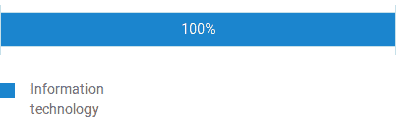](https://res.cloudinary.com/practicaldev/image/fetch/s--41mB7CR2--/c_limit%2Cf_auto%2Cfl_progressive%2Cq_auto%2Cw_880/https://thepracticaldev.s3.amazonaws.com/i/agl1gdmech420ji378ya.png)

**7。Octal IT Solution**
在其作为应用程序开发人员的 13 年漫长历程中， [Octal IT Solution](https://www.goodfirms.co/company/octal-it-solution) 成功地将无数想法以革命性应用程序的形式转化为现实，帮助数百人实现了他们的业务目标，并与 Skype、微软、NASSCOM 等科技巨头建立了合作关系。

**项目预算:**5000 美元以上

**团队规模:**$ 25-$ 49/小时

**服务重点**
[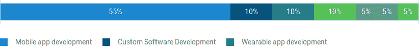](https://res.cloudinary.com/practicaldev/image/fetch/s--npNT2fWj--/c_limit%2Cf_auto%2Cfl_progressive%2Cq_auto%2Cw_880/https://thepracticaldev.s3.amazonaws.com/i/rd0vsnx70grbsywq81w3.png)

**客户端焦点**
[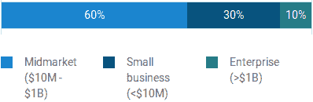](https://res.cloudinary.com/practicaldev/image/fetch/s--GkV6AHtk--/c_limit%2Cf_auto%2Cfl_progressive%2Cq_auto%2Cw_880/https://thepracticaldev.s3.amazonaws.com/i/12tozzkd3dzwictuk923.png)

**行业焦点**
[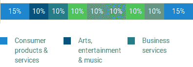](https://res.cloudinary.com/practicaldev/image/fetch/s--DjDBJ0XE--/c_limit%2Cf_auto%2Cfl_progressive%2Cq_auto%2Cw_880/https://thepracticaldev.s3.amazonaws.com/i/mx4p0pflugc8yqzhspft.png)

**8。明实验室**
[明实验室](https://minglabs.com/en)是另一家应用程序开发公司，多年来创造了移动应用程序来吸引、激励和愉悦用户。他们的应用程序之所以广受认可，像西门子、阿迪达斯、迪士尼和新加坡电信这样的大公司都是他们的客户。

他们还提供业务和服务模型设计、数据可视化和项目概念创建服务。

**项目预算:**$ 5000+
**小时费率:**$ 100-$ 249/小时
**团队规模:** 50-249

**服务重点**
[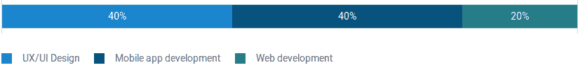](https://res.cloudinary.com/practicaldev/image/fetch/s--ELJqL5Ts--/c_limit%2Cf_auto%2Cfl_progressive%2Cq_auto%2Cw_880/https://thepracticaldev.s3.amazonaws.com/i/q4ixnowueu7z7xkxjwju.png)

**行业焦点**
[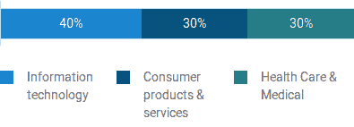](https://res.cloudinary.com/practicaldev/image/fetch/s--AL3H1bZg--/c_limit%2Cf_auto%2Cfl_progressive%2Cq_auto%2Cw_880/https://thepracticaldev.s3.amazonaws.com/i/404wkgs5brcb24pzx9ow.png)

**9。Mobiloitte**
[Mobiloitte](https://www.mobiloitte.com/)自 2005 年开始从事软件和移动应用开发业务，已经为娱乐&音乐、教育、交通、零售、医疗保健等行业开发了无数应用和软件。

除此之外，他们还提供聊天机器人、物联网和数字营销服务。
**项目预算:**【1000 美元+】
**团队规模:** 250-999

**服务重点**

**客户端焦点**
[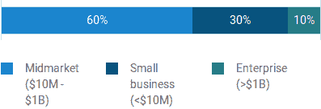](https://res.cloudinary.com/practicaldev/image/fetch/s--E-94AFmT--/c_limit%2Cf_auto%2Cfl_progressive%2Cq_auto%2Cw_880/https://thepracticaldev.s3.amazonaws.com/i/zinc3jxlwmlhn8xjmwij.png)

**行业焦点**
[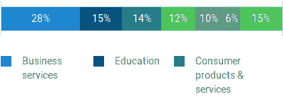](https://res.cloudinary.com/practicaldev/image/fetch/s--4IqQeILU--/c_limit%2Cf_auto%2Cfl_progressive%2Cq_auto%2Cw_880/https://thepracticaldev.s3.amazonaws.com/i/ajsw801cfswr3cq6j8fb.png)

10。Indus Net
[Indus Net](https://www.indusnet.co.in/)是一家新兴的应用程序开发公司，主要专注于移动应用程序开发、移动游戏开发、物联网和可穿戴应用程序开发。到目前为止，他们已经为受欢迎的企业和政府机构开发了许多应用程序。

**项目预算:** $5000+
**小时费率:**$ 25-$ 49/小时
**团队规模:** 250-999

**服务重点**
[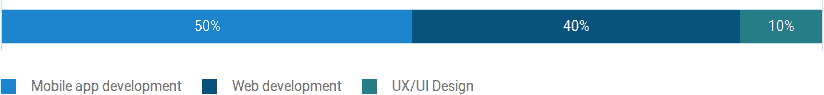](https://res.cloudinary.com/practicaldev/image/fetch/s--CurgVNUw--/c_limit%2Cf_auto%2Cfl_progressive%2Cq_auto%2Cw_880/https://thepracticaldev.s3.amazonaws.com/i/k1g3auwvlrqo5s12ogp6.png)

**客户端焦点**
[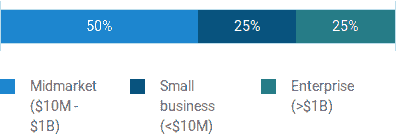](https://res.cloudinary.com/practicaldev/image/fetch/s--pg83Seyf--/c_limit%2Cf_auto%2Cfl_progressive%2Cq_auto%2Cw_880/https://thepracticaldev.s3.amazonaws.com/i/czwohahjkqa92bh5dwlx.png)

**行业焦点**
[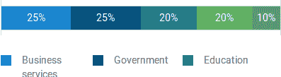](https://res.cloudinary.com/practicaldev/image/fetch/s--V3pfJlrU--/c_limit%2Cf_auto%2Cfl_progressive%2Cq_auto%2Cw_880/https://thepracticaldev.s3.amazonaws.com/i/6zsosm3e50lqiivfth8z.png)

希望上面的列表可以帮助你选择最好的应用程序开发公司，创建一个最适合你的需求和期望的应用程序！

资料来源:Clutch.co