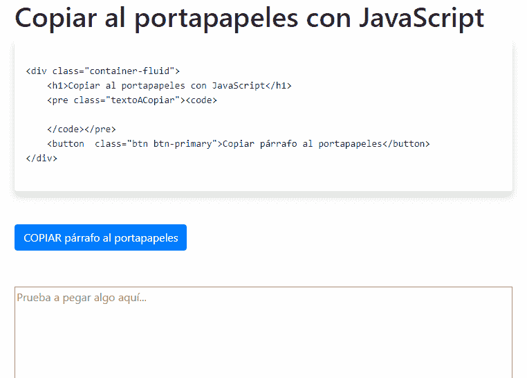

# 使用 JavaScript 将文本复制到剪贴板-经典方法

> [https://dev . to/jmalarcon/copy-from-text-al-clipboard-con-JavaScript---mtodo-classic-4m 0 f](https://dev.to/jmalarcon/copiado-de-texto-al-portapapeles-con-javascript---mtodo-clsico-4m0f)

直到几年前，通过编程使人们能够复制(或剪切)一页的内容并将其放到剪贴板上并不那么容易。

[](https://res.cloudinary.com/practicaldev/image/fetch/s--1yGzgQdg--/c_limit%2Cf_auto%2Cfl_progressive%2Cq_auto%2Cw_880/https://www.jasoft.org/Blog/image.axd%3Fpicture%3D/2018/Astronauta-Taylor-Fumando.jpg) 也就是说，如果你的内容页面上有代码片段，而你想**放一个【复制】按钮，方便你的访问者将其复制到剪贴板上，事情就不简单直接了当了。事实上，如果你想确保它能在所有的导航器上工作，你就必须使用闪光灯**，这种做法今天至少对我来说，产生的惊喜和乐趣就像看到宇航员泰勒(由查尔顿·赫斯顿主演)在 1968 年人猿星球的宇宙飞船舱里抽烟一样多。】****

 **Internet Explorer 9 引入了通过在页面上发出特定命令来执行这些操作的可能性，通过`execCommand`方法，我们将很快看到(该方法早在很早以前就引入了，但并没有随它复制到剪贴板的可能性)。其馀浏览器随后将其嵌入。由于 IE9 于 2011 年初发布，这些旧版本浏览器的市场份额一直保持在一定程度上(幸运的是)，而且所有现代浏览器都是*【常青】*并支持，这种方法已成为允许从一页、中间复制信息的最常见方式仅当您迫切需要允许从 ie 9 之前的版本按代码复制到剪贴板时，才应使用 Flash。

让我们看一下如何利用此功能，在稍后的文章中，我们将看到一种更现代、更高效的方法来实现此功能，但支持更少。

## 文件的执行命令方法

使用此方法非常简单，但在复制/剪切文档内容时，需要考虑其重要的详细信息。

`execCommand`方法一般采用三个参数:

*   包含要执行的命令的文本字符串
*   用于确定是否显示接口的布尔值
*   依赖于命令的任意值，是要传递给命令的信息

在复制或剪切信息的特定情况下，所需的三种信息中只有一种:命令，因为其他命令在此情况下没有用处。因此，相应的字符串仅仅是`'copy'`和`'cut'`，分别用于复制和剪切。

> **注**:两者工作方式相同，但剪切的工作方式只适用于实际上可以剪切的内容，例如文字输入框内的文字，而不适用于段落。通常仅使用第一个:复制。

要强制复制您在页面上选择的内容，只需键入:

```
var res = document.execCommand('copy'); 
```

Enter fullscreen mode Exit fullscreen mode

方法返回`false`(如果成功复制到剪贴板)，或`false`(如果不成功)。

发生的情况是，如我所说，要使其工作并复制某个东西，必须先选中它。因此，在这种情况下，真正的挑战恰恰是以透明和不经意间的方式作出这种选择。

因此，要使命令正常工作，需要执行以下步骤:

1.  选择要复制到剪贴板的内容
2.  执行 execcommand 以复制
3.  取消选择内容，使其保持原样

## 内容选择

通过使用浏览器窗口中的“**选择范围”**和“**选择方法”([JavaScript 全局对象)来处理内容选择](https://www.jasoft.org/Blog/post/Como-obtener-una-referencia-al-ambito-global-en-cualquier-entorno-JavaScript-HTML-Nodejs-Windows-Scripting-Host.aspx)**

要进行选择，首先需要创建一个范围/范围，指示一个或多个图元将成为范围/范围的一部分，然后将其添加到当前选择中。

代码如下:

```
var codigoACopiar = document.getElementById('textoACopiar');
var seleccion = document.createRange();
seleccion.selectNodeContents(codigoACopiar);
window.getSelection().removeAllRanges();
window.getSelection().addRange(seleccion);
var res = document.execCommand('copy');
window.getSelection().removeRange(seleccion); 
```

Enter fullscreen mode Exit fullscreen mode

上一段中的步骤包括:

1.  **选择包含要复制的文本**的 HTML 节点，在这种情况下，只需通过其 ID，在更一般的情况下，将根据我们的需要使用其他方法(例如，复制按钮后面的元素或相应的)
2.  **使用**方法创建选择范围，该文档将为空。
3.  **使用选取范围的 selectNodeContents 方法，将第一步 DOM 中的元素**加入选取范围。这将导致以后复制其内容
4.  **取消选中**页面上先前选中的任何内容。这实际上只对 Microsoft Edge 浏览器是必要的，因为在其他浏览器(包括 Internet Explorer)中并不需要这样做。但是在 Edge 上，如果我们不这样做，复制命令就会失败，所以如果我们将它包括在内，我们将始终没有问题，并确保更好的兼容性。小细节！
5.  **通过窗口中的**方法进行内容选择，分别获取当前选择(由于前一行而变为空白)，并将步骤 2 中的间隔/范围添加到选择中。
6.  **发布拷贝命令**，这是我们感兴趣的。以上只是准备工作。
7.  **项**被取消选中，因为如果不取消选中，它将在页面上突出显示，就像用户用鼠标选中它一样。这样，该过程对用户是透明的，用户不知道下面发生了什么。

我们很快就会看到一个实际例子。

## 要考虑的重要事项

使用上述内容时一定要牢记两件事。

我们首先要处理`false`传回的值，因为如果是`false`的话，就表示无法复制文字。此外，可能会出现错误(例如权限)，我们应该捕获这些错误，因此命令的执行应该返回到“`try-catch`”。

此外，非常重要的是要清楚，为了安全起见，此代码**只有在直接由于用户交互而运行时才会起作用**。也就是说，如果我们尝试在页面加载事件、计时器或任何其他非用户启动的片段上运行它，将无法正常工作，从而导致错误。这是合乎逻辑的，但可能会引起安全/隐私问题，并产生重大后果。因此，此类代码应始终在由用户直接交互产生的`click`、`keydown`或类似类型的事件中运行。

## 胶水怎么了？

`execCommand`方法也可以以字串`'paste'`为引数，以便贴上剪贴簿上的内容。问题是，在很多情况下它对你不起作用。例如，Chrome 默认情况下禁用了此功能。

建议的做法是，如果我们要做相反的工作，即在文本框中粘贴内容，请告知我们的用户使用`CMD+V`(或`CMD+V`(如果是 macOS)。

无论如何，我们可以检测到用户试图手动粘贴的行为并对此做出响应，从而防止用户尝试手动粘贴，甚至处理粘贴的内容。您必须使用浏览器中的剪贴簿事件来执行此作业。

## 剪贴板事件

具体来说，可以使用页面上的事件`'paste'`检测页面上的粘贴操作。此事件的处理方式与页面上的任何其他事件一样，可以为整个页面(如果我们对对象“`document`”执行此操作)和特定元素执行此操作。它还可以取消并收敛(“页面层次结构中的气泡”)。

表示事件的对象允许您访问剪贴板中的信息，实际上与将项目或文件拖到页面项目上时的情况非常相似。要访问尝试粘贴事件的数据，您具有一个名为“**`clipboardData`**”的特定属性。它返回的对象有一种方法叫做 [`getData()`](https://developer.mozilla.org/en-US/docs/Web/API/DataTransfer/getData) ，它是直接从拖放 API 和 sioltar 中提取出来的，使您可以从剪贴板中获取信息。根据此方法中的格式，我们可以使用第一个参数指定要获取的格式。例如，如果我们想得到剪贴板中的平面文本，要传递的字符串将是`'text/plain'`，如果我们知道可能有 HTML，那么将是`'text/html'`。

例如，假设我们的页面有一个文本框，我们想检测粘贴到其中的东西的时间。在这种情况下，我们只需检测事件，用简单的`alert`显示粘贴内容即可。在实践中，我们可以做很多其他事情，例如取消默认情况或修改粘贴的内容。我把它留给你想象。

```
document.getElementById('ParaPegar').addEventListener('paste', interceptarPegado);

function interceptarPegado(ev) {
    alert('Has pegado el texto:' + ev.clipboardData.getData('text/plain'));
} 
```

Enter fullscreen mode Exit fullscreen mode

## 下载的完整例子

作为一个示例，为了让您在实践中看到它，我已经准备了一个简单的 HTML 页，允许您使用按钮复制类型为“`<pre>`”的块中的 HTML 代码片段。显示时会显示一条消息(我已使用引导程序以免复杂化)，提示操作是否成功。

它还允许您将剪贴板中的内容粘贴到文本区域中，从而拦截事件。

您可以在此动画中看到它正在运行:

[T2】](https://res.cloudinary.com/practicaldev/image/fetch/s--qfSbykIf--/c_limit%2Cf_auto%2Cfl_progressive%2Cq_66%2Cw_880/https://jmalarcon.blob.core.windows.net/blog/imgs/Varias/Ejemplo-Copiado-Pegado-JavaScript.gif)

适用于 IE9 及更高版本的所有浏览器。

你可以从这里下载(zip，1.95KB)。

在[下一篇文章](https://dev.to/jmalarcon/copiado-de-texto-al-portapapeles-con-javascript---api-asncrona-3ho6)中，我介绍了处理剪贴板的最新方法，此外还允许异步复制，以便在内容非常大时不阻塞界面，并允许用户更好地控制如何管理剪贴板。

直到结果出来！**