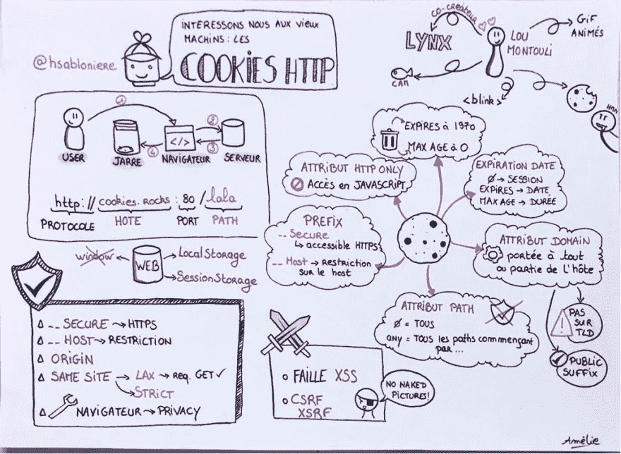
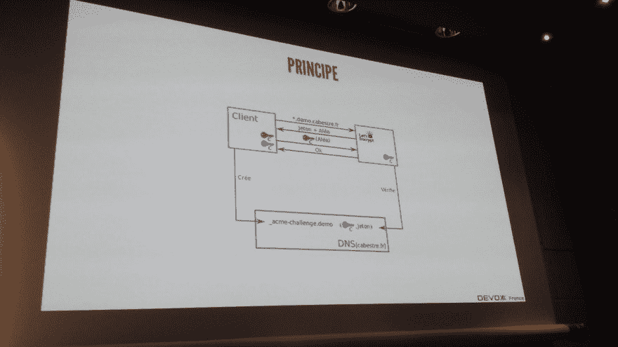
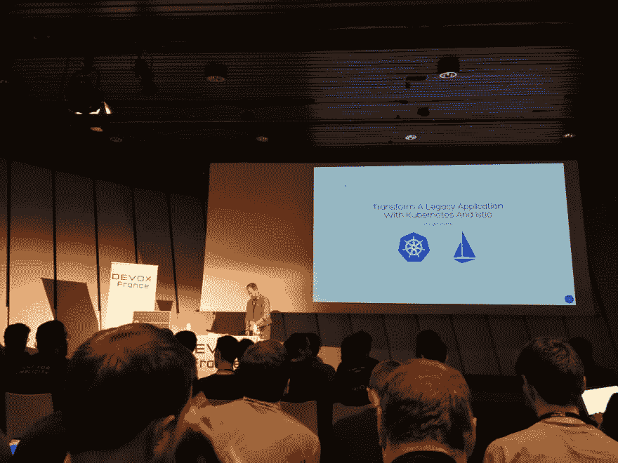

# 回到法国 devxx 2018 年-最重要的会议…

> 原文:# t0]https://dev . to/D3 rwan/devxx 南南返回-法国-2018-les-会议-plus-20o

法国 devoxx 第七版(aka 热情开发者会议)于今年 4 月 18 日至 20 日举行。下面是我对+会议的反馈…

## [最贪婪🍪](https://cfp.devoxx.fr/2018/talk/NMW-2592/%23RetourAuxSources_:_%F0%9F%8D%AA_Les_cookies_HTTP)

[休伯特·萨伯林](https://twitter.com/hsablonniere)向我们介绍了他对当今网络最大奥秘之一——*cookie*http 的调查结果。创建 Lou Montulli，也是 Lynx 命令行浏览器的创建者或标记和 gif 动画的发起者，cookie 是用于存储客户端状态的服务器/浏览器协议。演讲者在演讲中向我们解释了要避免的陷阱，以及为了最大限度地保证其应用的良好做法。一个*back to basics *在您对这些小东西不熟悉时查看，这些小东西是当前 web 的基础。

> 【阿尔诺继承人】@提前退休🍪与[@ hsabloner](https://twitter.com/hsablonniere)至[【devxx fr】](https://twitter.com/hashtag/devoxxfr)【2018 年 4 月 10 日上午 10 时 34 分至 19 日】

## [拉加维瑟勒🎨](https://cfp.devoxx.fr/2018/talk/LHA-6515/Let%E2%80%99s_Sketchnote_:_prise_de_notes_visuelle)

在他们的 quickie Let's sketchnote 中，[ane Diaz](https://twitter.com/ane_naiz)&[【Amelia Benoit】](https://twitter.com/AmelieBenoit33)为我们介绍了视觉笔记的基础。《T4》预先可供所有通过缔约方会议的人查阅，它包括使用文字或图片等基本要素，丰富箭头和内容，并增加色彩，以获得独特和有创意的报告。除此之外，它还能促进注意力和记忆。我们被要求看我们的作品而不是那些女士们的才华，但我们却想尝试一下。一颗小小的心脏。

> 【ameliebonit】@ ameliebonet 33[#Sketchnote](https://twitter.com/hashtag/Sketchnote) 【关于会议 http cookie 的内容】从[@ hsabulener](https://twitter.com/hsablonniere)[【devxx fr】](https://twitter.com/hashtag/DevoxxFR)🍪
> 
> 收复垒，围绕安全问题，一切都很清楚，玩得很开心！【2018 年 4 月 14 日下午 3 时至 20 日】65

## La 加 digitale👋

[Emmanuel pesticos](https://twitter.com/EmmanuelPESENTI)向我们解释了#frenchroad 程序如何使法国能够弥补其巨大的数字鸿沟，包括其‘T2’地图的“无所不包”*项目，并使法国成为一个*欧洲数字国家。*这一主题最后只是一个法国(和数字)版本的“T3”【arnaud castianer】版本，前一天，后者向我们解释了爱沙尼亚如何通过其 e-resident 方案成为一个数字前沿国家，有来自 150 个不同国家的 32000 名电子居民，还有 5000 家公司，甚至一家 e-both 公司因此，六边数字国家面前有许多工作要做。-我们能把手指拔出来吗？

> 数字，该死！@数码妓院耳朵里告诉我 31 分钟内超过 10 次。
> [@ devxx fr](https://twitter.com/DevoxxFR)，做点什么！把这个词换成哔声，把发言者放下不管。做点什么！[【Twitter . com/adeicbourg/ST…](https://t.co/DCIbQgTktA)【2018 年 4 月 7 日上午 34 分至 20 日】【阿尔巴尼亚语】

## [最讽刺🤔](https://cfp.devoxx.fr/2018/talk/KTY-9125/Architecture_Realtime_Data_de_Dailymotion)

在 Vivendi 被收购后，Dailymotion 不得不重新发明自己。各小组的工作重点之一是改进建议部分，使之成为一个实时部分。在这次谈话中，[Philippe giral ami](https://twitter.com/philgiro?lang=fr)[【Didier Girard】](https://twitter.com/didiergirard)向我们介绍了面对短时间的计时和重建团队，Dailymotion 如何选择从内部 OSS 堆栈过渡到 stack data cloud 堆栈，以及由此带来的收益。谷歌也是 Youtube 的竞争对手。

> 【残馀物检查】[@ d3rwan](https://dev.to/d3rwan)-我...。讽刺吗？【2018 年 4 月 14 日下午 28-20】0

## [最安全🔐](https://cfp.devoxx.fr/2018/talk/THX-0000/Balade_au_pays_de_%C2%ABLet's_Encrypt%C2%BB)

在他的演讲中， [Frédéric Cabestre](https://twitter.com/fcabestre) 从公私密钥库出发，带领我们走上证书和其他欢乐的道路，以便我们终于能够了解我们的 Encrypt 是如何改变认证机构中的数据的。如果你已经把你的鼻子伸进去了，你会发现这对其他人来说是很有用的提醒！

> 【Guillaume 成员】@ Guillaume 成员

## 最传统(但在容器中)🚢

[大卫盖吉欧](https://twitter.com/dgageot)来教我们如何在坞站，然后在库伯内，在 Yaml 的几行中旋转单片应用程序。第二步，他将运用*面庞*的模式的力量，方便解冻；具体来说，使用 istio peut 服务如何快速为我们提供其各种服务中的强大功能(监控、随处 HTTPS、速率限制、蓝色/绿色部署、电路断路器)。这是一个精心制作的演示文稿，让您可以轻松地进行演示(即使您没有遗留任何内容)！

> 信道+技术📺📱🎬@加那利群岛技术回归:改造具有和[【istio】的旧式应用程序](https://twitter.com/hashtag/Istio)

## [最相互对应](https://cfp.devoxx.fr/2018/talk/YTS-2643/Du_mutualisme_a_l'Open_Source)

[亚历山大·德尔加加](https://twitter.com/chanksleroux?lang=fr)、[【马太福音】](https://twitter.com/trevorreznik?lang=fr)和[法国人德尔加多](https://twitter.com/desmfr?lang=fr) r 告诉我们，MAIF 决定从 0 开始重建 S.I .，并向我们介绍这项工作的结果。有了钥匙，已经有了 2 种前景看好的产品——挂牌、[【耳鸣】&【izanami】](https://maif.github.io/)、一种方法和强有力的原则等，还有很多事情要做。举个例子？

[maif 的开源:成因与抱负](https://medium.com/oss-by-maif/open-source-%C3%A0-la-maif-gen%C3%A8se-et-ambition-6e7b2bc3d93d)

## [加上胡须🎅🏻](https://cfp.devoxx.fr/2018/talk/WIW-5296/_Monitorer_l'inconnu,_1000_*_100_series_par_jour)

[昆汀亚当](https://twitter.com/waxzce) & [克莱门特](https://twitter.com/clementd)、C[E|T]O 在 CleverCloud 公司来告诉我们他们在平台上设置指标的实验。主要问题是不了解要监视的应用程序，以及要存储的潜在数据量，在发现 Warp10 之前，他们已经将市场上的大多数解决方案(influxdb，Prometheus)抛在脑后。他们的实验表明，sont 正在部署 metrics 解决方案，并与 OVH (poke.digital)合作开展开源项目。还有一个很有用的提醒，尽管有‘T4’# server less’的催眠，但我们仍然生活在一个充满服务器的世界里！

> 【残馀物检查】[@ d3rwan](https://dev.to/d3rwan)【2018 年 4 月 15 日下午 29-20】

## [最个人化😊](http://cfp.devoxx.fr/2018/talk/FON-7243/Pourquoi_vous_devriez_arreter_d'utiliser_les_field_injection)

今年我再次有幸在法国 devoxx 演讲。我愿借此机会感谢幕后人士每年所做的大量工作，同时希望能说服我的观众停止现场注射！

> 【残馀物检查】[@ d3rwan](https://dev.to/d3rwan)幻灯片

当然，鉴于我没有参加的演讲次数，这种返回只能是部分的(因为三天内有 200 场演讲！)，但请记住，今年的所有会谈现在都在网上提供。明年见！😉

> 【devxx fr】@ devxx fr保存日期。【2019 年 4 月 17 日、18 日和 19 日】【2018 年 4 月 6 日上午 44 分至 20 日】