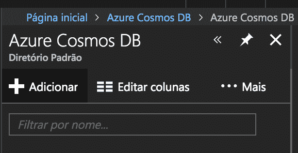
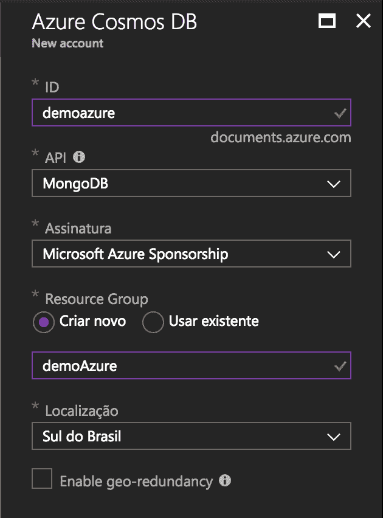
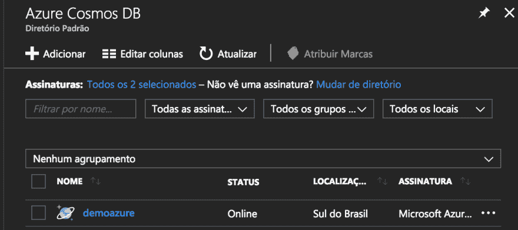
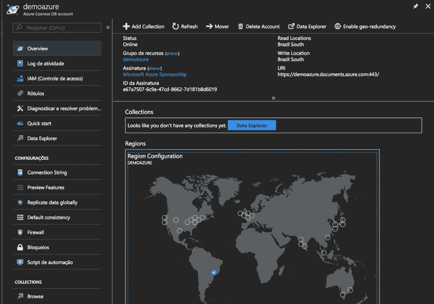
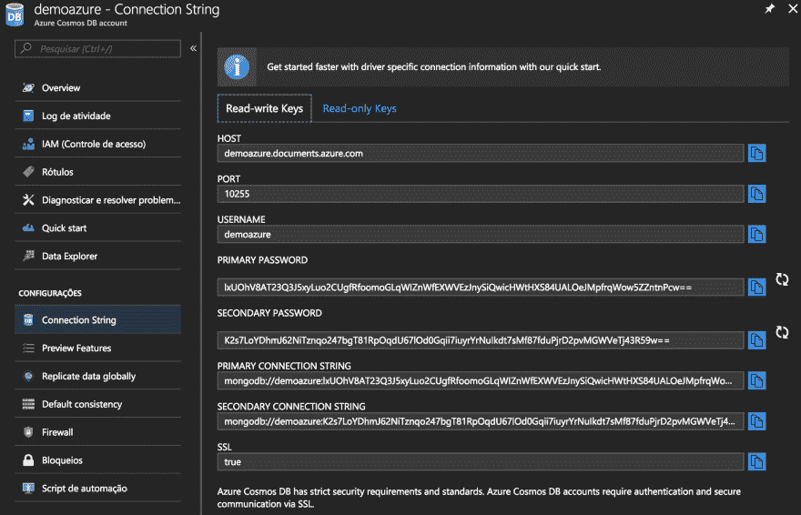

# Azure CosmosDB -使用 mongodb api 创建第一个数据库

> [https://dev . to/del busoweb/azure-cosmo sdb---创建您的第一个数据库-使用-mongbb-API-gp 2](https://dev.to/delbussoweb/azure-cosmosdb---criando-seu-primeiro-banco-de-dados-utilizando-mongodb-api-gp2)

大家好，今天我将继续播放关于在宇宙魔方中使用 mongodb 的系列节目，我将演示如何通过点击蓝色控制面板来创建一个实例。我们走吧-我...。

## Passo-a-passo

1.  以蓝色登录后，在左侧菜单中找到蓝色的宇宙魔方: 

2.  单击屏幕顶部的“添加”按钮: 

3.  选择帐户 ID 的名称，请注意，此名称对于整个蓝色必须是唯一的。然后选择 API，在我们的 MongoDB 案例中。选择您的签名，创建或选择资源组，然后选择位置。在此帖子中，我不会进入 geo distribution 选项，我将在另一帖子中介绍此功能，因此将此选项保留为禁用状态。最后单击“创建”按钮: 

4.  几分钟后，CosmosDB 中的账户将被创建并在列表中可用，我们只需点击账户名称:
    

5.  要查看登录凭据，只需单击连接字符串:  
    该选项的法律是，宇宙魔方已经实现认证 mongodb，这一点非常重要，因为在这种情况下银行将暴露在 web 上。它还提供了只读凭据的功能，用户只能在其中读取数据。重要的是要强调，由于 Azure CosmosDB 管理着所有这些验证部分，因此无法创建更具体的用户或权限，就像我们直接使用 mongodb 一样。
    要从您的应用程序连接，只需复制“主连接字符串”字段的内容，然后粘贴到您的应用程序连接字符串中即可。

好的，您已经有一个已启用并准备好接收您的数据的帐户。

## 下一步行动

在下一篇文章中，我们将了解如何将 MongoDB 实例中的数据导入 Azure CosmosDB，并从 Azure 数据资源管理器和第三方工具(如 3T 盗窃)中访问这些数据。

希望你们喜欢，下次再见！