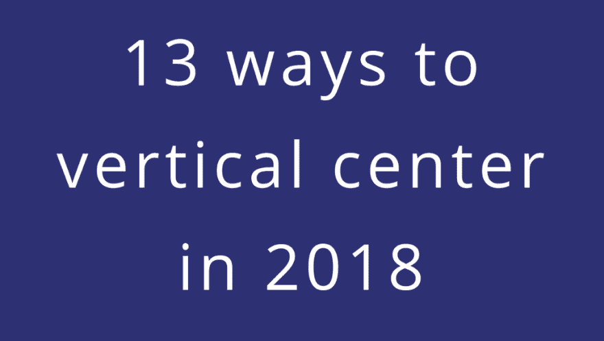

# 2018 年垂直居中的 13 种方式

> 原文：<https://dev.to/bnevilleoneill/13-ways-to-vertical-center-in-2018-29ni>

[T2】](https://res.cloudinary.com/practicaldev/image/fetch/s--ie8Y0vK0--/c_limit%2Cf_auto%2Cfl_progressive%2Cq_auto%2Cw_880/https://cdn-images-1.medium.com/max/1024/1%2AcIO90SyNTuk_PjnHCHPgzw.png)

回到过去的美好时光，CSS 的局限性是这样的，即使像垂直居中这样“简单”的事情也是一个挑战，我们中的一些人甚至依赖于 JavaScript 解决方案。它是脆弱的，它是非常受约束的，并且总是有一个例外使它失败。

无论我们是试图在文本旁边对齐图标或图像，创建一个流行的“英雄”横幅，还是一个模态叠加，在垂直轴上居中总是一个难题。

但是 CSS 已经走了很长的路，提供了很多方法，每次都使垂直居中变得更容易。下面是对其中一些的总结，以及它们的使用案例和局限性。

[T2】](https://logrocket.com/signup/)

### 1。绝对定位和自动边距

没有固有大小的元素可以通过简单地使用顶部和底部的相等值来“居中”。当元素有内部尺寸时，我们可以对顶部和底部使用 0，然后应用自动边距。这将自动使元素居中:

```
.container{
  position:relative;
}
.element{
  position:absolute;
  top: 0; bottom: 0; left: 0; right: 0;
  margin: auto;
  height: 20px; /*requires explicit height*/
} 
```

[https://codepen.io/facundocorradini/embed/bxPMgL?height=600&default-tab=result&embed-version=2](https://codepen.io/facundocorradini/embed/bxPMgL?height=600&default-tab=result&embed-version=2)
当然，限制是元素高度必须显式声明，否则会占据整个容器。

### 2。经典的前 50%转化为 50%

对于许多开发人员来说，这是第一个，并且仍然是一个首选。一个简单的技巧，依赖于将内部元素绝对定位在距其父元素顶部 50%的位置，然后将它向上平移其高度的 50%:

```
.container{
  position: relative;
}
.element{
  position: absolute;
  top: 50%;
  transform: translateY(-50%);
} 
```

[https://codepen.io/facundocorradini/embed/GXbdOv?height=600&default-tab=result&embed-version=2](https://codepen.io/facundocorradini/embed/GXbdOv?height=600&default-tab=result&embed-version=2)
一个相当可靠的方法，唯一的主要限制是使用翻译可能会妨碍其他变换，例如在应用过渡/动画时。

### 3。桌子。是的，我刚说了桌子。

一个非常简单的方法，也是最早的方法之一(在过去，一切都是表格)，是使用表格单元格的行为和垂直对齐来将元素放在容器的中心。

这可以通过实际的表格来实现( *shame，shame，shame* )，或者使用语义 HTML，将元素的显示切换到表格单元格:

```
.container{
  display: table;
  height: 100%;
}
.element{
  display: table-cell;
  text-align: center;
  vertical-align: middle;
} 
```

[https://codepen.io/facundocorradini/embed/OoeZNj?height=600&default-tab=result&embed-version=2](https://codepen.io/facundocorradini/embed/OoeZNj?height=600&default-tab=result&embed-version=2)
即使两个元素的高度都未知，这个方法仍然有效。主要的限制当然是如果你需要一个非中心的兄弟姐妹，背景限制可能会变得棘手。

此外，请记住这在屏幕阅读器上完全失败(即使您的标记基于 div，将 CSS 显示设置为 table 和 table-cell 也会使屏幕阅读器将其解释为实际的表格)。谈到可访问性，远非最佳。

### 4。鬼元素法

另一个老掉牙的方法，不管是什么原因，没有跟上，就是使用一个 ghost (pseudo)元素的内联块，该元素的高度是父元素的 100%，然后将 vertical-align 属性设置为 middle:

```
.container::before {
  content: '';
  display: inline-block;
  height: 100%;
  vertical-align: middle;
  margin-left: -1ch;
}
.element{
  display: inline-block;
  vertical-align: middle;
} 
```

[https://codepen.io/facundocorradini/embed/pOXVJZ?height=600&default-tab=result&embed-version=2](https://codepen.io/facundocorradini/embed/pOXVJZ?height=600&default-tab=result&embed-version=2)
它实际上工作得很好，最明显的“问题”是它将水平中心向右移动了一点点，因为行内块元素之间的空白总是有褶皱的行为。

这可以像我们在任何其他上下文中处理内联块问题一样来处理，最简单的方法是我在上面使用的 margin-left -1ch(尽管这不是 100%准确，除非在 monospace 字体上，因为 *ch* unit 表示“0”字符的宽度)，或者在容器上将字体大小设置为 0，然后在元素上将它重置为 px 或 rem。至少可以说不是最佳的。

### 5。弹性物料的自动毛利

**最终进入现代 CSS 领域**，flexbox 为自动边距引入了一个非常棒的行为。现在，它不仅像在块布局中一样将元素水平居中，还将它在垂直轴上居中:

```
.container{
  display:flex;
}
.element{
  margin:auto;
} 
```

[https://codepen.io/facundocorradini/embed/PdrePm?height=600&default-tab=result&embed-version=2](https://codepen.io/facundocorradini/embed/PdrePm?height=600&default-tab=result&embed-version=2)
这种策略是我最喜欢的一种，因为它简单，唯一的主要限制是它只对单一元素有效。

### 6。flex 容器上的伪元素

这不是世界上最实用的方法，但是我们也可以使用灵活的空伪元素将元素推到中心:

```
.container{
  display: flex;
  flex-direction: column;
}
.container::before,
.container::after {
  content: "";
  flex: 1;
} 
```

[https://codepen.io/facundocorradini/embed/yxdjLq?height=600&default-tab=result&embed-version=2](https://codepen.io/facundocorradini/embed/yxdjLq?height=600&default-tab=result&embed-version=2)
当我们想要在包含多个项目的列向 flex-container 上保持灵活的间距时，这可能很有用。

### 7 & 8。在弹性容器或弹性项目上对齐

Flexbox 还引入了非常棒的对齐属性(现在被分支到它们自己的 [box 对齐模块](https://www.w3.org/TR/css-align-3/#propdef-align-content))。这允许我们控制项目如何放置和空白空间如何分布，这种方式要么需要 CSS 中的幻数来表示特定数量的元素，要么需要非常聪明的 JS 来表示动态数量。

根据伸缩方向，我们可以根据需要使用对齐内容或对齐项目进行调整。

容器上:

```
.container{
  display: flex;
  justify-content: center;
  align-items: center;
} 
```

[https://codepen.io/facundocorradini/embed/YOoLzw?height=600&default-tab=result&embed-version=2](https://codepen.io/facundocorradini/embed/YOoLzw?height=600&default-tab=result&embed-version=2)
在特定的弹性项目上:

```
.container{
  display: flex;
}
.element{
  align-self: center;
  margin: 0 auto;
} 
```

[https://codepen.io/facundocorradini/embed/RYzMXa?height=600&default-tab=result&embed-version=2](https://codepen.io/facundocorradini/embed/RYzMXa?height=600&default-tab=result&embed-version=2)
这没有太多的缺点，除非你需要支持旧的浏览器。IE 11 应该可以工作，但是它的 flexbox 实现有很多 bug，所以应该格外小心。IE 10 需要额外的工作，因为它是基于一个[旧的、早期的规范草案](https://www.w3.org/TR/2012/WD-css3-flexbox-20120322/)，它有不同的语法，并且需要 *-ms* 厂商前缀。

### 9 & 10。在网格容器或网格项目上对齐

CSS Grid 包含了与 flexbox 几乎相同的对齐选项，所以我们可以在 grid-container 上使用它:

```
.container{
  display: grid;
  align-items: center;
  justify-content: center;
} 
```

[https://codepen.io/facundocorradini/embed/zJVWVe?height=600&default-tab=result&embed-version=2](https://codepen.io/facundocorradini/embed/zJVWVe?height=600&default-tab=result&embed-version=2)
或者只是在一个特定的网格上——项:

```
.container{
  display: grid;
}
.element{
  justify-self: center;
  align-self: center
} 
```

缺乏遗留浏览器的支持是这种技术的唯一限制。
[https://codepen.io/facundocorradini/embed/LJKdaw?height=600&default-tab=result&embed-version=2](https://codepen.io/facundocorradini/embed/LJKdaw?height=600&default-tab=result&embed-version=2)T2】

### 11。网格上的伪元素

类似于 flexbox 的替代方案，我们可以使用带有伪元素的三行网格:

```
.container{
  display: grid;
  grid-template-columns: 1fr;
  grid-template-rows: repeat(3, 1fr);
}
.container::before,
.container::after{
  content:"";
} 
```

记住 [1fr 实际上是 minmax(auto，1fr)](https://github.com/w3c/csswg-drafts/issues/1777) 的意思，所以空行不一定占容器高度的 1/3。它们将根据需要折叠，一直折叠到它们的最小值 auto，如果没有内容，则表示 0。
[https://codepen.io/facundocorradini/embed/BOgrMW?height=600&default-tab=result&embed-version=2](https://codepen.io/facundocorradini/embed/BOgrMW?height=600&default-tab=result&embed-version=2)
这可能看起来像一个愚蠢的方法，但它允许我们轻松地实现我最喜欢的 CSS 网格技巧之一:**将 *fr* 行与 *minmax* 行**行组合，这将导致空的 *fr* 行首先折叠，然后是 *mixmax* 行。Jenn Simmons 在这方面有很好的例子。

因此，让伪对象接受完全可折叠的行将允许自动放置算法在我们的实际元素上施展它的魔法。除非我们需要支持缺乏自动布局的 IE。这就引出了下一个方法…

### 12。显式网格行放置

CSS grid 允许将项目显式地放置在特定的行上，所以与上面相同的网格声明和放置在第二行的项目就足够了:

```
.container{
  display:grid;
  grid-template-columns:1fr;
  grid-template-rows: repeat(3, 1fr);
}
.element{
  grid-row: 2 / span 1; /* or grid-row: 2/3 */
} 
```

这个可以工作到 IE10。信不信由你， **IE 是 CSS grid** 最早也是最强的支持者之一，早在 2011 年 IE10 发布时就开始支持了。它基于一个[非常早期的草案](https://www.w3.org/TR/2011/WD-css3-grid-layout-20110407/)，有一个完全不同的语法，但我们可以让它工作:

```
.container{
  display: -ms-grid;
  -ms-grid-rows: (1fr)[3];
  -ms-grid-columns: 1fr;
}
.element{
  -ms-grid-column: 1;
  -ms-grid-row: 2;
} 
```

[https://codepen.io/facundocorradini/embed/VGJXGZ?height=600&default-tab=result&embed-version=2](https://codepen.io/facundocorradini/embed/VGJXGZ?height=600&default-tab=result&embed-version=2)

### 13。网格项目上的自动边距

**与 flexbox 类似，**对网格项目应用自动边距，使其在两个轴上居中。

```
.container{
  display: grid;
}
.element{
  margin: auto;
} 
```

[https://codepen.io/facundocorradini/embed/XPLEzY?height=600&default-tab=result&embed-version=2](https://codepen.io/facundocorradini/embed/XPLEzY?height=600&default-tab=result&embed-version=2)
这对于分别将一个特定的列/组或列/组跨度居中来说特别方便

### 一些(可能的)未来实现:

根据 CSS 框对齐模块第 3 级规范，align-content 应该在块容器和 multicol 容器的块轴上工作，所以(如果浏览器实现了它)我们应该能够像在 flex 或 grid 容器中一样将这些容器的内容居中。

### 结论

仅此而已。过去极其困难的事情现在可以通过十几种不同的方式来实现，我可能还会错过一些。如果你知道其他技巧，请在评论中分享。

* * *

### Plug: [LogRocket](https://logrocket.com/signup/) ，一款适用于网络应用的 DVR

[](https://logrocket.com/signup/)

<figcaption>[https://logrocket.com/signup/](https://logrocket.com/signup/)</figcaption>

LogRocket 是一个前端日志工具，可以让你回放问题，就像它们发生在你自己的浏览器中一样。LogRocket 不需要猜测错误发生的原因，也不需要向用户询问截图和日志转储，而是让您重放会话以快速了解哪里出错了。它可以与任何应用程序完美配合，不管是什么框架，并且有插件可以记录来自 Redux、Vuex 和@ngrx/store 的额外上下文。

除了记录 Redux 操作和状态，LogRocket 还记录控制台日志、JavaScript 错误、堆栈跟踪、带有头+正文的网络请求/响应、浏览器元数据和自定义日志。它还使用 DOM 来记录页面上的 HTML 和 CSS，甚至为最复杂的单页面应用程序重新创建像素级完美视频。

免费试用。

* * *

帖子[2018 年垂直居中的 13 种方式](https://blog.logrocket.com/13-ways-to-vertical-center-in-2018-cb6e98ed8a40/)最先出现在 [LogRocket 博客](https://blog.logrocket.com)上。