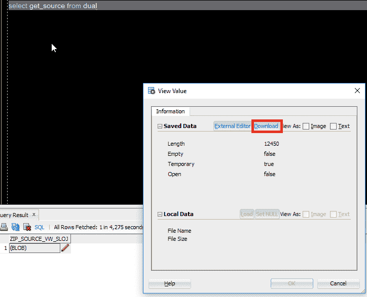

# Oracle 将 DDLS 导出到 zip

> 原文 https://dev.to/isabolic99/oracle-export-ddls-and-zip-source-c2f

## 目标

目标是创建一个 PL-SQL 函数，该函数将生成一个包含所有数据库对象源(DDL)的 zip 文件。

## 用 SQL 查询找到需要的对象

```
SELECT
    lower(object_name)
    || decode(object_type, 
              'VIEW', '.vw', 
              'TRIGGER', '.trg', 
              'PACKAGE', '.pks', 
              'PACKAGE BODY', '.pkb',
              '.sql')  file_name,
    dbms_metadata.get_ddl(object_type,object_name, owner)  file_content
FROM
    all_objects
WHERE owner = 'DEMO'; 
```

该查询将返回两个列**文件名**和**文件内容**，为了生成文件内容，我使用了 Oracle 内置函数**“DBMS _ metadata . get _ DDL”**一个返回 DDLs(对象源)CLOB 的函数。现在查询已经准备好了，我需要创建一个函数来返回文件中所有 DDL 的 zip。

## 函数 clob_to_blob 和 get_source

由于 a 没有找到任何 clob 到 blob 的内置函数 a 不得不自己创建，再一次 StackOverflow 非常有用:)第二个函数 get_source 由:

*   从上面对查询运行 FOR 循环
*   调用 **clob_to_blob** (将 ddl 内容转换为 blob)
*   将 blob 文件输出添加到 zip 文件，这是通过 oracle 的 **apex_zip** 包完成的
*   一旦 FOR 循环完成，完成 zip 并返回 zip BLOB

```
CREATE OR REPLACE FUNCTION clob_to_blob (clob_in IN CLOB)
   RETURN BLOB
AS
   v_blob      BLOB;
   v_varchar   RAW (32767);
   v_start     BINARY_INTEGER := 1;
   v_buffer    BINARY_INTEGER := 32767;
BEGIN
   dbms_lob.createtemporary (v_blob, false);

   FOR i in 1 .. ceil (dbms_lob.getlength (clob_in) / v_buffer)
   LOOP
      v_varchar := utl_raw.cast_to_raw (dbms_lob.substr (clob_in, v_buffer, v_start));
      dbms_lob.append (v_blob, v_varchar);
      v_start := v_start + v_buffer;
   END LOOP;

   RETURN v_blob;
END clob_to_blob;
/ 
```

```
CREATE OR REPLACE FUNCTION get_source RETURN BLOB AS
    l_zip_file       BLOB;
    v_file           BLOB;
BEGIN

    FOR l_file IN (
      SELECT lower(object_name)
             || decode(object_type, 
                       'VIEW', '.vw', 
                       'TRIGGER', '.trg', 
                       'PACKAGE', '.pks', 
                       'PACKAGE BODY', '.pkb',
                       '.sql')  file_name,
             dbms_metadata.get_ddl(object_type,object_name, owner)  file_content
        FROM all_objects
       WHERE owner = 'DEMO'
    ) LOOP
        --call clob to blob fn
        v_file := clob_to_blob(l_file.file_content);

        --add file into zip
        apex_zip.add_file(
                p_zipped_blob => l_zip_file
               ,p_file_name   => l_file.file_name
               ,p_content     => v_file
        );        

    END LOOP;

    -- finish zip
    apex_zip.finish(p_zipped_blob => l_zip_file);

    RETURN l_zip_file;
END;
/ 
```

## 执行功能

一旦所有东西都在 DB 上编译好了，我就可以从 SQL 或 PLSQL 调用函数 get_source 了。

```
select get_source from dual 
```

现在我可以将来自 SQL developer 的 DDL 源代码保存到我的 PC 上(git/svn repo)。:)
[T3】](https://res.cloudinary.com/practicaldev/image/fetch/s--49vy5Pme--/c_limit%2Cf_auto%2Cfl_progressive%2Cq_auto%2Cw_880/https://thepracticaldev.s3.amazonaws.com/i/6lx50abvfw30we4ocm32.png)