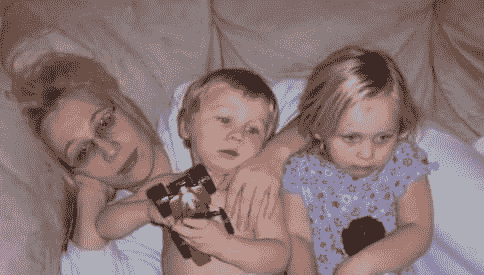

# 然而，一个单身母亲编码

> 原文 https://dev.to/vadler/nevertheless-a-single-mother-coded-21ip

[T2】](https://res.cloudinary.com/practicaldev/image/fetch/s--xd-8b57u--/c_limit%2Cf_auto%2Cfl_progressive%2Cq_auto%2Cw_880/https://thepracticaldev.s3.amazonaws.com/i/uvofickdpsiiweiyk85a.jpeg)

我为我的帖子选择了这张照片，因为这是我如何开始的。多亏了我的父亲，我很早就涉足科技领域。1993 年，我 16 岁的时候制造了我的第一台个人电脑。我爸爸说:“你可以有一台电脑，但你必须自己动手。”所以我做了...完成后，他让我去修理他在车库里为一个客户准备的另外 119 辆车。

我结婚很早，不久后离婚，发现自己独自一人带着两个小家伙。当时，我正在攻读创意写作和摄影学位，但很明显，一个文科学位不足以养活我和我的孩子。因此，有了三份工作和两个孩子，我将学位转向了信息技术，希望能够运用我父亲多年前传授给我的技能。

我的第一份工作是在 EDS，对话是这样的“你有成为一名开发人员的资质吗？”我学了 3 门编程课程，没有其他潜在客户，我回答“为什么，是的，我想！”。

2008 年，我大学一毕业就被录用了，并把我的小家庭搬到了离我认识的所有人 200 英里以外的地方，开始了一份让我前所未有地害怕的工作。然而，我非常幸运，EDS 以一个为期 6 周的编码训练营开始了我的职业生涯，弥补了我作为 IT 而不是 CS 所缺乏的知识。EDS 被惠普收购，一年后我发现自己在为惠普开发。我学到了我能学到的一切，但真正让我走上成功之路的是我的同龄人。在最初的四年里，我建立了无价的联盟，为我的整个职业生涯定下了基调。我会永远记得那些表现出善意并让我进入他们世界的人的脸。

10 年后，我现在是一名软件工程经理，而且我坚定不移地支持任何地方不太可能的候选人。在成长过程中成为一个单身母亲无论如何都不是一条容易的路，但这是一条我今天仍然会走的路。我给任何刚开始发展的人的建议是，和你钦佩的人在一起，有时成功和失败的唯一区别就是永不放弃。